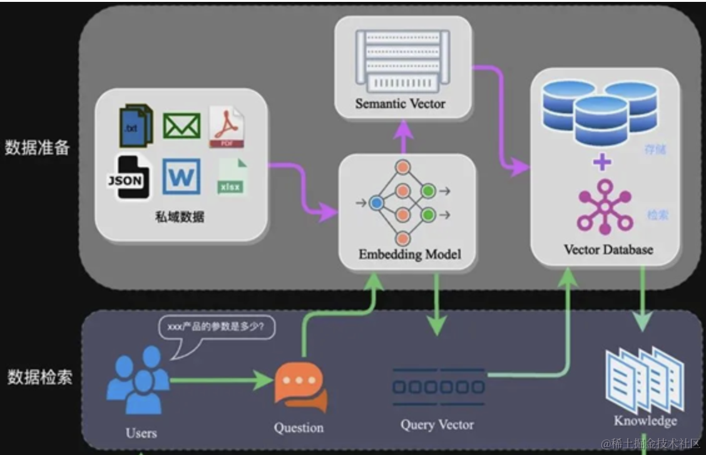
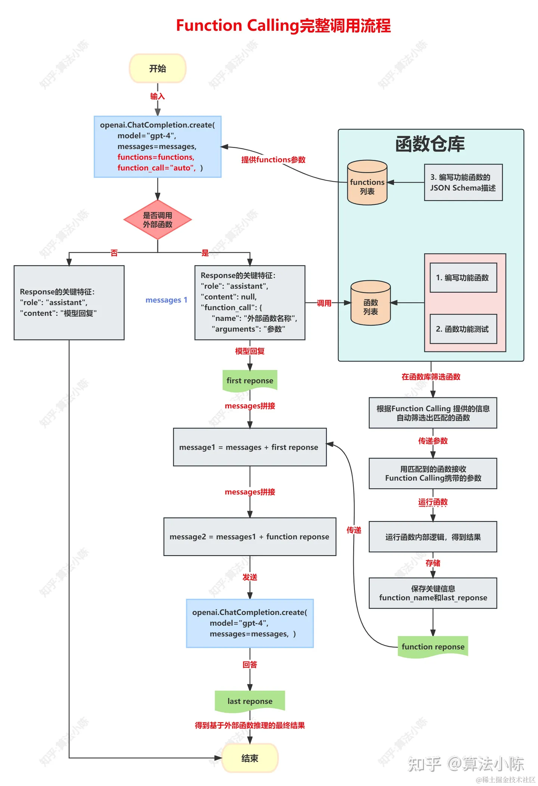

大模型的RAG（Retrieval-Augmented Generation）与Function Calling都是用于增强大型语言模型（如GPT）的技术，但它们的工作原理和应用场景有所不同。

# Retrieval-Augmented Generation (RAG):

* 原理：RAG结合了信息检索和文本生成。它首先从一个大型的文档数据库中检索与输入查询相关的文档，然后将这些文档的信息融入到语言模型的生成过程中。
* 应用：RAG适用于那些需要外部信息来提供准确回答的场景，如问答系统。它可以通过检索到的信息来丰富和支持模型的回答。

# Function Calling:

原理：Function Calling指的是在语言模型中集成外部功能或API的调用能力。这意味着模型可以在生成文本的过程中调用外部函数或服务，获取额外的数据或执行特定的任务。
应用：Function Calling适用于需要模型执行特定操作或与外部系统交互的场景。例如，模型可以调用天气API来回答关于当前天气的问题，或者调用翻译服务来提供翻译。

# 二者区别
RAG更侧重于通过检索来增强模型对外部信息或者数据的获取能力，而Function Calling更侧重于使模型能够执行外部操作（比如API的调用） 或访问外部服务。

# 共同点
两者都是扩展大模型能力的重要方式。

https://blog.csdn.net/2301_81940605/article/details/139833213