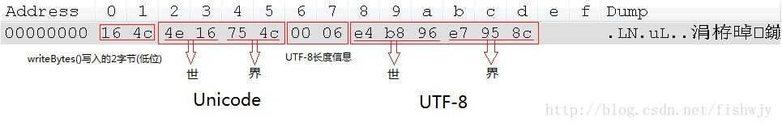
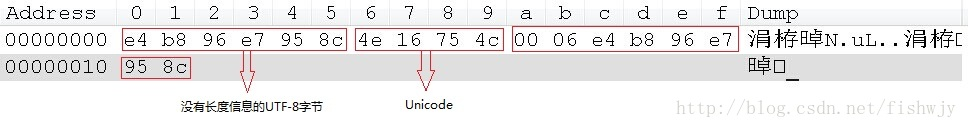

# DataInputStream和DataOutputStream用法细节探讨

> DataInputStream和DataOutputStream都是Java中输入输出流的装饰类，用起来很方便。今天就来讨论一下使用该类时候遇到的编码问题。
package com.vincent.example;

```java
import java.io.DataInputStream;
import java.io.DataOutputStream;
import java.io.FileInputStream;
import java.io.FileOutputStream;
import java.io.IOException;
 
public class TestDataStream {
    
	public static void main(String[] args) {
		// 使用DataInputStream,DataOutputStream写入文件且从文件中读取数据。
		try {
			// Data Stream写到输入流中
			DataOutputStream dos = new DataOutputStream(new FileOutputStream(
					"datasteam.txt"));
			dos.writeBytes("世界"); //按2字节写入，都是写入的低位
			dos.writeChars("世界"); // 按照Unicode写入
			// 按照UTF-8写入(UTF8变长，开头2字节是由writeUTF函数写入的长度信息，方便readUTF函数读取)
			dos.writeUTF("世界"); 
			dos.flush();
			dos.close();
 
			// Data Stream 读取
			DataInputStream dis = new DataInputStream(new FileInputStream(
					"datasteam.txt"));
			// 读取字节
			byte[] b = new byte[2];
			dis.read(b);
			System.out.println(new String(b, 0, 2));
 
			// 读取字符
			char[] c = new char[2];
			for (int i = 0; i < 2; i++) {
				c[i] = dis.readChar();
			}
			System.out.println(new String(c, 0, 2));
 
			// 读取UTF
			System.out.println(dis.readUTF());
 
			dis.close();
		} catch (IOException e) {
			e.printStackTrace();
		}
	}
}
```

使用16进制方式打开文件如下：




可以看出，第一个“世界”已经被截断，两个汉字都只被写入了低位，因此肯定乱码。

```java
package com.vincent.example;
 
import java.io.DataInputStream;
import java.io.DataOutputStream;
import java.io.FileInputStream;
import java.io.FileOutputStream;
import java.io.IOException;
 
public class TestDataStream {
	public static void main(String[] args) {
		// 使用DataInputStream,DataOutputStream写入文件且从文件中读取数据。
		try {
			// Data Stream写到输入流中
			DataOutputStream dos = new DataOutputStream(new FileOutputStream(
					"datasteam.txt"));
			dos.write("世界".getBytes()); // 按UTF8编码(我的系统默认编码方式)写入
			//dos.write("世界".getBytes("GBK"));  //指定其他编码方式
			dos.writeChars("世界"); // 按照Unicode写入
			// 按照UTF-8写入(UTF8编码长度可变，开头2字节是由writeUTF函数写入的长度信息，方便readUTF函数读取)
			dos.writeUTF("世界"); 
			dos.flush();
			dos.close();
 
			// Data Stream 读取
			DataInputStream dis = new DataInputStream(new FileInputStream(
					"datasteam.txt"));
			// 读取字节
			byte[] b = new byte[6];
			dis.read(b);
			System.out.println(new String(b, 0, 6));
 
			// 读取字符
			char[] c = new char[2];
			for (int i = 0; i < 2; i++) {
				c[i] = dis.readChar();
			}
			System.out.println(new String(c, 0, 2));
 
			// 读取UTF
			System.out.println(dis.readUTF());
 
			dis.close();
		} catch (IOException e) {
			e.printStackTrace();
		}
	}
}
```

文件打开如下：



可以看出，读取前6字节并按照UTF-8解码就可以避免乱码。  
值得注意的是，String构造函数也可以指定对byte数组作其他编码方式的解码。  
例如：`new String(b,0,6,"GBK")`。同时使用`writeUTF`和`readUTF`可以免去程序猿对于长度的考虑，因为这两个函数为我们解决了长度问题，写入了文件，因此我们无需关心。
但这样就使用了额外的空间去记录长度信息。


[参考文献](https://blog.csdn.net/fishwjy/article/details/38092985)

