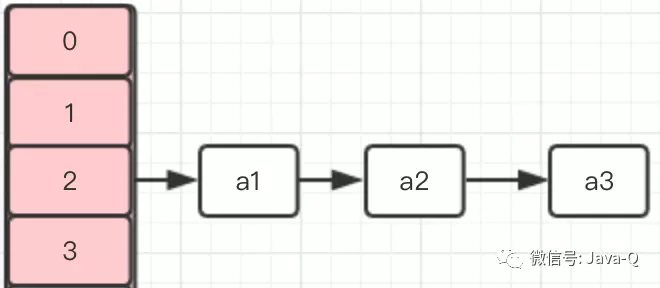
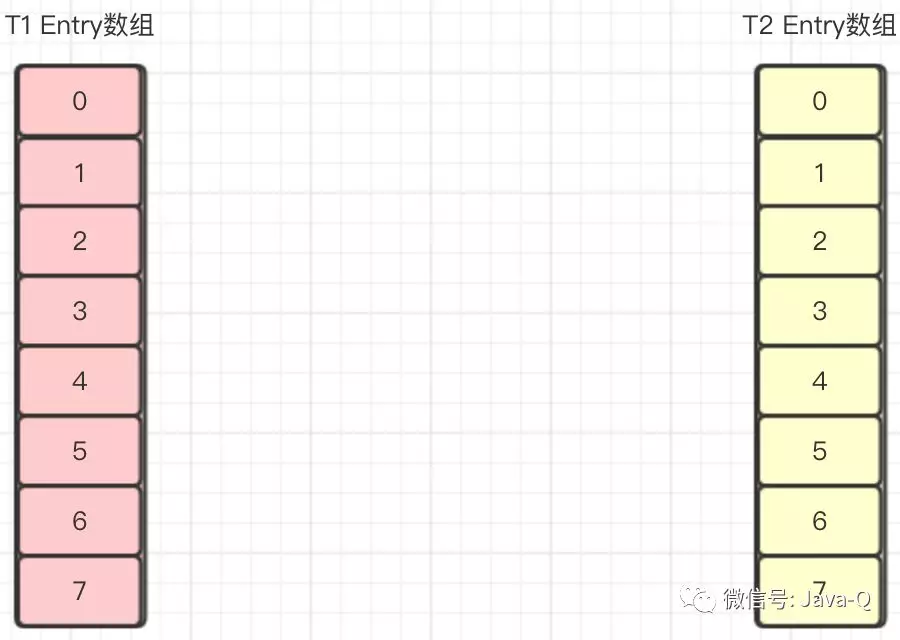
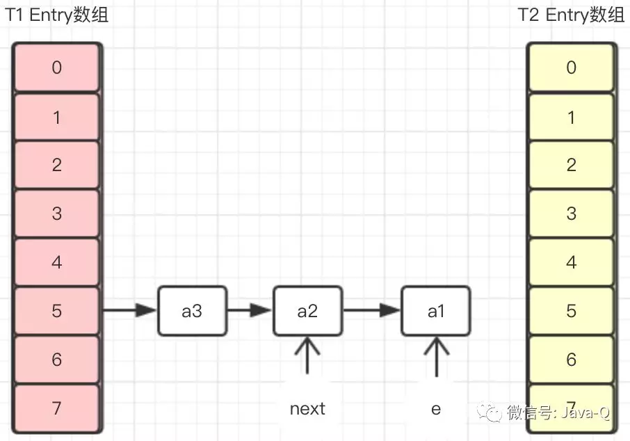
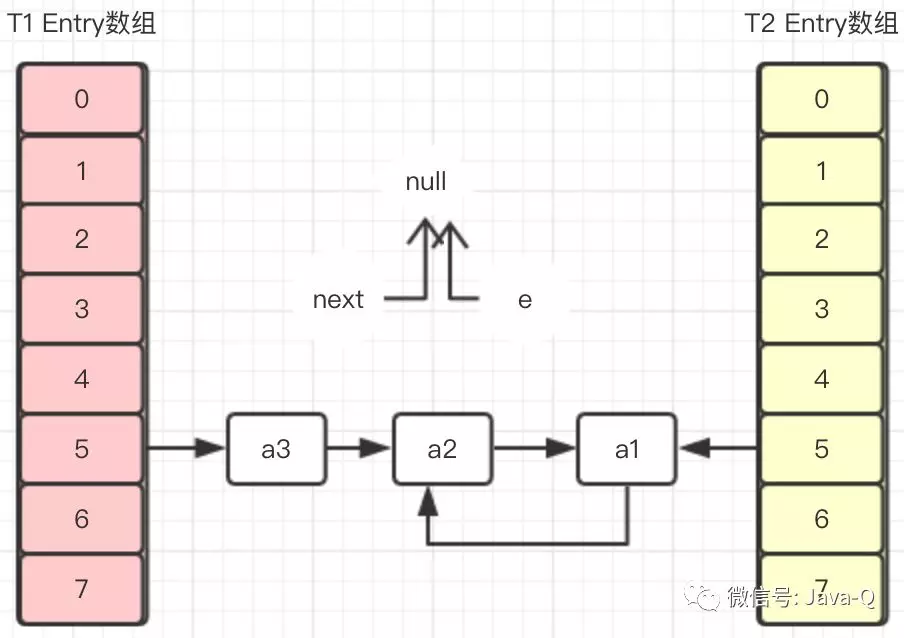

## HashMap死循环精简说
在JDK1.8之前的版本中，HashMap的底层实现是数组+链表。当调用HashMap的put方法添加元素时，如果新元素的hash值或key在原Map中不存在，会检查容量size有没有超过设定的threshold，如果超过则需要进行扩容，扩容的容量是原数组的两倍，具体代码如下：
```java
void addEntry(int hash, K key, V value, int bucketIndex) {
    //检查容量是否超过threshold
    if ((size >= threshold) && (null != table[bucketIndex])) {
        //扩容
        resize(2 * table.length);
        hash = (null != key) ? hash(key) : 0;
        bucketIndex = indexFor(hash, table.length);
    }
    createEntry(hash, key, value, bucketIndex);
} 
```

扩容就是新建Entry数组，并将原Map中元素重新计算hash值，然后存到新数组中，具体代码如下：
```java
void resize(int newCapacity) {
    Entry[] oldTable = table;
    int oldCapacity = oldTable.length;
    if (oldCapacity == MAXIMUM_CAPACITY) {
        threshold = Integer.MAX_VALUE;
        return;
    }
    //新数组
    Entry[] newTable = new Entry[newCapacity];
    //原数组元素转存到新数组中
    transfer(newTable, initHashSeedAsNeeded(newCapacity));
    //指向新数组
    table = newTable;
    threshold = (int)Math.min(newCapacity * loadFactor, MAXIMUM_CAPACITY + 1);
}

void transfer(Entry[] newTable, boolean rehash) {
    int newCapacity = newTable.length;
    for (Entry<K,V> e : table) {
        while(null != e) {
            Entry<K,V> next = e.next;
            if (rehash) {
                e.hash = null == e.key ? 0 : hash(e.key);
            }
            int i = indexFor(e.hash, newCapacity);
            e.next = newTable[i];
            newTable[i] = e;
            e = next;
        }
    }
} 
```

假设一个HashMap的初始容量是4，使用默认负载因子0.75，有三个元素通过Hash算法计算出的数组下标都是2，
但是key值都不同，分别是a1、a2、a3，HashMap内部存储如下图：



假设插入的第四个元素a4，通过Hash算法计算出的数组下标也是2，当插入时则需要扩容，此时有两个线程T1、T2同时插入a4，
则T1、T2同时进行扩容操作，它们各自新建了一个Entry数组newTable。



T2线程执行到transfer方法的Entry<K,V> next = e.next;时被挂起，T1线程执行transfer方法后Entry数组如下图：



在T1线程没返回新建Entry数组之前，T2线程恢复，因为在T2挂起时，变量e指向的是a1，变量next指向的是a2，
所以在T2恢复执行完transfer之后，Entry数组如下图：



可以看到在T2执行完transfer方法后，a1元素和a2元素形成了循环引用，此时无论将T1的Entry数组还是T2的Entry数组返回作为扩容后的新数组，
都会存在这个环形链表，当调用get方法获取该位置的元素时就会发生死循环，更严重会导致CPU占用100%故障。