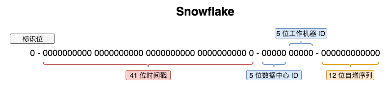

# 分布式 ID 生成算法 Snowflake

分布式系统中，有一些需要使用全局唯一 ID 的场景，这种时候为了防止 ID 冲突可以使用 36 个字符的 UUID，但是 UUID 有一些缺点，首先他相对比较长，另外 UUID 一般是无序的字符串。

有些时候我们希望能使用简单一些的 ID，并且希望 ID 能够按照时间有序生成，为了解决这个问题，Twitter 发明了 SnowFlake 算法，不依赖第三方介质例如 Redis、数据库，本地程序生成分布式自增 ID，这个 ID 只能保证在工作组中的机器生成的 ID 唯一，不能像 UUID 那样保证时空唯一。

Snowflake 把时间戳、工作组 ID、工作机器 ID、自增序列号组合在一起，生成一个 64bits 的整数 ID，能够使用 70 年，每台机器每秒可产生约 400 万个 ID (2^12*1000，每毫秒理论最多生成 2^12 个 ID)。

Snowflake 也有自己的缺点，虽然不同 workId 的机器生成的 ID 永远不会相同，但是同一台机器当把时间往后回拨后，生成的 ID 就会重复，所以需要保持时间是网络同步的。

Snowflake 生成的 ID 的 bit 结构如下:

`Sequence`类中为Java 实现 Snowflake，是现成安全的，调用 nextId() 生成 ID。
可能你要问，哎呀，只能保证 70年 内不重复，70 年后怎么办呢？我的答案是，让 70 年后公司的同事去头疼吧，问题是，你们公司能活到什么时候都是个问题！

[参考文献](http://qtdebug.com/java-snowflake/)
