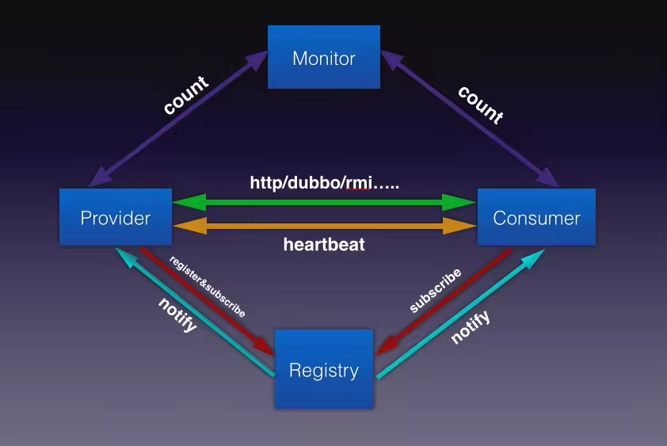
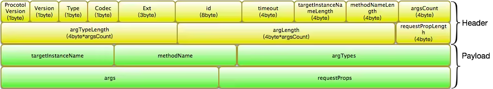

## 扩展性
HSF并没有提供和Dubbo类似的Adapter模式。如果面对一个扩展接口多个实现的时候，主要核心链路的扩展接口都是获取第一个，
具体代码在HSFServiceContainerHelp的getInstance方法中，实现如下：
```java
public  <T> T getInstance(Class<T> classType) {
        T instance = (T) INSTANCE_CACHE.get(classType);
        if (instance == null) {
            try {
                instance = ServiceLoader.load(classType, HSFServiceContainer.class.getClassLoader()).iterator().next();
                INSTANCE_CACHE.putIfAbsent(classType, instance);
                return (T) INSTANCE_CACHE.get(classType);
            } catch (Throwable e) {
                if (HSFPluggable.class.isAssignableFrom(classType)) {
                    LOGGER.warn("plugin: " + classType.getName() + " is not activated.");
                    return null;
                } else {
                    throw new RuntimeException("Cannot Load " + classType, e);
                }
            }
        } else {
            if (classType.isAssignableFrom(instance.getClass())) {
                return instance;
            } else {
                throw new RuntimeException("[Init HSFService Container Error]" + classType);
            }
        }
}
```
HSF是完全依托JDK自带的SPI方式来实现扩展接口实现的加载，上面的ServiceLoader.load是JDK的自带的SPI实现。
据我现在所知的，HSF中可以随便扩展的接口有ProcessHookService、RouteRuleParser、
TPSRuleParser、InvokeService和NamedCustomSerialization，以上几个接口，只要将你的实现按照标准的SPI方式配置好，HSF都会发现，除了InvokeService和NamedCustomSerialization其他的都会在对应的地方调用你的实现。下面大致介绍一下上面几个接口的功能：

在Dubbo里面基本上只要是接口都可以被扩展，由于Dubbo是基于URL总线的配置规则，可以动态的去识别使用哪个扩展的实现，所以在扩展性方面，Dubbo做的比HSF要好（个人观点）。
但可能也是这个原因，Dubbo的性能没有HSF那么好。

在Dubbo里面可以理解是一个完全面向接口编程，各个组件之间，是直接调用接口，并且允许这个接口可以有多个实现，通过URL的参数来识别当前应该用这个接口的哪个实现。
而HSF中，由于没有Adapter的支持，很多地方实现的比较直接，虽然在代码层面是按照接口去查找对应的实现，但是无法根据当前场景动态替换该接口另一个实现。

## 架构
不论是Dubbo还是HSF，服务的发布和订阅的整体流程和整体架构都是一样的，因为他们都是RPC组件。如下图：


## 协议栈
### dubbo协议


协议字段说明：
* magic:oxdabb
* flag:用来表示通信的标志，比如是request、respone或者是heartbeat，同时也可以通过这个得到该消息体的序列化方式以及通道类型（双攻还是单攻）
* status:这个是有response消息的时候启用，用来表示想要的状态是异常还是ok
* ID:某个接口，某个方法，某个消费端发起本次请求的唯一标示，用来在并发对某个方法发起RPC请求的时候予以区分


### hsf协议
#### Request


#### Response


协议字段说明：

* ProtocolVersion：标示协议的版本
* Version:标示的时HSF版本
* Type:标示的消息体类型，Request还是Response，上面的Request协议栈的type就只能是0（表示是Request）,而Response协议栈的type就只能是1（表示Response）
* Codec:表示编解码类型，比如1表示Hessain，2表示java，5表示kryo，6表示json，4表示Hessian2等
* Ext:是三个字节的扩展，暂时没有任何值在里面
* id:一个请求的唯一表示，一对请求和响应的id必须是一样，否则请求之后，客户端无法匹配响应，和dubbo中得id一样
* timeout:请求的超时时间
* targetInstanceNameLength:表示请求远程服务的唯一标示字节长度，比如一搬是接口类全面+版本号+分组
* methodNameLength:方法的名称字节长度
* argCount:调用方法入参的的数量
* argTypeLength:方法入参类型的名称字节长度
* argLength:方法入参字节长度
* requestPropLength:请求附加参数的字节长度，一般用来传递类似rpcId或者traceId的值
* body length:这个只有在response才有，用来描述消息体的内容，也就是响应的内容。

看到头里面一般是用来描述某些字段属性的字节长度，为了方便后续读取相应的内容，从而确保在解析后面的字节内容的时候，相应字段读取的字节数，从而解析成正确的内容。


上面只是列举出了HSF的Rpc协议栈，并不是HSF所有协议的协议栈，可以看到HSF的RPC协议是将Request和Response拆分成两个不同的协议栈，而dubbo的Request和Response是公用一个协议栈，他们的协议栈头都是一样的结构，只是通过标示来区分。


## 总结
1. 我觉得Dubbo是一个好的学习榜样，因为它里面对框架的可扩展性，框架的层次划分和代码结构做的很到位，如果你只是想去了解RPC是怎么工作的，以及内部的原理，那么建议你先去看看HSF，因为它里面更多的是表达一种RPC的思维，而且代码实现上比较容易去接受，相对没有Dubbo那么复杂。
2. 从协议栈上来说，Dubbo和HSF没有孰优孰劣，唯一存在比较大的不同是消息在框架内部的流转，因为Dubbo在一个调用链路里面会存在很多Filter的拦截，这个相对于HSF会存在一个的性能差问题
3. 每个事物都是相对的，正因为Dubbo存在Filter的拦截，所以外部可以很容易将自己逻辑整合到调用链路里面，从而进行相关逻辑处理，而HSF想在调用链路上做文章，这个目前为止，还没发现有什么好的途径