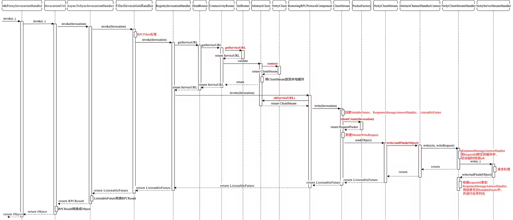

# HSF
High-speed Service Framework高速服务框架，是阿里内部广泛使用的分布式RPC服务框架。

### 总体架构


## HSF 特性

### 调用方式
#### 同步调用
1. HSF客户端默认以同步调用的方式消费服务，客户端代码需要同步等待返回结果。

#### 异步调用
3. 对于服务调用的客户端来说，并不是所有的HSF服务都需要同步等待返回结果的。对于这些服务，HSF提供异步调用的形式，让客户端不必同步阻塞在HSF调用操作上。HSF的异步调用，有 2 种：
Future 调用：客户端在需要获取调用的返回结果时，通过 HSFResponseFuture.getResponse(int timeout) 主动获取结果。
Callback 调用：Callback 调用利用HSF内部提供的回调机制，当指定的HSF服务消费完毕拿到返回结果时，HSF框架会回调用户实现的 HSFResponseCallback 接口，客户端通过回调通知的方式获取结果。

#### 泛化调用
对于一般的 HSF 调用来说，HSF 客户端需要依赖服务的二方包，通过依赖二方包中的 API 进行编程调用，获取返回结果。而泛化调用是指不需要依赖服务的二方包，从而发起 HSF 调用、获取返回结果的方式。在一些平台型的产品中，泛化调用的方式可以有效减少平台型产品的二方包依赖，实现系统的轻量级运行。

#### Http 调用
HSF 支持将服务以 HTTP 的形式暴露出来，从而支持非 Java 语言的客户端以 HTTP 协议进行服务调用。

### 调用链路 Filter扩展
HSF 内部设计了调用过滤器，并且能够主动发现用户的调用过滤器扩展点，将其集成到 HSF 调用链路中，使扩展方能够方便的对 HSF 请求进行扩展处理。（RPCFilter类）

## HSF 原理及模型
HSF的调用，由下图可了解到其整体的流程。后文将从HSF服务端的启动、服务发布与订阅、一次HSF服务调用的处理过程这几个方面来分析整个流程


### 层级释意

#### 配置领域 
APIBean 通过配置，用户使用API来对各层进行配置，并生成调用的代理或暴露服务

#### 服务领域
> 服务的粒度比应用小，包含调用链路、地址路由以及负载均衡等功能，运行时调用都在这个领域展开

InvocationHandler 调用的请求和响应，以责任链的形式实现了调用的拦截处理模式
Router 路由选址过程，一次调用传入Router，Router会符合要求的地址列表
LoadBalance 负载均衡的抽象，提供从一组地址中选择一个调用地址的能力
#### 应用领域
> 面向服务框架的注册和发现过程
>
Registry 注册中心客户端的抽象，完成服务注册以及服务订阅的工作
Protocol 定义协议和流程，识别注册中心下推地址的类型，完成发布和消费服务的工作

#### 框架领域
> 负责通信、线程、协议、序列化以及编解码相关的工作 

Packet 请求对象到通信对象的转换工作，以及通信对象到请求对象的转换
Serialize 序列化/反序列化工作
ThreadPool 线程池管理服务，维护了HSF框架对于线程资源的申请、分配以及线程指标的获取
Frame 网络层协议编解码
Stream 抽象的网络链接层，使用方可以通过Stream来发起调用以及接受响应

### 三个重复对象


#### FrameworkModel
框架级别的容器，一个框架级别的容器可以支持多个应用级别容器。在这个容器中，维护着框架层面的服务，比如：环境服务、I/O服务等，这些服务能够支持多个应用进行工作，因此在应用级别之上，抽象出了框架级别容器；

#### ApplicationModel
应用级别的容器，可以理解为一个war包就会对应一个应用级别的容器，它是HSF框架用户态的体现。在这个容器里面装着调用链路服务、地址服务等和应用相关的服务。HSF支持多个ApplicationModel，每个ApplicationModel都会有自己的类加载器，也有自己的应用服务加载器，HSF是围绕着应用级别容器来进行打造的；

#### ServiceMetadata
服务级别的容器，一个应用级别的容器可以拥有多个服务级别容器，因为HSF支持对于指定服务进行专属配置，所以每个服务都会生成一个ServiceMetadata，当然它会以消费者和提供者加以区分。

### 请求/响应流程图


## 从注解@HSFProvider看hsf服务的注册流程

### @HSFProvider 注解被 @Import(HsfProviderAnnotationRegistrar.class)
```java
@Target({ElementType.TYPE})
@Retention(RetentionPolicy.RUNTIME)
@Component
@Import(HsfProviderAnnotationRegistrar.class)
public @interface HSFProvider {
    // ....
}

```

#### HsfProviderAnnotationRegistrar
SpringBoot在启动过程中会解析@Import注解，解析的类是ConfigurationClassParser，方法是processImports，在解析的过程中会去装载通过@Import注解引入的HsfProviderAnnotationRegistrar类里面注册的BeanDefinition

HsfProviderAnnotationRegistrar内部的工作流程简单描述如下：

* 从environment中获取系统参数和application.properties中的配置参数，利用这些参数构造出HsfProperties对象，包含了HSF服务的各种配置信息；
* 创建HsfProviderBeanDefinitionBuilder，构造函数的入参是HsfProvider注解、beanName（【hsfProvider#HSFProvide】）、HsfProperties对象等，调用其build方法，构造类HSFSpringProviderBean的BeanDefinition用于后面的注册；
* 构造BeanDefinition的过程中可能会将StringListFactoryBean类注册到Spring容器中，该类和ConfigServer地址有关，是否注册取决于HsfProperties对象中是否存在configServerCenter的配置，存在则注册；
* 调用`registry.registerBeanDefinition(beanName, beanDefinition)` 注册HSFSpringProviderBean类到Spring容器；

### 注册 HSFSpringProviderBean
HSFSpringProviderBean实现了三个Spring提供的接口，InitializingBean、ApplicationContextAware、ApplicationListener，分别重写了afterPropertiesSet、setApplicationContext、onApplicationEvent方法


###  HSFApiProviderBean
HSFSpringProviderBean的实例化会触发HSFApiProviderBean类的实例化，HSFApiProviderBean是真正实现HSF发布注册的类。

```java
public class HSFApiProviderBean {
    // ...
    private final ApplicationModel applicationModel = ApplicationModelFactory.setCurrentApplication();
    private final ServiceMetadata metadata;
    private final AtomicBoolean inited = new AtomicBoolean(false);
    private final AtomicBoolean isPublished = new AtomicBoolean(false);
    private Config config;
    private boolean removeOnUnregister = false;
}
```
HSFApiProviderBean的构造方法内部利用applicationModel属性创建了ServiceMetadata 属性对象和Config属性对象，
* config对象（是HSF的各种内部配置，不会暴露给用户）
* applicationModel对象（代表了一个应用，里面包含了应用名，类加载器，管理此应用的容器，用来创建和管理本应用相关的实例）
* metadata对象是服务提供者信息（初始化线程池，包括框架使用的调度线程池scheduledExecutorService，发布线程池exportReferExecutorService，设置HSF配置初始值，包括调用端true，版本1.0.0，归组HSF，客户端默认调用超时时间3s，默认客户端连接超时时间1s，序列化类型hessian，HSF服务版本2.0，HSF2.0序列化类型hessian2等）

1. provider 服务注册流程图


####  初始化HSFApiProviderBean(HSFApiProviderBean#init)
```java
public synchronized void init() {
    // 构造protocolFilterChain拦截调用链，目的是当调用者请求HSF接口时，拦截请求并利用责任链模式逐层处理请求
    // 真正反射调用目标服务对象的方法的类在调用链的最末端，见下图 1
    // 当触发export方法后，链条的每个节点都会调用下一个节点的export方法，整个责任链的内容见下图2
    protocolFilterChain = ProtocolInterceptorChainBuilder.build(this);
    // ...
    
    // 服务提供者/消费者处理handlerChain
    if (isProvider()) {
        // 服务提供端处理
        // 获取ReflectInvocationHandler，实际上就是一个InvocationHandler，只不过实现了InvocationHandler
        InvocationHandler serverInvocationHandler = invocationHandlerFactory.createInvocationHandler(getTarget());
        // 构造handlerChain，和上面的protocolFilterChain类似
        invocationHandler = InvocationHandlerChainFactory.buildHandlerChain(this, serverInvocationHandler);
    } else {
        // 服务消费端处理
        invocationHandler = InvocationHandlerChainFactory.buildHandlerChain(this, consumerHandlerHitch);

        //bridge
        SyncInvocationHandler clientSyncInvocationHandler = invocationHandlerFactory.createSyncInvocationHandler(
                invocationHandler);
        syncInvocationHandler = SyncInvocationHandlerChainFactory
                .buildSyncInvocationHandlerChain(this, clientSyncInvocationHandler);
    }
}
```

1. protocolFilterChain 是在HSF 消费端和服务提供端都会创建


2. invocationHandlerChain 是在HSF 消费端和服务提供端都会创建

其中 FilterInvocationHandler的功能是处理RPCFilter，会发现有两个 FilterInvocationHandler，其中com.taobao.hsf.filter.FilterInvocationHandler是老版本的，为了兼容所以保留，新版本的是 com.taobao.hsf.invocation.filter.FilterInvocationHandler。

#### 调用HSFApiProviderBean#publish发布服务 
1. 获取服务提供端服务的模型，包括服务接口、版本、服务的真实处理类、服务的各种元数据信息metadata、服务中的提供的方法
2. 调用 ServiceMetadata#exportSync 发布服务
3. 调用protocolFilterChain，调用每个节点的export方法，最后一个节点是HSFProtocol和DubboProtocol，只能调一个，这两个类的export方法返回List<ServiceURL>，调用哪个就看用哪个协议
4. 调用HSFProtocol#export()获取服务URL列表List<ServiceURL>


####  HSFProtocol#export() 注册服务& 返回服务url
> 实际内部是调用HSFProviderManager#registerProvider 注册服务，实际上是使用线程池一个线程启动一个HSF server，然后返回服务访问链接，并且为该服务注册钩子事件
```java
@Override
public List<ServiceURL> export(ServiceMetadata serviceMetadata, InvocationHandler invocationHandler) {
  if (canNotUse(serviceMetadata)) {
      return Collections.emptyList();
  }

   // 1、内部会调用providerServer.startHSFServer();开始启动HSF server
   // 2、startHSFServer内部首先获取Server类的对象
   // 3、从环境中取hsf.server.ip和hsf.server.port的值，然后调bing() -> doBind()来启动TCP服务
   // 4、取hsf.http.port，然后起HTTP服务
   // 5、取环境中HSF_SERVER_PUB_PORT对应的TCP端口、HSF_HTTP_PUB_PORT对应的HTTP端口、HSF_SERVER_PUB_HOST对应的TCP IP，放入exportServerInfo缓存中
   // 6、isProviderStarted和isHttpStarted置位true
   // 7、利用ApplicationShutdownHooks.add(hook);添加关闭线程的钩子，线程内部是stopHSFServer，可以优雅关闭HSF server
   // 8、创建一个服务单独使用的线程池
  registerProvider(serviceMetadata);
  
   // 从exportServerInfo缓存中获取需要上报的HTTP、TCP端口和IP信息
  Map<Integer, String> needExportServers = providerServer.severNeedExport();

  List<ServiceURL> serviceURLs = new ArrayList<ServiceURL>();

  for (Map.Entry<Integer, String> server : needExportServers.entrySet()) {
      String data = HSFServiceTargetUtil.getTarget(server.getValue(), server.getKey(), serviceMetadata);
      ServiceURLRawData serviceURLRawData = ServiceURLRawData.parseUrl(data);
      HSFServiceURL hsfServiceURL = new HSFServiceURL(serviceMetadata, serviceURLRawData);
      serviceURLs.add(hsfServiceURL);
  }
  return serviceURLs;
}
```

#### 调用RegistryProtocolInterceptor#export将服务注册到ConfigServer
获取到serviceURLs后，遍历serviceMetadata中的每个Register，调用每个Register的register方法注册数据到ConfigServer，实际上调用的是ConfigServerRegistry的register方法。
该方法内部的核心是publish方法，publish内部的核心是doPublish，doPublish内部核心调用signalWorker，将服务注册到configServer


## HSF 消费端注册@HSFConsumer

1. HSFConsumerBean初始化流程


### 通过Spring-boot的AutoConfiguration开始注册HSFConsumer

#### HSFConsumer注解
```java
@Target({ElementType.FIELD})
@Retention(RetentionPolicy.RUNTIME)
@Autowired
public @interface HSFConsumer {
    // ...
}
```

#### @HsfConsumerAutoConfiguration 
SpringBoot项目的入口类使用`@SpringBootApplication`修饰，该类下的`@EnableAutoConfiguration`下的`@Import(EnableAutoConfigurationImportSelector.class)`会加载`EnableAutoConfigurationImportSelector`类。
该类在SpringBoot启动后会去扫描`META-INF/spring.factories`文件，该文件是SpringBoot提供的Starter自动配置的入口。

hsf-spring-boot-autoconfigure.jar中定义了`META-INF/spring.factories`文件，该文件定义了自动配置
```bash
org.springframework.boot.autoconfigure.EnableAutoConfiguration=\
com.alibaba.boot.hsf.consumer.HsfConsumerAutoConfiguration,\
com.alibaba.boot.hsf.health.HsfHealthIndicatorAutoConfiguration

org.springframework.boot.actuate.autoconfigure.ManagementContextConfiguration=\
com.alibaba.boot.hsf.endpoint.HsfEndPointManagementContextConfiguration
```
这里就是告诉SpringBoot使用HsfConsumerAutoConfiguration类来装配我这个模块，
SpringBoot获取到该配置后会经过一系列的判断(比如是否被用户手动exclude)，然后决定加载后将该类纳入SpringBoot的配置中去，让IoC容器去完成配置。
到此整个自动配置发现流程就算完成，这种方式类似Java提供的SPI，利用classpath下的配置信息达到批量自动配置的目地

##### HsfConsumerAutoConfiguration 初始化
BeanFactoryPostProcessor是Spring Bean生命周期中的扩展过程，它和BeanPostProcess的区别如下：
1、通过BeanFactoryPostProcessor接口，获取BeanFactory，操作BeanFactory对象，修改BeanDefinition，仅仅和BeanDefinition发生关系，不和Bean实例发生关系；
2、通过BeanPostProcess接口，可以在Bean实例初始化前后分别做扩展性的操作，和Bean实例直接发生关系。
```java
@Configuration
@ConditionalOnProperty(name = Constants.ENABLED, matchIfMissing = true)
public class HsfConsumerAutoConfiguration {

    @Bean
    public static BeanFactoryPostProcessor hsfConsumerPostProcessor() {
        return new HsfConsumerPostProcessor();
    }

}
```
HsfConsumerAutoConfiguration类会被SpringBoot接管，并且注入一个BeanFactoryPostProcessor对象，
SpringBoot启动的过程会调用ApplicationContext的refresh()方法，方法内部会调用invokeBeanFactoryPostProcessors方法来处理hsfConsumerPostProcessor方法返回的HsfConsumerPostProcessor对象。

#### HsfConsumerPostProcessor
该类的核心能力是继承BeanFactoryPostProcessor，重写postProcessBeanFactory，springBoot启动时会调用，重写的方法内部的功能是遍历BeanFactory中的每个bean，判断每个bean的属性是否由@HSFConsumer修饰，
如果是该注解修饰的，就创建这个属性的BeanDefinition，然后通过BeanDefinitionRegistry注册到容器中。

#### HSFSpringConsumerBean
HSFSpringConsumerBean实现了InitializingBean和FactoryBean，
SpringBoot启动过程中会调用InitializingBean的afterPropertiesSet()方法，该方法内部调用HSFApiConsumerBean的init()方法，用来初始化HSFApiConsumerBean的serviceMetadata属性。
BeanFactory是一个bean工厂，通过该接口可以管理Spring的所有bean。这里实现了FactoryBean的三个方法，其中getObject方法返回了ServiceMetadata的target属性，该属性是真正的HSF服务的代理对象。以上，即将消息流转到了消费者的核心类HSFApiConsumerBean。

#### HSFApiConsumerBean
类的核心功能包括ServiceMetadata的初始化（protocolFilterChain和invocationHandler的初始化）、消费者服务代理的创建和订阅、异步方法的解析（2.4节中HsfConsumerBeanDefinitionBuilder设置的futureMethods属性）等
````java
public HSFApiConsumerBean() {
    // 初始化applicationModel，当前应用的管理容器
    applicationModel = ApplicationModelFactory.setCurrentApplication();
    // 初始化ServiceMetadata，里面有线程池的初始化
    metadata = new ServiceMetadata(applicationModel);
    // 从容器中获取ConfigServer应用服务的配置
    config = HSFServiceContainer.getInstance(ConfigService.class).getConfig();
    // 初始化规则、版本、代理类型JSK或
    metadata.setGroup(config.getString(HSF_DEFAULT_GROUP_KEY));
    metadata.setVersion(config.getString(HSF_DEFAULT_VERSION_KEY));
    metadata.setProxyStyle(config.getString(HSF_DEFAULT_PROXY_STYLE_KEY));
}
````

1. HSFApiConsumerBean#init()方法初始化服务
2. 调用 serviceMetadata的init()方法 构建处理器InvocationHandler
3. 调用 HSFApiConsumerBean#consume()
通过jdk代理获得HSF服务的代理类，作为初始化HSFConsumerBean的基本数据，然后调用 metadata.referSync()方法订阅服务
4. metadata.referSync()方法订阅服务
   这里按照当时ServiceMetadata#init方法中构建的protocolFilterChain链时的顺序，逐一调用链上的每一个节点。
5. 直到调用链返回了一个InvocationHandler对象，跟踪调用链路时，会发现RegistryProtocolInterceptor类的refer()方法返回了一个新创建的RegistryInvocationHandler对象，返回之前消费端会订阅ConfigServer。

经过上述步骤后，会把一个代理对象注入到metadata中的target属性中。当执行FactoryBean的getObject方法时，从metadata获得代理对象。

## HSFConsumerBean调用流程
消费者调用流程总结起来就是异步执行protocolFilterChain的调用链，其中进行各种环境的初始化、订阅等准备工作，最终调用节点MultiplexingProtocol，含HSF本身与兼容Dubbo两种方式。
以HSF为例，最终调用RemotingRPCProtocolComponent的invoke()方法，利用ip和address定位远程的HSF-RPC服务，通过NettyClientStream将socket流写给服务端。
通过以上各Interceptor节点的处理，使得在调用HSFRPC服务时，就像在调用本地的接口一样。



## HSFProvider调用过程
1. 服务提供端调用流程图


### HandleRequest#received
HandleRequest继承了ServerStreamMessageListenerAdapter类，该类实现了ServerStreamMessageListener，是Netty的服务端部分。
```java
public void received(Server server, ServerStream stream, RequestPacket requestPacket) {
    // 根据请求中的协议类型选择serverHandler，如果是HSF，那么这里是HSFServerHandler
    ServerHandler serverHandler = ServerHandlerSelector.getInstance().select(requestPacket.protocolType());
    serverHandler.process(requestPacket, stream);
}
```

### HSFServerHandler#process
1. 获取服务名
2. 根据服务名获取元数据信息ServiceMetadata
3. 将请求packet，RequestPacket转换成为一次调用，获取一个Invocation对象
4. 取出Invocation中的服务方法名、方法入参，根据方法名获取方法执行的线程池，该线程池是服务提供端初始化计划时根据方法名创建好的；
5. 调用RequestProcessor属性的handleRequest方法开始处理请求；

### 调用 ProviderProcessor.handleRequest
1. 获取服务名，设置对端IP，就是serverStream中的remoteIp
2. 取元数据信息ServiceMetadata
3. 调用InvocationHandler链的每个invoke方法，传入Invocation对象，获取返回值
4. 返回的值是一个支持添加Listener的Future，当future完成时，将会回调所有被添加的Listener，用户进行添加的Runnable将会在Future的get()返回之前进行执行，如果没有调用Future的get()将会在Future完成时调用Listener。

#### FilterInvocationHandler
调用filterDelegate的invoke方法，触发调用RPCFilter的invoke方法，RPCFilter是用户自定义的Filter，可由用户自行对调用链进行扩展。
```java
public ListenableFuture<com.taobao.hsf.invocation.RPCResult> invoke(
    com.taobao.hsf.invocation.Invocation invocation) throws Throwable {
    if (hasOldExtension) {
        Invocation oldInvocation = new Invocation(invocation);
        // 用户自定义的Filter，可由用户自行对调用链进行扩展
        ListenableFuture<RPCResult> result = filterDelegate.invoke(oldInvocation);
        return Futures.map(result, new RPCResultAdapterFunc());
    } else {
        return delegate.invoke(invocation);
    }
}
```

#### 核心 ReflectInvocationHandler 处理请求和 返回值 
1. 构造一个默认Future，可以允许被设置值，当设置值的时候，在Future#get()方法的线程就会返回
2. 调用handleRequest0方法处理请求，获取HSF的响应对象HSFResponse
3. 将HSFResponse设置到rpcResult中，然后将rpcResult设置到默认Future中返回
4. Future完成时，会回调OutputCallback，该类没有直接实现Runnable接口，会通过父类AbstractContextAwareRPCCallback的父类AbstractListener来执行run方法，这里会执行future.get()。然后执行operationComplete方法。
   * 获取requestId、serializeType、protocolType
   * 用这些值初始化rpcResult的ResponseContext对象
   * 然后output的flush回调stream的write方法，返回调用结果给客户端。