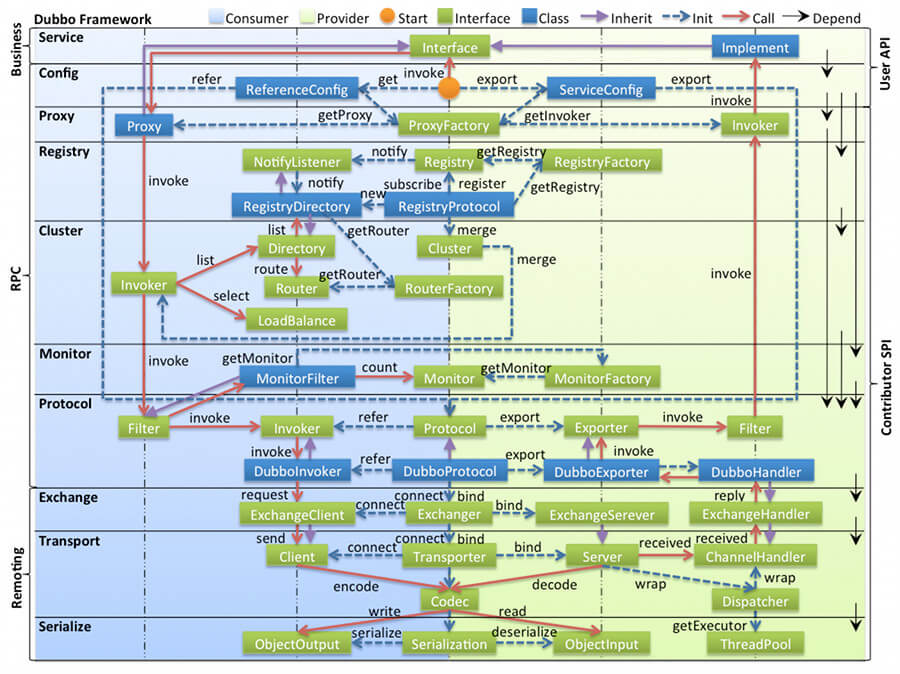
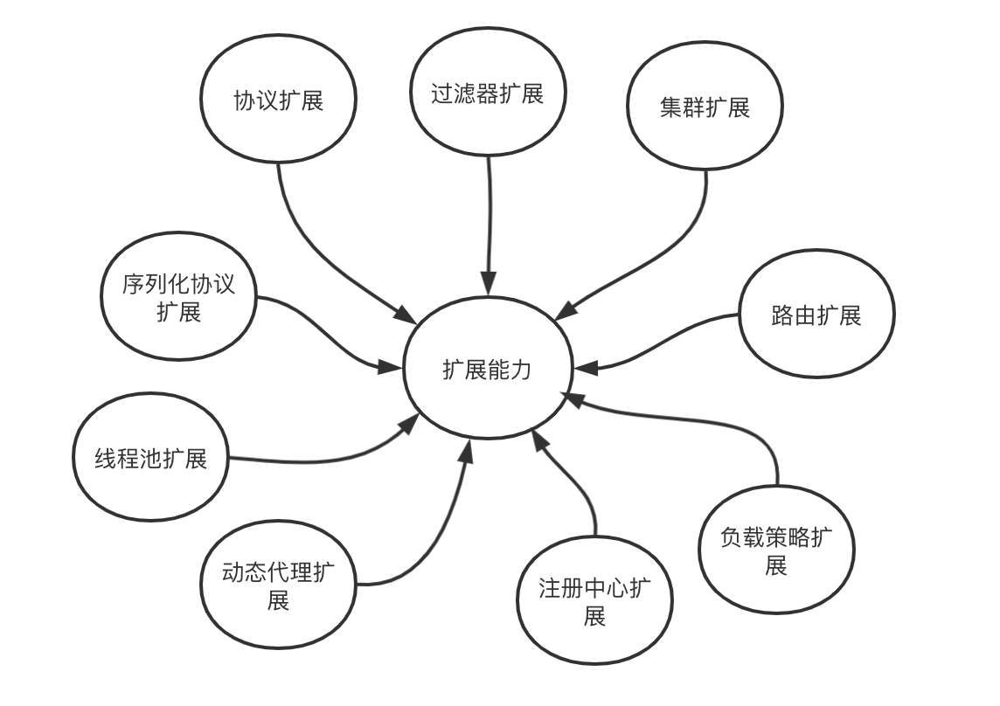

# Dubbo 

## 什么是Dubbo
### Dubbo 提供了六大核心能力:

1. 面向接口代理的高性能 RPC 调用。
2. 智能容错和负载均衡。
3. 服务自动注册和发现。
4. 高度可扩展能力。 
5. 运行期流量调度。 
6. 可视化的服务治理与运维。

### Dubbo 帮助我们解决了什么问题呢？
1. 负载均衡：同一个服务部署在不同的机器时该调用哪一台机器上的服务。
2. 服务调用链路生成：随着系统的发展，服务越来越多，服务间依赖关系变得错踪复杂，甚至分不清哪个应用要在哪个应用之前启动，架构师都不能完整的描述应用的架构关系。Dubbo 可以为我们解决服务之间互相是如何调用的。
3. 服务访问压力以及时长统计、资源调度和治理：基于访问压力实时管理集群容量，提高集群利用率。

## Dubbo的原理

### dubbo框架设计
下图是 Dubbo 的整体设计，从下至上分为十层，各层均为单向依赖。
左边淡蓝背景的为服务消费方使用的接口，右边淡绿色背景的为服务提供方使用的接口，位于中轴线上的为双方都用到的接口。



* config 配置层：Dubbo 相关的配置。支持代码配置，同时也支持基于 Spring 来做配置，以 ServiceConfig, ReferenceConfig 为中心
* proxy 服务代理层：调用远程方法像调用本地的方法一样简单的一个关键，真实调用过程依赖代理类，以 ServiceProxy 为中心。
* registry 注册中心层：封装服务地址的注册与发现。
* cluster 路由层：封装多个提供者的路由及负载均衡，并桥接注册中心，以 Invoker 为中心。
* monitor 监控层：RPC 调用次数和调用时间监控，以 Statistics 为中心。
* protocol 远程调用层：封装 RPC 调用，以 Invocation, Result 为中心。
* exchange 信息交换层：封装请求响应模式，同步转异步，以 Request, Response 为中心。
* transport 网络传输层：抽象 mina 和 netty 为统一接口，以 Message 为中心。
* serialize 数据序列化层：对需要在网络传输的数据进行序列化。


### Dubbo 的 SPI 机制了解么？ 如何扩展 Dubbo 中的默认实现？

SPI（Service Provider Interface） 机制被大量用在开源项目中，它可以帮助我们动态寻找服务/功能（比如负载均衡策略）的实现。

SPI 的具体原理是这样的：
我们将接口的实现类放在配置文件中，我们在程序运行过程中读取配置文件，通过反射加载实现类。
这样，我们可以在运行的时候，动态替换接口的实现类。和 IoC 的解耦思想是类似的。

Java 本身就提供了 SPI 机制的实现。不过，Dubbo 没有直接用，而是对 Java 原生的 SPI 机制进行了增强，以便更好满足自己的需求。

#### 那我们如何扩展 Dubbo 中的默认实现呢？
比如说我们想要实现自己的负载均衡策略。

1. 第1步：我们创建对应的实现类 XxxLoadBalance 实现 LoadBalance 接口或者 AbstractLoadBalance 类。
```java
package com.xxx;

import org.apache.dubbo.rpc.cluster.LoadBalance;
import org.apache.dubbo.rpc.Invoker;
import org.apache.dubbo.rpc.Invocation;
import org.apache.dubbo.rpc.RpcException;

public class XxxLoadBalance implements LoadBalance {
    public <T> Invoker<T> select(List<Invoker<T>> invokers, Invocation invocation) throws RpcException {
        // ...
    }
}
```
2. 第2步：我们将这个实现类的路径写入到resources 目录下的 `META-INF/dubbo/org.apache.dubbo.rpc.cluster.LoadBalance`文件中即可。
```java
src
 |-main
    |-java
        |-com
            |-xxx
                |-XxxLoadBalance.java (实现LoadBalance接口)
    |-resources
        |-META-INF
            |-dubbo
                |-org.apache.dubbo.rpc.cluster.LoadBalance (纯文本文件，内容为：xxx=com.xxx.XxxLoadBalance)
```

#### dubbo 提供的其他扩展SPI
使用 IoC 容器帮助管理组件的生命周期、依赖关系注入等是很多开发框架的常用设计，Dubbo 中内置了一个轻量版本的 IoC 容器，用来管理框架内部的插件，实现包括插件实例化、生命周期、依赖关系自动注入等能力。

Dubbo 插件体系与 IoC 容器具有以下特点：

* 核心组件均被定义为插件，用户或二次开发者扩展非常简单。 在无需改造框架内核的情况下，用户可以基于自身需求扩展如负载均衡、注册中心、通信协议、路由等策略。
* 平等对待第三方扩展实现。 Dubbo 中所有内部实现和第三方实现都是平等的，用户可以基于自身业务需求替换 Dubbo 提供的原生实现。
* 插件依赖支持自动注入（IoC）。 如果插件实现依赖其他插件属性，则 Dubbo 框架会完成该依赖对象的自动注入，支持属性、构造函数等方式。
* 插件扩展实现支持 AOP 能力。 框架可以自动发现扩展类的包装类，通过包装器模式对插件进行 AOP 增强。
* 支持插件自动激活。 通过为插件实现指定激活条件（通过注解参数等），框架可在运行时自动根据当前上下文决策是否激活该插件实现。
* 支持插件扩展排序。

Dubbo 在框架中定义了非常多的扩展点，因此，当你发现官方库没法满足业务需求，想为 Dubbo 框架提供定制能力时，请优先查阅以下扩展点定义，看是否能通过提供扩展实现的方式无侵入的定制 Dubbo 框架。



## Dubbo 支持的协议
Dubbo 支持多种通信协议，每种协议都有其特定的使用场景和优势。以下是 Dubbo 支持的主要协议及其特点：

### 1. Dubbo 协议
* 默认协议：Dubbo 协议是 Dubbo 框架的默认协议。
* 高性能：基于 Netty 实现，具有高性能和低延迟的特点。
* 适用场景：适用于对性能要求较高的内部服务调用。
### 2. HTTP 协议
* 通用性：支持 HTTP/1.1 协议，可以与现有的 Web 服务集成。
* 适用场景：适用于需要与非 Java 系统进行交互的场景。
### 3. Hessian 协议
* 二进制协议：Hessian 是一种轻量级的二进制协议，支持跨语言调用。
* 适用场景：适用于需要跨语言调用的场景，如 Java 与 PHP、Ruby 等语言之间的调用。
### 4. RMI 协议
* Java 标准：RMI（Remote Method Invocation）是 Java 的标准远程方法调用协议。
* 适用场景：适用于纯 Java 环境下的服务调用。
### 5. REST 协议
* RESTful 风格：支持 RESTful 风格的 API 调用。
* 适用场景：适用于需要构建 RESTful API 的场景，便于与前端应用或其他系统集成。
### 6. Thrift 协议
* 高效：Thrift 是一个高效的跨语言服务开发框架，支持多种传输协议和序列化协议。
* 适用场景：适用于需要高性能和跨语言调用的场景。

### 推荐使用的协议
* Dubbo 协议：推荐在大多数情况下使用 Dubbo 协议，因为它是 Dubbo 框架的默认协议，具有高性能和低延迟的特点，适合内部服务调用。
* HTTP 协议：如果需要与非 Java 系统集成或构建 RESTful API，可以考虑使用 HTTP 协议。
* Thrift 协议：如果需要高性能和跨语言调用，可以考虑使用 Thrift 协议。

### 在dubbo中配置不同的协议 
```xml
<!-- dubbo-provider.xml -->
<beans xmlns="http://www.springframework.org/schema/beans"
       xmlns:xsi="http://www.w3.org/2001/XMLSchema-instance"
       xmlns:dubbo="http://dubbo.apache.org/schema/dubbo"
       xsi:schemaLocation="http://www.springframework.org/schema/beans http://www.springframework.org/schema/beans/spring-beans.xsd
       http://dubbo.apache.org/schema/dubbo http://dubbo.apache.org/schema/dubbo/dubbo.xsd">

    <!-- 使用 Dubbo 协议 -->
    <dubbo:protocol name="dubbo" port="20880"/>

    <!-- 使用 HTTP 协议 -->
    <dubbo:protocol name="http" port="8080"/>

    <!-- 使用 Hessian 协议 -->
    <dubbo:protocol name="hessian" port="8081"/>

    <!-- 使用 RMI 协议 -->
    <dubbo:protocol name="rmi" port="1099"/>

    <!-- 使用 REST 协议 -->
    <dubbo:protocol name="rest" port="8082"/>

    <!-- 使用 Thrift 协议 -->
    <dubbo:protocol name="thrift" port="6666"/>

    <!-- 服务提供者配置 -->
    <dubbo:service interface="com.example.DemoService" ref="demoService" protocol="dubbo,http,hessian,rmi,rest,thrift"/>

    <bean id="demoService" class="com.example.impl.DemoServiceImpl"/>
</beans>
```

## Dubbo filter机制
Dubbo框架提供了非常丰富的扩展点，其扩展性依赖于dubbo的扩展点加载机制，即dubbo SPI。
不同于Java SPi的是dubbo在Java SPI原有基础之上做了扩展，包括：提供IOC和AOP的实现以及按需加载扩展类。

### dubbo filter 
Dubbo核心源码-Filter链原理 https://blog.csdn.net/Rookie_CEO/article/details/140847689
而dubbo自身提供了全局异常处理机制，也是通过Filter扩展点实现，即ExceptionFilter：
在onResponse方法的逻辑中通过注解不难看出：

1. 如果时受检异常直接抛出；
2. 如果时定义在方法签名上的异常直接抛出；
3. 如果异常类和接口在同一包下，直接抛出；
4. 如果是Java内部异常或者是dubbo内部异常，直接抛出；
5. 如果以上都不是，那将异常信息用RuntimeException包装返回。

#### 构建filter责任链
dubbo在执行远程调用请求时，会执行构建的filter链，在加载Protocol接口的扩展点ProtocolFilterWrapper时构建filter责任链


### 自定义扩展dubbo filter
自定义扩展Filter实现 https://www.cnblogs.com/zhaobo1997/p/18005296

1. 实现 Filter 接口
只需要扩展接口org.apache.dubbo.rpc.Filter，
2. 并在`META-INF/dubbo/org.apache.dubbo.rpc.Filter`中添加`xxx=com.xxx.XxxFilter`
注：`org.apache.dubbo.rpc.Filter` 全限定的名字为文件名，dubbo SPI规范如此。
具体的Maven项目结构应为：
```bash
src
 |-main
    |-java
        |-com
            |-xxx
                |-XxxFilter.java
    |-resources
        |-META-INF
            |-dubbo
                |-org.apache.dubbo.rpc.Filter
```

3. filter执行顺序配置
* 用户自定义 filter 默认在内置 filter(default) 之后。
* 特殊值 default，表示缺省扩展点插入的位置。比如：filter="xxx,default,yyy"，表示 xxx 在缺省 filter 之前，yyy 在缺省 filter 之后。
* 特殊符号 -，表示剔除。比如：filter="-foo1"，剔除添加缺省扩展点 foo1。比如：filter="-default"，剔除添加所有缺省扩展点。
* provider 和 service 同时配置的 filter 时，累加所有 filter，而不是覆盖。比如：<dubbo:provider filter="xxx,yyy"/> 和 <dubbo:service filter="aaa,bbb" />，则 xxx,yyy,aaa,bbb 均会生效。如果要覆盖，需配置：<dubbo:service filter="-xxx,-yyy,aaa,bbb" />
  
所以，可以将dubbo提供的ExceptionFilter二次封装，使其可以返回自定义异常：
```java
@Override
public void onResponse(Result appResponse, Invoker<?> invoker, Invocation invocation) {
    if (appResponse.hasException() && GenericService.class != invoker.getInterface()) {
        try {
            Throwable exception = appResponse.getException();

            // directly throw if it's checked exception
            if (!(exception instanceof RuntimeException) && (exception instanceof Exception)) {
                return;
            }

            // 返回自定义异常
            if (exception instanceof BaseBizException){
                appResponse.setException(((BaseBizException) exception));
            }
                ···
            // otherwise, wrap with RuntimeException and throw back to the client
            appResponse.setException(new RuntimeException(StringUtils.toString(exception)));
        } catch (Throwable e) {
            logger.warn("Fail to ExceptionFilter when called by " + RpcContext.getContext().getRemoteHost() + ". service: " + invoker.getInterface().getName() + ", method: " + invocation.getMethodName() + ", exception: " + e.getClass().getName() + ": " + e.getMessage(), e);
        }
    }
}
```

此外，还希望filter做一些其他的事情，比如在日志中打印dubbo调用情况，可以这么做：

首先在自定义的filter上加注解@Activate(group = {Constants.PROVIDER,Constants.CONSUMER},order = 1000)，然后在invoke中打印日志输出dubbo调用信息：
```java
@Slf4j
@Activate(group = {CommonConstants.PROVIDER, CommonConstants.CONSUMER}, order = 10000)
public class CustomDubboFilter implements Filter {
    private String role = "provider";
    private final Logger logger = LoggerFactory.getLogger(this.getClass());
    @Override
    public Result invoke(Invoker<?> invoker, Invocation invocation) throws RpcException {
        RpcServiceContext serviceContext = RpcContext.getServiceContext();
        if (serviceContext.isConsumerSide())
            role = "consumer";
        String remoteApplicationName = serviceContext.getRemoteApplicationName();
        String remoteAddressString = serviceContext.getRemoteAddressString();
        String method = invoker.getInterface().getName() +"#"+ invocation.getMethodName();

        String log = String.format("[DUBBO-INVOKE-LOG] ROLE：%s，invokeTime: %s，remoteApplicationName: %s，invokeMethod: %s，inputParameterTypes: %s, inputParams: %s, remoteAddress: %s",
                role,
                DateUtil.formatDateTime(new Date()),
                remoteApplicationName,
                method,
                JSON.toJSONString(invocation.getParameterTypes()),
                JSON.toJSONString(invocation.getArguments()),
                remoteAddressString);
        logger.info(log);
        return invoker.invoke(invocation);
    }
}
```

也可以通过attachment传递traceId：
```java
@Activate(group = {CommonConstants.PROVIDER, CommonConstants.CONSUMER}, order = 1000)
public class TraceFilter implements Filter, Filter.Listener {
    private Logger logger = LoggerFactory.getLogger(ExceptionFilter.class);

    private static final String TRACE_ID = "TraceId";

    @Override
    public Result invoke(Invoker<?> invoker, Invocation invocation) throws RpcException {
        RpcContext rpcContext = RpcContext.getContext();
        String traceId;
        if (rpcContext.isConsumerSide()) {
            traceId = (String) MDC.get(TRACE_ID);
            if (traceId == null) {
                traceId = UUID.randomUUID().toString();
            }
            rpcContext.setAttachment(TRACE_ID, traceId);
        }else if (rpcContext.isProviderSide()) {
            traceId = rpcContext.getAttachment(TRACE_ID);
            if (traceId == null) {
                traceId = UUID.randomUUID().toString();
            }
            MDC.put(TRACE_ID, traceId);
        }[]()
        return invoker.invoke(invocation);
    }
}
```

4. 最后，需要修改配置文件（yml）：
```yml
dubbo:
  consumer:
    filter: TraceFilter, LogFilter, -exception
  provider:
    filter: CustomExceptionFilter, LogFilter, TraceFilter, -exception
```


更多Dubbo SPI 插件及详情 https://cn.dubbo.apache.org/zh-cn/overview/mannual/java-sdk/reference-manual/spi/spi-list/

Dubbo SPI 核心源码 https://www.jianshu.com/p/7daa38fc9711
https://javaguide.cn/distributed-system/rpc/dubbo.html#dubbo-%E6%9E%B6%E6%9E%84%E4%B8%AD%E7%9A%84%E6%A0%B8%E5%BF%83%E8%A7%92%E8%89%B2%E6%9C%89%E5%93%AA%E4%BA%9B