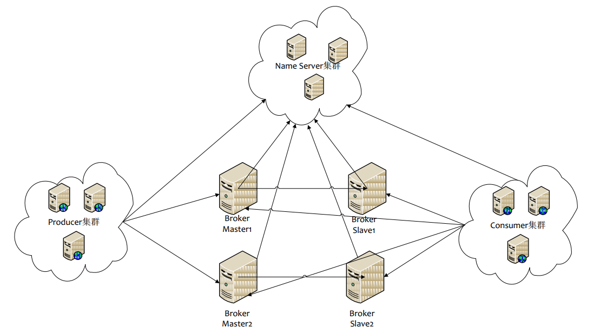
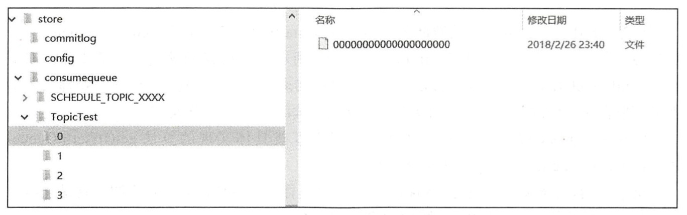
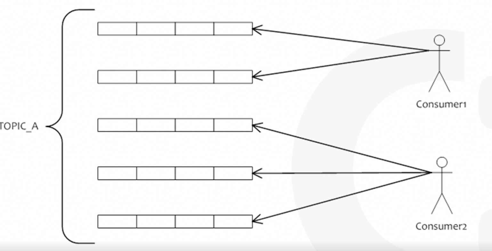
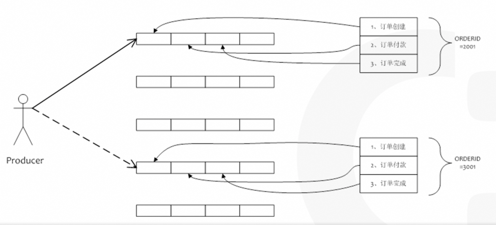
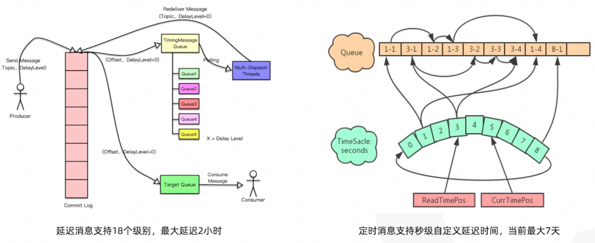
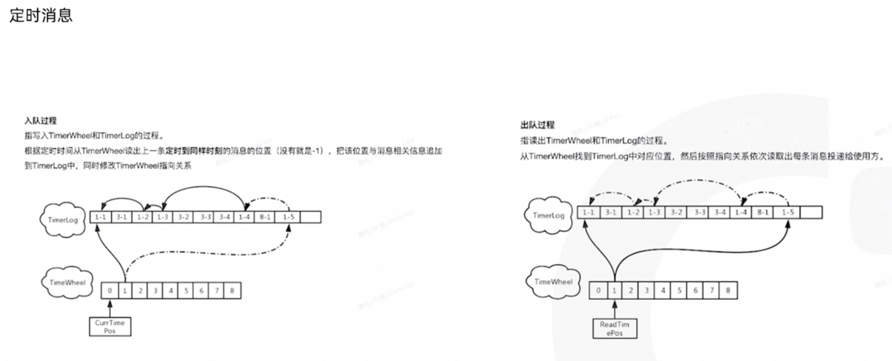
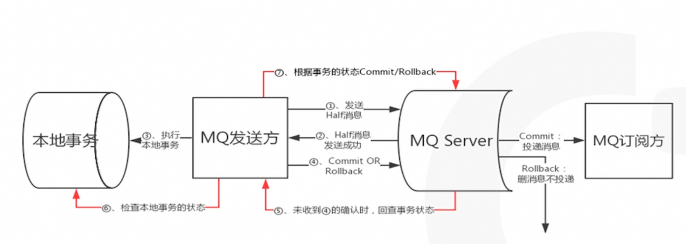

## MetaQ 框架及原理
MetaQ是一款分布式、队列模型的消息中间件。基于发布订阅模式，有Push和Pull两种消费方式，支持严格的消息顺序，亿级别的堆积能力，支持消息回溯和多个维度的消息查询。
MetaQ是阿里巴巴自研的一款分布式消息中间件，使用Java语言开发。
2011年初，淘宝中间件团队在对Kafka进行深入研究后，开发了一款新的MQ—MetaQ。
2012年，MetaQ发展到3.0版本，在其基础上进行了进一步的抽象，形成RocketMQ，然后进行了开源。
2016年11月11月28日，阿里巴巴向Apache 软件基金会捐赠 RocketMQ，RocketMQ成为Apache孵化项目。

### NameServer
Topic路由注册中心。NameServer是无状态的，各节点间相互不进行信息通讯。
NameServer优势：更轻量级，扩容简单，集群搭建简单。

Broker启动时会轮询NameServer列表，与每个NameServer节点都建立长连接，并发起注册请求。
因此，在每个NameServer节点内部都维护着所有Broker的地址列表，所有Topic和Topic对应Queue的信息等。
消息生产者在发送消息之前先与任意一台NameServer建立连接，获取Broker服务器的地址列表，然后根据负载均衡算法从列表中选择一台消息服务器发送消息。

### Broker
Broker负责接收并存储从生产者发送来的消息，同时为消费者的拉取请求作准备。

Broker在集群中分为Master与Slave。 Master负责处理读写操作请求，Slave负责对Master中的数据进行备份。一旦Master宕机，Slave会自动切换为Master工作。

消息发送到Broker后需要进行持久化。刷盘策略指的是消息发送到Broker内存后持久化到磁盘的方式，分为同步刷盘与异步刷盘。复制策略是Broker的Master与Slave间的数据同步方式，分为同步复制与异步复制。
由于异步复制、异步刷盘可能会丢失少量消息，因此Broker默认采用的是同步双写的方式。

### Producer
Producer发送的每条消息都包含一个Topic，表示一类消息的集合。同时还有一个Tag，用于区分同一Topic下不同类型的消息。
一个Topic包括多个Queue，每个Queue中存放该Topic的消息。一个Topic的Queue相当于该Topic中消息的分区，Queue可以存储在不同的Broker上。
发送消息时，Producer通过负载均衡模块选择相应的Broker集群队列进行消息投递。

### Consumer
push模式：推送模式，Broker有消息之后立刻推送消息给Consumer，需要Broker和Consumer建立长连接。
pull模式：拉取模式，Consumer设置间隔时间，主动去Broker拉取消息；
MetaQ/RocketMQ使用长轮询的方式。

## 消息存储及索引文件
消息存储相关文件默认在当前用户主目录下的store目录中。目录如下：
重要的是两个文件夹：
* commitlog下的mappedFile文件
* commitlog的索引文件夹-consumequeue

### appedFile文件
Broker的所有消息都存放在commitlog目录的mappedFile文件中。无论当前Broker中存放着多少Topic的消息，这些消息都是被顺序写入到了mappedFile文件中的。
每个mappedFile文件大小约为1G（小于等于1G）。文件名由20位十进制数构成，表示当前文件的第一条消息的起始位移偏移量。
根据offset查找消息时，可以通过二分查找文件列表，定位到具体文件，然后将绝对offset减去文件的起始节点转化为相对offset，就可以找到对应的消息。

### consumequeue文件夹
consumequeue文件夹下是commitlog的索引文件，可以根据consumequeue定位到具体的消息。 消息到达commitLog文件后，将异步生成consumequeue文件。
consumequeue文件中存在一个目录，目录名为Topic名称。在该目录下，会为该Topic的每个Queue建立一个目录，目录名为queueId。每个目录中存放着若干consumequeue文件。
consumequeue文件名由20位十进制数构成，表示当前文件的第一个索引条目的偏移量。
每个consumequeue文件可以包含30w个索引条目。每个索引条目包含消息的三个属性：消息在mappedFile文件中的偏移量CommitLog offset、消息长度、消息Tag的hashcode值。这三个属性占20个字节，因此每个文件的大小固定为30w*20字节（约5.72M）。

## 使用场景
### 填谷削峰
电商场景QPS很大，但下游系统处理能力有限，需要使用中间件进行限流，慢慢消费
消峰填补是指在大促期间，比如双十一零点，订单每秒创建量可能达到60万。但是下游物流系统可能不需要承担60万每秒的峰值，因为成本会很高。因此，他们会把消息全部堆在我们MEDICAL这里，然后通过一定的限流策略，比如订单创建每秒60万，他们只消费8万，然后慢慢地把这个流量消费掉。这是第一种最常用的场景，就是消峰填补。

### 异步解耦
对于一个应用来说，要在系统之间做异步解耦，消息中间件是最天然、最常用的手段。两个分布式系统之间可以不用感知对方的任何逻辑，通过消息中间件MAD Q紧密结合在一起

### 广播
### 精卫binlog同步
### IM
### 流计算类应用
越来越多的流计算开始流行，比如FLINK等集团内的流计算。它们会通过消息来进行实时计算。由于消息是基于队列模型的，因此对流计算来说是非常支持的一种场景

## 消费模式
### 集群消费
集群消费是指所有使用同一个消费组的机器，会平均地消费一个TOPIC下所有的消息。例如，某个TOPIC下面有九条消息，而你有一个CONSUMER ID下面有三个消费者实力。那么，在集群消费模式下，每台机器只会消费其中的三条消息。

### 广播消费
广播模式消费是与集群消费相对应的另一种消费模式。它指的是所有一个消费CONSUMER ID下面的所有消费者都会消费每一条消息。例如，我们刚才提到的一个TOPIC上有九条消息，同时有三个消费者，那么这九条消息这三个消费者都会收到。

### 顺序消费
即对于一个指令TOPIC，每个客户端可以在队列维度下按照严格的先进先出顺序进行消费和发送。

### 延迟消费
延迟消费是指将消息发送到服务器后，不希望立即消费，而是需要经过一定延迟时间后才会投递到消费者

## 事务消息
