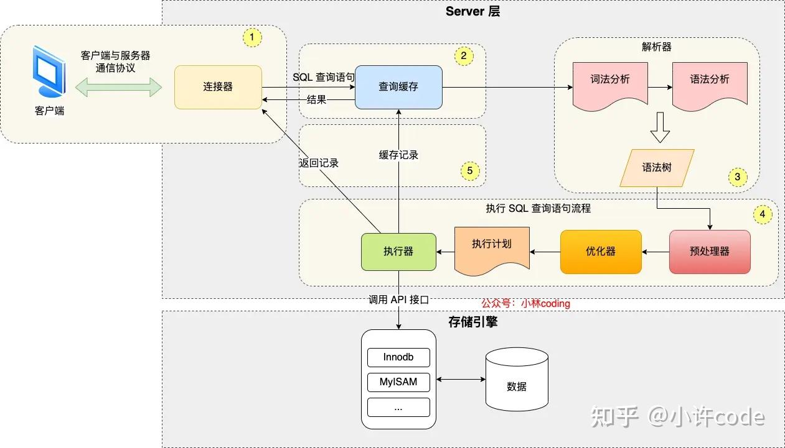
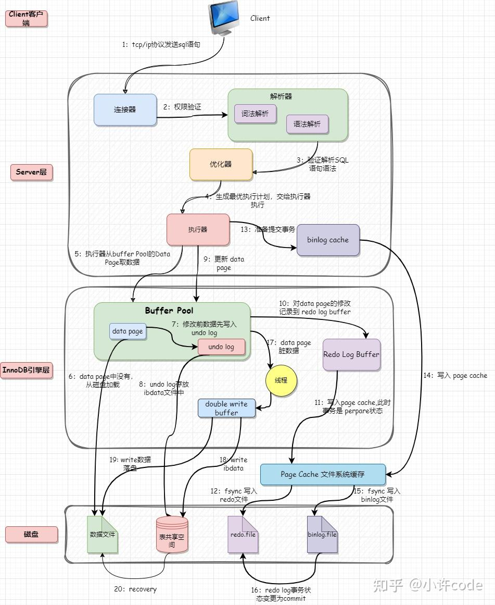

# 一条SQL语句的执行过程是怎样的？

## MySQL执行一条Select语句是怎么运行的？
执行流程图

* 连接器：建立连接，管理连接、校验用户身份；
* 查询缓存：查询语句如果命中查询缓存则直接返回，否则继续往下执行。MySQL 8.0 已删除该模块；
* 解析 SQL，通过解析器对 SQL 查询语句进行词法分析、语法分析，然后构建语法树，方便后续模块读取表名、字段、语句类型；
* 执行 SQL：执行 SQL 共有三个阶段：
* 预处理阶段：检查表或字段是否存在；将 select * 中的 * 符号扩展为表上的所有列。
* 优化阶段：基于查询成本的考虑， 选择查询成本最小的执行计划；
* 执行阶段：根据执行计划执行 SQL 查询语句，从存储引擎读取记录，返回给客户端

## MySQL执行一条UPDATE语句是怎么运行的？
执行流程图

### Client客户端：

客户端通过tcp/ip发送一条sql语句到server层

### Server层：
1. 接收客户端过来的请求，进行权限验证
2. 权限验证通过后，解析器会对SQL语句进行词法、语法分析等
3. 经过验证解析的SQL语句会在优化器生成选择最优执行计划
4. 然后执行器将会执行经过优化的SQL语句

#### Server层和存储引擎之间怎么通信的呢？
到这里用户发送的一个SQL已经经过各种验证、分析、优化到了执行阶段，那么接下来就是执行器怎么和InnoDB存储引擎打交道了。

对于Server层来说，它是不知道存储引擎的实现细节的，而是通过定义的API接口和存储引擎通信。可以理解为存储引擎是一个类，然后每个实例（InnoDB）都通过一个特殊的处理程序接口与MySQL服务器通信。

### InnoDB引擎层：
现在已经到了引擎层了，存储引擎主要负责数据的存储和读取
1. 调用存储引擎接口后，会先从Buffer Pool获取数据页，如果没有就从磁盘中读入Buffer Pool，然后判断更新前后的记录是否一样
2. 开启事务，修改数据之前先记录undo log，写入Buffer Pool的undo page
3. 开始更新page data中的记录，被修改的数据页称为脏页，修改会被记录到内存中的 redo log buffer中，再刷盘到磁盘的redo log文件，此时事务是 perpare阶段
4. 这个时候更新就完成了，当时脏页不会立即写入磁盘，而是由后台线程完成，这里会用double write来保证脏页刷盘的可靠性
5. 还没结束呢，这时候可以通知Server层，可以正式提交数据了， 执行器记录binlog cache，事务提交时才会将该事务中的binglog刷新到磁盘中
6. 这个时候Update语句完成了Buffer Pool中数据页的修改、undo日志、redo log缓存记录，以及记录binlog cache缓存
7. commit阶段，这个阶段是将redo log中事务状态标记为commit
8. 此时binlog和redo log都已经写入磁盘，如果触发了刷新脏页的操作，先把脏页copy到double write buffer里，Double Write Buffer 的内存数据刷到磁盘中的共享表空间 ibdata，再刷到数据磁盘上数据文件 ibd
9. 流程完结

## 常见问题
### Redo Log、Undo Log、BinLog分别存的什么内容，分别是做什么用的？
* Redo Log 在引擎层实现，用来恢复数据的，保障已提交事务的持久化特性，记录的是物理级别的数据页(包括data page和undo page)做的修改
* Undo Log 在引擎层实现的逻辑日志，用于数据回滚到之前状态，对于每个UPDATE语句，对应一条相反的UPDATE的undo log
* BinLog 是Server实现的逻辑日志，用于复制和恢复数据，记录了所有的 DDL 和 DML 语句（除了数据查询语句select、show等）

### WAL是什么，哪里用到了它？
WAL全称为Write-Ahead Logging，预写日志系统。主要写undo log、redo log、binlog这些用到了。

真正使用WAL的原因是：磁盘的写操作是随机IO，比较耗性能，所以如果把每一次的更新操作都先写入log中，那么就成了顺序写操作，实际更新操作由后台线程再根据log异步写入

### UndoLog会存储在哪些地方？
我们从图中也可以清晰的知道UndoLog在两个地方：Buffer Pool中的undo page页，和磁盘中的表共享空间的Undo log

### 什么是二阶段提交？
二阶段提交，顾名思义，会包含 2 个阶段：
* prepare 阶段，协调器会询问所有执行器，是否可以提交事务
* commit 阶段，协调器会通知执行器进行提交操作

update的执行阶段也用到了，比如：

* prepare 阶段：将 redo log 对应的事务状态设置为 prepare，然后将 redo log 刷新到硬盘；
* commit 阶段：将 binlog 刷新到磁盘，接着调用引擎的提交事务接口，将 redo log 状态设置为 commit（将事务设置为 commit 状态后，刷入到磁盘 redo log 文件）

MySQL的Double Write如何保证可靠性？ https://zhuanlan.zhihu.com/p/636801681
InnoDB的Buffer Pool是如何管理数据页的？ https://zhuanlan.zhihu.com/p/633942095
一条Update语句的执行过程是怎样的？ https://zhuanlan.zhihu.com/p/639174065
MySQL binlog、undolog、redolog  https://blog.csdn.net/xushiyu1996818/article/details/104210732