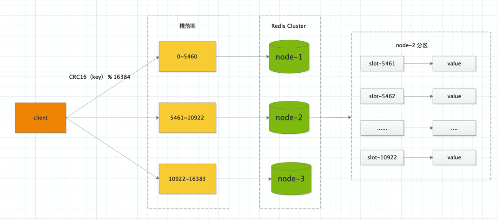
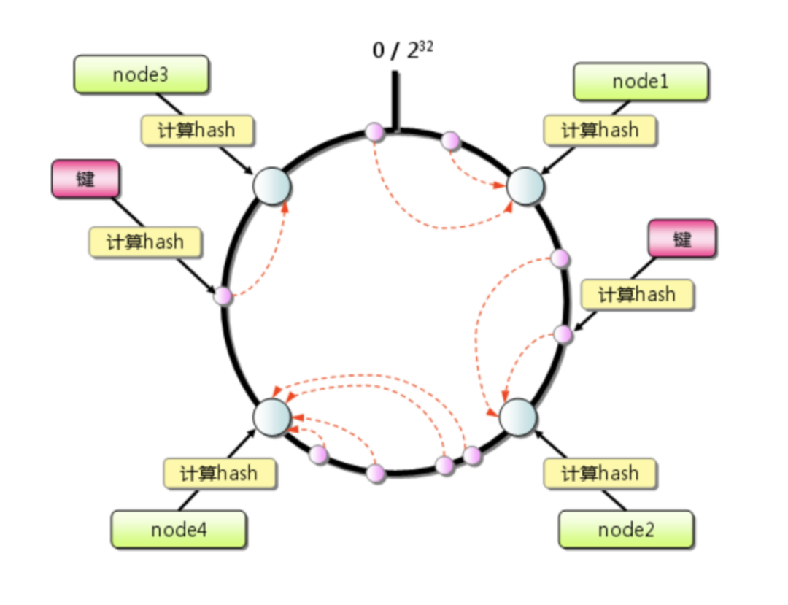

# 背景
对于分布式系统来说，整个集群的存储容量和处理能力，往往取决于集群中容量最大或响应最慢的节点。 因此在前期进行系统设计和容量规划时，应尽可能保证数据均衡。
但是，在生产环境的业务系统中，由于各方面的原因，数据倾斜的现象还是比较常见的。Redis Cluster也不例外，究其原因主要包括两个：
* 一个是不同分片间key数量不均匀，
* 另一个是某分片存在bigkey；

# Redis Cluster 节点
edis Cluster 集群有16384个哈希槽，每个key通过CRC16校验后对16384取模来决定放置哪个槽。
集群的每个节点负责一部分hash槽，举个例子，比如当前集群有3个节点，
* 那么 node-1 包含 0 到 5460 号哈希槽，
* node-2 包含 5461 到 10922 号哈希槽，
* node-3包含 10922  到 16383 号哈希槽。


一致性哈希算法是 1997年麻省理工学院的 Karger 等人提出了，为的就是解决分布式缓存的问题。

一致性哈希算法本质上也是一种取模算法，不同于按服务器数量取模，一致性哈希是对固定值 2^32 取模。

公式 = hash（key） % 2^32

其取模的结果必然是在 [0, 2^32-1] 这个区间中的整数，从圆上映射的位置开始顺时针方向找到的第一个节点即为存储key的节点


# 解决方案

## 不同分片间key数量不均匀
* 垂直扩容：扩容单分片内存容量(不推荐)
* 水平扩容：扩容分片数，以把key打散到不同分片(推荐)

## 分片存在bigkey
> 比如存储一个或多个 String 类型的 bigKey 数据，内存占用很大。
> 场景：开发时为了省事，采用JSON格式，将多个业务数据合并到一个 value，只关联一个key，导致了这个键值对容量达到了几百M。

频繁的大key读写，内存资源消耗比较重，同时给网络传输带了极大的压力，进而导致请求响应变慢，引发雪崩效应，最后系统各种超时报警。
### 垂直扩容：
扩容单分片内存容量(不推荐)

### 对bigkey进行改造，拆分成多个key打散(推荐)
将一个bigKey拆分为多个小key，独立维护，成本会降低很多。
当然这个拆也讲究些原则，既要考虑业务场景也要考虑访问场景，将关联紧密的放到一起。

比如：有个RPC接口内部对 Redis 有依赖，之前访问一次就可以拿到全部数据，拆分将要控制单值的大小，也要控制访问的次数，毕竟调用次数增多了，会拉大整体的接口响应时间。

### 2、HashTag 使用不当
Redis 采用单线程执行命令，从而保证了原子性。当采用集群部署后，为了解决mset、lua 脚本等对多key 批量操作，为了保证不同的 key 能路由到同一个 Redis 实例上，引入了 HashTag 机制。

用法也很简单，使用{}大括号，指定key只计算大括号内字符串的哈希，从而将不同key的健值对插入到同一个哈希槽。

举个例子：
```bash
192.168.0.1:6380> CLUSTER KEYSLOT testtag
(integer) 764
192.168.0.1:6380> CLUSTER KEYSLOT {testtag}
(integer) 764
192.168.0.1:6380> CLUSTER KEYSLOT mykey1{testtag}
(integer) 764
192.168.0.1:6380> CLUSTER KEYSLOT mykey2{testtag}
(integer) 764
```
check 下业务代码，有没有引入HashTag，将太多的key路由到了一个实例。结合具体场景，考虑如何做下拆分。

就像 RocketMQ 一样，很多时候只要能保证分区有序，就可以满足我们的业务需求。具体实战中，要找到这个平衡点，而不是为了解决问题而解决问题。


## 什么是缓存热点？
缓存热点是指大部分甚至所有的业务请求都命中同一份缓存数据，给缓存服务器带来了巨大压力，甚至超过了单机的承载上限，导致服务器宕机。

### 解决方案一：复制多份副本
我们可以在key的后面拼上有序编号，比如key#01、key#02。。。key#10多个副本，这些加工后的key位于多个缓存节点上。

客户端每次访问时，只需要在原key的基础上拼接一个分片数上限的随机数，将请求路由不到的实例节点。

注意：缓存一般都会设置过期时间，为了避免缓存的集中失效，我们对缓存的过期时间尽量不要一样，可以在预设的基础上增加一个随机数。 
至于数据路由的均匀性，这个由 Hash 算法来保证。

### 解决方案二： 本地内存缓存
把热点数据缓存在客户端的本地内存中，并且设置一个失效时间。对于每次读请求，将首先检查该数据是否存在于本地缓存中，如果存在则直接返回，如果不存在再去访问分布式缓存的服务器。

本地内存缓存彻底“解放”了缓存服务器，不会对缓存服务器有任何压力。

缺点：实时感知最新的缓存数据有点麻烦，会产生数据不一致的情况。我们可以设置一个比较短的过期时间，采用被动更新。
当然，也可以用监控机制，如果感知到数据已经发生了变化，及时更新本地缓存。


如何解决 Redis 数据倾斜、热点等问题 https://cloud.tencent.com/developer/article/2202544