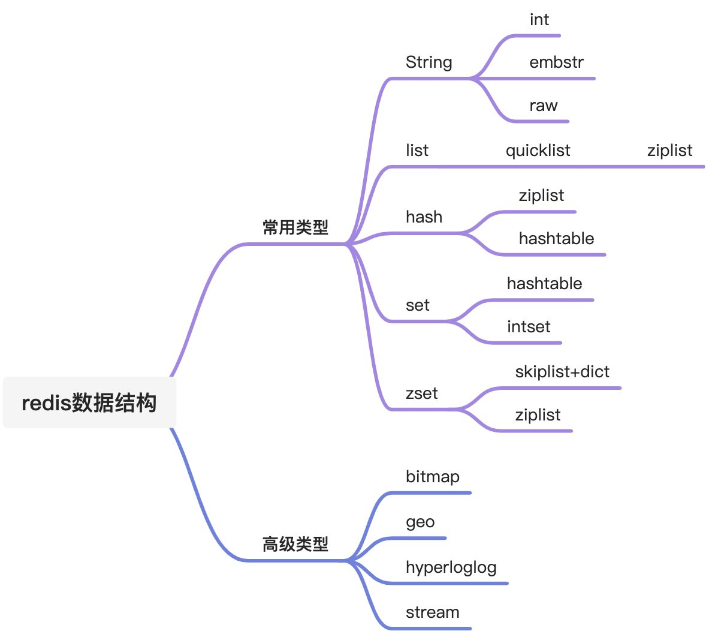
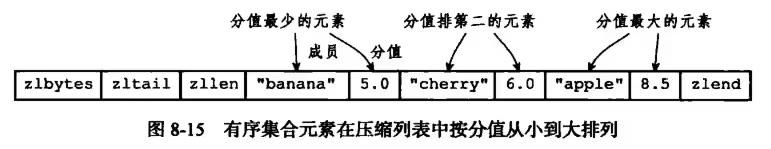
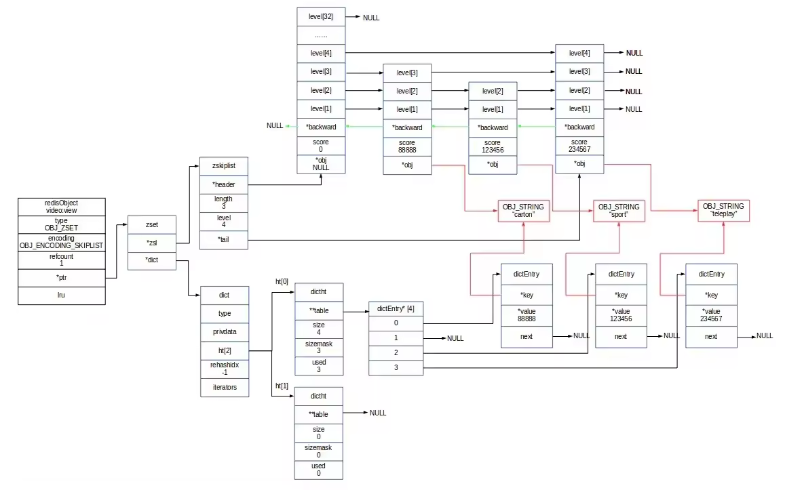
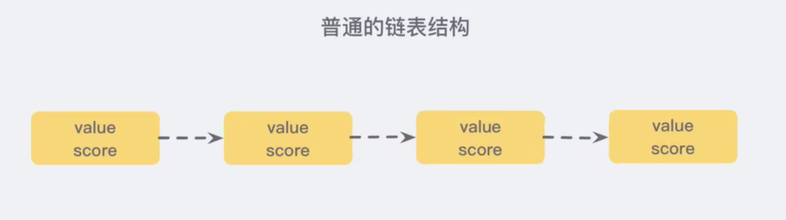
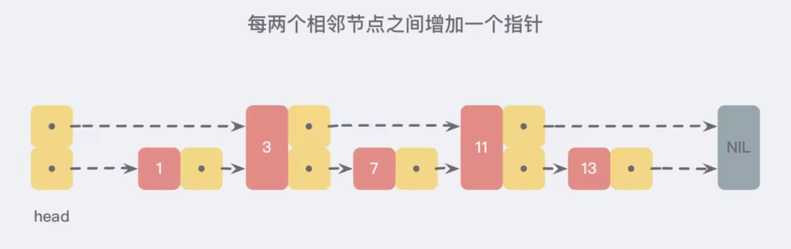
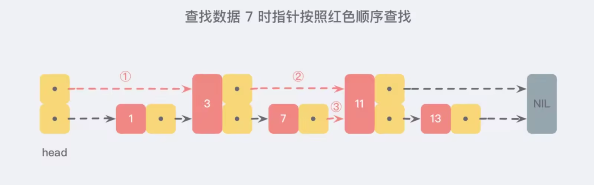
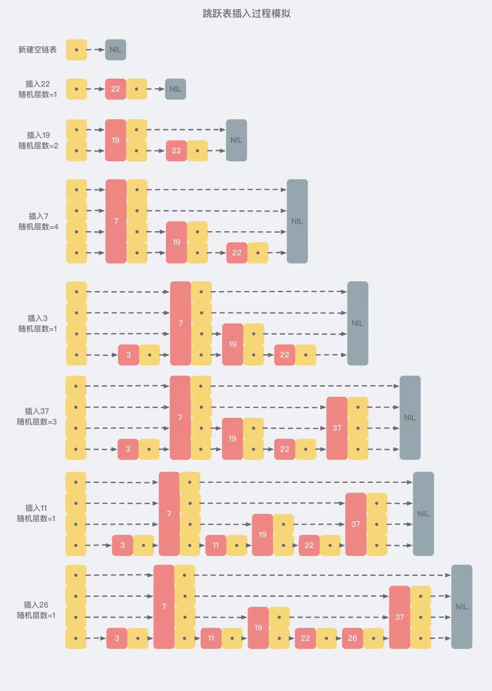
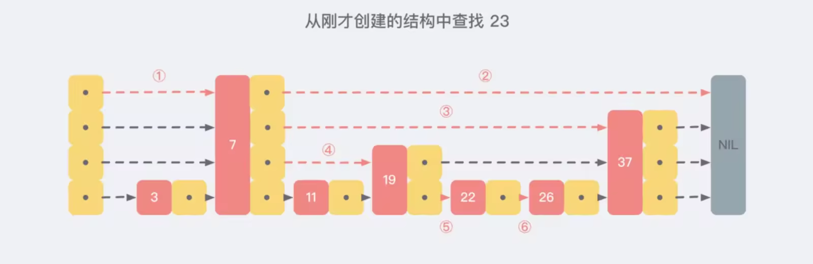
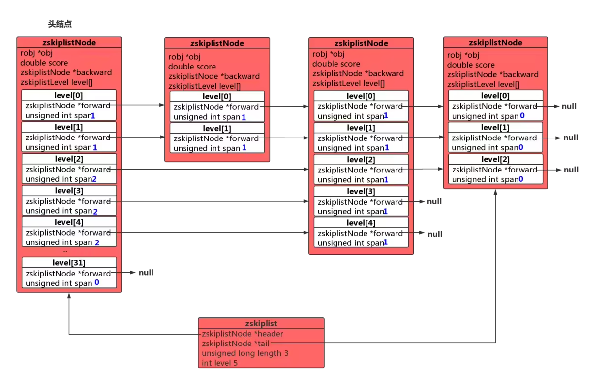

## Redis 数据结构
Redis是当今非常流行的一种nosql数据库，它出色的性能源于其优秀的IO模型和内存模型。

提到Redis的数据结构，我们很快能想到它提供的5种常见数据结构：字符串（String）、列表（List）、哈希（hash）、集合（set）、有序集合（sorted set）。 
如果对Redis的使用比较深入一点的话，还会知道Redis提供了geo、hyperloglog等高级特性。 但是这些数据结构，只是Redis对外暴露使用的数据结构（为了方便描述，我把这些类型称之为Redis对象类型） 。
这些Redis对象类型，底层的数据结构又是什么样的呢？



Redis是用c语言写的，但是Redis没有使用c语言的字符串类型，而是自己定义了一种简单动态字符串（simple dynamic string , SDS），作为redis里字符串的数据结构。
为什么要自己定义一种数据结构呢，主要是c语言的字符串是使用长度为n+1的字符数组来存储长度为n的字符串，字符数组的最后一个元素是'\0'空字符，不能满足redis对于字符串在安全性、效率以及功能方面的要求。

### zset 原理浅析
> zset 是redis里面一种比较复杂的数据结构，它是一种有序集合，可以帮助我们轻松实现排行榜等功能。审核派单平台的部分功能就是通过zset来实现，这里我们一起探究一下zset的内部实现原理。

#### zset的存储结构
zset底层的存储结构有ziplist或skiplist两种，在同时满足以下两个条件的时候使用ziplist，其他情况下使用skiplist。
1. 有序集合保存的元素数量小于128个
2. 有序集合保存的所有元素的长度小于64字节

可以看到，ziplist就是适用于数据量比较小的情况，而skiplist是用来存储数据量比较大的情况

#### ziplist数据结构
ziplist是有点类似于数组的存储结构，它是有连续的存储组成的数据结构，当使用ziplist来作为存储结构时，使用两个紧挨一起的节点来保存，第一个节点保存元素的成员，第二个节点保存元素的分值，格式如下图，整体的列表数据是有序的。



从上面的结构可以看出，ziplist就是为了节省内存空间而存在的，用时间换空间的典型例子。

但是当数据量比较大的时候，这种数据结构显然是不适用的，所以产生了skiplist存储结构。

#### skiplist数据结构
若使用skiplist作为底层存储实现zet时，需要结合dict一起用。
dict保存了key/value的关系，key是元素，value是分值。主要用于查询元素到分值的关系。
skiplist保存了一个有序的链表，每个元素都包括元素和分值。主要用于查询根据分数范围查询的情况。



dict和skiplist就是针对不同的查询场景而存在的存储结构，用空间换时间的典型例子。
```
/*
 * 有序集合
 */
typedef struct zset {

    // 字典，键为成员，值为分值
    // 用于支持 O(1) 复杂度的按成员取分值操作
    dict *dict;

    // 跳跃表，按分值排序成员
    // 用于支持平均复杂度为 O(log N) 的按分值定位成员操作
    // 以及范围操作
    zskiplist *zsl;

} zset;
```

### skiplist介绍
skiplist是跳跃链表，是基于多层的链表实现的。
它的主要目的是为了减少大数据量场景下的时间复杂度，插入，查询，删除等操作的时间复杂度为O(logN)，他的实现比红黑树等数据结构要简单得多，下面我们来看一下，skiplist的演进：

首先我们来看一下一个普通的链表结构


如果我们在间隔一个节点增加一个指针，如下图：



这样我们通过新增加的指针，可以得到一个新的链表，这个新的链表的数据量只有原来的一半，通过这个新的指针进行元素的查找，会比原来的快得多，假设我们需要寻找数字7，那么我们将沿着下图路径进行寻找


从上面的方式，我们可以看到，通过新增指针可以减少元素定位的时间消耗，那么我们再增加一层指针，会发生什么呢？如下图：

在新的三层链表中，我们发现，新链表的数据元素更少了，也就意味着我们的查询效率就会更快。可以想象，如果我们的链表元素很多的时候，这样的数据结构是可以帮我们跳过很多元素，加快了查找的效率。

从上面可以看到，我们通过增加多层指针的方式，就可以加快链表的查询效率。如果我们的指针层数足够多，那么我们的查找就相当于是一个二分查找，时间复杂度会降低到O(logn)。

但是上面这个例子是一个理想的例子，大家试想一下，如果我们通过上面这种结构，严格按照2:1的指针数量，增加多层的指针。会发生什么事？？

相信很多同学都已经想到了，就是会对插入造成比较大的影响，也就是说，如果我们需要插入一个新的节点。如果还是按照严格的2:1的关系，那么我们就必须调整大量的节点的指针关系，甚至睇整个链表的指针都需要调整，这种性能损耗是非常大的，明显我们是不能接受的。

那么如何避免整个问题，redis的skiplist就很巧妙的解决了这个问题，它使用了一个随机层数level来解决。比如需要插入一个元素，则执行一个随机函数，这个随机函数从1开始，有一定的概率可以提升到层数2，依次类推。若随机层数level=3，那么久吧它插入到第一层到第三层的链表中。如下图：


从上面的流程可以看到，每一个节点的层数level都是随机出来的，新插入的节点，并不会影响到其他元素的插入，大大降低了插入的复杂度，提升了性能。

那么基于这种随机层级的数据结构，我们的查找性能会不会受到影响？假设从我们刚才创建的这个结构中查找 23 这个不存在的数，那么查找路径会如下图：

redis的随机层数函数如下：
```java
int zslRandomLevel(void) { 
    int level = 1; 
    while ((random()&0xFFFF) < (ZSKIPLIST_P * 0xFFFF))
         level += 1; 
    return (level<ZSKIPLIST_MAXLEVEL) ? level : ZSKIPLIST_MAXLEVEL; 
}
```
从上图可以看出，我们的层数level是根据随机函数得到的，也就是说，元素越多，随机到的level大的概率越高。那么这个level是不是可以无限大呢？其实不是的，这个level最大只能到32。


有些同学可能会说，max_level=32真的够用了吗？
其实这就好比于我们抛硬币，每一个节点插入就相当于我们连续抛32次硬币，试想一下，32次都得到正面的概率是有多低。
并且redis里面限定了抛到正面的概率为1/4，也就是到达32层的概率为(1/2)^64。从这个概率来看，如果大量数据存在32层是不可能的，因为已经会超出服务器的最大内存。 所以32层目前来说是足够的，用太多层只会浪费指针空间。

最终的结构如下图所示：



### 下面比较一下skiplist与平衡树、哈希表
1. skiplist和平衡树的元素是有序的，而哈希表不是有序的，所以哈希表只能做单个key的查找，不能做范围查找
2. 在做范围查找时，平衡树的操作比skiplist要复杂。skiplist只需要在找到最小值之后，根据第一层链表进行遍历即可
3. 对于单个key的查询，skiplist和平衡树的时间复杂度都未O(log n)，大体相当。而哈希表在保持较低哈希冲突的前提下，查找复杂度接近O(1)，性能更高一些。
4. 从算法实现难度上来说，skiplist比平衡树要简单得多


## Redis七大经典问f题

### 1. 缓存雪崩
指缓存同一时间大面积的失效，所以，后面的请求都会落到数据库上，造成数据库短时间内承受大量请求而崩掉。
####  解决方案:
• Redis 高可用，主从+哨兵，Redis cluster，避免全盘崩溃
• 本地 ehcache 缓存 + hystrix 限流&降级，避免 MySQL 被打死
• 缓存数据的过期时间设置随机，防止同一时间大量数据过期现象发生。
• 逻辑上永不过期给每一个缓存数据增加相应的缓存标记，缓存标记失效则更新数据缓存
• 多级缓存，失效时通过二级更新一级，由第三方插件更新二级缓存。
   
### 2. 缓存穿透
https://blog.csdn.net/lin777lin/article/details/105666839 
缓存穿透是指缓存和数据库中都没有的数据，导致所有的请求都落到数据库上，造成数据库短时间内承受大量请求而崩掉。
#### 解决方案:
1)接口层增加校验，如用户鉴权校验，id做基础校验，id<=0的直接拦截; 
2)从缓存取不到的数据，在数据库中也没有取到，这时也可以将key-value对写为key-null，缓存有效时间可以设 置短点，如30秒。这样可以防止攻击用户反复用同一个id暴力攻击;
3)采用布隆过滤器，将所有可能存在的数据哈希到一个足够大的 bitmap 中，一个一定不存在的数据会被这个 bitmap 拦截掉，从而避免了对底层存储系统的查询压力。(宁可错杀一千不可放过一人)

### 3. 缓存击穿
这时由于并发用户特别多，同时读缓存没读到数据，又同时去数据库去取数据，引起数据库压力瞬间增大，造成过大压力。
和缓存雪崩不同的是，缓存击穿指并发查同一条数据，缓存雪崩是不同数据都过期了，很多数据都查不到从而查数据库

#### 解决方案:
1)设置热点数据永远不过期，异步线程处理。 2)加写回操作加互斥锁，查询失败默认值快速返回。 3)缓存预热
系统上线后，将相关可预期(例如排行榜)热点数据直接加载到缓存。
写一个缓存刷新页面，手动操作热点数据(例如广告推广)上下线。

### 4. 数据不一致
在缓存机器的带宽被打满，或者机房网络出现波动时，缓存更新失败，新数据没有写入缓存，就会导致缓存和 DB 的 数据不一致。
缓存 rehash 时，某个缓存机器反复异常，多次上下线，更新请求多次 rehash。这样，一份数据存在多 个节点，且每次 rehash 只更新某个节点，导致一些缓存节点产生脏数据。

#### 解决方案
• Cache 更新失败后，可以进行重试，则将重试失败的 key 写入mq，待缓存访问恢复后，将这些 key 从缓存删
除。这些 key 在再次被查询时，重新从 DB 加载，从而保证数据的一致性
• 缓存时间适当调短，让缓存数据及早过期后，然后从 DB 重新加载，确保数据的最终一致性。
• 不采用 rehash 漂移策略，而采用缓存分层策略，尽量避免脏数据产生。


### 5. 数据并发竞争
数据并发竞争在大流量系统也比较常见，
比如车票系统，如果某个火车车次缓存信息过期，但仍然有大量用户在查询该车次信息。
又比如微博系统中，如果某条微博正好被缓存淘汰，但这条微博仍然有大量的转发、评论、赞。
上述情 况都会造成并发竞争读取的问题。

#### 解决方案
• 加写回操作加互斥锁，查询失败默认值快速返回。
• 对缓存数据保持多个备份，减少并发竞争的概率

### 6. 热点key问题
明星结婚、离婚、出轨这种特殊突发事件，比如奥运、春节这些重大活动或节日，还比如秒杀、双12、618 等线上促 销活动，都很容易出现 Hot key 的情况。
如何提前发现HotKey?

• 对于重要节假日、线上促销活动这些提前已知的事情，可以提前评估出可能的热 key 来。
• 而对于突发事件，无法提前评估，可以通过 Spark，对应流任务进行实时分析，及时发现新发布的热点 key。而对
于之前已发出的事情，逐步发酵成为热 key 的，则可以通过 Hadoop 对批处理任务离线计算，找出最近历史数据 中的高频热 key。

#### 解决方案:
• 这 n 个 key 分散存在多个缓存节点，然后 client 端请求时，随机访问其中某个后缀的 hotkey，这样就可以把热 key 的请求打散，避免一个缓存节点过载
• 缓存集群可以单节点进行主从复制和垂直扩容
• 利用应用内的前置缓存，但是需注意需要设置上限
• 延迟不敏感，定时刷新，实时感知用主动刷新
• 和缓存穿透一样，限制逃逸流量，单请求进行数据回源并刷新前置
• 无论如何设计，最后都要写一个兜底逻辑，千万级流量说来就来

### 7. BigKey问题
比如互联网系统中需要保存用户最新 1万 个粉丝的业务，
比如一个用户个人信息缓存，包括基本资料、关系图谱计 数、发 feed 统计等。
微博的 feed 内容缓存也很容易出现，一般用户微博在 140 字以内，但很多用户也会发表 1千 字 甚至更长的微博内容，这些长微博也就成了大 key

• 首先Redis底层数据结构里，根据Value的不同，会进行数据结构的重新选择
• 可以扩展新的数据结构，进行序列化构建，然后通过 restore 一次性写入
• 将大 key 分拆为多个 key，设置较长的过期时间


