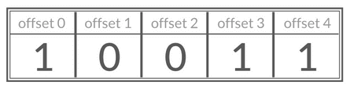

## Redis 数据结构
Redis是当今非常流行的一种nosql数据库，它出色的性能源于其优秀的IO模型和内存模型。

提到Redis的数据结构，我们很快能想到它提供的5种常见数据结构：

* 5 种基础数据类型：String（字符串）、List（列表）、Set（集合）、Hash（散列）、Zset（有序集合）。
* 3 种特殊数据类型：HyperLogLog（基数统计）、Bitmap （位图）、Geospatial (地理位置)。 

这些Redis对象类型，底层的数据结构又是什么样的呢？


### 1. String 原理浅析
Redis是用c语言写的，但是Redis没有使用c语言的字符串类型，而是自己定义了一种简单动态字符串（simple dynamic string , SDS），作为redis里字符串的数据结构。
为什么要自己定义一种数据结构呢，主要是c语言的字符串是使用长度为n+1的字符数组来存储长度为n的字符串，字符数组的最后一个元素是'\0'空字符，不能满足redis对于字符串在安全性、效率以及功能方面的要求。


```bash
# 基本设置
SET key value
OK
GET key
"value"
EXISTS key
(integer) 1
STRLEN key
(integer) 5
DEL key
(integer) 1
GET key
(nil)
```
批量设置 
```bash
MSET key1 value1 key2 value2 key3 value3
OK
MGET key1 key2 key3
1) "value1"
2) "value2"
3) "value3"
```

计数器
```bash
SET number 1
OK
INCR number # 将 key 中储存的数字值增一
(integer) 2
GET number
"2"
DECR number # 将 key 中储存的数字值减一
(integer) 1
GET number
"1"
```

设置过期时间
```bash
EXPIRE key 60
(integer) 1
SETEX key 60 value # 设置值并设置过期时间
OK
TTL key
(integer) 56
```

#### 应用场景
##### 需要存储常规数据的场景
举例：缓存 Session、Token、图片地址、序列化后的对象(相比较于 Hash 存储更节省内存)。相关命令：SET、GET。

##### 需要计数的场景
举例：用户单位时间的请求数（简单限流可以用到）、页面单位时间的访问数。相关命令：SET、GET、 INCR、DECR 。
##### 分布式锁
利用 SETNX key value 命令可以实现一个最简易的分布式锁（存在一些缺陷，通常不建议这样实现分布式锁）。


### 2. list 原理浅析
```bash
RPUSH myList value1 value2 value3
(integer) 3
LRANGE myList 0 1
1) "value1"
2) "value2"
LRANGE myList 0 -1
1) "value1"
2) "value2"
3) "value3"
```
通过 LRANGE 命令，你可以基于 List 实现分页查询，性能非常高！

通过 RPUSH/LPOP 或者 LPUSH/RPOP实现队列：
```bash
RPUSH myList value1
(integer) 1
RPUSH myList value2 value3
(integer) 3
LPOP myList
"value1"
LRANGE myList 0 1
1) "value2"
2) "value3"
LRANGE myList 0 -1
1) "value2"
2) "value3"
```

通过 RPUSH/RPOP或者LPUSH/LPOP 实现栈：
```bash
> RPUSH myList2 value1 value2 value3
(integer) 3
> RPOP myList2 # 将 list的最右边的元素取出
"value3"
```

#### 应用场景 

##### 信息流展示
举例：最新文章、最新动态。
相关命令：LPUSH、LRANGE。

##### 消息队列
List 可以用来做消息队列，只是功能过于简单且存在很多缺陷，不建议这样做。
相对来说，Redis 5.0 新增加的一个数据结构 Stream 更适合做消息队列一些，只是功能依然非常简陋。和专业的消息队列相比，还是有很多欠缺的地方比如消息丢失和堆积问题不好解决。


### 3. hash 原理浅析
Redis 中的 Hash 是一个 String 类型的 field-value（键值对） 的映射表，特别适合用于存储对象，后续操作的时候，你可以直接修改这个对象中的某些字段的值。
Hash 类似于 JDK1.8 前的 HashMap，内部实现也差不多(数组 + 链表)。不过，Redis 的 Hash 做了更多优化。

通过 LRANGE 查看对应下标范围的列表元素：
```bash
HMSET userInfoKey name "guide" description "dev" age 24
OK
HEXISTS userInfoKey name # 查看 key 对应的 value中指定的字段是否存在。
(integer) 1
HGET userInfoKey name # 获取存储在哈希表中指定字段的值。
"guide"
HGET userInfoKey age
"24"
HGETALL userInfoKey # 获取在哈希表中指定 key 的所有字段和值
1) "name"
2) "guide"
3) "description"
4) "dev"
5) "age"
6) "24"
HSET userInfoKey name "GuideGeGe"
HGET userInfoKey name
"GuideGeGe"
HINCRBY userInfoKey age 2
(integer) 26
```

#### 应用场景 
##### 对象数据存储场景
* 举例：用户信息、商品信息、文章信息、购物车信息。
* 相关命令：HSET （设置单个字段的值）、HMSET（设置多个字段的值）、HGET（获取单个字段的值）、HMGET（获取多个字段的值）。


### 4. set原理浅析
Redis 中的 Set 类型是一种无序集合，集合中的元素没有先后顺序但都唯一，有点类似于 Java 中的 HashSet 。

当你需要存储一个列表数据，又不希望出现重复数据时，Set 是一个很好的选择，并且 Set 提供了判断某个元素是否在一个 Set 集合内的重要接口，这个也是 List 所不能提供的。

你可以基于 Set 轻易实现交集、并集、差集的操作，比如你可以将一个用户所有的关注人存在一个集合中，将其所有粉丝存在一个集合。
这样的话，Set 可以非常方便的实现如共同关注、共同粉丝、共同喜好等功能。这个过程也就是求交集的过程。

```bash
SADD mySet value1 value2
(integer) 2
SADD mySet value1 # 不允许有重复元素，因此添加失败
(integer) 0
SMEMBERS mySet
1) "value1"
2) "value2"
SCARD mySet
(integer) 2
SISMEMBER mySet value1
(integer) 1
SADD mySet2 value2 value3
(integer) 2
```

求交集
```bash
SINTERSTORE mySet3 mySet mySet2
(integer) 1
SMEMBERS mySet3
1) "value2"
```

求并集
```bash
SUNION mySet mySet2
1) "value3"
2) "value2"
3) "value1"
```

求差集
```java
SDIFF mySet mySet2 # 差集是由所有属于 mySet 但不属于 A 的元素组成的集合
1) "value1"
```
#### 应用场景
##### 需要存放的数据不能重复的场景

* 举例：网站 UV 统计（数据量巨大的场景还是 HyperLogLog更适合一些）、文章点赞、动态点赞等场景。
* 相关命令：SCARD（获取集合数量） 。

##### 需要获取多个数据源交集、并集和差集的场景
* 举例：共同好友(交集)、共同粉丝(交集)、共同关注(交集)、好友推荐（差集）、音乐推荐（差集）、订阅号推荐（差集+交集） 等场景。
* 相关命令：SINTER（交集）、SINTERSTORE （交集）、SUNION （并集）、SUNIONSTORE（并集）、SDIFF（差集）、SDIFFSTORE （差集）。

##### 需要随机获取数据源中的元素的场景
* 举例：抽奖系统、随机点名等场景。
* 相关命令：SPOP（随机获取集合中的元素并移除，适合不允许重复中奖的场景）、SRANDMEMBER（随机获取集合中的元素，适合允许重复中奖的场景）。


### 5. zset(Sorted Set) 原理浅析
> zset 是redis里面一种比较复杂的数据结构，它是一种有序集合，可以帮助我们轻松实现排行榜等功能。审核派单平台的部分功能就是通过zset来实现，这里我们一起探究一下zset的内部实现原理。

Sorted Set 类似于 Set，但和 Set 相比，Sorted Set 增加了一个权重参数 score，使得集合中的元素能够按 score 进行有序排列，还可以通过 score 的范围来获取元素的列表。
有点像是 Java 中 HashMap 和 TreeSet 的结合体。

#### 常用命令
* `zadd <key> <score1> <value1> <score2> <value2>…` 将一个或多个 member 元素及其score 值加入到有序集 key 当中
* `zrange <key><start><stop> [WITHSCORES]`  返回有序集 key 中，下标在<start><stop>之间的元素，带WITHSCORES，可以让分数一起和值返回到结果集。
* `zrangebyscore key minmax [withscores] [limit offset count]` 返回有序集 key 中，所有 score 值介于 min 和 max 之间(包括等于 min 或 max )的成员。有序集成员按 score 值递增(从小到大)次序排列。
* `zrevrangebyscore key maxmin [withscores] [limit offset count]`  同上，改为从大到小排列。
* `zincrby <key><increment><value>`  为元素的score加上增量
* `zrem <key><value>` 删除该集合下，指定值的元素
* `zcount <key><min><max>` 统计该集合，分数区间内的元素个数
* `zrank <key> <value>` 返回该值在集合中的排名，从0开始。
* `ZREVRANK key <value>` 获取指定有序集合中指定元素的排名(score 从大到小排序)


```bash
# myZset : value1(2.0)、value2(1.0) 。
# myZset2：value2 （4.0）、value3(3.0) 。

ZADD myZset 2.0 value1 1.0 value2
(integer) 2
ZCARD myZset
2
ZSCORE myZset value1
2.0
ZRANGE myZset 0 1
1) "value2"
2) "value1"
ZREVRANGE myZset 0 1
1) "value1"
2) "value2"
ZADD myZset2 4.0 value2 3.0 value3
(integer) 2
```

获取指定元素的排名：
```bash
ZINTERSTORE myZset3 2 myZset myZset2
1
ZRANGE myZset3 0 1 WITHSCORES
value2
5
```

求交集
```bash
ZINTERSTORE myZset3 2 myZset myZset2
1
ZRANGE myZset3 0 1 WITHSCORES
value2
5
```

求并集
```bash
ZUNIONSTORE myZset4 2 myZset myZset2
3
ZRANGE myZset4 0 2 WITHSCORES
value1
2
value3
3
value2
5
```

求差集
```bash
ZDIFF 2 myZset myZset2 WITHSCORES
value1
2
```

#### 应用场景 
##### 需要随机获取数据源中的元素根据某个权重进行排序的场景
* 举例：各种排行榜比如直播间送礼物的排行榜、朋友圈的微信步数排行榜、王者荣耀中的段位排行榜、话题热度排行榜等等。
* 相关命令：ZRANGE (从小到大排序)、 ZREVRANGE （从大到小排序）、ZREVRANK (指定元素排名)。


##### 需要存储的数据有优先级或者重要程度的场景
* 比如优先级任务队列。举例：优先级任务队列。
* 相关命令：ZRANGE (从小到大排序)、 ZREVRANGE （从大到小排序）、ZREVRANK (指定元素排名)。


#### zset的存储结构
zset底层的存储结构有ziplist或skiplist两种，在同时满足以下两个条件的时候使用ziplist，其他情况下使用skiplist。
1. 有序集合保存的元素数量小于128个
2. 有序集合保存的所有元素的长度小于64字节

可以看到，ziplist就是适用于数据量比较小的情况，而skiplist是用来存储数据量比较大的情况

##### zset的value,score能不能重复?
* value不能重复：ZSET 中的每个成员（member）是唯一的。如果尝试添加已存在的成员，其对应的 score 会被更新为新值
* score可以重复：多个不同的成员可以拥有相同的 score。此时这些成员会按照 字典序（lexicographical order）排序，而不是随机排序。

#### ziplist数据结构
ziplist是有点类似于数组的存储结构，它是有连续的存储组成的数据结构，当使用ziplist来作为存储结构时，使用两个紧挨一起的节点来保存，第一个节点保存元素的成员，第二个节点保存元素的分值，格式如下图，整体的列表数据是有序的。


从上面的结构可以看出，ziplist就是为了节省内存空间而存在的，用时间换空间的典型例子。

但是当数据量比较大的时候，这种数据结构显然是不适用的，所以产生了skiplist存储结构。

#### skiplist数据结构
若使用skiplist作为底层存储实现zet时，需要结合dict一起用。
dict保存了key/value的关系，key是元素，value是分值。主要用于查询元素到分值的关系。
skiplist保存了一个有序的链表，每个元素都包括元素和分值。主要用于查询根据分数范围查询的情况。


dict和skiplist就是针对不同的查询场景而存在的存储结构，用空间换时间的典型例子。
```
/*
 * 有序集合
 */
typedef struct zset {

    // 字典，键为成员，值为分值
    // 用于支持 O(1) 复杂度的按成员取分值操作
    dict *dict;

    // 跳跃表，按分值排序成员
    // 用于支持平均复杂度为 O(log N) 的按分值定位成员操作
    // 以及范围操作
    zskiplist *zsl;

} zset;
```

### skiplist介绍
skiplist是跳跃链表，是基于多层的链表实现的。
它的主要目的是为了减少大数据量场景下的时间复杂度，插入，查询，删除等操作的时间复杂度为O(logN)，他的实现比红黑树等数据结构要简单得多，下面我们来看一下，skiplist的演进：

首先我们来看一下一个普通的链表结构


如果我们在间隔一个节点增加一个指针，如下图：


这样我们通过新增加的指针，可以得到一个新的链表，这个新的链表的数据量只有原来的一半，通过这个新的指针进行元素的查找，会比原来的快得多，假设我们需要寻找数字7，那么我们将沿着下图路径进行寻找


从上面的方式，我们可以看到，通过新增指针可以减少元素定位的时间消耗，那么我们再增加一层指针，会发生什么呢？如下图：

在新的三层链表中，我们发现，新链表的数据元素更少了，也就意味着我们的查询效率就会更快。可以想象，如果我们的链表元素很多的时候，这样的数据结构是可以帮我们跳过很多元素，加快了查找的效率。

从上面可以看到，我们通过增加多层指针的方式，就可以加快链表的查询效率。如果我们的指针层数足够多，那么我们的查找就相当于是一个二分查找，时间复杂度会降低到O(logn)。

但是上面这个例子是一个理想的例子，大家试想一下，如果我们通过上面这种结构，严格按照2:1的指针数量，增加多层的指针。会发生什么事？？

相信很多同学都已经想到了，就是会对插入造成比较大的影响，也就是说，如果我们需要插入一个新的节点。如果还是按照严格的2:1的关系，那么我们就必须调整大量的节点的指针关系，甚至睇整个链表的指针都需要调整，这种性能损耗是非常大的，明显我们是不能接受的。

那么如何避免整个问题，redis的skiplist就很巧妙的解决了这个问题，它使用了一个随机层数level来解决。比如需要插入一个元素，则执行一个随机函数，这个随机函数从1开始，有一定的概率可以提升到层数2，依次类推。若随机层数level=3，那么久吧它插入到第一层到第三层的链表中。如下图：


从上面的流程可以看到，每一个节点的层数level都是随机出来的，新插入的节点，并不会影响到其他元素的插入，大大降低了插入的复杂度，提升了性能。

那么基于这种随机层级的数据结构，我们的查找性能会不会受到影响？假设从我们刚才创建的这个结构中查找 23 这个不存在的数，那么查找路径会如下图：


redis的随机层数函数如下：
```java
int randomLevel() {
    int level = 1;
    // Redis 使用 0.25 的概率（与二进制位运算相关）
    while ((random() & 0xFFFF) < (0.25 * 0xFFFF) && level < ZSKIPLIST_MAXLEVEL) {
        level++;
    }
    return level;
}
```
从上图可以看出，我们的层数level是根据随机函数得到的，也就是说，元素越多，随机到的level大的概率越高。那么这个level是不是可以无限大呢？其实不是的，这个level最大只能到32。


有些同学可能会说，max_level=32真的够用了吗？
其实这就好比于我们抛硬币，每一个节点插入就相当于我们连续抛32次硬币，试想一下，32次都得到正面的概率是有多低。
并且redis里面限定了抛到正面的概率为1/4，也就是到达32层的概率为(1/2)^64。从这个概率来看，如果大量数据存在32层是不可能的，因为已经会超出服务器的最大内存。 所以32层目前来说是足够的，用太多层只会浪费指针空间。

最终的结构如下图所示：


### 下面比较一下skiplist与平衡树、哈希表
1. skiplist和平衡树的元素是有序的，而哈希表不是有序的，所以哈希表只能做单个key的查找，不能做范围查找
2. 在做范围查找时，平衡树的操作比skiplist要复杂。skiplist只需要在找到最小值之后，根据第一层链表进行遍历即可
3. 对于单个key的查询，skiplist和平衡树的时间复杂度都未O(log n)，大体相当。而哈希表在保持较低哈希冲突的前提下，查找复杂度接近O(1)，性能更高一些。
4. 从算法实现难度上来说，skiplist比平衡树要简单得多

## 不常用的3种高级类型

https://javaguide.cn/database/redis/redis-data-structures-02.html#%E5%B8%B8%E7%94%A8%E5%91%BD%E4%BB%A4-2

### 1. bitmap （位图）数据结构及使用场景
Bitmap 存储的是连续的二进制数字（0 和 1），通过 Bitmap, 只需要一个 bit 位来表示某个元素对应的值或者状态，key 就是对应元素本身 。我们知道 8 个 bit 可以组成一个 byte，所以 Bitmap 本身会极大的节省储存空间。你可以将 Bitmap 看作是一个存储二进制数字（0 和 1）的数组，数组中每个元素的下标叫做 offset（偏移量）。

#### 常用命令
`SETBIT key offset value`  设置指定 offset 位置的值
`GETBIT key offset`  获取指定 offset 位置的值
`BITCOUNT key start end`  获取 start 和 end 之间值为 1 的元素个数
`BITOP operation destkey key1 key2 ...`  对一个或多个 Bitmap 进行运算，可用运算符有 AND, OR, XOR 以及 NOT

```bash
# SETBIT 会返回之前位的值（默认是 0）这里会生成 7 个位
SETBIT mykey 7 1
(integer) 0
SETBIT mykey 7 0
(integer) 1
GETBIT mykey 7
(integer) 0
SETBIT mykey 6 1
(integer) 0
SETBIT mykey 8 1
(integer) 0
# 通过 bitcount 统计被被设置为 1 的位的数量。
BITCOUNT mykey
(integer) 2
```
#### 使用场景
> 需要保存状态信息（0/1 即可表示）的场景

* 举例：用户签到情况、活跃用户情况、用户行为统计（比如是否点赞过某个视频）。
* 相关命令：SETBIT、GETBIT、BITCOUNT、BITOP。


### 2. geo

### 3. hyperloglog


Redis 5种基本数据类型详解 https://javaguide.cn/database/redis/redis-data-structures-01.html
Redis 5大基本数据类型 https://cloud.tencent.com/developer/article/2182747

Redis集群模式 https://blog.csdn.net/qq_61302385/article/details/147605716
深入分析Cluster 集群模式 https://developer.aliyun.com/article/1045585

Redis 架构深入：主从复制、哨兵到集群 https://www.cnblogs.com/xiaokang-coding/p/18063911