# Redis 架构学习笔记：主从复制 → 哨兵 → 集群

> **来源**：[Redis 架构深入：主从复制、哨兵到集群 - 江小康 - 博客园](https://www.cnblogs.com/xiaokang-coding/p/18063911)  
> **用途**：根据原文整理的离线笔记；新用户可先读下方「速读」，再按需展开各节。  
> **插图**：已下载至仓库 `static/image/redis/`（从本文件引用为 `../../static/image/redis/`）。

---

## 速读：3 种模式各自解决什么？（新用户先看）

| 模式 | **设计意图** | **和上一级差在哪** | **优点** | **缺点 / 边界** |
|------|----------------|-------------------|------------|------------------|
| **主从复制** | 一主多从：主写、从读；从异步复制主的数据 | 最基础拓扑，无自动切主 | 实现简单；读可横向扩展；多副本冗余 | 主宕机则**写中断**；从有**复制延迟**；容量与写吞吐仍受**单机主**限制 |
| **哨兵 Sentinel** | 独立进程集群：**监控**主从、**投票**判下线、**选主**并通知客户端 | 在**主从之上**增加故障发现与自动 failover | **自动高可用**；客户端可通过哨兵/订阅感知**当前主** | 数据仍是**整套全量**在一条逻辑主链路上；**单机内存与写 QPS** 天花板仍在 |
| **集群 Cluster** | **16384 哈希槽**分片到多个主节点；每主可有从；节点间 Gossip 与内置故障转移 | **多主分片**，数据分散在多个主上 | **容量与写吞吐水平扩展**；内置高可用，**不依赖外部哨兵** | 运维与客户端要求高；**reshard** 有成本；**多键 / 跨槽 / 部分命令**受限（常靠 hash tag） |

**读法建议**：把主从当成「副本 + 读写分离」，把哨兵当成「主从 + 自动切主」，把集群当成「多主分片 + 自带高可用」。下文按原文顺序展开原理、配置要点与图示。

---

## 0. 一页纸总览（复习先看这张表）

| 维度 | 主从复制 | 哨兵 Sentinel | 集群 Cluster |
|------|-----------|---------------|--------------|
| **核心目的** | 多副本、读扩展、备份 | 在主从之上做 **自动故障转移** + 发现当前主 | **分片** 存更多数据、分散读写；内置高可用 |
| **写入口** | 只有主节点 | 仍是单主（切换后主会变） | **多个主节点**，各管一部分槽 |
| **数据形态** | 全量数据在每套主从上各一份 | 同左 | 数据 **拆片** 分布在多主上 |
| **故障切换** | 需人工或外加机制 | 哨兵投票、选新主、通知客户端 | 集群内节点协作，**不依赖外部哨兵** |
| **典型短板** | 主挂写停、从延迟读旧 | 仍是单机容量/写吞吐上限 | 运维复杂、Gossip 与迁移期成本、部分命令/多键受限 |

**类比（原文前言，压缩成记忆点）**

- 主从：开分店，多店能卖同一套「配方」（数据），顾客多读少挤总店。  
- 哨兵：总店断电，系统 **自动** 指定一家分店当新总店。  
- 集群：连锁各自有招牌 SKU，整体仍是一套品牌；数据 **分片** 到多店各自扛流量与容量。

---

## 1. 主从复制（Replication）

### 1.1 是什么

- **一个 Master**：接所有 **写**。  
- **多个 Slave / Replica**：复制主的数据，一般 **只读**，分担读压。  
- 复制是 **异步** 的：从库数据可能略滞后于主库。


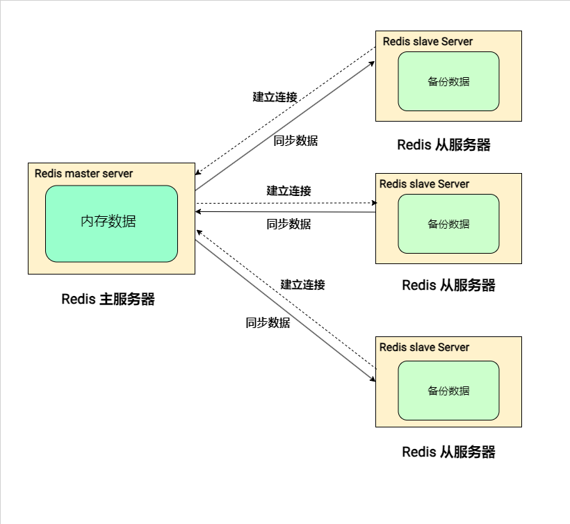

### 1.2 同步怎么跑（全量 + 命令流）

1. 从库执行 `REPLICAOF ip port`（或配置 `replicaof`），准备跟主库同步。  
2. **建连**：TCP 连上后，从库发 `PSYNC ? -1`；主库可回 `FULLRESYNC runid offset`，准备传 RDB。  
3. **RDB**：主库 `bgsave` 出快照 → 把 RDB 发给从库 → 从库加载进内存。  
4. **持续同步**：主库新写入会 **立刻发给从库**，并写入复制相关缓冲区；从库边收边执行，追赶主库。

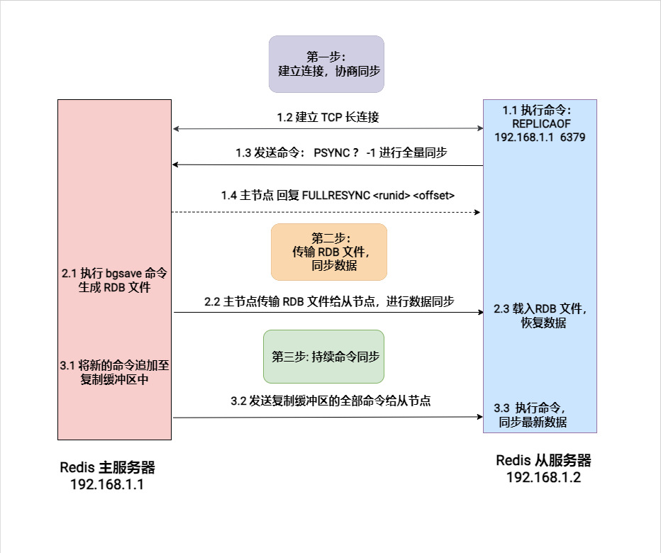

### 1.3 断线重连：全量 vs 部分同步

- 网络抖动后从库带 **上次的 runid + 复制偏移** 再 `PSYNC` 主库。  
- 主库校验 runid 一致，且 **复制积压缓冲区** 里还留着从库缺的命令 → 回 `CONTINUE`，只补一段命令（**部分同步**）。  
- 否则 → `FULLRESYNC`，再来一遍全量。

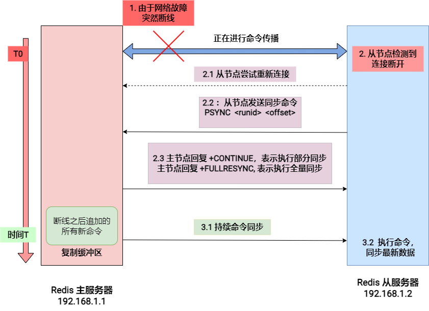

**复习要点**：部分同步靠 **积压缓冲区**（`repl-backlog-size` 等）+ offset；缓冲区不够或 runid 对不上就退化为全量。

### 1.4 `redis.conf` 里和复制相关的配置（按类记）

| 类别 | 配置项（记含义即可） |
|------|----------------------|
| **连主** | `replicaof`、`masteruser`、`masterauth` |
| **断连时从库行为** | `replica-serve-stale-data`（断连后是否仍返回旧数据）、`replica-read-only`（从是否只读） |
| **RDB 传输方式** | `repl-diskless-sync`、`repl-diskless-sync-delay`、`repl-diskless-load` |
| **保活与超时** | `repl-ping-replica-period`、`repl-timeout`、`repl-disable-tcp-nodelay` |
| **部分重同步** | `repl-backlog-size`、`repl-backlog-ttl` |
| **哨兵/集群会用到** | `replica-priority`（越小越优先被提升；**0 表示不参与升主**）、`replica-announced`、`replica-announce-ip`、`replica-announce-port`（Docker/NAT 下对外宣告地址） |
| **写确认（强一点的一致性）** | `min-replicas-to-write`、`min-replicas-max-lag` |

原文在 `redis.conf` 中搜 **`replication`** 可快速定位。

### 1.5 常见使用场景（背标题即可）

1. **读负载均衡**：读打到多个从，写打主。  
2. **冗余备份**：多节点有同一份数据拷贝。  
3. **读写分离**：主写从读，读性能更稳。  
4. **故障恢复（配合哨兵）**：主挂后从可被提升为新主，缩短不可用时间。

### 1.6 局限 → 对应出路

| 问题 | 要点 | 常见对策 |
|------|------|----------|
| **单点故障** | 主挂则写停 | **哨兵** 自动故障转移 |
| **主从延迟** | 异步复制，读从可能旧 | 业务层读延迟策略；写后用 **`WAIT <numslaves> <timeout>`** 等若干从确认（仍非跨业务强一致银弹） |
| **写吞吐上限** | 写只在一台主上 | **Cluster** 多主分片 |

---

## 2. 哨兵（Sentinel）

### 2.1 解决什么问题

主从只能复制和扩展读；**主挂了不会自动换主**。哨兵 = 一组独立进程，**监控 + 投票 + 切主 + 通知**，让 Redis **高可用**。

### 2.2 配置与启动（记关键项）

配置文件：**`sentinel.conf`**。示例要点：

```conf
port 26379
daemonize yes
logfile "/var/log/redis/sentinel.log"

# 监控名为 mymaster 的主；最后的 2 为 quorum（与客观下线/选举相关，原文强调要理解）
sentinel monitor mymaster 127.0.0.1 6379 2

sentinel down-after-milliseconds mymaster 30000
sentinel parallel-syncs mymaster 1
```

- **`down-after-milliseconds`**：多久收不到主/从响应 → 该哨兵判 **主观下线**。  
- **`parallel-syncs`**：故障转移后，允许多少个从 **同时** 向新主同步（过大可能打满新主）。

**部署建议**：至少 **3 个哨兵实例**，尽量 **跨机器**，避免单点。

```bash
redis-sentinel /path/to/sentinel.conf
```

### 2.3 哨兵怎么连上主、彼此、从？（面试常问）

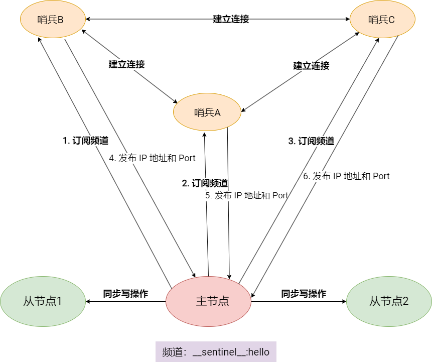

| 问题 | 答案要点 |
|------|----------|
| 哨兵 → 主 | `sentinel monitor 名字 ip port quorum` 里给了地址，直接连上监控 |
| 哨兵 ↔ 哨兵 | 订阅主节点上的 **`__sentinel__:hello`**：各哨兵发布自己的 ip/port，互相发现 |
| 哨兵 → 从 | 对主定期发 **`INFO replication`**，从返回里解析出各从的 ip、port |

### 2.4 工作原理三块：监控 → 选 Leader → 故障转移

**（1）监控：主观下线**

- 哨兵对主、从发 **PING**，等 **PONG**。  
- 超时（`down-after-milliseconds`）→ 该哨兵认为节点 **主观下线（SDOWN）**。

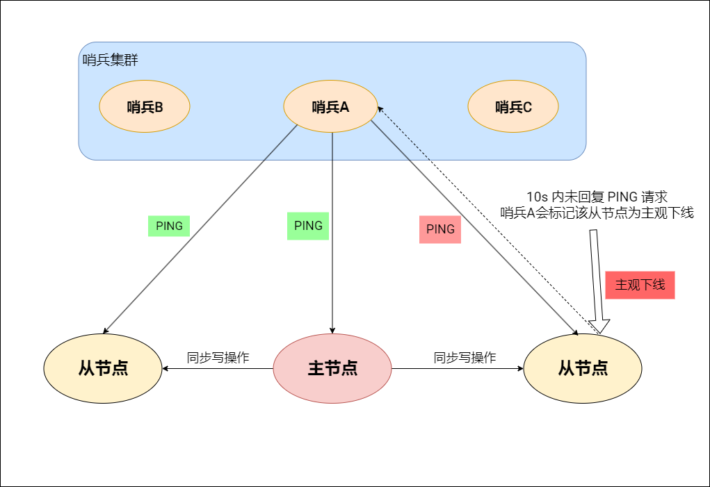

**（2）客观下线：多哨兵达成一致**

- 一哨兵认为主 SDOWN 后，会问其他哨兵（如原文中的 `+sdown master ...` 类消息协同）。  
- **足够多的哨兵** 都同意主不可用 → 主被标为 **客观下线（ODOWN）**，才进入选 Leader 与切主。

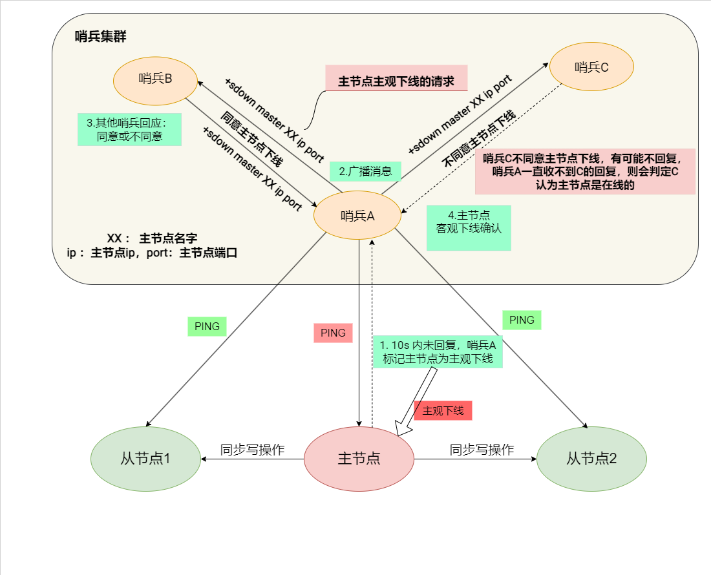

**（3）Leader 选举**

- **候选哨兵**：通常 **第一个确认客观下线** 的哨兵发起选举。  
- 向其他哨兵发：`SENTINEL is-master-down-by-addr <ip> <port> <current-epoch> <candidate-name>`。  
- 同一 **epoch** 里每哨兵 **只投一票**，常倾向 **最先发起** 的候选。  
- 得票过 **半数** → 成为 **哨兵 Leader**，执行故障转移。  
- 与 `sentinel monitor ... quorum` 中的 **quorum** 强相关（原文提醒要搞清二者关系）。

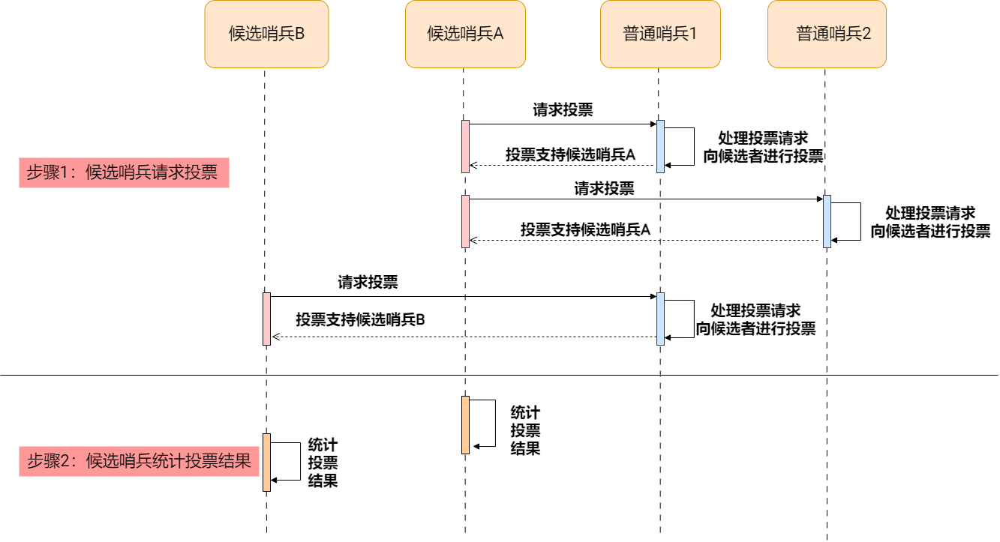

**（4）故障转移（Leader 做的事，按顺序记）**

1. **选新主**（从若干从库里挑一个）：  
   - 与旧主 **断开过久** 的从剔除（数据可能太旧；原文给出与 `down-after-milliseconds` 及 SDOWN 持续时间相关的经验公式）。  
   - 看 **`replica-priority`**（小优先）。  
   - 再看 **复制偏移**（越新越好）。  
   - 再 tie-break 用 **runid** 字典序最小等。  
   - 对选中从：`SLAVEOF no one` → 变主。  
2. **其余从库**：`SLAVEOF 新主IP 新主端口`，改复制目标。  
3. **旧主恢复**：哨兵会对其 `SLAVEOF 新主...`，**降级为从**，避免双写冲突。  
4. **通知客户端**：通过 **Pub/Sub**，在 **`+switch-master`** 等频道发布新主地址；客户端可 `SUBSCRIBE +switch-master` 感知切换。

### 2.5 哨兵优点（复习两句话）

- **高可用**：主故障自动提升从为主。  
- **服务发现**：客户端可通过哨兵/订阅拿到 **当前主** 地址。

### 2.6 哨兵局限（与「速读」表对照）

- **容量与写扩展**：不拆分数据，单机内存与单主写吞吐仍是瓶颈。  
- **依赖与部署**：需额外维护哨兵进程（建议至少 3 个、跨机），客户端需支持哨兵协议或自行订阅切换事件。  
- **切换窗口**：故障检测、选举 Leader、批量改从到新主需要时间，期间可能有短暂抖动，业务需容忍或重试。

---

## 3. 集群（Cluster）

### 3.1 为什么需要集群

主从 + 哨兵：**仍是整套数据在一个「逻辑主」上**，内存与 **单机写吞吐** 有天花板。数据量与并发再涨 → 用 **Cluster**：多主分片 + 每主可挂多从 + 内部故障转移。

### 3.2 核心概念：16384 个哈希槽

- 共 **16384** 个槽；每个 key 映射到一个槽：  
  **`slot = CRC16(key) mod 16384`**  
- 槽再 **分配到各个主节点**（可均匀可手工）。三主均分时常近似：5461 + 5461 + 5462 槽。  
- 客户端：知槽 → 知 **哪个主** 处理该 key。

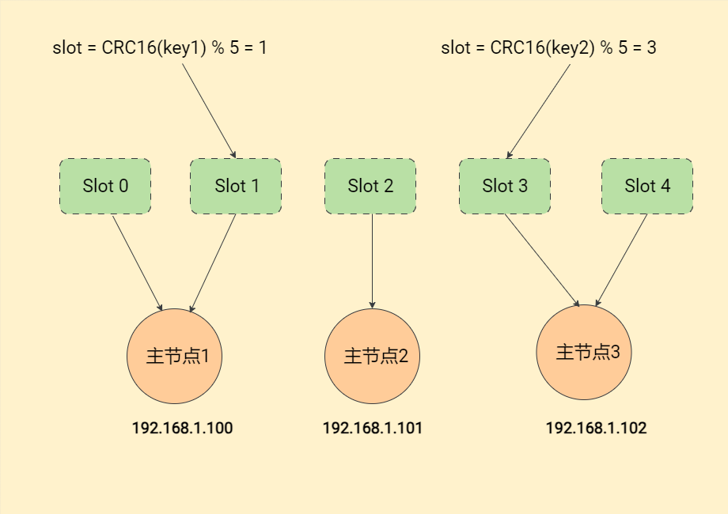

### 3.3 节点角色与读写路径

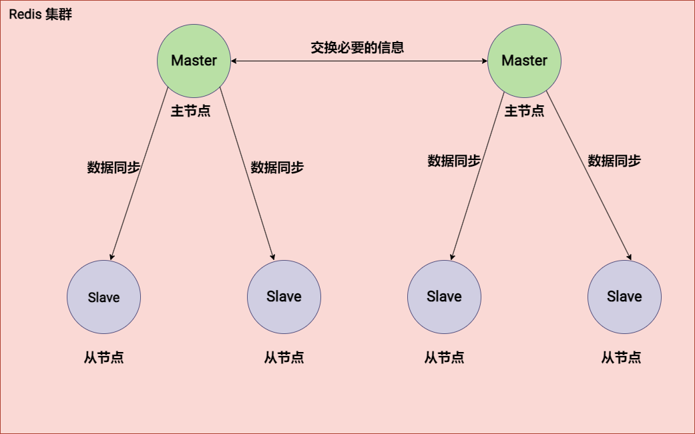

| 角色 | 职责摘要 |
|------|----------|
| **主** | 持有一部分槽；处理这些槽上的 **写**；向自己的从复制 |
| **从** | 备份对应主的数据；可分担 **读**；主挂时可被提升并 **接管槽** |

- **写**：算槽 → 找负责该槽的 **主** → 直连该主。  
- **读**：可到主或从（视客户端策略；从仍有延迟可能）。

### 3.4 Gossip：节点怎么「互相知道状态」

- 随机和同伴交换信息，像「闲聊」传开：拓扑、健康、槽分布等。  
- 用途：**发现节点**、**交换状态**、**传播疑似故障**、配合 **路由**（槽在谁身上）。

### 3.5 故障转移（与哨兵思想类似，但无外部哨兵）

**① 故障检测**

- **主观下线**：某节点在 `cluster-node-timeout` 内收不到对方 PONG → 单方面标记。  
- **客观下线**：**多数节点** 都认为某节点有问题 → 才触发后续（原文有 A/B/C/D/E 五步广播、FAIL 消息等示例，记「要过半数共识」即可）。

**② 从节点晋升**

- 从候选从里选新主：**复制进度新** > **`replica-priority` 小** > **网络/延迟更好**（原文顺序）。  
- 新主 **接管原主的槽**；集群元数据（ip/port、槽归属）随之更新。

**③ 恢复**

- 其他从向新主同步；客户端用 **支持 Cluster 的客户端** 自动跟拓扑，或定期 `CLUSTER NODES` / **`CLUSTER SLOTS`** 自建路由表。

### 3.6 客户端与集群：MOVED、ASK、ASKING

**正常槽不在本节点**：返回 **MOVED**，带上正确节点的 host:port，客户端应更新槽映射并重试。

**槽正在迁移**：访问落在迁移中的槽时，可能收到 **ASK**，引导去 **目标节点**；目标前要先发 **`ASKING`**（只对 **紧跟的一条命令** 生效），表示「这次允许临时访问迁移中的槽」。原文强调：**每条需要 ASK 的请求前都要 ASKING**。

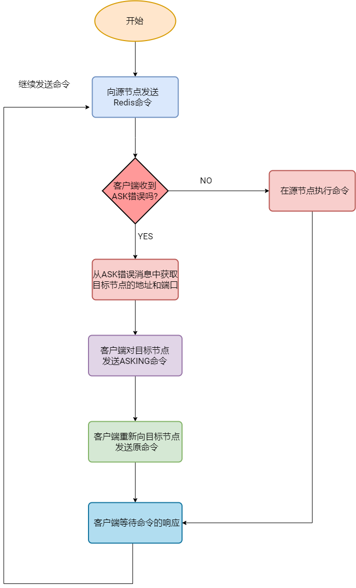

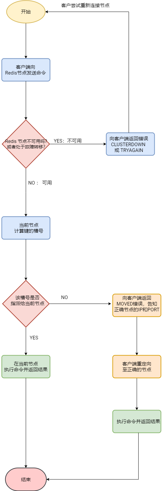

**交互流程（简记 4 步）**

1. 发命令到某已知节点；若 `CLUSTERDOWN` / `TRYAGAIN` → 退避重试。  
2. 算 `slot = CRC16(key) % 16384`。  
3. 槽归本节点则执行；否则 **MOVED/ASK** 重定向。  
4. 使用 **Cluster 感知客户端** 自动处理重定向与缓存拓扑。

### 3.7 重新分片（reshard）五步走（运维复习）

1. **`redis-cli -c -p 端口 cluster nodes`**（或 `redis-cli --cluster check`）看槽分布与节点状态。  
2. 结合 **INFO / 监控** 找 **热点源节点** 与 **空闲或低负载目标节点**。  
3. 分析哪些槽键多（可 `SCAN` + **`CLUSTER KEYSLOT`** 统计）。  
4. 执行迁移：  
   - 交互式：`redis-cli --cluster reshard <任意节点IP:端口>`  
   - 自动均衡：`redis-cli --cluster rebalance ...`，可加 **`--cluster-use-empty-masters`** 让空主也参与接槽。  
5. **`redis-cli --cluster check`** 校验全覆盖、无冲突；再看延迟、吞吐、各节点负载。

迁移期客户端可能大量见 **ASK**，需客户端正确处理。

### 3.8 集群优缺点（对照原文）

**优点**：容量横向扩展、读写吞吐分散、内置故障转移与高可用、加节点扩缩容相对平滑（仍有迁移成本）。  

**缺点**：配置与槽管理复杂；扩缩容 **reshard** 有短暂性能影响；Gossip **网络开销**；**多键/跨槽/部分命令** 使用受限（原文举例多键场景，实际工程上常配合 **hash tag** `{...}` 同槽设计）。

### 3.9 集群相关配置（扫一眼关键词）

```conf
cluster-enabled yes
cluster-config-file nodes-6379.conf
cluster-node-timeout 15000
cluster-replica-validity-factor 10
cluster-migration-barrier 1
cluster-allow-replica-migration yes
cluster-require-full-coverage yes
cluster-replica-no-failover no
cluster-allow-reads-when-down no
```

记：**`cluster-require-full-coverage yes`** 表示槽必须都有主负责，否则集群可能整体拒服（按业务谨慎选择）。

---

## 4. 收尾：原文总结 + 选型口诀

**主从**：副本 + 读扩展；主挂要人救或上哨兵；异步延迟要心里有数。  

**哨兵**：在主从之上 **自动切主** + **发现主**；容量与写仍受单主限制。  

**集群**：**多主分片** 解决容量与写扩展；**内置** 故障转移；运维与客户端要求高。

| 我要…… | 选型 |
|--------|------|
| 只要读多、能忍手动切主 / 有别的切换方案 | 主从 |
| 要 **7×24 自动高可用**，数据单机吃得下 | **主从 + 哨兵** |
| 单机内存/写压顶不住，要水平扩展 | **Cluster** |

---

## 常见面试追问 10 条（一句话答案）

| # | 追问 | 一句话答案 |
|---|------|-------------|
| 1 | 主从复制是同步还是异步？从库读到的数据一定和主库一致吗？ | **异步复制**，主先写、从后追，从库数据**可能滞后**，读从可能读到旧值。 |
| 2 | 断线重连后，什么情况下走全量、什么情况下走部分同步？ | 从库带 **runid + offset** 再 `PSYNC`，主库积压里**还够补**缺失命令则 **CONTINUE（部分）**，否则 **FULLRESYNC（全量）**。 |
| 3 | 复制积压缓冲区（repl backlog）是干什么的？ | 主上**环形缓冲**最近一段写命令，用于**短时断线**后增量补发，太小或断太久易退化为全量。 |
| 4 | 哨兵里「主观下线」和「客观下线」差在哪？ | **主观下线**是单个哨兵自己超时判的；**客观下线**要**足够多哨兵**都同意主不可用，才进入选 Leader 与故障转移。 |
| 5 | `sentinel monitor` 里的 **quorum** 和「过半数」是一回事吗？ | **不完全是**：quorum 是配置的**最少同意数**（与判定下线、能否发起转移相关），具体选举 Leader 等仍要结合**哨兵总数与投票规则**理解，别简单等同「过半」。 |
| 6 | 哨兵选新主时大致按什么顺序筛从库？ | 先剔除与主**断开过久、数据太旧**的从，再比 **`replica-priority`（小优先）**、**复制偏移（越新越好）**、再 **runId** 等 tie-break。 |
| 7 | 集群里 key 怎么落到某个节点？16384 从哪来？ | **`slot = CRC16(key) mod 16384`**，槽再映射到主节点；**16384（2^14）** 是协议与 gossip 开销权衡下的固定分片粒度。 |
| 8 | **MOVED** 和 **ASK** 有什么区别？ | **MOVED** 表示槽**已稳定**归另一节点，客户端应**更新槽映射**再请求；**ASK** 表示槽**正在迁移**，需对目标先发 **ASKING** 再带原命令做**一次性**访问。 |
| 9 | 集群故障转移还要不要哨兵？ | **不要外部哨兵**，由集群节点 **PING/PONG + 主观/客观下线 + 从晋升接槽** 在内部完成。 |
| 10 | 主从 + 哨兵已经高可用了，为什么还要上 Cluster？ | 哨兵仍是**一套逻辑数据挂在当前主上**，**单机内存与写吞吐**有上限；Cluster 用**多主分片**做容量与写的**水平扩展**。 |

---

## 5. 参考与版权

- 笔记结构与子话题顺序对齐博客园原文，便于回原文查细节。  
- 正文观点版权归原作者与 [原文章](https://www.cnblogs.com/xiaokang-coding/p/18063911)。  
- 文中 **14 张示意图** 来自原文托管图床（`files.mdnice.com`），已下载到本仓库 `static/image/redis/` 便于离线阅读；版权归原作者与原作者文章。
