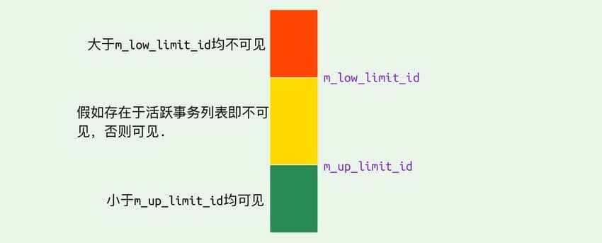
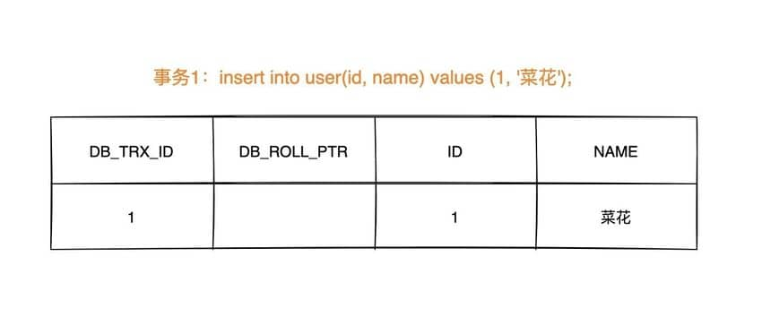
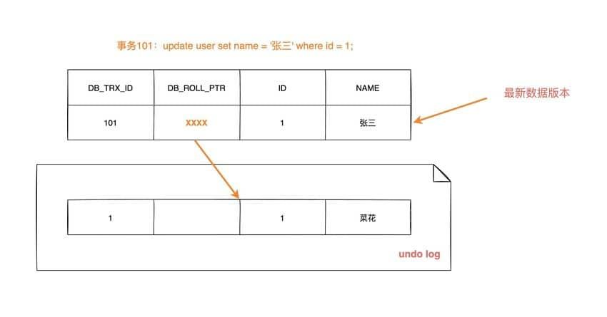
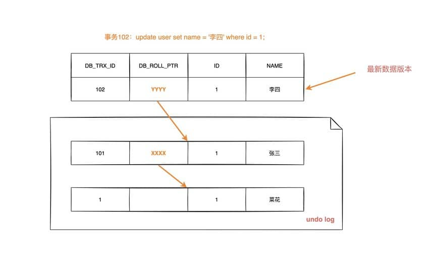
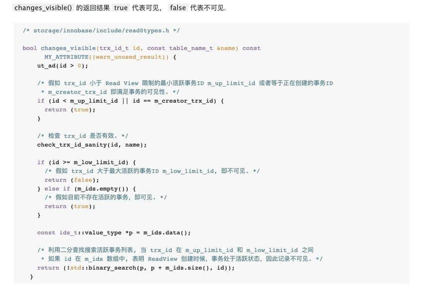

# InnoDB存储引擎对MVCC（Multi-Version Concurrency Control）的实现

MVCC 是一种并发控制机制，用于在多个并发事务同时读写数据库时保持数据的一致性和隔离性。 它是通过在每个数据行上维护多个版本的数据来实现的。
当一个事务要对数据库中的数据进行修改时，MVCC 会为该事务创建一个数据快照，而不是直接修改实际的数据行。
## mysql 实现MVCC说明 

### 1、读操作（SELECT）
当一个事务执行读操作时，它会使用快照读取。快照读取是基于事务开始时数据库中的状态创建的，因此事务不会读取其他事务尚未提交的修改。

具体工作情况如下：

对于读取操作，事务会查找符合条件的数据行，并选择符合其事务开始时间的数据版本进行读取。如果某个数据行有多个版本，事务会选择不晚于其开始时间的最新版本，确保事务只读取在它开始之前已经存在的数据。

事务读取的是快照数据，因此其他并发事务对数据行的修改不会影响当前事务的读取操作。

### 2、写操作（INSERT、UPDATE、DELETE）
当一个事务执行写操作时，它会生成一个新的数据版本，并将修改后的数据写入数据库。

具体工作情况如下：

对于写操作，事务会为要修改的数据行创建一个新的版本，并将修改后的数据写入新版本。新版本的数据会带有当前事务的版本号，以便其他事务能够正确读取相应版本的数据。

原始版本的数据仍然存在，供其他事务使用快照读取，这保证了其他事务不受当前事务的写操作影响。

### 3、事务提交和回滚
当一个事务提交时，它所做的修改将成为数据库的最新版本，并且对其他事务可见。

当一个事务回滚时，它所做的修改将被撤销，对其他事务不可见。

### 4、版本的回收：
为了防止数据库中的版本无限增长，MVCC 会定期进行版本的回收。回收机制会删除已经不再需要的旧版本数据，从而释放空间。 

MVCC 通过创建数据的多个版本和使用快照读取来实现并发控制。读操作使用旧版本数据的快照，写操作创建新版本，并确保原始版本仍然可用。这样，不同的事务可以在一定程度上并发执行，而不会相互干扰，从而提高了数据库的并发性能和数据一致性。

## InnoDB 对 MVCC 的实现
MVCC 的实现依赖于：隐藏字段、Read View、undo log。

在内部实现中，InnoDB 通过数据行的 DB_TRX_ID 和 Read View 来判断数据的可见性，如不可见，则通过数据行的 DB_ROLL_PTR 找到 undo log 中的历史版本。
每个事务读到的数据版本可能是不一样的，在同一个事务中，用户只能看到该事务创建 Read View 之前已经提交的修改和该事务本身做的修改

### 隐藏字段
在内部，InnoDB 存储引擎为每行数据添加了三个 隐藏字段：
* DB_TRX_ID（6字节）：表示最后一次插入或更新该行的事务 id。此外，delete 操作在内部被视为更新，只不过会在记录头 Record header 中的 deleted_flag 字段将其标记为已删除
* DB_ROLL_PTR（7字节） 回滚指针，指向该行的 undo log 。如果该行未被更新，则为空
* DB_ROW_ID（6字节）：如果没有设置主键且该表没有唯一非空索引时，InnoDB 会使用该 id 来生成聚簇索引

### ReadView 对象
Read View 主要是用来做可见性判断，里面保存了 “当前对本事务不可见的其他活跃事务”
```java
class ReadView {
  /* ... */
private:
  trx_id_t m_low_limit_id;      /* 大于等于这个 ID 的事务均不可见 */

  trx_id_t m_up_limit_id;       /* 小于这个 ID 的事务均可见 */

  trx_id_t m_creator_trx_id;    /* 创建该 Read View 的事务ID */

  trx_id_t m_low_limit_no;      /* 事务 Number, 小于该 Number 的 Undo Logs 均可以被 Purge */

  ids_t m_ids;                  /* 创建 Read View 时的活跃事务列表 */

  m_closed;                     /* 标记 Read View 是否 close */
}
```
主要有以下字段：
* m_low_limit_id：目前出现过的最大的事务 ID+1，即下一个将被分配的事务 ID。大于等于这个 ID 的数据版本均不可见
* m_up_limit_id：活跃事务列表 m_ids 中最小的事务 ID，如果 m_ids 为空，则 m_up_limit_id 为 m_low_limit_id。小于这个 ID 的数据版本均可见
* m_ids：Read View 创建时其他未提交的活跃事务 ID 列表。创建 Read View时，将当前未提交事务 ID 记录下来，后续即使它们修改了记录行的值，对于当前事务也是不可见的。m_ids 不包括当前事务自己和已提交的事务（正在内存中）
* m_creator_trx_id：创建该 Read View 的事务 ID

事务可见性示意图


### undo-log
undo log 主要有两个作用：
* 当事务回滚时用于将数据恢复到修改前的样子
* 另一个作用是 MVCC ，当读取记录时，若该记录被其他事务占用或当前版本对该事务不可见，则可以通过 undo log 读取之前的版本数据，以此实现非锁定读

在 InnoDB 存储引擎中 undo log 分为两种：insert undo log 和 update undo log：
1. insert undo log：指在 insert 操作中产生的 undo log。因为 insert 操作的记录只对事务本身可见，对其他事务不可见，故该 undo log 可以在事务提交后直接删除。不需要进行 purge 操作
   insert 时的数据初始状态：


2. update undo log：update 或 delete 操作中产生的 undo log。该 undo log可能需要提供 MVCC 机制，因此不能在事务提交时就进行删除。提交时放入 undo log 链表，等待 purge线程 进行最后的删除
   数据第一次被修改时：


数据第二次被修改时：


不同事务或者相同事务的对同一记录行的修改，会使该记录行的 undo log 成为一条链表，链首就是最新的记录，链尾就是最早的旧记录。


## 数据可见性算法
在 InnoDB 存储引擎中，创建一个新事务后，执行每个 select 语句前，都会创建一个快照（Read View），快照中保存了当前数据库系统中正处于活跃（没有 commit）的事务的 ID 号。其实简单的说保存的是系统中当前不应该被本事务看到的其他事务 ID 列表（即 m_ids）。当用户在这个事务中要读取某个记录行的时候，InnoDB 会将该记录行的 DB_TRX_ID 与 Read View 中的一些变量及当前事务 ID 进行比较，判断是否满足可见性条件


1. 如果记录 DB_TRX_ID < m_up_limit_id，那么表明最新修改该行的事务（DB_TRX_ID）在当前事务创建快照之前就提交了，所以该记录行的值对当前事务是可见的
2. 如果 DB_TRX_ID >= m_low_limit_id，那么表明最新修改该行的事务（DB_TRX_ID）在当前事务创建快照之后才修改该行，所以该记录行的值对当前事务不可见。跳到步骤 5
3. m_ids 为空，则表明在当前事务创建快照之前，修改该行的事务就已经提交了，所以该记录行的值对当前事务是可见的

4. 如果 m_up_limit_id <= DB_TRX_ID < m_low_limit_id，表明最新修改该行的事务（DB_TRX_ID）在当前事务创建快照的时候可能处于“活动状态”或者“已提交状态”；所以就要对活跃事务列表 m_ids 进行查找（源码中是用的二分查找，因为是有序的）
   * 如果在活跃事务列表 m_ids 中能找到 DB_TRX_ID，表明：
     * ① 在当前事务创建快照前，该记录行的值被事务 ID 为 DB_TRX_ID 的事务修改了，但没有提交；
     * 或者 ② 在当前事务创建快照后，该记录行的值被事务 ID 为 DB_TRX_ID 的事务修改了。这些情况下，这个记录行的值对当前事务都是不可见的。跳到步骤 5
   * 在活跃事务列表中找不到，则表明“id 为 trx_id 的事务”在修改“该记录行的值”后，在“当前事务”创建快照前就已经提交了，所以记录行对当前事务可见
5. 在该记录行的 DB_ROLL_PTR 指针所指向的 undo log 取出快照记录，用快照记录的 DB_TRX_ID 跳到步骤 1 重新开始判断，直到找到满足的快照版本或返回空


MySQL MVCC实现 https://javaguide.cn/database/mysql/innodb-implementation-of-mvcc.html

MVCC及实现原理 https://blog.csdn.net/weixin_44823875/article/details/144742365

【MySQL】MVCC原理分析 + 源码解读 https://cloud.tencent.com/developer/article/2184720

MySQL事务隔离机制 https://cloud.tencent.com/developer/article/2184718?from_column=20421&from=20421
