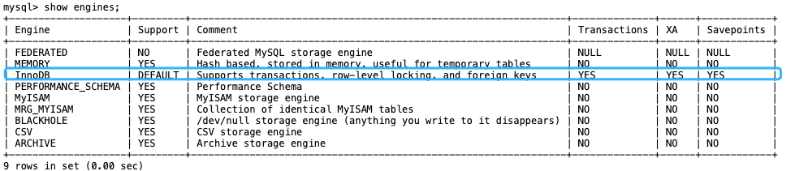

## 1.MySQL 字段类型
MySQL 字段类型可以简单分为三大类：
* 数值类型：整型（TINYINT、SMALLINT、MEDIUMINT、INT 和 BIGINT）、浮点型（FLOAT 和 DOUBLE）、定点型（DECIMAL）
* 字符串类型：CHAR、VARCHAR、TINYTEXT、TEXT、MEDIUMTEXT、LONGTEXT、TINYBLOB、BLOB、MEDIUMBLOB 和 LONGBLOB 等，最常用的是 CHAR 和 VARCHAR。
* 日期时间类型：YEAR、TIME、DATE、DATETIME 和 TIMESTAMP 等。

### 1.1 DATETIME 和 TIMESTAMP 的区别是什么？
DATETIME 类型没有时区信息，TIMESTAMP 和时区有关。
TIMESTAMP 只需要使用 4 个字节的存储空间，但是 DATETIME 需要耗费 8 个字节的存储空间。但是，这样同样造成了一个问题，Timestamp 表示的时间范围更小。
DATETIME：1000-01-01 00:00:00 ~ 9999-12-31 23:59:59
Timestamp：1970-01-01 00:00:01 ~ 2037-12-31 23:59:59
https://javaguide.cn/database/mysql/some-thoughts-on-database-storage-time.html


### 1.2 NULL 和 '' 的区别是什么？
NULL 跟 ''(空字符串)是两个完全不一样的值，区别如下：
1. NULL 代表一个不确定的值,就算是两个 NULL,它俩也不一定相等。例如，SELECT NULL=NULL的结果为 false，但是在我们使用DISTINCT,GROUP BY,ORDER BY时,NULL又被认为是相等的。
2. ''的长度是 0，是不占用空间的，而NULL 是需要占用空间的。
3. NULL 会影响聚合函数的结果。
例如，SUM、AVG、MIN、MAX 等聚合函数会忽略 NULL 值。 COUNT 的处理方式取决于参数的类型。如果参数是 *(COUNT(*))，则会统计所有的记录数，包括 NULL 值；
如果参数是某个字段名(COUNT(列名))，则会忽略 NULL 值，只统计非空值的个数。
4. 查询 NULL 值时，必须使用 IS NULL 或 IS NOT NULLl 来判断，而不能使用 =、!=、 <、> 之类的比较运算符。而''是可以使用这些比较运算符的。

### Boolean 类型如何表示？
MySQL 中没有专门的布尔类型，而是用 TINYINT(1) 类型来表示布尔值。TINYINT(1) 类型可以存储 0 或 1，分别对应 false 或 true。


## MySQL 基础架构


从上图可以看出， MySQL 主要由下面几部分构成：
* 连接器： 身份认证和权限相关(登录 MySQL 的时候)。
* 查询缓存： 执行查询语句的时候，会先查询缓存（MySQL 8.0 版本后移除，因为这个功能不太实用）。
* 分析器： 没有命中缓存的话，SQL 语句就会经过分析器，分析器说白了就是要先看你的 SQL 语句要干嘛，再检查你的 SQL 语句语法是否正确。
* 优化器： 按照 MySQL 认为最优的方案去执行。执行器： 执行语句，然后从存储引擎返回数据。 执行语句之前会先判断是否有权限，如果没有权限的话，就会报错。
* 插件式存储引擎：主要负责数据的存储和读取，采用的是插件式架构，支持 InnoDB、MyISAM、Memory 等多种存储引擎。InnoDB 是 MySQL 的默认存储引擎，绝大部分场景使用 InnoDB 就是最好的选择。

### 存储引擎
MySQL 支持多种存储引擎，你可以通过 SHOW ENGINES 命令来查看 MySQL 支持的所有存储引擎。

从上图我们可以查看出， MySQL 当前默认的存储引擎是 InnoDB。并且，所有的存储引擎中只有 InnoDB 是事务性存储引擎，也就是说只有 InnoDB 支持事务。

我这里使用的 MySQL 版本是 8.x，不同的 MySQL 版本之间可能会有差别。
MySQL 5.5.5 之前，MyISAM 是 MySQL 的默认存储引擎。5.5.5 版本之后，InnoDB 是 MySQL 的默认存储引擎。

常用命令
```bash
# 查看版本
mysql> SELECT VERSION();
+-----------+
| VERSION() |
+-----------+
| 8.0.27    |
+-----------+
1 row in set (0.00 sec)

# 你也可以通过 SHOW VARIABLES LIKE '%storage_engine%' 命令直接查看 MySQL 当前默认的存储引擎。
mysql> SHOW VARIABLES  LIKE '%storage_engine%';
+---------------------------------+-----------+
| Variable_name                   | Value     |
+---------------------------------+-----------+
| default_storage_engine          | InnoDB    |
| default_tmp_storage_engine      | InnoDB    |
| disabled_storage_engines        |           |
| internal_tmp_mem_storage_engine | TempTable |
+---------------------------------+-----------+
4 rows in set (0.00 sec)

```

### MySQL 存储引擎架构了解吗？
MySQL 存储引擎采用的是 插件式架构 ，支持多种存储引擎，我们甚至可以为不同的数据库表设置不同的存储引擎以适应不同场景的需要。
`存储引擎是基于表的，而不是数据库` 。


你还可以根据 MySQL 定义的存储引擎实现标准接口来编写一个属于自己的存储引擎。这些非官方提供的存储引擎可以称为第三方存储引擎，区别于官方存储引擎。像目前最常用的 InnoDB 其实刚开始就是一个第三方存储引擎，后面由于过于优秀，其被 Oracle 直接收购了。

### MyISAM 和 InnoDB 有什么区别？

1. 是否支持行级锁
MyISAM 只有表级锁(table-level locking)，而 InnoDB 支持行级锁(row-level locking)和表级锁,默认为行级锁。也就说，MyISAM 一锁就是锁住了整张表，这在并发写的情况下是多么滴憨憨啊！这也是为什么 InnoDB 在并发写的时候，性能更牛皮了！
2. 是否支持事务MyISAM 
不提供事务支持。
InnoDB 提供事务支持，实现了 SQL 标准定义了四个隔离级别，具有提交(commit)和回滚(rollback)事务的能力。并且，InnoDB 默认使用的 REPEATABLE-READ（可重读）隔离级别是可以解决幻读问题发生的（基于 MVCC 和 Next-Key Lock）。
3. 是否支持外键
MyISAM 不支持，而 InnoDB 支持。
外键对于维护数据一致性非常有帮助，但是对性能有一定的损耗。因此，通常情况下，我们是不建议在实际生产项目中使用外键的，在业务代码中进行约束即可！

4. 是否支持数据库异常崩溃后的安全恢复
MyISAM 不支持，而 InnoDB 支持。
使用 InnoDB 的数据库在异常崩溃后，数据库重新启动的时候会保证数据库恢复到崩溃前的状态。这个恢复的过程依赖于 redo log 。
5. 是否支持 MVCC
MyISAM 不支持，而 InnoDB 支持。
讲真，这个对比有点废话，毕竟 MyISAM 连行级锁都不支持。MVCC 可以看作是行级锁的一个升级，可以有效减少加锁操作，提高性能

6. 索引实现不一样
虽然 MyISAM 引擎和 InnoDB 引擎都是使用 B+Tree 作为索引结构，但是两者的实现方式不太一样。
InnoDB 引擎中，其数据文件本身就是索引文件。相比 MyISAM，索引文件和数据文件是分离的，其表数据文件本身就是按 B+Tree 组织的一个索引结构，树的叶节点 data 域保存了完整的数据记录。

7. 性能有差别。
InnoDB 的性能比 MyISAM 更强大，不管是在读写混合模式下还是只读模式下，随着 CPU 核数的增加， InnoDB 的读写能力呈线性增长。MyISAM 因为读写不能并发，它的处理能力跟核数没关系。

8. 数据缓存策略和机制实现不同。
InnoDB 使用缓冲池（Buffer Pool）缓存数据页和索引页，MyISAM 使用键缓存（Key Cache）仅缓存索引页而不缓存数据页

总结：
* InnoDB 支持行级别的锁粒度，MyISAM 不支持，只支持表级别的锁粒度。
* MyISAM 不提供事务支持。InnoDB 提供事务支持，实现了 SQL 标准定义了四个隔离级别。
* MyISAM 不支持外键，而 InnoDB 支持。
* MyISAM 不支持 MVCC，而 InnoDB 支持。
* 虽然 MyISAM 引擎和 InnoDB 引擎都是使用 B+Tree 作为索引结构，但是两者的实现方式不太一样。
* MyISAM 不支持数据库异常崩溃后的安全恢复，而 InnoDB 支持。InnoDB 的性能比 MyISAM 更强大。

## mysql事务 
关系型数据库（例如：MySQL、SQL Server、Oracle 等）事务都有 ACID 特性：
1. 原子性（Atomicity）：事务是最小的执行单位，不允许分割。事务的原子性确保动作要么全部完成，要么完全不起作用；
2. 一致性（Consistency）：执行事务前后，数据保持一致，例如转账业务中，无论事务是否成功，转账者和收款人的总额应该是不变的；
3. 隔离性（Isolation）：并发访问数据库时，一个用户的事务不被其他事务所干扰，各并发事务之间数据库是独立的；
4. 持久性（Durability）：一个事务被提交之后。它对数据库中数据的改变是持久的，即使数据库发生故障也不应该对其有任何影响。

这里要额外补充一点：`只有保证了事务的持久性、原子性、隔离性之后，一致性才能得到保障。也就是说 A、I、D 是手段，C 是目的！` 

### 并发事务问题
在典型的应用程序中，多个事务并发运行，经常会操作相同的数据来完成各自的任务（多个用户对同一数据进行操作）。并发虽然是必须的，但可能会导致以下的问题。

#### 脏读（Dirty read）
一个事务读取数据并且对数据进行了修改，这个修改对其他事务来说是可见的，即使当前事务没有提交。这时另外一个事务读取了这个还未提交的数据，但第一个事务突然回滚，导致数据并没有被提交到数据库，那第二个事务读取到的就是脏数据，这也就是脏读的由来。

例如：事务 1 读取某表中的数据 A=20，事务 1 修改 A=A-1，事务 2 读取到 A = 19,事务 1 回滚导致对 A 的修改并未提交到数据库， A 的值还是 20。
#### 丢失修改（Lost to modify）
在一个事务读取一个数据时，另外一个事务也访问了该数据，那么在第一个事务中修改了这个数据后，第二个事务也修改了这个数据。这样第一个事务内的修改结果就被丢失，因此称为丢失修改。

例如：事务 1 读取某表中的数据 A=20，事务 2 也读取 A=20，事务 1 先修改 A=A-1，事务 2 后来也修改 A=A-1，最终结果 A=19，事务 1 的修改被丢失。
#### 不可重复读（Unrepeatable read）
指在一个事务内多次读同一数据。在这个事务还没有结束时，另一个事务也访问该数据。那么，在第一个事务中的两次读数据之间，由于第二个事务的修改导致第一个事务两次读取的数据可能不太一样。这就发生了在一个事务内两次读到的数据是不一样的情况，因此称为不可重复读。

例如：事务 1 读取某表中的数据 A=20，事务 2 也读取 A=20，事务 1 修改 A=A-1，事务 2 再次读取 A =19，此时读取的结果和第一次读取的结果不同。
#### 幻读（Phantom read）
幻读与不可重复读类似。它发生在一个事务读取了几行数据，接着另一个并发事务插入了一些数据时。在随后的查询中，第一个事务就会发现多了一些原本不存在的记录，就好像发生了幻觉一样，所以称为幻读。

例如：事务 2 读取某个范围的数据，事务 1 在这个范围插入了新的数据，事务 2 再次读取这个范围的数据发现相比于第一次读取的结果多了新的数据。

### 不可重复读和幻读有什么区别？
* 不可重复读的重点是内容修改或者记录减少比如多次读取一条记录发现其中某些记录的值被修改；
* 幻读的重点在于记录新增比如多次执行同一条查询语句（DQL）时，发现查到的记录增加了。

幻读其实可以看作是不可重复读的一种特殊情况，单独把幻读区分出来的原因主要是解决幻读和不可重复读的方案不一样。

举个例子：执行 delete 和 update 操作的时候，可以直接对记录加锁，保证事务安全。而执行 insert 操作的时候，由于记录锁（Record Lock）只能锁住已经存在的记录，为了避免插入新记录，需要依赖间隙锁（Gap Lock）。也就是说执行 insert 操作的时候需要依赖 Next-Key Lock（Record Lock+Gap Lock） 进行加锁来保证不出现幻读。

### 并发事务的控制方式有哪些？
MySQL 中并发事务的控制方式无非就两种：锁 和 MVCC。
锁可以看作是悲观控制的模式，多版本并发控制（MVCC，Multiversion concurrency control）可以看作是乐观控制的模式。

锁 控制方式下会通过锁来显式控制共享资源而不是通过调度手段，MySQL 中主要是通过 读写锁 来实现并发控制。
* 共享锁（S 锁）：又称读锁，事务在读取记录的时候获取共享锁，允许多个事务同时获取（锁兼容）。
* 排他锁（X 锁）：又称写锁/独占锁，事务在修改记录的时候获取排他锁，不允许多个事务同时获取。如果一个记录已经被加了排他锁，那其他事务不能再对这条记录加任何类型的锁（锁不兼容）。

读写锁可以做到读读并行，但是无法做到写读、写写并行。另外，根据根据锁粒度的不同，又被分为 表级锁(table-level locking) 和 行级锁(row-level locking) 。
InnoDB 不光支持表级锁，还支持行级锁，默认为行级锁。行级锁的粒度更小，仅对相关的记录上锁即可（对一行或者多行记录加锁），所以对于并发写入操作来说， I
nnoDB 的性能更高。不论是表级锁还是行级锁，都存在共享锁（Share Lock，S 锁）和排他锁（Exclusive Lock，X 锁）这两类。


### SQL 标准定义了哪些事务隔离级别?
SQL 标准定义了四个隔离级别：
* READ-UNCOMMITTED(读取未提交) ：
最低的隔离级别，允许读取尚未提交的数据变更，可能会导致脏读、幻读或不可重复读。
* READ-COMMITTED(读取已提交) ：
允许读取并发事务已经提交的数据，可以阻止脏读，但是幻读或不可重复读仍有可能发生。
* REPEATABLE-READ(可重复读) ：
对同一字段的多次读取结果都是一致的，除非数据是被本身事务自己所修改，可以阻止脏读和不可重复读，但幻读仍有可能发生。
* SERIALIZABLE(可串行化) ：
最高的隔离级别，完全服从 ACID 的隔离级别。所有的事务依次逐个执行，这样事务之间就完全不可能产生干扰，也就是说，该级别可以防止脏读、不可重复读以及幻读。

隔离级别	            脏读	不可重复读	幻读
READ-UNCOMMITTED	√	    √	    √
READ-COMMITTED	    ×	    √	    √
REPEATABLE-READ	    ×	    ×	    √
SERIALIZABLE	    ×	    ×	    ×

### MySQL 的默认隔离级别是什么？是基于锁实现的吗？
MySQL InnoDB 存储引擎的默认支持的隔离级别是 `REPEATABLE-READ（可重读）`。我们可以通过SELECT @@tx_isolation;
命令来查看，MySQL 8.0 该命令改为SELECT @@transaction_isolation;

```bash
mysql> SELECT @@tx_isolation;
+-----------------+
| @@tx_isolation  |
+-----------------+
| REPEATABLE-READ |
+-----------------+
```

MySQL 的隔离级别基于锁 和 MVCC 机制共同实现的。
SERIALIZABLE 隔离级别是通过锁来实现的，
READ-COMMITTED 和 REPEATABLE-READ 隔离级别是基于 MVCC 实现的。
不过，SERIALIZABLE 之外的其他隔离级别可能也需要用到锁机制，就比如 REPEATABLE-READ 在当前读情况下需要使用加锁读来保证不会出现幻读。


## Mysql 锁
### 表级锁和行级锁了解吗？有什么区别？
MyISAM 仅仅支持表级锁(table-level locking)，一锁就锁整张表，这在并发写的情况下性非常差。InnoDB 不光支持表级锁(table-level locking)，还支持行级锁(row-level locking)，默认为行级锁。
行级锁的粒度更小，仅对相关的记录上锁即可（对一行或者多行记录加锁），所以对于并发写入操作来说， InnoDB 的性能更高。

表级锁和行级锁对比：
* 表级锁： MySQL 中锁定粒度最大的一种锁（全局锁除外），是针对非索引字段加的锁，对当前操作的整张表加锁，实现简单，资源消耗也比较少，加锁快，不会出现死锁。不过，触发锁冲突的概率最高，高并发下效率极低。表级锁和存储引擎无关，MyISAM 和 InnoDB 引擎都支持表级锁。
* 行级锁： MySQL 中锁定粒度最小的一种锁，是 针对索引字段加的锁 ，只针对当前操作的行记录进行加锁。 行级锁能大大减少数据库操作的冲突。其加锁粒度最小，并发度高，但加锁的开销也最大，加锁慢，会出现死锁。行级锁和存储引擎有关，是在存储引擎层面实现的。


### 行级锁的使用有什么注意事项？
InnoDB 的行锁是针对索引字段加的锁，表级锁是针对非索引字段加的锁。当我们执行 UPDATE、DELETE 语句时，如果 WHERE条件中字段没有命中唯一索引或者索引失效的话，就会导致扫描全表对表中的所有行记录进行加锁。这个在我们日常工作开发中经常会遇到，一定要多多注意！！！
不过，很多时候即使用了索引也有可能会走全表扫描，这是因为 MySQL 优化器的原因。

### InnoDB 有哪几类行锁？
InnoDB 行锁是通过对索引数据页上的记录加锁实现的，MySQL InnoDB 支持三种行锁定方式：
* 记录锁（Record Lock）：属于单个行记录上的锁。
* 间隙锁（Gap Lock）：锁定一个范围，不包括记录本身。
* 临键锁（Next-Key Lock）：Record Lock+Gap Lock，锁定一个范围，包含记录本身，主要目的是为了解决幻读问题（MySQL 事务部分提到过）。记录锁只能锁住已经存在的记录，为了避免插入新记录，需要依赖间隙锁。

在 InnoDB 默认的隔离级别 REPEATABLE-READ 下，行锁默认使用的是 Next-Key Lock。但是，如果操作的索引是唯一索引或主键，InnoDB 会对 Next-Key Lock 进行优化，将其降级为 Record Lock，即仅锁住索引本身，而不是范围。

### 共享锁和排他锁呢？
不论是表级锁还是行级锁，都存在共享锁（Share Lock，S 锁）和排他锁（Exclusive Lock，X 锁）这两类：
* 共享锁（S 锁）：又称读锁，事务在读取记录的时候获取共享锁，允许多个事务同时获取（锁兼容）。
* 排他锁（X 锁）：又称写锁/独占锁，事务在修改记录的时候获取排他锁，不允许多个事务同时获取。如果一个记录已经被加了排他锁，那其他事务不能再对这条事务加任何类型的锁（锁不兼容）。

排他锁与任何的锁都不兼容，共享锁仅和共享锁兼容。

        S锁	    X锁
  S锁	不冲突	冲突
  X锁	冲突	    冲突

由于 MVCC 的存在，对于一般的 SELECT 语句，InnoDB 不会加任何锁。不过， 你可以通过以下语句显式加共享锁或排他锁。
```mysql
# 共享锁 可以在 MySQL 5.7 和 MySQL 8.0 中使用
SELECT ... LOCK IN SHARE MODE;
# 共享锁 可以在 MySQL 8.0 中使用
SELECT ... FOR SHARE;
# 排他锁
SELECT ... FOR UPDATE;
```

## MySQL 性能怎么优化？
MySQL 性能优化是一个系统性工程，涉及多个方面，在面试中不可能面面俱到。因此，建议按照“点-线-面”的思路展开，从核心问题入手，再逐步扩展，展示出你对问题的思考深度和解决能力。
### 1. 抓住核心：
慢 SQL 定位与分析性能优化的第一步永远是找到瓶颈。面试时，建议先从 慢 SQL 定位和分析 入手，这不仅能展示你解决问题的思路，还能体现你对数据库性能监控的熟练掌握：
* 监控工具： 
介绍常用的慢 SQL 监控工具，如 MySQL 慢查询日志、Performance Schema 等，说明你对这些工具的熟悉程度以及如何通过它们定位问题。
* EXPLAIN 命令： 
详细说明 EXPLAIN 命令的使用，分析查询计划、索引使用情况，可以结合实际案例展示如何解读分析结果，比如执行顺序、索引使用情况、全表扫描等。
### 2. 由点及面：
索引、表结构和 SQL 优化定位到慢 SQL 后，接下来就要针对具体问题进行优化。 这里可以重点介绍索引、表结构和 SQL 编写规范等方面的优化技巧：
* 索引优化： 这是 MySQL 性能优化的重点，可以介绍索引的创建原则、覆盖索引、最左前缀匹配原则等。如果能结合你项目的实际应用来说明如何选择合适的索引，会更加分一些。
* 表结构优化： 优化表结构设计，包括选择合适的字段类型、避免冗余字段、合理使用范式和反范式设计等等。
* SQL 优化： 避免使用 SELECT *、尽量使用具体字段、使用连接查询代替子查询、合理使用分页查询、批量操作等，都是 SQL 编写过程中需要注意的细节。

### 3. 进阶方案：
架构优化当面试官对基础优化知识比较满意时，可能会深入探讨一些架构层面的优化方案。以下是一些常见的架构优化策略：
* 读写分离： 将读操作和写操作分离到不同的数据库实例，提升数据库的并发处理能力。
* 分库分表： 将数据分散到多个数据库实例或数据表中，降低单表数据量，提升查询效率。但要权衡其带来的复杂性和维护成本，谨慎使用。
* 数据冷热分离：根据数据的访问频率和业务重要性，将数据分为冷数据和热数据，冷数据一般存储在存储在低成本、低性能的介质中，热数据高性能存储介质中。
* 缓存机制： 使用 Redis 等缓存中间件，将热点数据缓存到内存中，减轻数据库压力。这个非常常用，提升效果非常明显，性价比极高！4. 其他优化手段除了慢 SQL 定位、索引优化和架构优化，还可以提及一些其他优化手段，展示你对 MySQL 性能调优的全面理解：连接池配置： 配置合理的数据库连接池（如 连接池大小、超时时间 等），能够有效提升数据库连接的效率，避免频繁的连接开销。硬件配置： 提升硬件性能也是优化的重要手段之一。使用高性能服务器、增加内存、使用 SSD 硬盘等硬件升级，都可以有效提升数据库的整体性能。


原文链接  https://javaguide.cn/database/mysql/mysql-questions-01.html#mysql-%E6%80%A7%E8%83%BD%E6%80%8E%E4%B9%88%E4%BC%98%E5%8C%96

分库分表 https://javaguide.cn/high-performance/read-and-write-separation-and-library-subtable.html#%E5%88%86%E5%BA%93%E5%88%86%E8%A1%A8%E6%9C%89%E6%B2%A1%E6%9C%89%E4%BB%80%E4%B9%88%E6%AF%94%E8%BE%83%E6%8E%A8%E8%8D%90%E7%9A%84%E6%96%B9%E6%A1%88