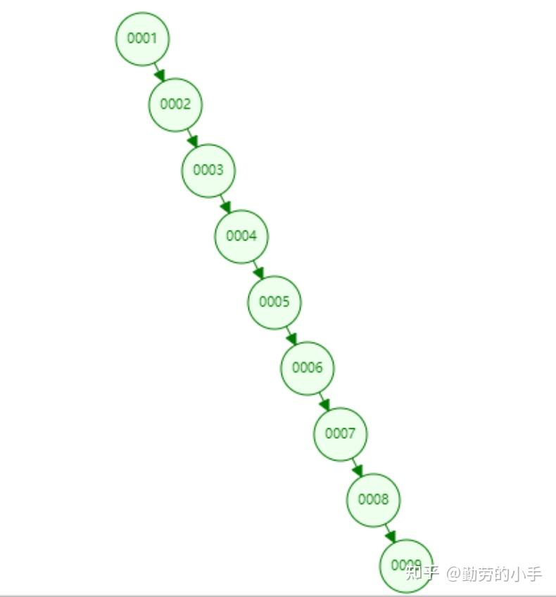

## B+树存储模型
### 假设每条sql信息为1kb，主键ID为bigint型，一颗高度为4的b+树能存 储多少数据?
在 innodb 存储引擎里面，最小的存储单元是页（page）， 一个页的大小是 16KB。

如果我们在数据库的命令行输入如下 命令，那么可以返回如右图所示。 这就说明了一个页的大小为 16384B, 也就是 16kb。 假设一行数据的大小是 1k，那么一个页可以存放 16 行这样的数据。那如果想查找某个页里面的一个数据的话，得首先找到他所在的页。innodb 存储引擎我们都知道使用 B + 树的结构来组织数据。如果是在主键上建 立的索引就是聚簇索引，即只有在叶子节点才存储行数据，而非叶子节点里面的内容其实是键值和指向数据 页的指针。

因此，我们首先解决一个简单一点的问题：那么如果是 2 层的 B + 树，最多可以存储多少行数据？ 如果是 2 层的 B + 树，即存在一个根节点和若干个叶子节点，那么这棵 B + 树的存放总记录数为：根节点指 针数 * 单个叶子节点记录行数。因为单个页的大小为 16kb，而一行数据的大小为 1kb，也就是说一页可以存 放 16 行数据。然后因为非叶子节点的结构是：“页指针 + 键值”，我们假设主键 ID 为 bigint 类型，长度为 8 字节（byte），而指针大小在 InnoDB 源码中设置为 6 字节（byte），这样一共 14 字节（byte），因为一个 页可以存放 16k 个 byte，所以一个页可以存放的指针个数为 16384/14=1170 个。因此一个两层的 B + 树可 以存放的数据行的个数为：1170*16=18720（行）。

那么对于高度为3的B+树呢？也就是说第一层的页，即根页可以存放 1170 个指针，然后第二层的每个页也可以 存放 1170 个指针。这样一共可以存放 11701170 个指针，所以一共可以存放 1170117016=21902400（2千万 左右） 行记录。也就是说一个三层的 B + 树就可以存放千万级别的数据了。而每经过一个节点都需要 IO 一次， 把这个页数据从磁盘读取到缓存，也就是说读取一个数据只需要三次 IO。 继续来说，高度为4的B+树呢？ 11701170117016 约等于 2000万*1000。 5个 2000 万是 1个亿。1000个 2000 万就是 200亿。

### 为什么选用B+树做索引而不选用二叉树或者B树?
b树（balance tree）和b+树应用在数据库索引，可以认为是m叉的多路平衡查找树，但是从理论上讲，二叉树查找速度和比较次数都是最小的。

#### 为什么不用二叉树呢？ 
二叉查找树充分了利用二分法的思维提升了数据查找的效率，不过我们在构建二叉树的时候就会发现很容易出现一个问题， 就是二叉查找树的“高度”不稳定，同样的数据插入的先后顺序不一样。
如果树的节点变成线性结构，那么就会极大的降低我们的查询效率 就很有可能变成下图一样的结构。

数据库索引是存储在磁盘上的，当数据量大时， 就不能把整个索引全部加载到内存了，只能逐一加载每一个磁盘页（对应索引树的节点）。
所以我们要减少 IO 次数，对于树来说，IO 次数就是树的高度，而 “矮胖” 就是 b 树的特征之一，它的每个节点最多包含 m 个孩子， m 称为 b 树的阶。 

#### 为什么不用B树呢？

b+树，是b树的一种变体，查询性能更好。 b+树相比于b树的查询优势： 
1. b + 树的中间节点不保存数据，所以磁盘页能容纳更多节点元素，更 “矮胖”。B 树不管叶子节点还是非叶子节点，都会保存数据，这样导致在非叶子节点中能保存的指针数量变少（有些资料也称为扇出），指针少的情况下要保存大量数据，只能增加树的高度，导致 IO 操作变多，查询性能变低； 
2. b + 树查询必须查找到叶子节点，b 树只要匹配到即可直接返回。因此 b + 树查找更稳定（并不慢），必须查找到叶子节点；而B树，如果数据在根节点最快，在叶子节点最慢，查询效率不稳定。 
3. 对于范围查找来说，b+树只需遍历叶子节点链表即可，并且不需要排序操作，因为叶子节点已经对索引进行了排序操作。b 树却需要重复地中序遍历，找到所有的范围内的节点。

### 为什么用 B+ 树做索引而不用哈希表做索引？
1. 模糊查找不支持：哈希表是把索引字段映射成对应的哈希码然后再存放在对应的位置，这样的话，如果我们要进行模糊查找的话，显然哈希表这种结构是不支持的，只能遍历这个表。而 B + 树则可以通过最左前缀原则快速找到对应的数据。 
2. 范围查找不支持：如果我们要进行范围查找，例如查找 ID 为 100 ~ 400 的人，哈希表同样不支持，只能遍历全表。 
3. 哈希冲突问题：索引字段通过哈希映射成哈希码，如果很多字段都刚好映射到相同值的 哈希码的话，那么形成的索引结构将会是一条很长的链表，这样的话，查找的时间就会大大增加。

### 如何避免长事务对业务的影响
首先，从应用开发端来看：
1. 确认是否使用了 set autocommit=0。这个确认工作可以在测试环境中开展，把 MySQL 的 general_log 开起来，然后随便跑一个业务逻辑，通过 general_log 的日志来确认。一般框架如果会设置这个值，也就会提供参数来控制行为，你的目标就是把它改成 1。
2. 确认是否有不必要的只读事务。有些框架会习惯不管什么语句先用 begin/commit 框起来。我见过有些是业务并没有这个需要，但是也把好几个 select 语句放到了事务中。这种只读事务可以去掉。
3. 业务连接数据库的时候，根据业务本身的预估，通过 SET MAX_EXECUTION_TIME 命令，来控制每个语句执行的最长时间，避免单个语句意外执行太长时间。（为什么会意外？在后续的文章中会提到这类案例）
   其次，从数据库端来看：
   1. 监控 information_schema.Innodb_trx 表，设置长事务阈值，超过就报警 / 或者 kill；
   2. Percona 的 pt-kill 这个工具不错，推荐使用；
   3. 在业务功能测试阶段要求输出所有的 general_log，分析日志行为提前发现问题；
   4. 如果使用的是 MySQL 5.6 或者更新版本，把 innodb_undo_tablespaces 设置成 2（或更大的值）。如果真的出现大事务导致回滚段过大，这样设置后清理起来更方便。

### 为什么B+树查询性能更好？
#### 1. 非叶节点只存储键值
B+树的非叶节点（也称为内部节点或索引节点）不存储数据，只存储键值（以及可能指向子节点的指针）。

这与B树不同，B树的非叶节点既存储键值也存储数据或指向子节点的指针。

这意味着在B+树中，从根节点到叶节点的路径上，我们只需要跟随键值来查找数据，而不必在非叶节点中寻找具体的数据位置。
由于B+树的非叶节点存储的键值更多（不存储数据），因此单个磁盘块可以容纳更多的键值，减少了访问磁盘的次数。特别是在处理大量数据时，这种优化尤其明显。
这样可以减少磁盘I/O操作，因为每个节点可以包含更多的键值，从而减少访问节点的次数。

#### 2. 叶节点之间有指针连接
B+树的叶节点之间通过指针相互连接，形成一个有序的链表。这种结构支持范围查询非常有效，因为我们可以从任一叶节点开始，沿着链表向前或向后遍历，直到达到查询范围或链表末尾。

在B树中，虽然也可以通过中序遍历所有节点来模拟范围查询，但B+树的链表结构使得范围查询更加直接和高效。
#### 3. 更好的缓存效率
由于数据都存储在叶节点，且叶节点之间通过指针相连，这使得B+树在缓存中的表现更好。

因为连续访问的数据（例如顺序扫描或范围查询）很可能都在缓存中连续存储，从而减少了缓存未命中的情况。

### mysql索引优化
MySQL的InnoDB存储引擎对B+树做了进一步优化：

1. 聚簇索引：主键索引的叶子节点直接存储行数据
2. 非聚簇索引：二级索引的叶子节点存储主键值
3. 页结构：每个节点对应一个16KB的页

mysql 相关知识  https://aliyuque.antfin.com/ye6zsd/azrg0f/bbef62

## B+树单表可以存放多少条记录详解
https://juejin.cn/post/7165689453124517896

平衡二叉树、B树、B+树、B*树 https://zhuanlan.zhihu.com/p/27700617