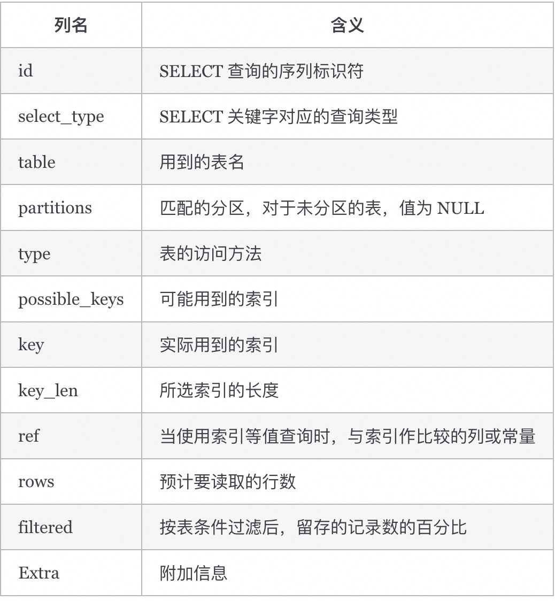

MySQL执行计划分析 及优化 

## MySQL执行计划分析 
如何获取执行计划？MySQL 为我们提供了 EXPLAIN 命令，来获取执行计划的相关信息。需要注意的是，EXPLAIN 语句并不会真的去执行相关的语句，而是通过查询优化器对语句进行分析，找出最优的查询方案，并显示对应的信息。EXPLAIN 执行计划支持 SELECT、DELETE、INSERT、REPLACE 以及 UPDATE 语句。我们一般多用于分析 SELECT 查询语句，使用起来非常简单，语法如下：
```bash
EXPLAIN + SELECT 查询语句；

```


可以看到，执行计划结果中共有 12 列，各列代表的含义总结如下表：



### id
SELECT 标识符，用于标识每个 SELECT 语句的执行顺序。id 如果相同，从上往下依次执行。id 不同，id 值越大，执行优先级越高，如果行引用其他行的并集结果，则该值可以为 NULL。select_type查询的类型，主要用于区分普通查询、联合查询、子查询等复杂的查询，常见的值有：SIMPLE：简单查询，不包含 UNION 或者子查询。PRIMARY：查询中如果包含子查询或其他部分，外层的 SELECT 将被标记为 PRIMARY。SUBQUERY：子查询中的第一个 SELECT。UNION：在 UNION 语句中，UNION 之后出现的 SELECT。DERIVED：在 FROM 中出现的子查询将被标记为 DERIVED。UNION RESULT：UNION 查询的结果。
### table
查询用到的表名，每行都有对应的表名，表名除了正常的表之外，也可能是以下列出的值：<unionM,N> : 本行引用了 id 为 M 和 N 的行的 UNION 结果；<derivedN> : 本行引用了 id 为 N 的表所产生的的派生表结果。派生表有可能产生自 FROM 语句中的子查询。<subqueryN> : 本行引用了 id 为 N 的表所产生的的物化子查询结果。

### type（重要）
查询执行的类型，描述了查询是如何执行的。所有值的顺序`从最优到最差` 排序为：
`system > const > eq_ref > ref > fulltext > ref_or_null > index_merge > unique_subquery > index_subquery > range > index > ALL`

常见的几种类型具体含义如下：
* system：如果表使用的引擎对于表行数统计是精确的（如：MyISAM），且表中只有一行记录的情况下，访问方法是 system ，是 const 的一种特例。
* const：表中最多只有一行匹配的记录，一次查询就可以找到，常用于使用主键或唯一索引的所有字段作为查询条件。
* eq_ref：当连表查询时，前一张表的行在当前这张表中只有一行与之对应。是除了 system 与 const 之外最好的 join 方式，常用于使用主键或唯一索引的所有字段作为连表条件。
* ref：使用普通索引作为查询条件，查询结果可能找到多个符合条件的行。
* index_merge：当查询条件使用了多个索引时，表示开启了 Index Merge 优化，此时执行计划中的 key 列列出了使用到的索引。
* range：对索引列进行范围查询，执行计划中的 key 列表示哪个索引被使用了。
* index：查询遍历了整棵索引树，与 ALL 类似，只不过扫描的是索引，而索引一般在内存中，速度更快。
* ALL：全表扫描。

### possible_keys
possible_keys 列表示 MySQL 执行查询时可能用到的索引。如果这一列为 NULL ，则表示没有可能用到的索引；这种情况下，需要检查 WHERE 语句中所使用的的列，看是否可以通过给这些列中某个或多个添加索引的方法来提高查询性能。

### key（重要）
key 列表示 MySQL 实际使用到的索引。如果为 NULL，则表示未用到索引。
### key_len
key_len 列表示 MySQL 实际使用的索引的最大长度；当使用到联合索引时，有可能是多个列的长度和。在满足需求的前提下越短越好。如果 key 列显示 NULL ，则 key_len 列也显示 NULL 。
### rows
rows 列表示根据表统计信息及选用情况，大致估算出找到所需的记录或所需读取的行数，数值越小越好。

### Extra（重要）
这列包含了 MySQL 解析查询的额外信息，通过这些信息，可以更准确的理解 MySQL 到底是如何执行查询的。常见的值如下：
* Using index：表明查询使用了覆盖索引，不用回表，查询效率非常高。
* Using index condition：表示查询优化器选择使用了索引条件下推这个特性。
* Using where：表明查询使用了 WHERE 子句进行条件过滤。一般在没有使用到索引的时候会出现。
* Using filesort：在排序时使用了外部的索引排序，没有用到表内索引进行排序。
* Using temporary：MySQL 需要创建临时表来存储查询的结果，常见于 ORDER BY 和 GROUP BY。
* Using join buffer (Block Nested Loop)：连表查询的方式，表示当被驱动表的没有使用索引的时候，MySQL 会先将驱动表读出来放到 join buffer 中，再遍历被驱动表与驱动表进行查询。
 
这里提醒下，当 Extra 列包含 Using filesort 或 Using temporary 时，MySQL 的性能可能会存在问题，需要尽可能避免。

## 深度分页介绍及优化建议
https://javaguide.cn/high-performance/deep-pagination-optimization.html#%E6%B7%B1%E5%BA%A6%E5%88%86%E9%A1%B5%E9%97%AE%E9%A2%98%E7%9A%84%E5%8E%9F%E5%9B%A0