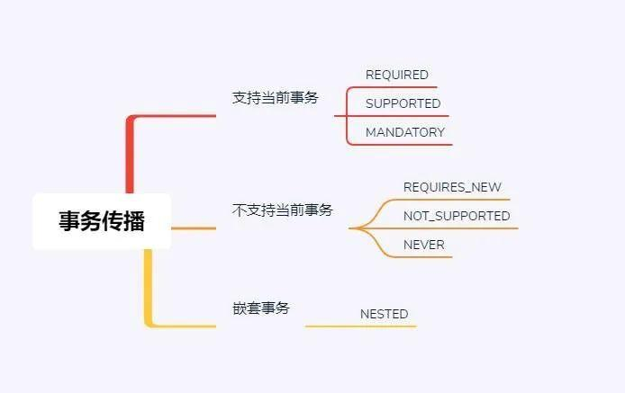

```java
@EnableTransactionManagement 
@Transactional

```
## 注意事项 
1. 事务函数中不要处理耗时任务，会导致长期占有数据库连接。 
2. 事务函数中不要处理无关业务，防止产生异常导致事务回滚。

# Spring事务传播性

## 1. 什么是Spring事务的传播性
Spring 事务传播性是指， 在Spring的环境中，当多个含有事务的方法嵌套调用时，每个事务方法都处于自己事务的上下文中，其提交或者回滚行为应该如何处理。

通俗讲，就是当一个事务方法调用另外一个事务方法时，事务如何跨上下文传播。

## 2. 事务的传播性都有哪些行为
事务的传播行为，主要分为三种类型，分别是：支持当前事务、不支持当前事务、嵌套事务。


### 2.1 支持当前事务
* REQUIRED：默认的事务传播级别，表示如果当前方法已在事务内，该方法就在当前事务中执行，否则，开启一个新的事务并在其上下文中执行。
* SUPPORTED：当前方法在事务内，则在其上下文中执行该方法，否则，开启一个新的事务。
* MANDATORY：必须在事务中执行，否则，将抛出异常。

### 2.2 不支持当前事务
* REQUIRES_NEW：无论当前是否有事务上下文，都会开启一个事务 。如果已经有一个事务在执行 ，则正在执行的事务将被挂起 ，新开启的事务会被执行。
事务之间相互独立，互不干扰。
* NOT_SUPPORTED：不支持事务，如果当前存在事务上下文，则挂起当前事务，然后以非事务的方式执行。
* NEVER：不能在事务中执行，如果当前存在事务上下文，则抛出异常。

### 2.3 嵌套事务
* NESTED：嵌套事务，如果当前已存在一个事务的上下文中，则在嵌套事务中执行，如果抛异常，则回滚嵌套事务，而不影响其他事务的操作。
  
https://blog.csdn.net/bbb36921/article/details/145954222
Spring 七种事务传播性介绍 https://zhuanlan.zhihu.com/p/675986743