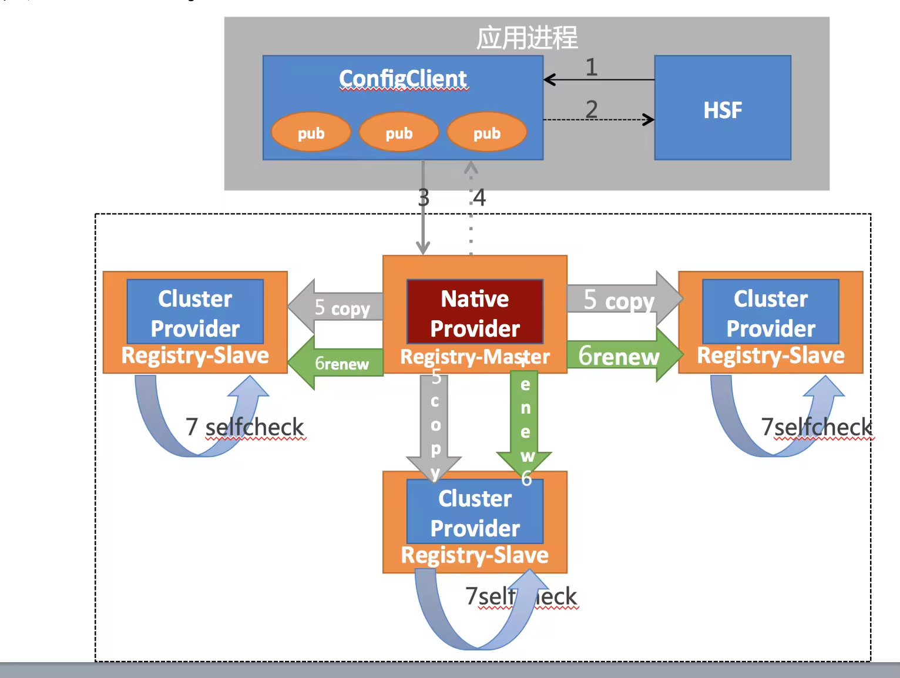
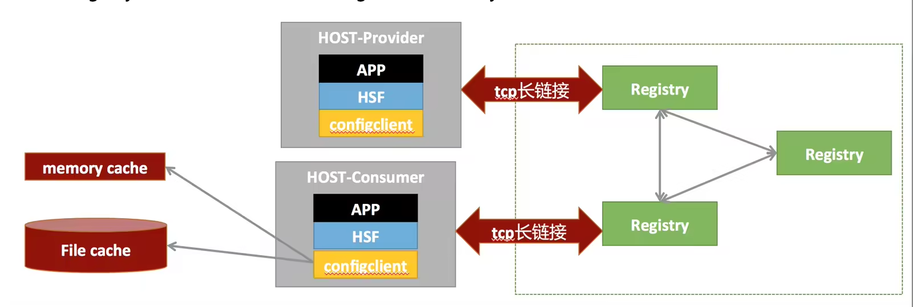
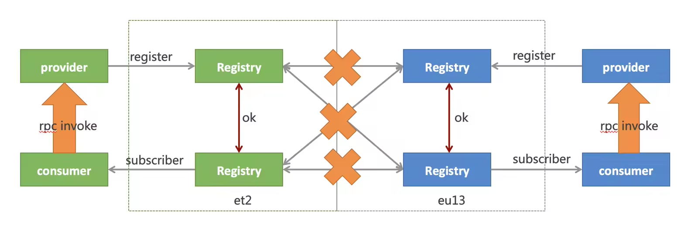

# ConfigServer
* 目前支持java，cpp，nodejs
• sdk同Regsitry间自定义通信协议，长链接
• sdk上报心跳，双向可用性检测（健康检查）
• 服务变更主动push给sdk
• ConfigServer集群不依赖DB，没有file cache

## ConfigServer如何处理 CAP 问题 

### ConfigServer的一致性(Consistency)协议：Master/Master
ConfigServer不依赖于DB，自己实现了一致性协议；这个协议的特点是：异步复制+renew+self check
* HSF在应用端向ConfigClient注册pub（1到2步）
* ConfigClient随机注册到一个master registry（3到4步）
  * master宕机，自动重注册到集群中另外可用的Registry
  * master接收注册，即可返回
* master异步复制pub给其他所有的slave（5步）
* master：renew（第6步）
  * master定期向slave发送renew报文
  * slave的pub的alive time被刷新
  * 可以发现slave上缺失的pub（如：扩容）
* slave：self check（第7步）
  * slave周期性自检本地所有的cluster provider
  * alive time超期则自动删除

### ConfigServer可用性(Available)：客户端多级缓存（cache）
configclient在memory和file中各缓存一份服务地址
* Registry的服务地址push给configclient时，先写file，再更新memory，运行时以memory为主
* Consumer重启的时候，根据file cache来初始化memory，Registry随后推送最新的数据给configclient
* 如果Registry集群重启/宕机的时候，configclient中memory的服务数据保持不变，持续可用

### ConfigServer容灾(Partition)：网络分区（Partition）
正常情况下，registry部署在et2和eu13机房，两两互写达到多副本数据的一致性
* 当et2和eu13出现partition时，eu2和eu13断裂成小集群，self check会清除另一个机房的cluster provider
* et2和eu13机房内部的rpc调用不受影响
* Partition期间，ConfigServer集群一样可以读写，可用性不受影响
* 网络恢复后，自动愈合

