## Seata基本架构
* TC (Transaction Coordinator) - 事务协调者；维护全局和分支事务的状态，驱动全局事务提交或回滚。
* TM (Transaction Manager) - 事务管理器；定义全局事务的范围：开始全局事务、提交或回滚全局事务。
* RM (Resource Manager) - 资源管理器；管理分支事务处理的资源，与TC交谈以注册分支事务和报告分支事务的状态，并驱动分支事务提交或回滚。

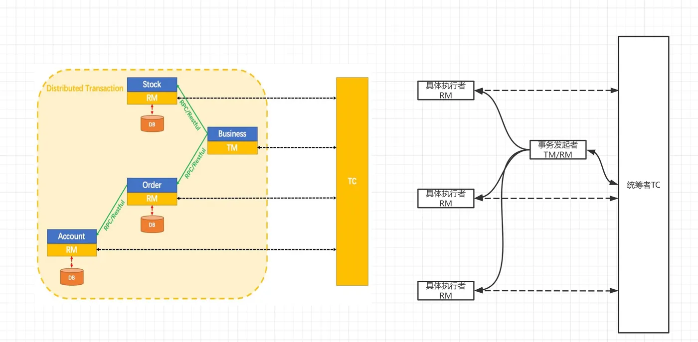

### 分布式事务解决方案
Seata提供了四种不同的分布式事务解决方案：
* XA模式：强一致性分阶段事务模式，牺牲了一定的可用性，无业务侵入。
* TCC模式：最终一致的分阶段事务模式，有业务侵入。
* AT模式：最终一致的分阶段事务模式，无业务侵入，也是Seata的默认模式。
* SAGA模式：长事务模式，有业务侵入。

## 1. Seata-AT模式
基本概念：AT模式是一种无侵入的分布式事务解决方案，在AT模式下，用户只需要关注自己的“业务SQL”,用户的“业务SQL”作为一阶段，Seata框架会自动的生成事务的二阶段提交和回滚。

两阶段提交协议的演变：
* 一阶段：业务数据和回滚日志在同一个本地事务中提交，释放本地锁和连接资源。
* 二阶段：提交异步化，非常快速的完成；回滚通过一阶段的回滚日志进行反向补偿。

两阶段具体操作：
* 一阶段：在一阶段中，Seata会拦截“业务SQL”,首先解析SQL的语义，找到要更新的业务数据，在数据更新前，保存下来“undo”,然后执行“业务SQL”更新数据，更新之后再次保存数据“redo”,最后生成行锁，这些操作都在本地数据库事务内完成，这样保证了一阶段的原子性。

* 二阶段：相对一阶段，二阶段比较简单，负责整体的回滚和提交，如果之前的一阶段中有本地事务没有通过，那么就执行全局回滚，否则执行全局提交，回滚用到的就是一阶段记录的“undo Log”，通过回滚记录生成反向更新SQL并执行，以完成分支的回滚。当然事务完成后会释放所有资源和删除所有的日志。

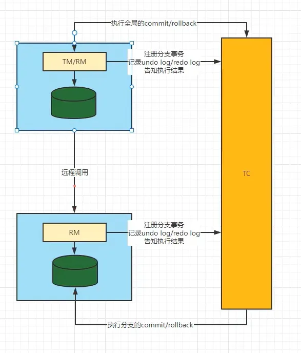

## Seata-XA 模式（XA方案）

### 什么是XA
* XA规范是 X/Open 组织定义的分布式事务处理（DTP，Distributed Transaction Processing）标准。
* XA 规范描述了全局的事务管理器与局部的资源管理器之间的接口。 XA规范的目的是允许的多个资源（如数据库，应用服务器，消息队列等）在同一事务中访问，这样可以使 ACID 属性跨越应用程序而保持有效。
* XA 规范使用两阶段提交（2PC，Two-Phase Commit）来保证所有资源同时提交或回滚任何特定的事务。
* XA 规范 在上世纪 90 年代初就被提出。目前，几乎所有主流的数据库都对 XA 规范 提供了支持。

#### DTP模型定义如下角色：
* AP：即应用程序，可以理解为使用DTP分布式事务的程序
* RM：资源管理器，可以理解为事务的参与者，一般情况下是指一个数据库的实例（MySql），通过资源管理器对该数据库进行控制，资源管理器控制着分支事务
* TM：事务管理器，负责协调和管理事务，事务管理器控制着全局事务，管理实务生命周期，并协调各个RM。全局事务是指分布式事务处理环境中，需要操作多个数据库共同完成一个工作，这个工作即是一个全局事务。
* DTP模式定义TM和RM之间通讯的接口规范叫XA，简单理解为数据库提供的2PC接口协议，`基于数据库的XA协议来实现的2PC又称为XA方案`。

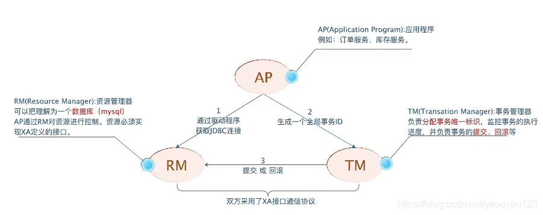

#### 案例解释：
* 应用程序（AP）持有订单库和商品库两个数据源。
* 应用程序（AP）通过TM通知订单库（RM）和商品库（RM），来创建订单和减库存，RM此时未提交事务，此时商品和订单资源锁定。
* TM收到执行回复，只要有一方失败则分别向其他RM发送回滚事务，回滚完毕，资源锁释放。
* TM收到执行回复，全部成功，此时向所有的RM发起提交事务，提交完毕，资源锁释放。

#### XA协议的痛点
* 如果一个参与全局事务的资源 “失联” 了（收不到分支事务结束的命令），那么它锁定的数据，将一直被锁定。进而，甚至可能因此产生死锁。

这是 XA 协议的核心痛点，也是 Seata 引入 XA 模式要重点解决的问题。

### Seata-XA事务模式
在 Seata 定义的分布式事务框架内，利用事务资源（数据库、消息服务等）对 XA 协议的支持，以 XA 协议的机制来管理分支事务的一种事务模式。
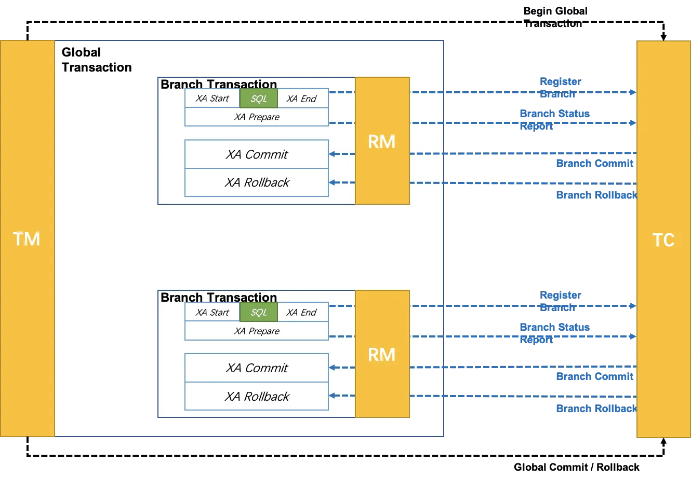

* 执行阶段：
  * 可回滚：业务 SQL 操作放在 XA 分支中进行，由资源对 XA 协议的支持来保证 可回滚
  * 持久化：XA 分支完成后，执行 XA prepare，同样，由资源对 XA 协议的支持来保证 持久化（即，之后任何意外都不会造成无法回滚的情况）

* 完成阶段：
  * 分支提交：执行 XA 分支的 commit
  * 分支回滚：执行 XA 分支的 rollback

#### 为什么要在Seata中支持XA
为什么要在 Seata 中增加 XA 模式呢？支持 XA 的意义在哪里呢？

本质上，Seata 已经支持的 3 大事务模式：AT、TCC、Saga 都是补偿型 的。

补偿型事务处理机制构建在事务资源之上（要么在中间件层面，要么在应用层面），事务资源 本身对分布式事务是无感知的。

事务资源对分布式事务的无感知存在一个根本性的问题：无法做到真正的全局一致性 。

比如，一条库存记录，处在 补偿型 事务处理过程中，由 100 扣减为 50。此时，仓库管理员连接数据库，查询统计库存，就看到当前的 50。之后，事务因为异外回滚，库存会被补偿回滚为 100。显然，仓库管理员查询统计到的 50 就是 脏 数据。所以补偿型事务是存在中间状态的（中途可能读到脏数据）。

#### XA的价值
与 补偿型 不同，XA 协议 要求 事务资源 本身提供对规范和协议的支持。

因为 事务资源 感知并参与分布式事务处理过程，所以 事务资源（如数据库）可以保障从任意视角对数据的访问有效隔离，满足全局数据一致性。

比如，刚才提到的库存更新场景，XA 事务处理过程中，中间状态数据库存 50 由数据库本身保证，是不会仓库管理员的查询统计看到的。(Mysql是通过MVCC机会实现的)

除了 全局一致性 这个根本性的价值外，支持 XA 还有如下几个方面的好处：
1. 业务无侵入：和 AT 一样，XA 模式将是业务无侵入的，不给应用设计和开发带来额外负担。
2. 数据库的支持广泛：XA 协议被主流关系型数据库广泛支持，不需要额外的适配即可使用。
3. 多语言支持容易：因为不涉及 SQL 解析，XA 模式对 Seata 的 RM 的要求比较少。
4. 传统基于 XA 应用的迁移：传统的，基于 XA 协议的应用，迁移到 Seata 平台，使用 XA 模式将更平滑。

## Seata-TCC事务模式

### 什么是TCC
TCC 是分布式事务中的二阶段提交协议，它的全称为 Try-Confirm-Cancel，即资源预留（Try）、确认操作（Confirm）、取消操作（Cancel），他们的具体含义如下：

* Try：对业务资源的检查并预留。
* Confirm：对业务处理进行提交，即 commit 操作，只要 Try 成功，那么该步骤一定成功。
* Cancel：对业务处理进行取消，即回滚操作，该步骤回对 Try 预留的资源进行释放。

缺点： TCC 是一种`侵入式`的分布式事务解决方案，以上三个操作都需要业务系统自行实现，对业务系统有着非常大的入侵性，设计相对复杂。

优点： 是 TCC 完全不依赖数据库，能够实现跨数据库、跨应用资源管理，对这些不同数据访问通过侵入式的编码方式实现一个原子操作，更好地解决了在各种复杂业务场景下的分布式事务问题。
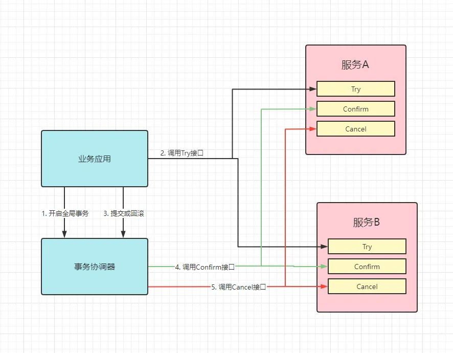

### Seata的TCC模式
Seata TCC 模式跟通用型 TCC 模式原理一致。

#### TCC和AT区别

1. AT 模式基于支持本地 ACID 事务的关系型数据库：
* 一阶段 prepare 行为：在本地事务中，一并提交业务数据更新和相应回滚日志记录。
* 二阶段 commit 行为：马上成功结束，自动异步批量清理回滚日志。
* 二阶段 rollback 行为：通过回滚日志，自动生成补偿操作，完成数据回滚。

2. 相应的，TCC 模式，不依赖于底层数据资源的事务支持：
* 一阶段 prepare 行为：调用`自定义`的prepare 逻辑。
* 二阶段 commit 行为：调用`自定义`的commit 逻辑。
* 二阶段 rollback 行为：调用`自定义`的 rollback 逻辑。

所谓 TCC 模式，是指支持把 自定义 的分支事务纳入到全局事务的管理中。

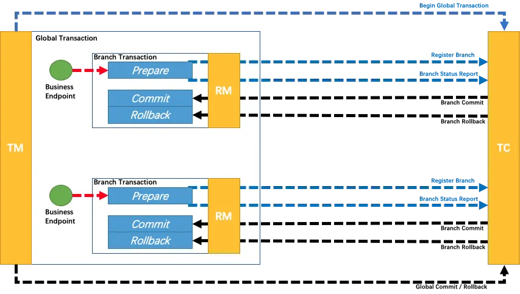

特点
* 侵入性比较强，并且需要自己实现相关事务控制逻辑。
* 在整个过程基本没有锁，性能较强。

详细讲解
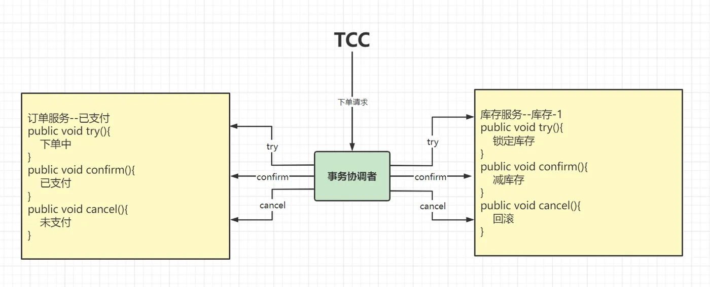

## Seata-Saga事务模式

### 基本概念
Saga模式是SEATA提供的长事务解决方案，在Saga模式中，业务流程中每个参与者都提交本地事务，当出现某一个参与者失败则补偿前面已经成功的参与者，一阶段正向服务和二阶段补偿服务（执行处理时候出错了，给一个修复的机会）都由业务开发实现。

Saga 模式下分布式事务通常是由事件驱动的，各个参与者之间是异步执行的，Saga 模式是一种长事务解决方案。

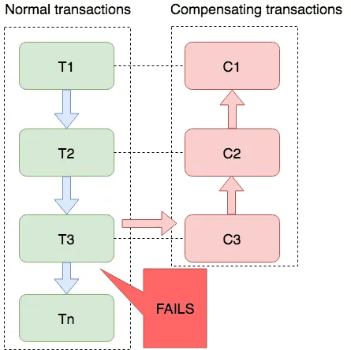

### 为什么需要Saga
之前我们学习的Seata分布式三种操作模型中所使用的的微服务全部可以根据开发者的需求进行修改，但是在一些特殊环境下，比如老系统，封闭的系统（无法修改，同时没有任何分布式事务引入），那么AT、XA、TCC模型将全部不能使用，为了解决这样的问题，才引用了Saga模型。

比如：事务参与者可能是其他公司的服务或者是遗留系统，无法改造，可以使用Saga模式。

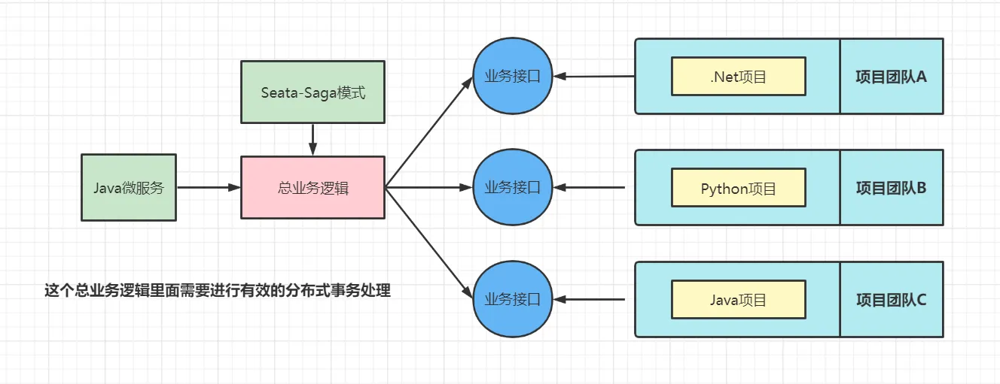

Saga模式是Seata提供的长事务解决方案，提供了异构系统的事务统一处理模型。

在Saga模式中，所有的子业务都不在直接参与整体事务的处理（只负责本地事务的处理），而是全部交由了最终调用端来负责实现，而在进行总业务逻辑处理时，在某一个子业务出现问题时，则自动补偿全面已经成功的其他参与者，这样一阶段的正向服务调用和二阶段的服务补偿处理全部由总业务开发实现。

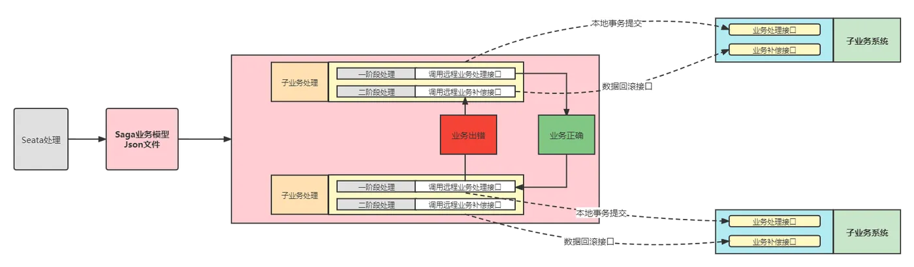

### Saga状态机
目前Seata提供的Saga模式只能通过状态机引擎来实现，需要开发者手工的进行Saga业务流程绘制，并且将其转换为Json配置文件，而后在程序运行时，将依据子配置文件实现业务处理以及服务补偿处理，而要想进行Saga状态图的绘制，一般需要通过Saga状态机来实现。

基本原理：
* 通过状态图来定义服务调用的流程并生成json定义文件。
* 状态图中一个节点可以调用一个服务，节点可以配置它的补偿节点。
* 状态图 json 由状态机引擎驱动执行，当出现异常时状态引擎反向执行已成功节点对应的补偿节点将事务回滚。
* 可以实现服务编排需求，支持单项选择、并发、子流程、参数转换、参数映射、服务执行状态判断、异常捕获等功能。

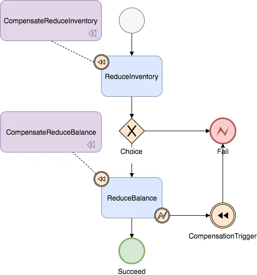

#### Saga状态机设计器
Seata Saga 提供了一个可视化的状态机设计器方便用户使用，代码和运行指南请参考：
https://github.com/seata/seata/tree/develop/saga/seata-saga-statemachine-designer

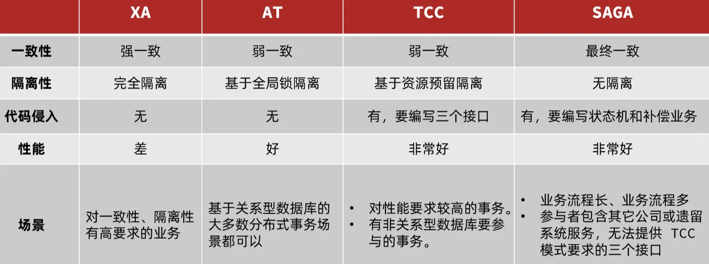

## 4种模式对比
* AT模式，是我们常用的处理模式，也是使用最多的一种。
* XA和AT，是无侵入式的，二者间的切换只需要更改数据源的代理对象即可。
* TCC需要我们手动、自定义，try、Confirm、Cancel。
* Saga是针对老项目，不可更改的项目，通过外部的形式解决调用的时候出现的分布式问题，通过Saga中的状态机进行总业务逻辑的设计。

seata  https://developer.aliyun.com/article/1460045