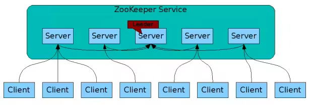
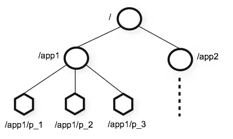
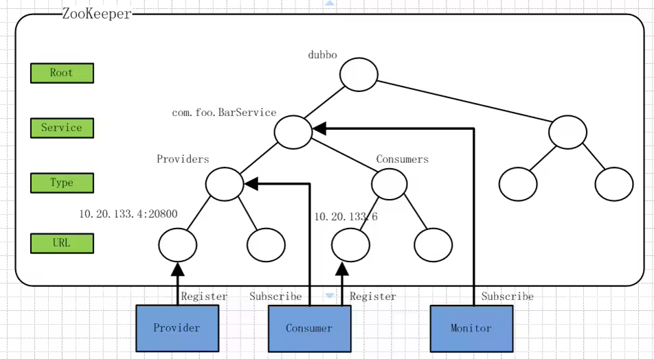

# 简介 
Zookeeper 是一个分布式的服务框架，主要用来解决分布式集群中应用系统的协调和一致性问题，它能提供基于类似于文件系统的目录节点树方式的数据存储，但是 Zookeeper 并不是用来专门存储数据的，它的作用主要是用来维护和监控你存储的数据的状态变化。如：统一命名服务、状态同步服务、集群管理、分布式应用配置管理等。

ookeeper集群是由一组Server节点组成，这一组Server节点中存在一个角色为Leader的节点，其他节点都为Follower。
客户端可以和集群中的任一Server建立连接，当读请求时，所有Server都可以直接返回结果；
当请求为数据变更请求时，Follower会将请求转发给Leader节点，Leader节点接收到数据变更请求后，首先会将变更写入本地磁盘以作恢复，当持久化完毕后才会将变更写入内存，并将变更后的数据同步到各个Follower。

Zookeeper中一共有以下角色：
* Leader，负责进行投票的发起和决议，更新状态和数据
* Follower，用于接收客户端请求并向客户端返回结果，在选择Leader时会进行投票
* Observer，一种功能和Follower相同，但是它不参与投票过程。它主要是为了扩展系统，提高读取速度
* Client，客户端用来发起请求，严格说不属于Zookeeper集群

## zookeeper 核心概念

### 核心数据结构

树中的每个节点称为ZNode，简单的说它包含一个路径和与之相关的元数据，以及它的孩子节点。比较类似树形的文件系统，但Zookeeper的数据保存在内存中，所以拥有分布式同步服务的高吞吐和低延迟的特点。
Zookeeper主要通过对树形数据结构ZNode节点的监听和变更来完成不同分布式环境中各个进程的协调和同步。

1. 节点ZNode存储同步、协调相关的数据，数据量比较小，比如状态信息、配置内容、位置信息等。
2. ZNode中存有状态信息，包括版本号、ACL变更、时间戳等, 每次变更版本号都会递增。这样一方面可以基于版本号检索状态；另一方面可以实现分布式的乐观锁。
3. ZNode都有ACL，可以限制ZNode的访问权限
4. ZNode上数据的读写都是原子的
5. 客户端可以在ZNode上设置Watcher监听，一但该ZNode有数据变更，就会通知客户端，触发回调方法。【这个地方需要注意，Watcher都是一次性，触发一次后就失效，持续监听需要重新注册】
6. 客户端和Zookeeper连接建立后就是一次session，Zookeeper支持临时节点，它和一次session关联，一但session关闭，节点就被删除。【可以用临时节点来实现连通性的检测】

### 监听器Watcher
Watcher是ZK中很重要的特性，ZK允许用户在指定节点上注册一些Watcher，在该节点相关特定事件（比如节点添加、删除、子节点变更等）发生时Watcher会监听到，ZK服务端会将事件通知到感兴趣的客户端上去，该机制是ZK实现分布式协调服务的重要特性。

通知的时候服务端只会告诉客户端一个简单的事件（通知状态、事件类型、节点路径）而不包含具体的变化信息（如原始数据及变更后的数据），客户端如要具体信息再次主动去重新获取数据；
此外，无论是服务端还是客户端，只要Watcher被触发ZK就会将其删除，因此在Watcher的使用上需要反复注册，这样轻量的设计有效减轻了服务端压力。
如果Watcher一直有效，节点更新频繁时服务端会不断向客户端发送通知，对网络及服务端性能影响会非常大。

## 工作机制
Zookeeper的核心是Zab（Zookeeper Atomic Broadcast）协议。Zab协议有两种模式，它们分别是恢复模式和广播模式。

### 恢复模式
当Zookeeper集群启动或Leader崩溃时，就进入到该模式。该模式需要选举出新的Leader，选举算法基于paxos或fastpaxos【先mark一下，具体需要去看一下论文】：
1. 每个Server启动以后都会询问其它的Server投票给谁
2. 对于其他Server的询问，Server每次根据自己的状态回复自己推荐Leader的id和该Server最后处理事务的zxid【zookeeper中的每次变更（事务）都会被赋予一个顺序递增的zxid，zxid越大说明变更越新】【Server刚启动时都会选择自己】
3. 收到Server的回复后，就计算出zxid最大的那个Server，将该Server的信息设置成下次要投票的Server【如果zxid同样大，就选择Server id大的】
4. 计算获得票数最多的Server，如果该Server的得票数超过半数，则该Server当选Leader，否则继续投票直到Leader选举出来。
   
假设Zookeeper集群有5台机器，ServerId分别为1,2,3,4,5，启动顺序按照1,2,3,4,5依次启动：
1. Server 1启动，此时它选择自己为leader，同时向外发出投票报文，但收不到任何回复，选票不过半，启动机器数不超过集群的一半【不能正常工作】
2. Server2启动，此时由于没有历史数据，Server1和Server2会选择ServerId较大的2位leader，但选票不超过一半，启动的机器数不超过集群的一半【不能正常工作】
3. Server3启动，此时情况与b)类似，Server3会被选为Leader，但不同的是此时得票过半，并且启动的机器数超过集群的一半，所以集群可以正常工作，Server3被选为Leader
4. Server4启动，由于此时Server3已经被选为Leader，所以Server4只能作为Follower
5. Server5启动，与d)同理，Server5也只能作为Follower
Leader崩溃恢复时，类似不同的是，有了数据主要依据zxid的大小进行选举。

### 广播模式
Leader选举完毕后，Leader需要与Follower进行数据同步：
1. leader会开始等待server连接
2. Follower连接leader，将最大的zxid发送给leader 
3. Leader根据follower的zxid确定同步点 
4. 完成同步后通知follower 已经成为uptodate状态 
5. Follower收到uptodate消息后，就可以重新接受client的请求进行服务了。

## 应用场景
### 数据发布/订阅（以Dubbo注册中心为例）

* /dubbo: 这是Dubbo在ZK上创建的根节点。
* /dubbo/com.foo.BarService: 这是服务节点，代表了Dubbo的一个服务。
* /dubbo/com.foo.BarService/Providers: 这是服务提供者的根节点，其子节点代表了每个服务的真正提供者。
* /dubbo/com.foo.BarService/Consumers: 这是服务消费者的根节点，其子节点代表了没一个服务的真正消费者

#### Dubbo基于ZK实现注册中心的工作流程：

1. 服务提供者：
在初始化启动的时候首先在/dubbo/com.foo.BarService/Providers节点下创建一个子节点，同时写入自己的url地址，代表这个服务的一个提供者。

2. 服务消费者：
在启动的时候读取并订阅ZooKeeper上/dubbo/com.foo.BarService/Providersz节点下的所有子节点，并解析所有提供者的url地址类作为该服务的地址列表，开始发起正常调用。
同时在Consumers节点下创建一个临时节点，写入自己的url地址，代表自己是BarService的一个消费者

3. 监控中心：
监控中心是Dubbo服务治理体系的重要一部分，它需要知道一个服务的所有提供者和订阅者及变化情况。
监控中心在启动的时候会通过ZK的/dubbo/com.foo.BarService节点来获取所有提供者和消费者的url地址，并`注册Watcher`来监听其子节点变化情况。

所有服务提供者在ZK上创建的节点都是临时节点，利用的是临时节点的生命周期和客户端会话绑定的特性，一旦提供者机器挂掉无法对外提供服务时该临时节点就会从ZK上摘除，这样服务消费者和监控中心都能感知到服务提供者的变化。

### 分布式锁
> Zookeeper可以实现分布式锁，排他锁的核心是如何保证当前有且只有一个事务获得锁，并且锁被释放后所有等待获取锁的事务能够被通知到。
1. 获得分布式锁
比如创建一个ZNode节点表示锁，当一个客户端去拿锁时，会在这个节点下创建一个自增的子节点，然后通过getChildren()方式来检查自己创建的子节点是不是最靠前的，如果是则拿到锁;否则就调用exist()来检查第二靠前的子节点，并加上watch来监视。
2. 释放锁
   * 当获取锁的客户端挂掉，ZK上的该节点会被删除
   * 正常执行完业务逻辑之后客户端会主动将自己创建的临时节点删除。

无论在什么情况下删除了lock临时节点，这时watch机制会通知到所有没有拿到锁的客户端，这些客户端就会重复上述的过程来检查是否能够拿到锁。

### 分布式队列
可以使用一个ZNode来表示队列，然后用它的子节点来表示队列中的节点。
1. Zookeeper的create方法有顺序递增的模式，会自动地在name后面加上一个递增的数字来插入新元素。
2. offer的时候使用create方法，take的时候按照子节点的顺序删除第一个即可。

### 分布式Barrier（分布式屏障）
在大规模分布式并行计算的场景下，最终的合并计算需要基于很多并行计算的子结果来进行，即系统需要满足特定的条件，一个队列的元素必须都聚齐之后才能进行后续处理，否则一直等待。看下如何用ZK来支持这种场景。

开始时/queue_barrier是一个存在的节点，数据内容赋值为一个数字n来代表满足条件的机器总数，例如n=10表示只有当/queue_barrier节点下的子节点数量达到10后才会打开屏障继续处理。
然后所有的客户端都会到/queue_barrier节点下创建一个临时节点，如/queue_barrier/192.168.0.1。
创建完节点之后根据以下步骤来确定执行顺序：
1. 调用获取节点数据的api获取/queue_barrier节点的内容：10
2. 调用获取子节点总数的api获取/queue_barrier下的所有子节点，并且注册对子节点变更的Watcher监听 
3. 统计子节点个数 
4. 如果子节点个数小于10则继续等待，否则打开屏障继续处理 
5. 接收到Watcher通知后，重复步骤2

### ZK在其它大型分布式系统中的应用简介

1. 在Hadoop中ZooKeeper主要用于实现HA做主备切换（类似上面讲的Master选举），同时在YARN中又特别提供了ZK来存储应用的运行状态。
2. Kafaka是由LinkedIn开源的分布式消息系统，是一个吞吐量极高的分布式消息系统，主要用于实现低延迟的发送和收集大量的事件和日志等活跃数据。
Kafaka使用ZK作为其分布式协调框架，将消息生产、消息存储和消息消费的过程结合起来，保持包括生产者消费者和Broker在内的所有组件无状态的情况下，建立起生产者和消费者之间的订阅关系，并实现生产者和消费者之间的负载均衡。
3. HBase全称Hadoop DataBase，是一个基于Hadoop文件系统设计、面向海量数据的高可靠性、高性能、面向列、可伸缩的分布式存储系统。
在HBase向在线分布式存储方向发展过程中，开发者发现如果有RegionServer服务器挂掉时系统和客户端都无法及时得知信息，服务难以快速迁移到其它RegionServer服务器上，问题原因是缺少相应的分布式协调组件，于是后来ZooKeeper被加入到HBase的技术体系中。
目前ZooKeeper已经成为HBase的核心组件，应用场景包括系统容错、RootRegion管理、Region状态管理、分布式SplitLog任务管理和Replication管理，除此之外还包括HMaster选举、Table的enable/disable状态记录及几乎所有元数据的存储等

选举算法 https://www.cnblogs.com/gaogaoyanjiu/p/9991492.html