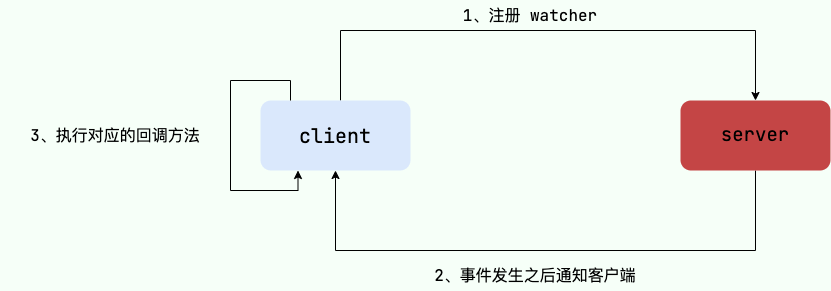
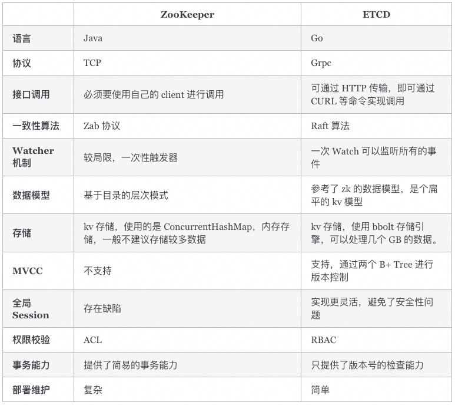

# 简介 
Zookeeper 是一个分布式的服务框架，主要用来解决分布式集群中应用系统的协调和一致性问题，它能提供基于类似于文件系统的目录节点树方式的数据存储，
`但是 Zookeeper 并不是用来专门存储数据的，它的作用主要是用来维护和监控你存储的数据的状态变化。
如：统一命名服务、状态同步服务、集群管理、分布式应用配置管理等。`

zookeeper集群是由一组Server节点组成，这一组Server节点中存在一个角色为Leader的节点，其他节点都为Follower。
客户端可以和集群中的任一Server建立连接，当读请求时，所有Server都可以直接返回结果；
当请求为数据变更请求时，Follower会将请求转发给Leader节点，Leader节点接收到数据变更请求后，首先会将变更写入本地磁盘以作恢复，当持久化完毕后才会将变更写入内存，并将变更后的数据同步到各个Follower。

Zookeeper中一共有以下角色：
* Leader: 负责进行投票的发起和决议，更新状态和数据
* Follower: 用于接收客户端请求并向客户端返回结果，只能提供读服务;在选择Leader时会进行投票
* Observer: 一种功能和Follower相同,只提供读服务但是它不参与投票过程;它主要是为了扩展系统，提高读取速度

### ZooKeeper 特点
1. 顺序一致性： 从同一客户端发起的事务请求，最终将会严格地按照顺序被应用到 ZooKeeper 中去。
2. 原子性： 所有事务请求的处理结果在整个集群中所有机器上的应用情况是一致的，也就是说，要么整个集群中所有的机器都成功应用了某一个事务，要么都没有应用。
3. 单一系统映像： 无论客户端连到哪一个 ZooKeeper 服务器上，其看到的服务端数据模型都是一致的。
4. 可靠性： 一旦一次更改请求被应用，更改的结果就会被持久化，直到被下一次更改覆盖。
5. 实时性： 一旦数据发生变更，其他节点会实时感知到。每个客户端的系统视图都是最新的。
6. 集群部署：3~5 台（最好奇数台）机器就可以组成一个集群，每台机器都在内存保存了 ZooKeeper 的全部数据，机器之间互相通信同步数据，客户端连接任何一台机器都可以。
7. 高可用：如果某台机器宕机，会保证数据不丢失。集群中挂掉不超过一半的机器，都能保证集群可用。比如 3 台机器可以挂 1 台，5 台机器可以挂 2 台。

## 工作机制
ZAB（ZooKeeper Atomic Broadcast，原子广播） 协议是为分布式协调服务 ZooKeeper 专门设计的一种支持崩溃恢复的原子广播协议。
在 ZooKeeper 中，主要依赖 ZAB 协议来实现分布式数据一致性，基于该协议，ZooKeeper 实现了一种主备模式的系统架构来保持集群中各个副本之间的数据一致性。

Zab协议有两种模式，它们分别是恢复模式和广播模式。

### 恢复模式
当Zookeeper集群启动或Leader崩溃时，就进入到该模式。该模式需要选举出新的Leader，选举算法基于paxos或fastpaxos【先mark一下，具体需要去看一下论文】：
1. 每个Server启动以后都会询问其它的Server投票给谁
2. 对于其他Server的询问，Server每次根据自己的状态回复自己推荐Leader的id和该Server最后处理事务的zxid【zookeeper中的每次变更（事务）都会被赋予一个顺序递增的zxid，zxid越大说明变更越新】【Server刚启动时都会选择自己】
3. 收到Server的回复后，就计算出zxid最大的那个Server，将该Server的信息设置成下次要投票的Server【如果zxid同样大，就选择Server id大的】
4. 计算获得票数最多的Server，如果该Server的得票数超过半数，则该Server当选Leader，否则继续投票直到Leader选举出来。

假设Zookeeper集群有5台机器，ServerId分别为1,2,3,4,5，启动顺序按照1,2,3,4,5依次启动：
1. Server 1启动，此时它选择自己为leader，同时向外发出投票报文，但收不到任何回复，选票不过半，启动机器数不超过集群的一半【不能正常工作】
2. Server2启动，此时由于没有历史数据，Server1和Server2会选择ServerId较大的2位leader，但选票不超过一半，启动的机器数不超过集群的一半【不能正常工作】
3. Server3启动，此时情况与2类似，Server3会被选为Leader，但不同的是此时得票过半，并且启动的机器数超过集群的一半，所以集群可以正常工作，Server3被选为Leader
4. Server4启动，由于此时Server3已经被选为Leader，所以Server4只能作为Follower
5. Server5启动，与4同理，Server5也只能作为Follower

Leader崩溃恢复时，类似不同的是，有了数据主要依据zxid的大小进行选举。

### 广播模式
Leader选举完毕后，Leader需要与Follower进行数据同步：
1. leader会开始等待server连接
2. Follower连接leader，将最大的zxid发送给leader
3. Leader根据follower的zxid确定同步点
4. 完成同步后通知follower 已经成为uptodate状态
5. Follower收到uptodate消息后，就可以重新接受client的请求进行服务了。

### 什么是zookeeper 脑裂及如何解决？

#### 什么是脑裂（Split-Brain）？

在分布式系统中，当网络分区（Network Partition）导致集群分裂为多个独立子集群时，若每个子集群都认为自己是唯一活跃的群体并选举出独立的 Leader，就会发生脑裂。这会导致数据不一致、服务冲突等问题。

#### Zookeeper 如何防止脑裂？ 
* 多数派原则（Quorum）

集群需要 N/2 + 1 个节点（多数派）达成一致才能选举 Leader 或提交事务。
例如：3 节点集群需要至少 2 个节点在线；5 节点需要 3 个。

* ZAB 协议（Zookeeper Atomic Broadcast）
  * Leader 选举：只有获得多数派支持的节点才能成为 Leader。
  * 事务提交：所有写操作需由 Leader 广播，并经多数派节点确认后才生效。
  * 崩溃恢复：Leader 失效后，剩余节点重新选举，确保新 Leader 拥有最新数据。

* Fencing 机制
旧 Leader 若因网络隔离被降级，会被禁止写入，避免数据冲突。

## zookeeper 核心概念

### 核心数据结构

树中的每个节点称为ZNode，简单的说它包含一个路径和与之相关的元数据，以及它的孩子节点。比较类似树形的文件系统，但Zookeeper的数据保存在内存中，所以拥有分布式同步服务的高吞吐和低延迟的特点。
Zookeeper主要通过对树形数据结构ZNode节点的监听和变更来完成不同分布式环境中各个进程的协调和同步。

1. 节点ZNode存储同步、协调相关的数据，数据量比较小，比如状态信息、配置内容、位置信息等。
2. ZNode中存有状态信息，包括版本号、ACL变更、时间戳等, 每次变更版本号都会递增。这样一方面可以基于版本号检索状态；另一方面可以实现分布式的乐观锁。
3. ZNode都有ACL，可以限制ZNode的访问权限
4. ZNode上数据的读写都是原子的
5. 客户端可以在ZNode上设置Watcher监听，一但该ZNode有数据变更，就会通知客户端，触发回调方法。【这个地方需要注意，Watcher都是一次性，触发一次后就失效，持续监听需要重新注册】
6. 客户端和Zookeeper连接建立后就是一次session，Zookeeper支持临时节点，它和一次session关联，一但session关闭，节点就被删除。【可以用临时节点来实现连通性的检测】

### 监听器Watcher
Watcher是ZK中很重要的特性，ZK允许用户在指定节点上注册一些Watcher，在该节点相关特定事件（比如节点添加、删除、子节点变更等）发生时Watcher会监听到，ZK服务端会将事件通知到感兴趣的客户端上去，该机制是ZK实现分布式协调服务的重要特性。

通知的时候服务端只会告诉客户端一个简单的事件（通知状态、事件类型、节点路径）而不包含具体的变化信息（如原始数据及变更后的数据），客户端如要具体信息再次主动去重新获取数据；
此外，无论是服务端还是客户端，只要Watcher被触发ZK就会将其删除，因此在Watcher的使用上需要反复注册，这样轻量的设计有效减轻了服务端压力。
如果Watcher一直有效，节点更新频繁时服务端会不断向客户端发送通知，对网络及服务端性能影响会非常大。

## 应用场景
### 数据发布/订阅（以Dubbo注册中心为例）

* /dubbo: 这是Dubbo在ZK上创建的根节点。
* /dubbo/com.foo.BarService: 这是服务节点，代表了Dubbo的一个服务。
* /dubbo/com.foo.BarService/Providers: 这是服务提供者的根节点，其子节点代表了每个服务的真正提供者。
* /dubbo/com.foo.BarService/Consumers: 这是服务消费者的根节点，其子节点代表了没一个服务的真正消费者

#### Dubbo基于ZK实现注册中心的工作流程：

1. 服务提供者：
在初始化启动的时候首先在/dubbo/com.foo.BarService/Providers节点下创建一个子节点，同时写入自己的url地址，代表这个服务的一个提供者。

2. 服务消费者：
在启动的时候读取并订阅ZooKeeper上/dubbo/com.foo.BarService/Providersz节点下的所有子节点，并解析所有提供者的url地址类作为该服务的地址列表，开始发起正常调用。
同时在Consumers节点下创建一个临时节点，写入自己的url地址，代表自己是BarService的一个消费者

3. 监控中心：
监控中心是Dubbo服务治理体系的重要一部分，它需要知道一个服务的所有提供者和订阅者及变化情况。
监控中心在启动的时候会通过ZK的/dubbo/com.foo.BarService节点来获取所有提供者和消费者的url地址，并`注册Watcher`来监听其子节点变化情况。

所有服务提供者在ZK上创建的节点都是临时节点，利用的是临时节点的生命周期和客户端会话绑定的特性，一旦提供者机器挂掉无法对外提供服务时该临时节点就会从ZK上摘除，这样服务消费者和监控中心都能感知到服务提供者的变化。

### 分布式锁
> Zookeeper可以实现分布式锁，排他锁的核心是如何保证当前有且只有一个事务获得锁，并且锁被释放后所有等待获取锁的事务能够被通知到。
1. 获得分布式锁
比如创建一个ZNode节点表示锁，当一个客户端去拿锁时，会在这个节点下创建一个自增的子节点，然后通过getChildren()方式来检查自己创建的子节点是不是最靠前的，如果是则拿到锁;否则就调用exist()来检查第二靠前的子节点，并加上watch来监视。
2. 释放锁
   * 当获取锁的客户端挂掉，ZK上的该节点会被删除
   * 正常执行完业务逻辑之后客户端会主动将自己创建的临时节点删除。

无论在什么情况下删除了lock临时节点，这时watch机制会通知到所有没有拿到锁的客户端，这些客户端就会重复上述的过程来检查是否能够拿到锁。

### 分布式队列
可以使用一个ZNode来表示队列，然后用它的子节点来表示队列中的节点。
1. Zookeeper的create方法有顺序递增的模式，会自动地在name后面加上一个递增的数字来插入新元素。
2. offer的时候使用create方法，take的时候按照子节点的顺序删除第一个即可。

### 分布式Barrier（分布式屏障）
在大规模分布式并行计算的场景下，最终的合并计算需要基于很多并行计算的子结果来进行，即系统需要满足特定的条件，一个队列的元素必须都聚齐之后才能进行后续处理，否则一直等待。看下如何用ZK来支持这种场景。

开始时/queue_barrier是一个存在的节点，数据内容赋值为一个数字n来代表满足条件的机器总数，例如n=10表示只有当/queue_barrier节点下的子节点数量达到10后才会打开屏障继续处理。
然后所有的客户端都会到/queue_barrier节点下创建一个临时节点，如/queue_barrier/192.168.0.1。
创建完节点之后根据以下步骤来确定执行顺序：
1. 调用获取节点数据的api获取/queue_barrier节点的内容：10
2. 调用获取子节点总数的api获取/queue_barrier下的所有子节点，并且注册对子节点变更的Watcher监听 
3. 统计子节点个数 
4. 如果子节点个数小于10则继续等待，否则打开屏障继续处理 
5. 接收到Watcher通知后，重复步骤2

### ZK在其它大型分布式系统中的应用简介

1. 在Hadoop中ZooKeeper主要用于实现HA做主备切换（类似上面讲的Master选举），同时在YARN中又特别提供了ZK来存储应用的运行状态。
2. Kafaka是由LinkedIn开源的分布式消息系统，是一个吞吐量极高的分布式消息系统，主要用于实现低延迟的发送和收集大量的事件和日志等活跃数据。
Kafaka使用ZK作为其分布式协调框架，将消息生产、消息存储和消息消费的过程结合起来，保持包括生产者消费者和Broker在内的所有组件无状态的情况下，建立起生产者和消费者之间的订阅关系，并实现生产者和消费者之间的负载均衡。
3. HBase全称Hadoop DataBase，是一个基于Hadoop文件系统设计、面向海量数据的高可靠性、高性能、面向列、可伸缩的分布式存储系统。
在HBase向在线分布式存储方向发展过程中，开发者发现如果有RegionServer服务器挂掉时系统和客户端都无法及时得知信息，服务难以快速迁移到其它RegionServer服务器上，问题原因是缺少相应的分布式协调组件，于是后来ZooKeeper被加入到HBase的技术体系中。
目前ZooKeeper已经成为HBase的核心组件，应用场景包括系统容错、RootRegion管理、Region状态管理、分布式SplitLog任务管理和Replication管理，除此之外还包括HMaster选举、Table的enable/disable状态记录及几乎所有元数据的存储等

## ZooKeeper VS ETCD
ETCD 是一种强一致性的分布式键值存储，它提供了一种可靠的方式来存储需要由分布式系统或机器集群访问的数据。

ETCD 内部采用 Raft 算法作为一致性算法，基于 Go 语言实现。与 ZooKeeper 类似，ETCD 也可用于数据发布/订阅、负载均衡、命名服务、分布式协调/通知、分布式锁等场景。

那二者如何选择呢？

## 总结
1. ZooKeeper 本身就是一个分布式程序（只要半数以上节点存活，ZooKeeper 就能正常服务）。
2. 为了保证高可用，最好是以集群形态来部署 ZooKeeper，这样只要集群中大部分机器是可用的（能够容忍一定的机器故障），那么 ZooKeeper 本身仍然是可用的。
3. ZooKeeper 将数据保存在内存中，这也就保证了 高吞吐量和低延迟（但是内存限制了能够存储的容量不太大，此限制也是保持 znode 中存储的数据量较小的进一步原因）。
4. ZooKeeper 是高性能的。 
在“读”多于“写”的应用程序中尤其地明显，因为“写”会导致所有的服务器间同步状态。（“读”多于“写”是协调服务的典型场景。）
5. ZooKeeper 有临时节点的概念。 
当创建临时节点的客户端会话一直保持活动，瞬时节点就一直存在。而当会话终结时，瞬时节点被删除。持久节点是指一旦这个 znode 被创建了，除非主动进行 znode 的移除操作，否则这个 znode 将一直保存在 ZooKeeper 上。
6. ZooKeeper 底层其实只提供了两个功能：
   * 管理（存储、读取）用户程序提交的数据；
   * 为用户程序提供数据节点监听服务。

ZooKeeper局限性及与ETCD对比
https://wingsxdu.com/posts/database/zookeeper-limitations/

选举算法 https://www.cnblogs.com/gaogaoyanjiu/p/9991492.html