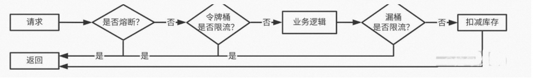

# 高并发读请求

1. 使用缓存策略将请求挡在上层中的缓存中
2. 使用CDN，能静态化的数据尽量做到静态化 
3. 加入限流(比如对短时间之内来自某一个用户，某一个IP、某个设备的重复请求做丢弃处理) 
   * 资源隔离限流会将对应的资源按照指定的类型进行隔离，比如线程池和信号量。
   * 计数器限流，例如5秒内技术1000请求，超数后限流，未超数重新计数
   * 滑动窗口限流，解决计数器不够精确的问题，把一个窗口拆分多滚动窗口
   * 令牌桶限流，类似景区售票，售票的速度是固定的，拿到令牌才能去处理请求
   * 漏桶限流，生产者消费者模型，实现了恒定速度处理请求，能够绝对防止突发流量
   流量控制效果从好到差依次是:漏桶限流 > 令牌桶限流 > 滑动窗口限流 > 计数器限流

其中，只有漏桶算法真正实现了恒定速度处理请求，能够绝对防止突发流量超过下游系统承载能力。
不过，漏桶限流也有个不足，就是需要分配内存资源缓存请求，这会增加内存的使用率。
`而令牌桶限流算法中的“桶”可以用一个整数表示，资源占用相对较小，这也让它成为最常用的限流算法。`
正是因为这些特点，漏桶限流和令牌桶限流经常在一些大流量系统中结合使用。

# 高并发写请求
1. 削峰:恶意用户拦截 
对于单用户多次点击、单设备、IMEI、源IP均设置规则
2. 采用比较成熟的漏桶算法、令牌桶算法，也可以使用guava开箱即用的限流算法 
可以集群限流，但单机限流更加简洁和稳定 
3. 当前层直接过滤一定比例的请求，最大承载值前需要加上兜底逻辑
4. 对于已经无货的产品，本地缓存直接返回
5. 单独部署，减少对系统正常服务的影响，方便扩缩容

对于一段时间内的秒杀活动，需要保证写成功，我们可以使用 消息队列。 
* 削去秒杀场景下的峰值写流量——流量削峰
* 通过异步处理简化秒杀请求中的业务流程——异步处理
* 解耦，实现秒杀系统模块之间松耦合——解耦

# 秒杀系统瓶颈-日志
> 秒杀服务单节点需要处理的请求 QPS 可能达到 10 万以上。一个请求从进入秒杀服务到处理失败或者成功，至少会产生两条日志。
> 也就是说，高峰期间，一个秒杀节点每秒产生的日志可能达到 30 万条以上

## 问题
一块性能比较好的固态硬盘，每秒写的IOPS 大概在 3 万左右。也就是说，一个秒杀节点的每秒日志条数是固态硬盘 IOPS 的 10 倍，磁盘都扛不住，更别说通过网络写入到监控系统中。
• 每秒日志量远高于磁盘 IOPS，直接写磁盘会影响服务性能和稳定性
• 大量日志导致服务频繁分配，频繁释放内存，影响服务性能。
• 服务异常退出丢失大量日志的问题

## 解决方案
* Tmpfs，即临时文件系统，它是一种基于内存的文件系统。我们可以将秒杀服务写日志的文件放在临时文件系统
中。相比直接写磁盘，在临时文件系统中写日志的性能至少能提升 100 倍，每当日志文件达到 20MB 的时候，就
将日志文件转移到磁盘上，并将临时文件系统中的日志文件清空。
• 可以参考内存池设计，将给logger分配缓冲区，每一次的新写可以复用Logger对象
• 参考kafka的缓冲池设计，当缓冲区达到大小和间隔时长临界值时，调用Flush函数，减少丢失的风险