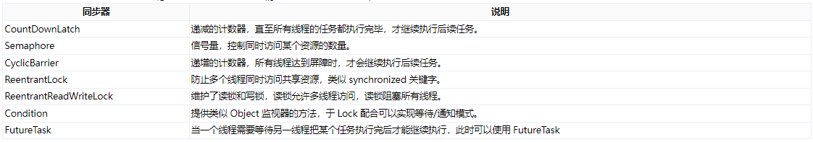
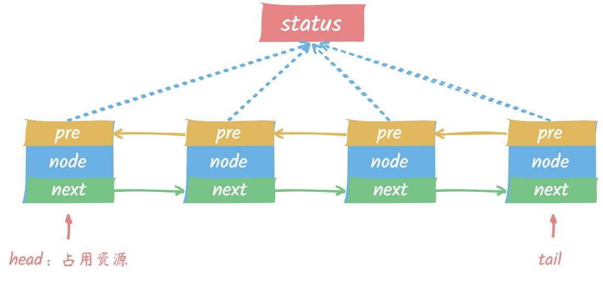

在 Java 并发编程中，AbstractQueuedSynchronizer（AQS）是一个非常重要的组件。AQS 是 JDK 提供的一个框架，用于实现基于 FIFO（First In, First Out）等待队列的阻塞锁和同步器，例如 ReentrantLock、Semaphore、CountDownLatch 等。本文将从多个角度深入解析 AQS 的工作原理及其在并发编程中的应用。

# 一、什么是 AQS？
## AQS 概述
AQS 是一个用于构建锁和同步器的基础框架，它通过一个先进先出的等待队列管理多个线程的同步操作。AQS 提供了以下核心功能：

* 资源状态管理：通过一个整数表示同步状态，子类可以定义该状态的意义和操作方式。
* 线程排队管理：通过 FIFO 等待队列管理多个线程的竞争和等待。
* 提供模板方法：AQS 提供了一系列模板方法，子类可以通过实现这些方法来定义具体的同步机制。

那么有哪些同步器是基于 AQS 实现的呢？

## AQS 设计理念
AQS 的设计理念是将同步状态和线程队列的管理逻辑抽象出来，以便不同类型的同步器可以重用这些逻辑。
这样，开发者可以集中精力于具体的同步器逻辑实现，而无需关心底层的线程排队和状态管理细节。

## AQS 队列数据结构
AQS 核心是通过对同步状态的管理，来完成线程同步，底层是依赖一个双端队列来完成同步状态的管理。

当前线程获取同步状态失败后，会构造成一个 Node 节点并加入队列末尾，同实阻塞线程。

当同步状态释放时，会把头节点中的线程唤醒，让其再次尝试获取同步状态

如下图，这里只是简单绘制，具体流程见下面原理分析：

这里的每个 Node 节点都存储着当前线程、等待信息等。

# 二、AQS 的工作原理
## 同步状态
AQS 使用一个 volatile 类型的整数变量（state）来表示同步状态。这个状态可以由子类定义其具体意义，例如：

* 对于独占锁，state 表示锁的持有状态（0 表示未持有，1 表示持有）。
* 对于共享锁，state 表示当前持有的读锁数量。

AQS 提供了一系列的方法来操作同步状态，如 getState()、setState(int newState) 和 compareAndSetState(int expect, int update)。

## 等待队列
AQS 使用一个 FIFO 等待队列来管理处于等待状态的线程。当线程请求无法获取同步状态时，会被加入等待队列。等待队列由一个双向链表实现，每个节点（Node）表示一个等待线程。

## 模板方法
AQS 提供了以下几个模板方法，子类可以通过覆盖这些方法来实现具体的同步器逻辑：

* tryAcquire(int arg)：尝试获取同步状态。对于独占模式，如果成功获取返回 true，否则返回 false。
* tryRelease(int arg)：尝试释放同步状态。对于独占模式，如果成功释放返回 true，否则返回 false。
* tryAcquireShared(int arg)：尝试共享模式下获取同步状态。如果成功获取返回一个大于等于 0 的值，否则返回一个小于 0 的值。
* tryReleaseShared(int arg)：尝试共享模式下释放同步状态。如果成功释放返回 true，否则返回 false。

# 三、AQS 的应用
## ReentrantLock
ReentrantLock 是一种基于 AQS 实现的可重入独占锁。它有两种模式：公平模式和非公平模式。

公平模式
公平模式下，ReentrantLock 按照请求顺序获取锁。具体实现是在 tryAcquire 方法中检查等待队列中的前驱节点，如果没有前驱节点或前驱节点的线程已经被唤醒，则尝试获取锁。

非公平模式
非公平模式下，ReentrantLock 不保证按照请求顺序获取锁，而是直接尝试获取锁。如果失败，再进入等待队列。

## Semaphore
Semaphore 是一种基于 AQS 实现的计数信号量，用于控制对资源的访问数量。它可以在独占模式和共享模式下使用。

在独占模式下，Semaphore 允许一个线程访问资源。在共享模式下，Semaphore 允许多个线程同时访问资源，其核心逻辑通过 tryAcquireShared 和 tryReleaseShared 方法实现。

## CountDownLatch
CountDownLatch 是一种基于 AQS 实现的同步工具，它允许一个或多个线程等待一组操作完成。CountDownLatch 通过一个计数器来实现这一功能，每当一个操作完成时，计数器减 1，当计数器减到 0 时，所有等待的线程被唤醒。

CountDownLatch 主要使用了 AQS 的共享模式，通过 tryAcquireShared 方法判断计数器是否为 0，如果是，则获取同步状态，否则进入等待队列。

# 四、AQS 的优势
## 高度可扩展性
AQS 提供了一套通用的同步状态管理和线程排队机制，开发者可以通过扩展 AQS 实现各种复杂的同步器。AQS 的设计使得它具有高度的可扩展性，可以适应不同的并发编程需求。

## 可靠性和性能
AQS 使用 CAS（Compare-And-Swap）操作来管理同步状态，保证了操作的原子性和线程安全。同时，AQS 的等待队列机制减少了线程竞争，提高了并发性能。

## 简化开发
通过 AQS，开发者可以专注于同步器的具体逻辑实现，而无需关心底层的线程排队和状态管理细节。这大大简化了同步器的开发过程，提高了开发效率。

# 讨论
AQS 作为 Java 并发编程的重要基石，其设计思想和实现细节值得深入研究。理解 AQS 的工作原理，可以帮助我们更好地使用和扩展 Java 的并发工具，编写出高效、可靠的并发程序。

什么是AQS? 一文让你彻底搞懂! https://cloud.tencent.com/developer/article/2425999
一文搞懂到底什么是 AQS https://blog.csdn.net/dsgdauigfs/article/details/140200764