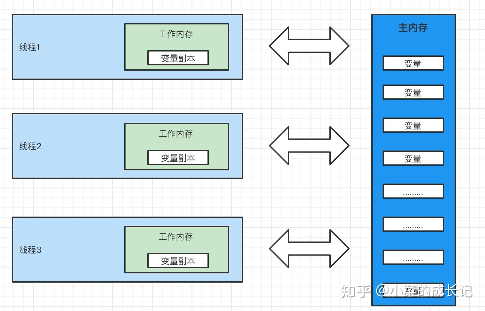

## 什么是JMM?
Java内存模型(Java Memory Model简称JMM)是一种抽象的概念，并不真实存在，它描述的一组规则或者规范。 通过这些规则、规范定义了程序中各个变量的访问方式。

jvm运行的程序的实体是线程，而每个线程运行时，都会创建一个工作内存（也叫栈空间），来保存线程所有的私有变量。

而JMM内存模型规范中规定所有的变量都存储在主内存中，而主内存中的变量是所有的线程都可以共享的，而对主内存中的变量进行操作时，必须在线程的工作内存进行操作，首先将主内存的变量copy到工作内存，进行操作后，再将变量刷回到主内存中。所有线程只有通过主内存来进行通信。

## JMM与JVM
JMM与JVM是两个不同的概念。

JMM规定的是一个规范，通过规范定义了程序中各个变量的访问方式。JMM围绕着原子性、有序性、可见性三点展开。

如果非要说有关系，就是JMM、JVM都一个私有、共有的内存区域。

JMM内存模型交互图

## JMM存在的必要性
由于JVM运行时的实体是线程，每一个线程运行时都会创建一个工作内存，作为线程的私有空间，每个线程操作变量都在自己的工作内存，从主内存copy一份数据到工作内存，在工作内存中进行操作后，再将其刷新回主内存。

如果是在多线程的情况下，则会出现线程安全问题。因此JMM规范规定了如下八种操作来完成数据的操作

### 数据同步八大原子操作

* （1）lock(锁定)：作用于主内存的变量，把一个变量标记为一条线程独占状态

* （2）unlock(解锁)：作用于主内存的变量，把一个处于锁定状态的变量释放出来，释放后的变量才可以被其他线程锁定

* （3）read(读取)：作用于主内存的变量，把一个变量值从主内存传输到线程的工作内存中，以便随后的load动作使用

* （4）load(载入)：作用于工作内存的变量，它把read操作从主内存中得到的变量值放入工作内存的变量副本中

* （5）use(使用)：作用于工作内存的变量，把工作内存中的一个变量值传递给执行引擎

* （6）assign(赋值)：作用于工作内存的变量，它把一个从执行引擎接收到的值赋给工作内存的变量

* （7）store(存储)：作用于工作内存的变量，把工作内存中的一个变量的值传送到主内存中，以便随后的write的操作

* （8）write(写入)：作用于工作内存的变量，它把store操作从工作内存中的一个变量的值传送到主内存的变量中

如果一个变量从主内存中复制到工作内存中，就需要按顺序的执行read、load指令，如果是工作内存刷新到主内存则需要按顺序的执行store、write操作。但JMM只保证了顺序执行，并没有保证连续执行。

### 同步规则分析
1. 不允许线程无原因的将变量从工作内存写回主内存（没有经过任何的assign）。
2. 一个新的变量只能在主内存中诞生，不允许在工作内存中直接使用一个未被初始化的变量（load或者assign）的变量，就是对一个变量进行use和store操作之前，必须先自行load与assign操作。
3. 一个变量在同一时刻只能被一个线程lock，同一个线程能多次lock，必须对应的多次unlock，lock与unlock必须成对的出现。
4. 如果对一个变量执行lock操作，将会清除工作内存中此变量的值，在执行引擎使用这个变量时，必须重新load、assign操作。
5. 如果一个线程对一个变量没有进行lock操作，则不允许unlock，也不允许对其他线程进行unlock。
6. 对一个变量进行unlock时，必须先将变量刷新到主内存。

## JMM如何解决原子性&可见性&有序性

### 原子性问题
除了jvm自身提供的对基本类型的原子性操作以外，可以通过synchronized和Lock实现原子性。

synchronized与lock在同一时刻始终只会存在一个线程访问对应的代码块。

### 可见性问题
volatile关键字保证了可见性。当一个共享变量被volatile修饰时，它会保证共享变量修改的值立即被其他线程可见，即修改的值立即刷新到主内存，当其它线程去需要读取变量时，从主内存中读取。'
synchronized和Lock也保证了可见性。因为同一时刻只有一个线程能访问同步代码块，所以是能保证可见性。

### 有序性问题
volatile关键字保证了有序性，synchronized和Lock也保证了有序性（因为同一时刻只允许一个线程访问同步代码块，自然保证了线程之间在同步代码块的有序执行）。

JMM内存模型：每个线程都有自己的工作内存。线程对变量的操作只能在工作内存中进行操作，并且线程之前的工作内存是不可见的。java内粗模型具备一定的先天有序性，happens-before 原则。如果两个操作无法推断出happens-before 原则，则无法保证程序的有序性。虚拟机可以随意的将它们进行排序。

指令重排：即只要程序的最终结果与顺序执行的结果保持一致，则虚拟机就可以进行排序，此过程就叫指令重排序，为啥需要指令重排序？jvm根据处理器特性（cpu多级缓存、多核处理器等）适当的对机器指令进行排序，使机器指令能更符合CPU的执行特性，最大的限度发挥机器性能。
https://zhuanlan.zhihu.com/p/455820119