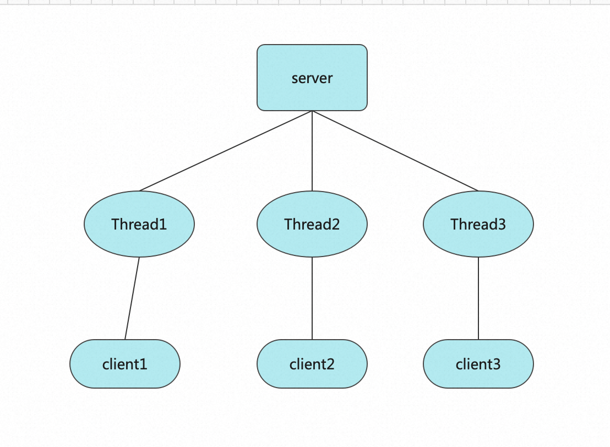
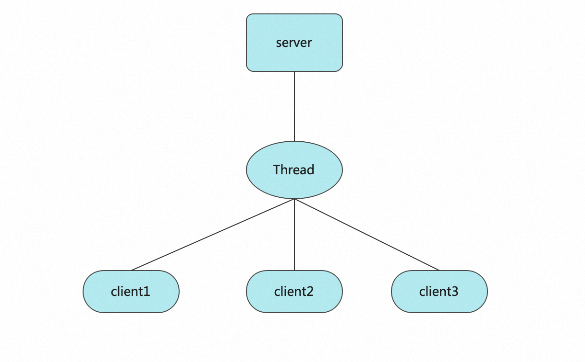
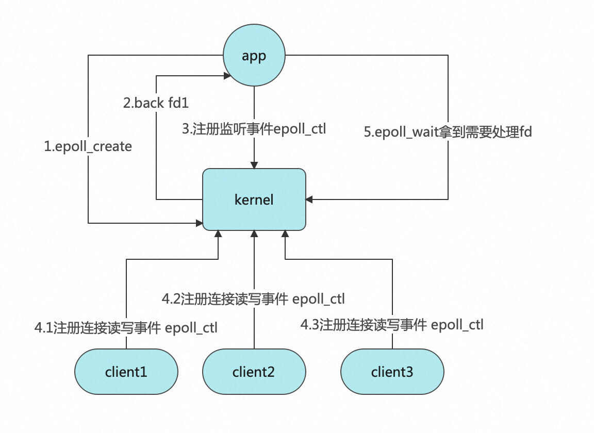
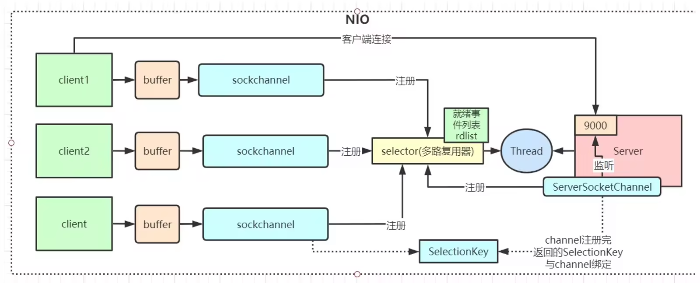

## Java IO 流了解吗？
IO 即 Input/Output，输入和输出。数据输入到计算机内存的过程即输入，反之输出到外部存储（比如数据库，文件，远程主机）的过程即输出。
数据传输过程类似于水流，因此称为 IO 流。IO 流在 Java 中分为输入流和输出流，而根据数据的处理方式又分为字节流和字符流。
Java IO 流的 40 多个类都是从如下 4 个抽象类基类中派生出来的。
* InputStream/Reader: 所有的输入流的基类，前者是字节输入流，后者是字符输入流。
* OutputStream/Writer: 所有输出流的基类，前者是字节输出流，后者是字符输出流。

### 字符流的优势
1. 简化文本操作
   直接读写字符：无需手动处理字节与字符的转换。
   处理换行符：自动适配不同系统的换行符（\n、\r\n）。
   按行读取：BufferedReader.readLine() 可直接读取一行文本。
2. 避免编码错误
   统一编码：指定字符集后，字符流确保读写时编码一致。
   防止乱码：手动处理字节时，若编码不一致会导致乱码（如用 ISO-8859-1 解码 UTF-8 字节）。
3. 性能优化
   缓冲机制：BufferedReader / BufferedWriter 减少底层 I/O 调用次数。
   批量处理：以字符数组为单位读写，比逐字节处理更高效。 


### I/O 流为什么要分为字节流和字符流呢?
问题本质想问：`不管是文件读写还是网络发送接收，信息的最小存储单元都是字节，那为什么 I/O 流操作要分为字节流操作和字符流操作呢？`
个人认为主要有两点原因：
1. 处理字符编码、简化文本操作，以及提供更友好的API来处理文本数据。
2. 虽然底层是字节，但字符流在更高层次上封装了这些细节，让开发者更专注于字符层面的处理，而不是字节的细节。

## IO模型分类
首先来谈下IO模型的分类
1. BIO（Blocking I/O）：同步阻塞I/O，传统的I/O模型。在进行I/O操作时，必须等待数据读取或写入完成后才能进行下一步操作。
2. NIO（Non-blocking I/O）：同步非阻塞I/O，是一种事件驱动的I/O模型。在进行I/O操作时，不需要等待操作完成，可以进行其他操作。
3. AIO（Asynchronous I/O）：异步非阻塞I/O，是一种更高级别的I/O模型。在进行I/O操作时，不需要等待操作完成，就可继续进行其他操作，当操作完成后会自动回调通知  
   
AIO其实很早就支持了，但是业界主流IO框架却很少使用呢，比如netty， 从 2.x 开始引入AIO,随后，3.x也继续保持，但到了4.x却删除对AIO的支持，能让一款世界级最优秀的IO框架之一做出舍弃AIO，那肯定是有迫不得已的原因，那原因到底是啥呢？
* 对AIO支持最好的是Windows系统，但是很少用Windows做服务器
* linux常用来做服务器，但AIO的实现不够成熟
* linux下AIO相比NIO性能提升并不明显
* 维护成本过高

## BIO C10k问题
1. too many open files 这里说明打开的文件描述符过多，什么是文件描述符？
2. unable to create new native thread 不能再创建新的本地线程。

文件描述符（ file descriptor简称fd,请记住这个概念，后续会多次出现)在linux中，一切皆文件。
实际上，它是一个索引值，指向一个文件记录表，该表记录内核为每一个进程维护的文件记录信息。

由于本例中创建了三万个socket，而一个socket(即一个tcp连接)就对应一个文件描述符(fd)，30000已经超过了系统默认的文件描述符限制。
那怎么去查看fd信息呢？可通过`lsof -i -a -p [pid]`查看当前进程打开的tcp相关的文件描述符。

从上面的分析，结合BIO处理c10k的过程，不难得出以下问题：
* 一个连接需要一个线程，一台机器开辟线程数有限
* 线程是轻量级进程，操作系统会为每一个线程分配1M独立的栈空间，如果要处理c10k(10000个连接)，就得有10G的栈空间
* 即便是内存空间足够，一台机器的cpu核数是有限的。比如我们线上机器是4核，10000个线程情况下，cpu大量时间是耗费在线程调度而不是业务逻辑处理上，会产生极大浪费

所以BIO存在的核心问题是阻塞导致多线程，如何解决？
那就是非阻塞+少量线程。



## NIO 调用链路


NIO相比BIO有个非常牛逼的特性,即设置非阻塞。可通过 java.nio.AbstractSelectableChannel 下的configureBlocking方法，调用内核，设置当前socket接收客户端连接，或者读取数据为非阻塞（BIO中这两个操作都为阻塞），啥是socket?socket就是TPC连接的抽象，客户端client.connect(serverAddr); 实际上底层就会调用系统内核就处理三次握手，建立tcp连接。
从代码中不难看出，相比BIO,NIO的优势：
* 建立连接和读写数据非阻塞
* 无需开辟过多线程
那它是不是就是完美解决方案了呢？如果你细心看以上37行到48行代码，就会发现，只要有一个连接进来，就不管三七二十一遍历所有客户端，调用系统调用read方法。实际情况可能并没有客户端有数据到达，这就产生了一个新的问题
* 无论是否有读写事件，都需要空遍历所有客户端连接，产生大量系统调用，大量浪费CPU资源

如果你来设计，你会想着怎么优化呢？

其实也比较容易，就是有没有办法，我不要用去遍历所有客户端，因为10k个客户端我就得调用10k次系统调用，就得产生10k次用户态和内核态的来回切换（回顾下计算机组成原理，感受下这个资源消耗），而只调用一次内核就能知道哪些连接有数据。
嗯，Linus Torvalds（linux之父）也是这样想的，所以就出现了多路复用

## 多路复用
在Linux中，多路复用指的是一种实现同时监控多个文件描述符（包括socket，文件和标准输入输出等）的技术。 它可以通过一个进程同时接受多个连接请求或处理多个文件的IO操作，提高程序的效率和响应速度。

怎么去理解这段话？结合我们上面的例子，说的直白一点就是一次系统调用，我就能得到多个客户端是否有读写事件， 
多路（多个客户端）复用（复用一次系统调用）。

多路复用是依赖内核的能力，不同的操作系统都有自己不同的多路复用器实现，这里以linux为例，多路复用又分为两个阶段。

### 阶段一：select&poll
看下入参，需要用户主动传入要监视的文件描述符数量，可读文件描述符集合，可写文件描述符集合，异常文件描述符集合等入参，
实际上就干了一件事，以前由用户态去循环遍历所有客户端产生系统调用（如果10k个socket，需要产生10k个系统调用），改成了由内核遍历。
如果select模式，只需10系统调用（因为select最大支持传入1024个文件描述符），如果是poll模式（不限制文件描述符数量），则只需1次系统调用
```java
int select(int nfds, //要监视的文件描述符数量
            fd_set *restrict readfds, //可读文件描述符集合
            fd_set *restrict writefds, //可写文件描述符集合
            fd_set *restrict errorfds, //异常文件描述符集合
            struct timeval *restrict timeout//超时时间
            );
```

pool和select同属第一阶段，因为它们处理问题的思路基本相同，但也有如下区别：
1. 实现机制不同：select使用轮询的方式来查询文件描述符上是否有事件发生，而poll则使用链表来存储文件描述符，查询时只需要对链表进行遍历。
2. 文件描述符的数量限制不同：select最大支持1024个文件描述符，poll没有数量限制，可以支持更多的文件描述符。
3. 阻塞方式不同：select会阻塞整个进程，而poll可以只阻塞等待的文件描述符。
4. 可移植性不同：select是POSIX标准中的函数，可在各种操作系统上使用，而poll是Linux特有的函数，不是标准的POSIX函数，在其他操作系统上可能不被支持。

那是不是select和pool就很完美了呢，当然不是，这里还存在一个问题：
大量的fd(即连接)需要在用户态和内核态互相拷贝
啥叫高性能，高性能首先要做到的就是避免资源浪费，fd集合在用户态和内核态互相拷贝就是一种浪费，越是在底层，一个细微的优化，对系统性能的提升都是巨大的。
如何解决？linus大神又出手了，杜绝拷贝（不需要在用户态和内核态互相拷贝），空间换时间，在内核为应用程序开辟一块空间，这就是epoll要干的事情

### epoll
Linux epoll在2.6内核版本中发布，于2002年发布，这里大家可以回过头去看下，java.nio也刚好在2002年推出



1. 应用程序调用内核系统调用，创建epoll文件描述符，也就是在内核中申请一块空间，用于监听socket fd发生了什么样的事件，size也就适合socket fd的数量。
* 对应的系统调用：int epoll_create(int size);

2. 应用程序新连接，注册到对应的内核空间,并关联事件event
* 对应的系统调用 int epoll_ctl(int epfd, int op, int fd, struct epoll_event *event);

3. 应用程序询问需要处理的连接
* 哪些需要处理？有读，写，错误的事件
* 对应的系统调用 ：int epoll_wait(int epfd, struct epoll_event *events, int maxevents, int timeout);

### Java selector
刚才带大家看了下linux操作系统多路复用的发展历程，那java.nio是怎么使用的呢？
其实在一开始就贴出了java selector的代码实现，发现比前面的版本代码会复杂不少，但第一遍咱们只是知道怎么写，至于为什么这么写，并没有讲的很清楚，有了上面的铺垫，再去看这段代码，是不是会有不一样的感觉呢
代码内加入了关键注释，串联linux多路复用器相关知识，强烈建议阅读下代码
```java
public class SelectorNIO {

    /**
     * linux 多路复用器 默认使用epoll,可通过启动参数指定使用select poll或者epoll ，
     */
    private Selector selector = null;
    int port = 9998;

    public static void main(String[] args) {
        SelectorNIO service = new SelectorNIO();
        service.start();
    }

   public void initServer() {
      try {
         ServerSocketChannel server = ServerSocketChannel.open();
         server.configureBlocking(false);
         server.bind(new InetSocketAddress(port));

         //epoll模式下 open会调用一个调用系统调用 epoll_create 返回文件描述符 fd3
         selector = Selector.open();
         /**
          *对应系统调用
          *select，poll模式下：jvm里开辟一个文件描述符数组，并吧 fd4 放入
          *epoll模式下： 调用内核 epoll_ctl(fd3,ADD,fd4,EPOLLIN)
          */
         server.register(selector, SelectionKey.OP_ACCEPT);
      } catch (IOException e) {
         e.printStackTrace();
      }
   }

   public void start() {
      initServer();
      System.out.println("server start");
      while (true) {
         try {
            Set<SelectionKey> keys = selector.keys();
            System.out.println("可处理事件数量 " + keys.size());

            /**
             *对应系统调用
             *1，select，poll模式下： 调用 内核 select（fd4）  poll(fd4)
             *2，epoll： 调用内核 epoll_wait()
             */
            while (selector.select() > 0) {
               //返回的待处理的文件描述符集合
               Set<SelectionKey> selectionKeys = selector.selectedKeys();
               Iterator<SelectionKey> iterator = selectionKeys.iterator();
               while (iterator.hasNext()) {
                  SelectionKey key = iterator.next();
                  //使用后需移除，否则会被一直处理
                  iterator.remove();
                  if (key.isAcceptable()) {
                     /**
                      * 对应系统调用
                      * select，poll模式下：因为内核未开辟空间，那么在jvm中存放fd4的数组空间
                      * epoll模式下： 通过epoll_ctl把新客户端fd注册到内核空间
                      */
                     acceptHandler(key);
                  } else if (key.isReadable()) {
                     /**
                      * 处理读事件
                      */
                     readHandler(key);
                  }
               }
            }
         } catch (IOException e) {
            e.printStackTrace();
         }
      }
   }

   public void acceptHandler(SelectionKey key) {
      try {
         ServerSocketChannel ssc = (ServerSocketChannel)key.channel();
         //接受新客户端
         SocketChannel client = ssc.accept();
         //重点，设置非阻塞
         client.configureBlocking(false);
         ByteBuffer buffer = ByteBuffer.allocate(1024);
         /**
          * 调用系统调用
          * select，poll模式下：jvm里开辟一个数组存入 fd7
          * epoll模式下： 调用 epoll_ctl(fd3,ADD,fd7,EPOLLIN
          */
         client.register(selector, SelectionKey.OP_READ, buffer);
         System.out.println("client connected：" + client.getRemoteAddress());
      } catch (IOException e) {
         e.printStackTrace();
      }
   }

   public void readHandler(SelectionKey key) {
      try {
         // 可读事件，读取数据并向客户端发送响应
         SocketChannel socketChannel = (SocketChannel)key.channel();
         /**
          * 简单介绍下Buffer
          * Buffer本质上是一个内存块,要弄懂它首先要了解以下三个属性
          * capacity（容量）、position（读写位置）和limit（读写的限制）。两种模式，读模式和写模式，
          * capacity在读写模式下不变，但position和limit在读写模式下值是会变的
          * 举个例子，
          * 1.创建一个capacity为1024的Buffer,刚开始position=0，limit=capacity=1024
          * 2.往Buffer写数据，每写一个数据，position指针向后移动一个位置，其值加一,limit则减1。比如
          * 写入24个字节后，position=24(已经写入24)，limit=1000(还可写入1024)
          * 3.假设我们已经写完了，那我从哪里读？读多少呢？所以Buffer提供了一个读写模式翻转的方法flip方法
          * 把写模式转换成读模式，底层就是把position和limit的值改成从哪里读，读多少，所以调用该方法后，我们
          * 就能得到position=0 从0位置开始读,limit=24读24个位置
          */
         ByteBuffer buffer = ByteBuffer.allocate(1024);
         int len = socketChannel.read(buffer);
         System.out.println("readHandler len" + len);
         if (len > 0) {
            buffer.flip();
            byte[] bytes = new byte[buffer.remaining()];
            buffer.get(bytes);
            String message = new String(bytes, "UTF-8");
            System.out.println("Received message from " + socketChannel.getRemoteAddress() + ": " + message);
            // 向客户端发送响应
            String response = "Hello, client!";
            ByteBuffer responseBuffer = ByteBuffer.wrap(response.getBytes("UTF-8"));
            socketChannel.write(responseBuffer);
         }
      } catch (Exception e) {
         e.printStackTrace();
      }
   }
}
```

### Java NIO 图解


点击jdk的NIO源码可以看到，jdk在open、register、select都调用了native方法。在linux操作系统底层，分别对应了epoll_create、epoll_ctl、epoll_wait方法。

epoll在操作系统底层是C语言中的结构体，内部包含2个元素，一个是监听的事件，一个是符合监听事件的rdlist。
每当调用epoll_create时就会创建一个结构体。而epoll_ctl方法被调用时会向该结构体注册一个事件。

当发生网络请求时，网卡驱动程序会回调操作系统的epoll_callback方法，该方法会将事件放到rdlist中。
在调用epoll_wait方法时，它只需要判断rdlist中有没有事件就行。如果有，则会把事件复制到用户态，在java里也就是堆内存中。


## Netty 
上面的NIO模式有没有问题？
如果此时来了一万个链接，都有读写请求，那么在一万个请求处理结束之前，它没法接受新的请求，哪怕是简单的链接请求，因为此时的处理线程只有一个。那怎么改善那？

Netty是一种NIO模式框架，它能帮助我们简单和快速的搭建基于CS结构网络应用。 它极大地简化了诸如TCP和UDP套接字服务器之类的网络编程。 “快速简便”并不意味着最终的应用程序将遭受可维护性或性能问题的困扰。 
Netty经过精心设计，结合了许多协议（例如FTP，SMTP，HTTP以及各种基于二进制和文本的旧式协议）的实施经验。 
事实上，Netty成功地找到了一种无需妥协即可轻松实现开发，性能，稳定性和灵活性的方法。

总结一句，就是Netty本质上对NIO模式的封装，封装了CS结构下通信协议。研发无需关注底层细节，并且它很简单、稳定、强大。

1) Netty 抽象出两组线程池BossGroup和WorkerGroup，BossGroup专门负责接收客户端的连接, WorkerGroup专门负责网络的读写；
2) BossGroup和WorkerGroup类型都是NioEventLoopGroup，里面包含很多个NioEventLoop;
3) NioEventLoopGroup 相当于一个事件循环线程组, 这个组中含有多个事件循环线程 ， 每一个事件循环线程是 NioEventLoop;
4) 每个NioEventLoop都有一个selector , 用于监听注册在其上的socketChannel的网络通讯；
5) 每个Boss NioEventLoop线程内部循环执行的步骤有 3 步
      a、处理accept事件 , 与client 建立连接 , 生成 NioSocketChannel；
      b、将NioSocketChannel注册到某个worker NIOEventLoop上的selector；
      c、处理任务队列的任务 ， 即runAllTasks；
6) 每个worker NIOEventLoop线程循环执行的步骤
   a、轮询注册到自己selector上的所有NioSocketChannel 的read, write事件；
   b、处理 I/O 事件， 即read , write 事件， 在对应NioSocketChannel 处理业务；
   c、runAllTasks处理任务队列TaskQueue的任务 ，一些耗时的业务处理一般可以放入TaskQueue中慢慢处理，这样不影响
   数据在 pipeline 中的流动处理；
7) 每个worker NIOEventLoop处理NioSocketChannel业务时，会使用 pipeline (管道)，管道中维护了很多 handler，处理器用来处理 channel 中的数据。
   总结下来Netty能做到高并发、高性能，他的架构设计有如下特点：
   1、主从Reactor线程模型
   2、NIO多路复用非阻塞
   3、无锁串行化设计思想
   4、零拷贝技术的使用
   5、ByteBuf内存池设计
   6、灵活的TCP参数配置能力
   7、并发优化

## 哪些中间件框架用到了Netty
a、互联网行业：分布式系统中，高性能的RPC框架必不可少Netty，如Dubbo的RPC框架使用Netty，进行个节点间的通信。RocketMQ同样使用Netty作为基础通信组件。

b、游戏行业：无论是手游服务还是网络游戏，都使用Netty作为基础通信组件。

c、大数据领域：hadoop的高性能通信和序列化组件Avro的RPC框架，就是使用Netty作为基础通信组件使用。

java IO 详解 https://javaguide.cn/java/io/io-model.html#nio-non-blocking-new-i-o

Linux 中的 epoll 原理及使用 https://blog.csdn.net/shift_wwx/article/details/104275383