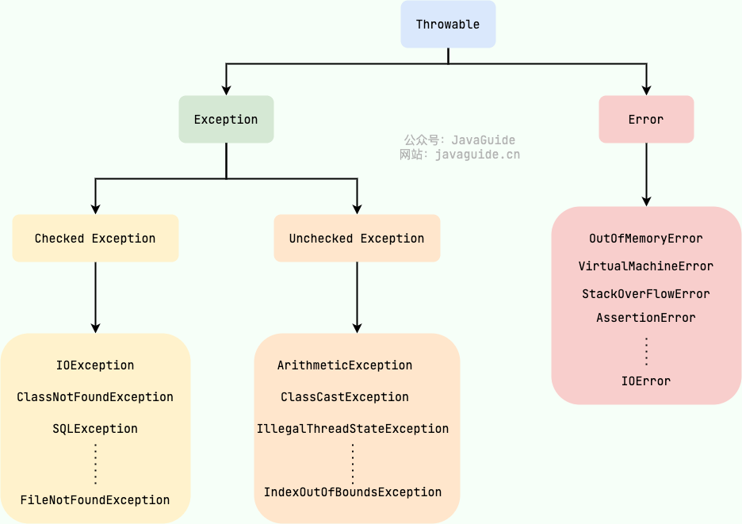

# Java异常体系



## Exception 和 Error 有什么区别？
在 Java 中，所有的异常都有一个共同的祖先 java.lang 包中的 Throwable 类。

### Throwable 类有两个重要的子类:
* Exception :程序本身可以处理的异常，可以通过 catch 来进行捕获。 Exception 又可以分为 Checked Exception (受检查异常，必须处理) 和 Unchecked Exception (不受检查异常，可以不处理)。
* Error：Error 属于程序无法处理的错误 ，我们没办法通过 catch 来进行捕获不建议通过catch捕获 。
例如 Java 虚拟机运行错误（Virtual MachineError）、虚拟机内存不够错误(OutOfMemoryError)、类定义错误（NoClassDefFoundError）等 。 这些异常发生时，Java 虚拟机（JVM）一般会选择线程终止。

## 如何使用 try-with-resources 代替try-catch-finally？
1. 适用范围（资源的定义）： 任何实现 java.lang.AutoCloseable或者 java.io.Closeable 的对象
2. 关闭资源和 finally 块的执行顺序： 在 try-with-resources 语句中，任何 catch 或 finally 块在声明的资源关闭后运行

### try-catch-finally 实现
java 中类似于InputStream、OutputStream、Scanner、PrintWriter等的资源都需要我们调用close()方法来手动关闭，一般情况下我们都是通过try-catch-finally语句来实现这个需求，如下：
```java
//读取文本文件的内容
Scanner scanner = null;
try {
    scanner = new Scanner(new File("D://read.txt"));
    while (scanner.hasNext()) {
        System.out.println(scanner.nextLine());
    }
} catch (FileNotFoundException e) {
    e.printStackTrace();
} finally {
    if (scanner != null) {
        scanner.close();
    }
}
```

### try-with-resources 实现
使用 Java 7 之后的 try-with-resources 语句改造上面的代码:

```java
try (Scanner scanner = new Scanner(new File("test.txt"))) {
    while (scanner.hasNext()) {
        System.out.println(scanner.nextLine());
    }
} catch (FileNotFoundException fnfe) {
    fnfe.printStackTrace();
}

```
当然多个资源需要关闭的时候，使用 try-with-resources 实现起来也非常简单，如果你还是用try-catch-finally可能会带来很多问题。通过使用分号分隔，可以在try-with-resources块中声明多个资源。

```java
try (BufferedInputStream bin = new BufferedInputStream(new FileInputStream(new File("test.txt")));
     BufferedOutputStream bout = new BufferedOutputStream(new FileOutputStream(new File("out.txt")))) {
    int b;
    while ((b = bin.read()) != -1) {
        bout.write(b);
    }
}
catch (IOException e) {
    e.printStackTrace();
}
```

