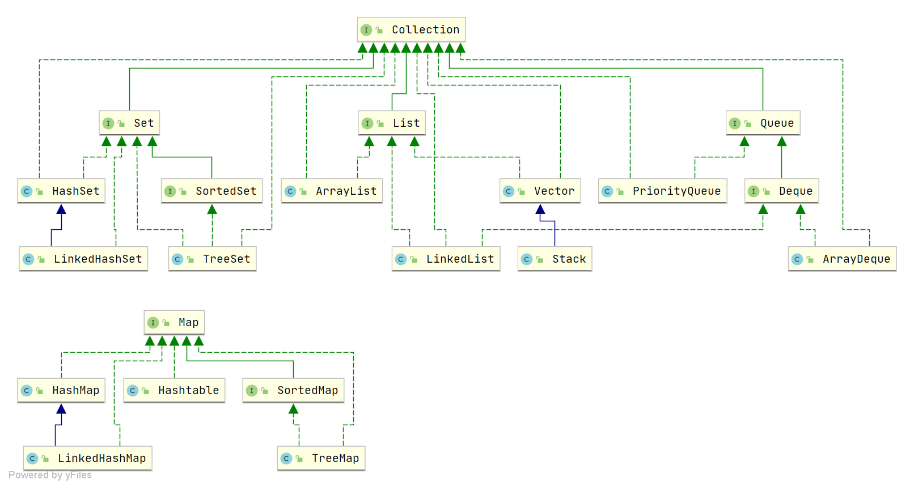

## 面向对象三大特性
特性:封装、继承、多态 

封装: 对抽象的事物抽象化成一个对象，并对其对象的属性私有化，同时提供一些能被外界访问属性的方法; 

继承: 子类扩展新的数据域或功能，并复用父类的属性与功能，单继承，多实现; 

多态: 通过继承(多个子类对同一方法的重写)、也可以通过接口(实现接口并覆盖接口)
### 多态实现原理
多态的底层实现是动态绑定，即在运行时才把方法调用与方法实现关联起来。

#### 静态绑定与动态绑定
一种是在编译期确定，被称为静态分派，比如方法的重载; 一种是在运行时确定，被称为动态分派，比如方法的覆盖(重写)和接口的实现。

#### 多态的实现
虚拟机栈中会存放当前方法调用的栈帧(局部变量表、操作栈、动态连接 、返回地址)。
多态的实现过程，就是方法调用动态分派的过程，如果子类覆盖了父类的方法，则在多态调用中，动态绑定过程会首先确定实际类型是子类，从而先搜索到子类中的方法。
这个过程便是方法覆盖的本质。


## 容器
Java 集合，也叫作容器，主要是由两大接口派生而来：
一个是 Collection接口，主要用于存放单一元素；
另一个是 Map 接口，主要用于存放键值对。
对于Collection 接口，下面又有三个主要的子接口：List、Set 、Queue。




## 语法糖
语法糖（Syntactic sugar） 代指的是编程语言为了方便程序员开发程序而设计的一种特殊语法，这种语法对编程语言的功能并没有影响。
实现相同的功能，基于语法糖写出来的代码往往更简单简洁且更易阅读。
举个例子，Java 中的 for-each 就是一个常用的语法糖，其原理其实就是基于普通的 for 循环和迭代器。

```java
String[] strs = {"JavaGuide", "公众号：JavaGuide", "博客：https://javaguide.cn/"};
for (String s : strs) {
    System.out.println(s);
}
```

不过，JVM 其实并不能识别语法糖，Java 语法糖要想被正确执行，需要先通过编译器进行解糖，也就是在程序编译阶段将其转换成 JVM 认识的基本语法。
这也侧面说明，`Java 中真正支持语法糖的是 Java 编译器而不是 JVM` 。
如果你去看`com.sun.tools.javac.main.JavaCompiler`的源码，你会发现在`compile()`中有一个步骤就是调用`desugar()`，这个方法就是负责解语法糖的实现的。

### Java 中有哪些常见的语法糖？
Java 中最常用的语法糖主要有泛型、自动拆装箱、变长参数、枚举、内部类、增强 for 循环、try-with-resources 语法、lambda 表达式等。

java 语法糖 https://javaguide.cn/java/basis/syntactic-sugar.html

