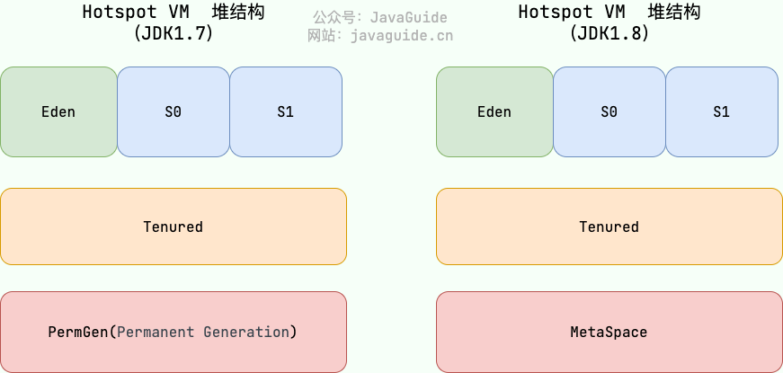

# Java内存区域详解

## 内存模型
以下为1.7 和 1.8 的内存模型


### 程序计数器
程序计数器是一块较小的内存空间，可以看作是当前线程所执行的字节码的行号指示器。
字节码解释器工作时通过改变这个计数器的值来选取下一条需要执行的字节码指令，分支、循环、跳转、异常处理、线程恢复等功能都需要依赖这个计数器来完成。
另外，为了线程切换后能恢复到正确的执行位置，每条线程都需要有一个独立的程序计数器，各线程之间计数器互不影响，独立存储，我们称这类内存区域为“线程私有”的内存。

从上面的介绍中我们知道了程序计数器主要有两个作用：
* 字节码解释器通过改变程序计数器来依次读取指令，从而实现代码的流程控制，如：顺序执行、选择、循环、异常处理。
* 在多线程的情况下，程序计数器用于记录当前线程执行的位置，从而当线程被切换回来的时候能够知道该线程上次运行到哪儿了。

注意：程序计数器是唯一一个不会出现 OutOfMemoryError 的内存区域，它的生命周期随着线程的创建而创建，随着线程的结束而死亡。

### Java 虚拟机栈
栈由一个个栈帧组成，而每个栈帧中都拥有：`局部变量表、操作数栈、动态链接、方法返回地址`。 和数据结构上的栈类似，两者都是`先进后出`的数据结构，只支持`出栈`和`入栈`两种操作。

与程序计数器一样，Java 虚拟机栈（后文简称栈）也是线程私有的，它的生命周期和线程相同，随着线程的创建而创建，随着线程的死亡而死亡。

栈绝对算的上是 JVM 运行时数据区域的一个核心，除了一些 Native 方法调用是通过本地方法栈实现的(后面会提到)，其他所有的 Java 方法调用都是通过栈来实现的（也需要和其他运行时数据区域比如程序计数器配合）。

方法调用的数据需要通过栈进行传递，每一次方法调用都会有一个对应的栈帧被压入栈中，每一个方法调用结束后，都会有一个栈帧被弹出。


#### 局部变量表
局部变量表是一组变量值存储空间，用来存放方法参数、方法内部定义的局部变量。底层是变量槽 (variable slot)
#### 操作数栈
是用来记录一个方法在执行的过程中，字节码指令向操作数栈中进行入栈和出栈的过程。
大小在编译的时候已经确定了，当一个方法刚开始执行的时候，操作数栈中是空的，在方法执行的过程中会有各种字节码指令往操作数栈中入栈和出栈。
#### 动态链接
因为字节码文件中有很多符号的引用，这些符号引用一部分会在类加载的解析阶段或第一次使用的时候转化成直接引用，这种称为静态解析;
另一部分会在运行期间转化为直接引用，称为动态链接。
#### 返回地址(returnAddress)
类型(指向了一条字节码指令的地址) JIT即时编译器(Just In Time Compiler)，简称 JIT 编译器:

为了提高热点代码的执行效率，在运行时，虚拟机将会把这些代码编译成与本地平台相关的机器码，并进行各种层次的优化，比如锁粗化等


### 本地方法栈
和虚拟机栈所发挥的作用非常相似，区别是：虚拟机栈为虚拟机执行 Java 方法 （也就是字节码）服务，而本地方法栈则为虚拟机使用到的 Native 方法服务。 在 HotSpot 虚拟机中和 Java 虚拟机栈合二为一。

本地方法被执行的时候，在本地方法栈也会创建一个栈帧，用于存放该本地方法的局部变量表、操作数栈、动态链接、出口信息。

方法执行完毕后相应的栈帧也会出栈并释放内存空间，也会出现 StackOverFlowError 和 OutOfMemoryError 两种错误。


### 堆
Java 虚拟机所管理的内存中最大的一块，Java 堆是所有线程共享的一块内存区域，在虚拟机启动时创建。此内存区域的唯一目的就是存放对象实例，几乎所有的对象实例以及数组都在这里分配内存。

Java 世界中“几乎”所有的对象都在堆中分配，但是，随着 JIT 编译器的发展与逃逸分析技术逐渐成熟，栈上分配、标量替换优化技术将会导致一些微妙的变化，所有的对象都分配到堆上也渐渐变得不那么“绝对”了。从 JDK 1.7 开始已经默认开启逃逸分析，如果某些方法中的对象引用没有被返回或者未被外面使用（也就是未逃逸出去），那么对象可以直接在栈上分配内存。

Java 堆是垃圾收集器管理的主要区域，因此也被称作 GC 堆（Garbage Collected Heap）。从垃圾回收的角度，由于现在收集器基本都采用分代垃圾收集算法，所以 Java 堆还可以细分为：新生代和老年代；再细致一点有：Eden、Survivor、Old 等空间。进一步划分的目的是更好地回收内存，或者更快地分配内存。

在 JDK 7 版本及 JDK 7 版本之前，堆内存被通常分为下面三部分：
* 新生代内存(Young Generation)
* 老生代(Old Generation)
* 永久代(Permanent Generation)

下图所示的 Eden 区、两个 Survivor 区 S0 和 S1 都属于新生代，中间一层属于老年代，最下面一层属于永久代。



JDK 8 版本之后 PermGen(永久代) 已被 Metaspace(元空间) 取代，元空间使用的是本地内存。 

大部分情况，对象都会首先在 Eden 区域分配，在一次新生代垃圾回收后，如果对象还存活，则会进入 S0 或者 S1，并且对象的年龄还会加 1(Eden 区->Survivor 区后对象的初始年龄变为 1)，当它的年龄增加到一定程度（默认为 15 岁），就会被晋升到老年代中。

对象晋升到老年代的年龄阈值，可以通过参数 `-XX:MaxTenuringThreshold`  来设置。不过，设置的值应该在 0-15，
否则会爆出以下错误：`MaxTenuringThreshold of 20 is invalid; must be between 0 and 15` 

为什么年龄只能是 0-15?
因为记录年龄的区域在对象头中，这个区域的大小通常是 4 位。这 4 位可以表示的最大二进制数字是 1111，即十进制的 15。因此，对象的年龄被限制为 0 到 15。

**注：晋升年龄默认最大值是15，实行运行中是动态计算的**
Hotspot 遍历所有对象时，按照年龄从小到大对其所占用的大小进行累积，当累积的某个年龄大小超过了 survivor 区的 50% 时（默认值是 50%，可以通过 -XX:TargetSurvivorRatio=percent 来设置），
`取这个年龄和 MaxTenuringThreshold 中更小的一个值，作为新的晋升年龄阈值`。


堆这里最容易出现的就是 OutOfMemoryError 错误，并且出现这种错误之后的表现形式还会有几种，比如：
1. java.lang.OutOfMemoryError: GC Overhead Limit Exceeded：当 JVM 花太多时间执行垃圾回收并且只能回收很少的堆空间时，就会发生此错误。
2. java.lang.OutOfMemoryError: Java heap space :假如在创建新的对象时, 堆内存中的空间不足以存放新创建的对象, 就会引发此错误。(和配置的最大堆内存有关，且受制于物理内存大小。最大堆内存可通过-Xmx参数配置，若没有特别配置，将会使用默认值)


### 方法区
方法区属于是 JVM 运行时数据区域的一块逻辑区域，是各个线程共享的内存区域。

《Java 虚拟机规范》只是规定了有方法区这么个概念和它的作用，方法区到底要如何实现那就是虚拟机自己要考虑的事情了。也就是说，在不同的虚拟机实现上，方法区的实现是不同的。

当虚拟机要使用一个类时，它需要读取并解析 Class 文件获取相关信息，再将信息存入到方法区。方法区会存储已被虚拟机加载的 类信息、字段信息、方法信息、常量、静态变量、即时编译器编译后的代码缓存等数据。

方法区和永久代以及元空间是什么关系呢？ 

方法区和永久代以及元空间的关系很像 Java 中接口和类的关系，类实现了接口，这里的类就可以看作是永久代和元空间，接口可以看作是方法区，也就是说永久代以及元空间是 HotSpot 虚拟机对虚拟机规范中方法区的两种实现方式。并且，永久代是 JDK 1.8 之前的方法区实现，JDK 1.8 及以后方法区的实现变成了元空间。


1. 整个永久代有一个 JVM 本身设置的固定大小上限，无法进行调整（也就是受到 JVM 内存的限制），而元空间使用的是本地内存，受本机可用内存的限制，虽然元空间仍旧可能溢出，但是比原来出现的几率会更小。
当元空间溢出时会得到如下错误：java.lang.OutOfMemoryError: MetaSpace你可以使用 -XX：MaxMetaspaceSize 标志设置最大元空间大小，默认值为 unlimited，这意味着它只受系统内存的限制。-XX：MetaspaceSize 调整标志定义元空间的初始大小如果未指定此标志，则 Metaspace 将根据运行时的应用程序需求动态地重新调整大小。
2. 元空间里面存放的是类的元数据，这样加载多少类的元数据就不由 MaxPermSize 控制了, 而由系统的实际可用空间来控制，这样能加载的类就更多了。
3. 在 JDK8，合并 HotSpot 和 JRockit 的代码时, JRockit 从来没有一个叫永久代的东西, 合并之后就没有必要额外的设置这么一个永久代的地方了。
4. 永久代会为 GC 带来不必要的复杂度，并且回收效率偏低。
方法区常用参数有哪些？
JDK 1.8 之前永久代还没被彻底移除的时候通常通过下面这些参数来调节方法区大小。
```bash

-XX:PermSize=N //方法区 (永久代) 初始大小
-XX:MaxPermSize=N //方法区 (永久代) 最大大小,超过这个值将会抛出 OutOfMemoryError 异常:java.lang.OutOfMemoryError: PermGen
```

相对而言，垃圾收集行为在这个区域是比较少出现的，但并非数据进入方法区后就“永久存在”了。JDK 1.8 的时候，方法区（HotSpot 的永久代）被彻底移除了（JDK1.7 就已经开始了），取而代之是元空间，元空间使用的是本地内存。
下面是一些常用参数：
```bash


-XX:MetaspaceSize=N //设置 Metaspace 的初始（和最小大小）
-XX:MaxMetaspaceSize=N //设置 Metaspace 的最大大小
```
与永久代很大的不同就是，如果不指定大小的话，随着更多类的创建，虚拟机会耗尽所有可用的系统内存

### 直接内存
直接内存是一种特殊的内存缓冲区，并不在 Java 堆或方法区中分配的，而是通过 JNI 的方式在本地内存上分配的。

直接内存并不是虚拟机运行时数据区的一部分，也不是虚拟机规范中定义的内存区域，但是这部分内存也被频繁地使用。而且也可能导致 OutOfMemoryError 错误出现。

JDK1.4 中新加入的 NIO（Non-Blocking I/O，也被称为 New I/O），引入了一种基于通道（Channel）与缓存区（Buffer）的 I/O 方式，它可以直接使用 Native 函数库直接分配堆外内存，然后通过一个存储在 Java 堆中的 DirectByteBuffer 对象作为这块内存的引用进行操作。这样就能在一些场景中显著提高性能，因为避免了在 Java 堆和 Native 堆之间来回复制数据。

直接内存的分配不会受到 Java 堆的限制，但是，既然是内存就会受到本机总内存大小以及处理器寻址空间的限制。

类似的概念还有 堆外内存 。在一些文章中将直接内存等价于堆外内存，个人觉得不是特别准确。

堆外内存就是把内存对象分配在堆外的内存，这些内存直接受操作系统管理（而不是虚拟机），这样做的结果就是能够在一定程度上减少垃圾回收对应用程序造成的影响。


## 17 对象创建
java 对象的创建过程我建议最好是能默写出来，并且要掌握每一步在做什么。

### Step1:类加载检查
虚拟机遇到一条 new 指令时，首先将去检查这个指令的参数是否能在常量池中定位到这个类的符号引用，并且检查这个符号引用代表的类是否已被加载过、解析和初始化过。如果没有，那必须先执行相应的类加载过程。

### Step2:分配内存
在类加载检查通过后，接下来虚拟机将为新生对象分配内存。对象所需的内存大小在类加载完成后便可确定，为对象分配空间的任务等同于把一块确定大小的内存从 Java 堆中划分出来。分配方式有 “指针碰撞” 和 “空闲列表” 两种，选择哪种分配方式由 Java 堆是否规整决定，而 Java 堆是否规整又由所采用的垃圾收集器是否带有压缩整理功能决定。
内存分配的两种方式 （补充内容，需要掌握）：
1. 指针碰撞： 
*  适用场合：堆内存规整（即没有内存碎片）的情况下。
*  原理：用过的内存全部整合到一边，没有用过的内存放在另一边，中间有一个分界指针，只需要向着没用过的内存方向将该指针移动对象内存大小位置即可。
* 使用该分配方式的 GC 收集器：Serial, ParNew
2. 空闲列表： 
* 适用场合：堆内存不规整的情况下。
* 原理：虚拟机会维护一个列表，该列表中会记录哪些内存块是可用的，在分配的时候，找一块儿足够大的内存块儿来划分给对象实例，最后更新列表记录。
* 使用该分配方式的 GC 收集器：CMS

选择以上两种方式中的哪一种，取决于 Java 堆内存是否规整。而 Java 堆内存是否规整，取决于 GC 收集器的算法是"标记-清除"，还是"标记-整理"（也称作"标记-压缩"），值得注意的是，复制算法内存也是规整的。

#### 内存分配并发问题（补充内容，需要掌握）
在创建对象的时候有一个很重要的问题，就是线程安全，因为在实际开发过程中，创建对象是很频繁的事情，作为虚拟机来说，必须要保证线程是安全的，通常来讲，虚拟机采用两种方式来保证线程安全：
1. CAS+失败重试： 
 CAS 是乐观锁的一种实现方式。所谓乐观锁就是，每次不加锁而是假设没有冲突而去完成某项操作，如果因为冲突失败就重试，直到成功为止。虚拟机采用 CAS 配上失败重试的方式保证更新操作的原子性。
2. TLAB： 
为每一个线程预先在 Eden 区分配一块儿内存，JVM 在给线程中的对象分配内存时，首先在 TLAB 分配，当对象大于 TLAB 中的剩余内存或 TLAB 的内存已用尽时，再采用上述的 CAS 进行内存分配

### Step3:初始化零值
内存分配完成后，虚拟机需要将分配到的内存空间都初始化为零值（不包括对象头），这一步操作保证了对象的实例字段在 Java 代码中可以不赋初始值就直接使用，程序能访问到这些字段的数据类型所对应的零值。

### Step4:设置对象头
初始化零值完成之后，虚拟机要对对象进行必要的设置，例如这个对象是哪个类的实例、如何才能找到类的元数据信息、对象的哈希码、对象的 GC 分代年龄等信息。 这些信息存放在对象头中。 另外，根据虚拟机当前运行状态的不同，如是否启用偏向锁等，对象头会有不同的设置方式。

### Step5:执行 init 方法
在上面工作都完成之后，从虚拟机的视角来看，一个新的对象已经产生了，但从 Java 程序的视角来看，对象创建才刚开始，<init> 方法还没有执行，所有的字段都还为零。所以一般来说，执行 new 指令之后会接着执行 <init> 方法，把对象按照程序员的意愿进行初始化，这样一个真正可用的对象才算完全产生出来。


## JVM什么时候会触发FullGC

Full GC（完全垃圾回收）是JVM中一次比较耗时的垃圾回收操作，它会回收整个堆内存（包括新生代和老年代）。触发Full GC的原因有很多，以下是一些常见的触发条件：

1. 老年代（Old Generation）内存不足
   当老年代的内存空间不足以容纳新晋升的对象时，JVM会触发Full GC来尝试回收老年代中的空间。
2. 永久代（PermGen）或元空间（Metaspace）内存不足
   在Java 7及以前，永久代（PermGen）内存不足时会触发Full GC。Java 8及以后，永久代被元空间（Metaspace）取代，同样，当元空间内存不足时也会触发Full GC。
3. System.gc()调用
   显式调用System.gc()方法可能会触发Full GC，尽管JVM有时会忽略这个请求。
4. 空间分配担保（Allocation Failure）
   在进行Minor GC时，如果发现新生代的对象晋升到老年代后，老年代的空间不足，就会触发Full GC。
5. CMS垃圾回收失败
   在使用并发标记清除（Concurrent Mark-Sweep, CMS）垃圾回收器时，如果CMS回收失败，JVM会回退到Serial Old垃圾回收器进行Full GC。
6. 老年代碎片过多
   当老年代中的内存碎片过多，导致大对象无法找到足够连续的内存空间时，也可能触发Full GC。
7. 显式Full GC触发器
   某些应用程序或框架可能会通过JVM参数或特定代码路径显式地触发Full GC。
8. 新生代和老年代比例失调
   如果新生代和老年代的比例配置不合理，导致频繁的对象晋升，可能会间接导致Full GC的频繁触发。
9. 对象过多晋升
   当短时间内大量对象从新生代晋升到老年代，导致老年代迅速填满，也会触发Full GC。
10. JVM内部优化或策略调整
    在一些情况下，JVM内部的优化或策略调整可能会触发Full GC，例如JIT编译器优化后的代码路径变化。

### 解决方法
如果发现应用频繁触发Full GC，可以采取以下措施：
* 优化内存分配和使用：减少临时对象的创建和使用，优化数据结构和算法。
* 调整JVM参数：调整堆大小、分代比例、垃圾回收器等参数。
* 使用更合适的垃圾回收器：例如G1垃圾回收器或ZGC，可以更好地处理大内存应用。
* 监控和分析：使用工具监控JVM内存和垃圾回收情况，找出导致Full GC频繁的原因。
    
原文链接：https://javaguide.cn/java/jvm/memory-area.html
原文链接：https://blog.csdn.net/weixin_45990682/article/details/140240177