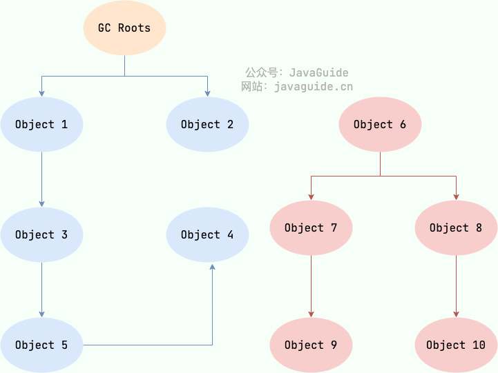
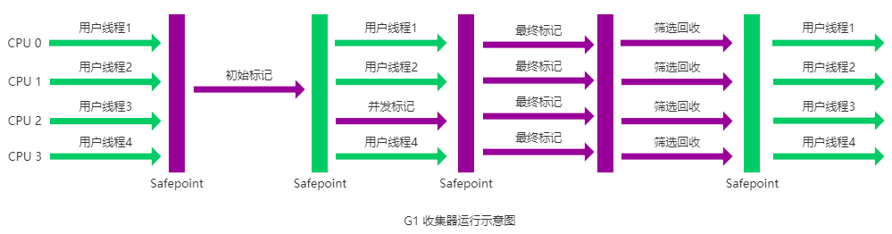
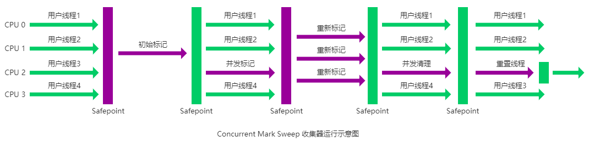

## 死亡对象判断方法
堆中几乎放着所有的对象实例，对堆垃圾回收前的第一步就是要判断哪些对象已经死亡（即不能再被任何途径使用的对象）。

### 引用计数法(弃用)
给对象中添加一个引用计数器：
* 每当有一个地方引用它，计数器就加 1；
* 当引用失效，计数器就减 1；
* 任何时候计数器为 0 的对象就是不可能再被使用的。
 
这个方法实现简单，效率高，但是`目前主流的虚拟机中并没有选择这个算法来管理内存，其最主要的原因是它很难解决对象之间循环引用的问题。`

所谓对象之间的相互引用问题，如下面代码所示：除了对象 objA 和 objB 相互引用着对方之外，这两个对象之间再无任何引用。但是他们因为互相引用对方，导致它们的引用计数器都不为 0，于是引用计数算法无法通知 GC 回收器回收他们。


### 可达性分析算法
这个算法的基本思想就是通过一系列的称为 “GC Roots” 的对象作为起点，从这些节点开始向下搜索，节点所走过的路径称为引用链，当一个对象到 GC Roots 没有任何引用链相连的话，则证明此对象是不可用的，需要被回收。

下图中的 Object 6 ~ Object 10 之间虽有引用关系，但它们到 GC Roots 不可达，因此为需要被回收的对象。


哪些对象可以作为 GC Roots 呢？
* 虚拟机栈(栈帧中的局部变量表)中引用的对象
* 本地方法栈(Native 方法)中引用的对象
* 方法区中类静态属性引用的对象
* 方法区中常量引用的对象所有被同步锁持有的对象
* JNI（Java Native Interface）引用的对象

### 对象可以被回收，就代表一定会被回收吗？
即使在可达性分析法中不可达的对象，也并非是“非死不可”的，这时候它们暂时处于“缓刑阶段”，要真正宣告一个对象死亡，至少要经历两次标记过程；
可达性分析法中不可达的对象被第一次标记并且进行一次筛选，筛选的条件是此对象是否有必要执行 finalize 方法。
当对象没有覆盖 finalize 方法，或 finalize 方法已经被虚拟机调用过时，虚拟机将这两种情况视为没有必要执行。
被判定为需要执行的对象将会被放在一个队列中进行第二次标记，除非这个对象与引用链上的任何一个对象建立关联，否则就会被真的回收。

Object 类中的 finalize 方法一直被认为是一个糟糕的设计，成为了 Java 语言的负担，影响了 Java 语言的安全和 GC 的性能。JDK9 版本及后续版本中各个类中的 finalize 方法会被逐渐弃用移除。忘掉它的存在吧！


### 如何判断一个常量是废弃常量？

运行时常量池主要回收的是废弃的常量。那么，我们如何判断一个常量是废弃常量呢？
1. JDK1.7 之前运行时常量池逻辑包含字符串常量池存放在方法区, 此时 hotspot 虚拟机对方法区的实现为永久代
2. JDK1.7 字符串常量池被从方法区拿到了堆中, 这里没有提到运行时常量池,也就是说字符串常量池被单独拿到堆,运行时常量池剩下的东西还在方法区, 也就是 hotspot 中的永久代 。
3. JDK1.8 hotspot 移除了永久代用元空间(Metaspace)取而代之, 这时候字符串常量池还在堆, 运行时常量池还在方法区, 只不过方法区的实现从永久代变成了元空间(Metaspace)

假如在字符串常量池中存在字符串 "abc"，如果当前没有任何 String 对象引用该字符串常量的话，就说明常量 "abc" 就是废弃常量，如果这时发生内存回收的话而且有必要的话，"abc" 就会被系统清理出常量池了。


### 如何判断一个类是无用的类？
方法区主要回收的是无用的类，那么如何判断一个类是无用的类的呢？

判定一个常量是否是“废弃常量”比较简单，而要判定一个类是否是“无用的类”的条件则相对苛刻许多。类需要同时满足下面 3 个条件才能算是 “无用的类”：
* 该类所有的实例都已经被回收，也就是 Java 堆中不存在该类的任何实例。
* 加载该类的 ClassLoader 已经被回收。
* 该类对应的 java.lang.Class 对象没有在任何地方被引用，无法在任何地方通过反射访问该类的方法。
 
虚拟机可以对满足上述 3 个条件的无用类进行回收，这里说的仅仅是“可以”，而并不是和对象一样不使用了就会必然被回收。

## 垃圾收集算法
### 标记-清除算法
### 复制算法
### 标记-整理算法
### 分代收集算法

## 垃圾回收器
### G1
> G1 收集器在后台维护了一个优先列表，每次根据允许的收集时间，优先选择回收价值最大的 Region(这也就是它的名字 Garbage-First 的由来) 。这种使用 Region 划分内存空间以及有优先级的区域回收方式，保证了 G1 收集器在有限时间内可以尽可能高的收集效率（把内存化整为零）。 从 JDK9 开始，G1 垃圾收集器成为了默认的垃圾收集器。
G1 (Garbage-First) 是一款面向服务器的垃圾收集器,主要针对配备多颗处理器及大容量内存的机器. 以极高概率满足 GC 停顿时间要求的同时,还具备高吞吐量性能特征。

被视为 JDK1.7 中 HotSpot 虚拟机的一个重要进化特征。它具备以下特点：
* 并行与并发：G1 能充分利用 CPU、多核环境下的硬件优势，使用多个 CPU（CPU 或者 CPU 核心）来缩短 Stop-The-World 停顿时间。部分其他收集器原本需要停顿 Java 线程执行的 GC 动作，G1 收集器仍然可以通过并发的方式让 java 程序继续执行。
* 分代收集：虽然 G1 可以不需要其他收集器配合就能独立管理整个 GC 堆，但是还是保留了分代的概念。
* 空间整合：与 CMS 的“标记-清除”算法不同，G1 从整体来看是基于“标记-整理”算法实现的收集器；从局部上来看是基于“标记-复制”算法实现的。
* 可预测的停顿：这是 G1 相对于 CMS 的另一个大优势，降低停顿时间是 G1 和 CMS 共同的关注点，但 G1 除了追求低停顿外，还能建立可预测的停顿时间模型，能让使用者明确指定在一个长度为 M 毫秒的时间片段内，消耗在垃圾收集上的时间不得超过 N 毫秒。

G1 收集器的运作大致分为以下几个步骤：
* 初始标记： 短暂停顿（Stop-The-World，STW），标记从 GC Roots 可直接引用的对象，即标记所有直接可达的活跃对象
* 并发标记：与应用并发运行，标记所有可达对象。 这一阶段可能持续较长时间，取决于堆的大小和对象的数量。
* 最终标记： 短暂停顿（STW），处理并发标记阶段结束后残留的少量未处理的引用变更。
* 筛选回收：根据标记结果，选择回收价值高的区域，复制存活对象到新区域，回收旧区域内存。这一阶段包含一个或多个停顿（STW），具体取决于回收的复杂度。
  


### CMS
> CMS 垃圾回收器在 Java 9 中已经被标记为过时(deprecated)，并在 Java 14 中被移除。

CMS（Concurrent Mark Sweep）收集器是一种以获取最短回收停顿时间为目标的收集器。它非常符合在注重用户体验的应用上使用。

CMS（Concurrent Mark Sweep）收集器是 HotSpot 虚拟机第一款真正意义上的并发收集器，它第一次实现了让垃圾收集线程与用户线程（基本上）同时工作。

从名字中的Mark Sweep这两个词可以看出，CMS 收集器是一种 “标记-清除”算法实现的，它的运作过程相比于前面几种垃圾收集器来说更加复杂一些。整个过程分为四个步骤：
* 初始标记： 短暂停顿，标记直接与 root 相连的对象（根对象）；
* 并发标记： 同时开启 GC 和用户线程，用一个闭包结构去记录可达对象。但在这个阶段结束，这个闭包结构并不能保证包含当前所有的可达对象。因为用户线程可能会不断的更新引用域，所以 GC 线程无法保证可达性分析的实时性。所以这个算法里会跟踪记录这些发生引用更新的地方。
* 重新标记： 重新标记阶段就是为了修正并发标记期间因为用户程序继续运行而导致标记产生变动的那一部分对象的标记记录，这个阶段的停顿时间一般会比初始标记阶段的时间稍长，远远比并发标记阶段时间短 
* 并发清除： 开启用户线程，同时 GC 线程开始对未标记的区域做清扫。
  
  
从它的名字就可以看出它是一款优秀的垃圾收集器，主要优点：并发收集、低停顿。但是它有下面三个明显的缺点：

* 对 CPU 资源敏感；
* 无法处理浮动垃圾；
* 它使用的回收算法-“标记-清除”算法会导致收集结束时会有大量空间碎片产生。

### ZGC

与 CMS 中的 ParNew 和 G1 类似，ZGC 也采用标记-复制算法，不过 ZGC 对该算法做了重大改进。

ZGC 可以将暂停时间控制在几毫秒以内，且暂停时间不受堆内存大小的影响，出现 Stop The World 的情况会更少，但代价是牺牲了一些吞吐量。ZGC 最大支持 16TB 的堆内存。

ZGC 在 Java11 中引入，处于试验阶段。经过多个版本的迭代，不断的完善和修复问题，ZGC 在 Java15 已经可以正式使用了。
不过，默认的垃圾回收器依然是 G1。你可以通过下面的参数启用 ZGC：

```
java -XX:+UseZGC className
```

在 Java21 中，引入了分代 ZGC，暂停时间可以缩短到 1 毫秒以内。

你可以通过下面的参数启用分代 ZGC：
```java
java -XX:+UseZGC -XX:+ZGenerational className
```
从历代 GC 算法角度剖析 ZGC - 京东技术
https://mp.weixin.qq.com/s/ExkB40cq1_Z0ooDzXn7CVw

新一代垃圾回收器 ZGC 的探索与实践 - 美团技术团队
https://tech.meituan.com/2020/08/06/new-zgc-practice-in-meituan.html

极致八股文之 JVM 垃圾回收器 G1&ZGC 详解 - 阿里云开发者
https://mp.weixin.qq.com/s/Ywj3XMws0IIK-kiUllN87Q

https://javaguide.cn/java/jvm/jvm-garbage-collection.html#%E6%A0%87%E8%AE%B0-%E6%B8%85%E9%99%A4%E7%AE%97%E6%B3%95