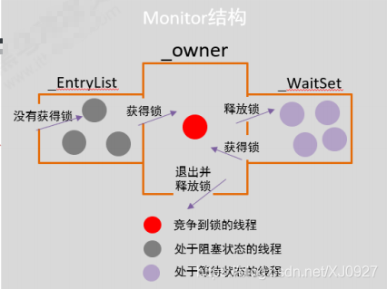
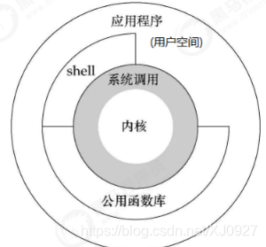

## synchronized 原理
synchronized同步语句块的实现使⽤的是 monitorenter和monitorexit指令，其中monitorenter指令指向同步代码块的开始位置，monitorexit 指令则指明同步代码块的结束位置。 

当执⾏monitorenter指令时，线程试图获取锁也就是获取monitor(monitor对象存在于每个Java对象的对象头中，synchronized 锁便是通过这种⽅式获取锁的，也是为什么Java中任意对象可以作为锁的原因)的持有权。

当计数器为0则可以成功获取，获取后将锁计数器设为1也就是加1。相应的在执⾏monitorexit指令后，将锁计数器设为0，表明锁被释放。如果获取对象锁失败，那当前线程就要阻塞等待，直到锁被另外⼀个线程释放为⽌。

## monitor
### monitor监视器锁
monitor主要结构如下：
```java
ObjectMonitor() { 
    _header = NULL; 
    _count = 0;
    _waiters = 0，
    _recursions = 0; // 线程的重入次数
	_object = NULL; // 存储该monitor的对象
    _owner = NULL; // 标识拥有该monitor的线程
    _WaitSet = NULL; // 处于wait状态的线程，会被加入到
    _WaitSet
    _WaitSetLock = 0 ;
    _Responsible = NULL; 
    _succ = NULL;
    _cxq = NULL; // 多线程竞争锁时的单向列表 
    FreeNext = NULL;
    _EntryList = NULL; // 处于等待锁block状态的线程，会被加入到该列表 
    _SpinFreq = 0;
    _SpinClock = 0;
    OwnerIsThread = 0;
}
```
* _owner：初始时为NULL。当有线程占有该monitor时，owner标记为该线程的唯一标识。当线程释放monitor时，owner又恢复为NULL。owner是一个临界资源，JVM是通过CAS操作来保证其线程安全的。
* _cxq：竞争队列，所有请求锁的线程首先会被放在这个队列中（单向链接）。_cxq是一个临界资源，JVM通过CAS原子指令来修改_cxq队列。修改前_cxq的旧值填入了node的next字段，_cxq指向新值（新线程）。因此_cxq是一个后进先出的stack（栈）。
* _EntryList：_cxq队列中有资格成为候选资源的线程会被移动到该队列中。
* _WaitSet：因为调用wait方法而被阻塞的线程会被放在该队列中。



### monitor竞争
* 通过CAS尝试把monitor的owner字段设置为当前线程。
* 如果设置之前的owner指向当前线程，说明当前线程再次进入monitor，即重入锁，执行recursions ++，记录重入的次数。
* 如果当前线程是第一次进入该monitor，设置`recursions`为1，`_owner`为当前线程，该线程成功获得锁并返回。
* 如果获取锁失败，则等待锁的释放。

### monitor等待
* 当前线程被封装成ObjectWaiter对象node，状态设置成ObjectWaiter::TS_CXQ。
* 在for循环中，通过CAS把node节点push到_cxq列表中，同一时刻可能有多个线程把自己的node节点push到_cxq列表中。
* node节点push到_cxq列表之后，通过自旋尝试获取锁，如果还是没有获取到锁，则通过park将当前线程挂起，等待被唤醒。
* 当该线程被唤醒时，会从挂起的点继续执行，通过 ObjectMonitor::TryLock尝试获取锁。

### monitor释放
退出同步代码块时会让_recursions减1，当recursions的值减为0时，说明线程释放了锁。
根据不同的策略（由QMode指定），从cxq或EntryList中获取头节点，通过ObjectMonitor::ExitEpilog方法唤醒该节点封装的线程，唤醒操作最终由unpark完成。

### monitor是重量级锁
执行同步代码块，没有竞争到锁的对象会park()被挂起，竞争到锁的线程会unpark()唤醒，这个时候就会存在操作系统用户态和内核态的转换，这种切换会消耗大量的系统资源。
所以synchronized是Java语言中是一个重量级(Heavyweight)的操作。



## synchronized 可重入实现原理
synchronized的实现重入是在JVM层面，JAVA对象头MARK WORD中便藏有线程ID和计数器来对当前线程做重入判断，避免每次CAS。

当一个线程访问同步块并获取锁时，会在对象头和栈帧中的锁记录里存储偏向的线程ID，以后该线程在进入和退出同步块时不需要进行CAS操作来加锁和解锁，只需简单测试一下对象头的Mark Word里是否存储着指向当前线程的偏向锁。

如果测试成功，表示线程已经获得了锁。
如果测试失败，则需要再测试一下Mark Word中偏向锁标志是否设置成1：没有则CAS竞争；设置了，则CAS将对象头偏向锁指向当前线程。

再维护一个计数器，同个线程进入则自增1，离开再减1，直到为0才能释放


synchronized 实现原理 https://blog.csdn.net/XJ0927/article/details/108684346


