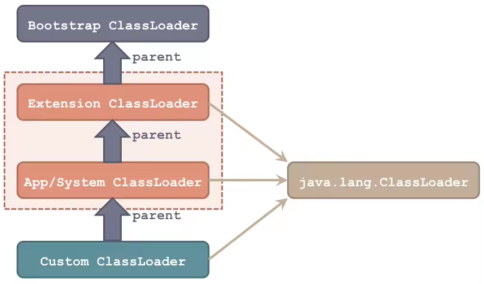

### 类加载器的层次
Java默认提供三个类加载器，按照层次关系（ 非继承关系，只是类加载器的父子关系，通过classloader.getParent()获取父类加载器 ）如下图所示：

* Bootstrap Class Loader： 启动类加载器，是Java类加载层次中最顶层的类加载器，负责加载JDK中的核心类库，如：rt.jar、resources.jar、charsets.jar等；
* Extension ClassLoader： 扩展类加载器，负责加载Java的扩展类库，默认加载JAVA_HOME/jre/lib/ext/目录下的所有jar；
* App/System Class Loader： 系统类加载器，负责加载应用程序CLASSPATH目录下的所有jar和class文件。

除了Java默认提供的三个ClassLoader之外，用户还可以根据需要实现自定义的 Custom ClassLoader，这些自定义的ClassLoader都必须继承自java.lang.ClassLoader类。
Java提供的两个ClassLoader：ExtClassLoader和AppClassLoader也都继承自java.lang.ClassLoader，但是Bootstrap ClassLoader不继承自ClassLoader，因为它不是一个普通的Java类，底层由C++编写，已嵌入到了JVM内核当中，当JVM启动后，Bootstrap ClassLoader也随着启动，负责加载完核心类库后，并构造ExtClassLoader和AppClassLoader。

### 双亲委派
JVM在加载类时默认采用的是双亲委派机制。

通俗的讲，就是某个类加载器在执行loadClass()操作时，会首先将加载类的任务委派给自己的父classloader，而父classloader在执行loadClass()操作时，又会继续委派给它的父classloader，依次向上...直到最顶层的Bootstrap ClassLoader。
如果某个层次上的父classloader可以成功加载到目标class，则返回； 只有当父classloader加载不到目标class时，才会由当前的classloader进行加载。

### 反双亲委派
而在Tomcat等应用容器中，则采用了另一种类加载机制：`反双亲委派`。
即某个类加载器在执行loadClass()操作时，会首先尝试从自己的ClASSPATH下加载类，只有在加载不到时，才会委派给父classloader帮他加载。
这样就能保证应用加载到的一些三方jar中的类，是自己应用lib目录下依赖的版本了。

说明：
应用容器在实现反双亲委派时，会对`Java核心类库中的类`按照全类名进行过滤，保证Java核心类库中的类是从Bootstrap ClassLoader加载到的。
