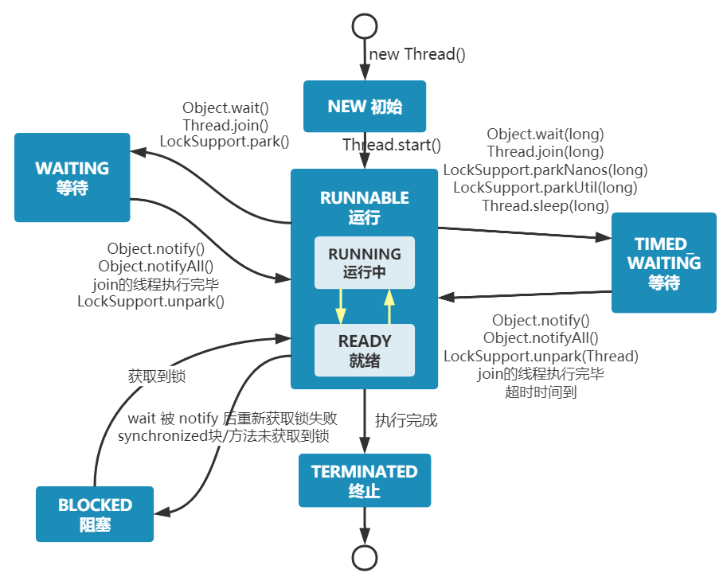

## ⭐️说说线程的生命周期和状态?
Java 线程在运行的生命周期中的指定时刻只可能处于下面 6 种不同状态的其中一个状态：
1. NEW: 初始状态，线程被创建出来但没有被调用 start() 。
2. RUNNABLE: 运行状态，线程被调用了 start()等待运行的状态。
3. BLOCKED：阻塞状态，需要等待锁释放。
4. WAITING：等待状态，表示该线程需要等待其他线程做出一些特定动作（通知或中断）。
5. TIME_WAITING：超时等待状态，可以在指定的时间后自行返回而不是像 WAITING 那样一直等待。
6. TERMINATED：终止状态，表示该线程已经运行完毕。线程在生命周期中并不是固定处于某一个状态而是随着代码的执行在不同状态之间切换。

## Thread#sleep() 方法和 Object#wait() 方法对 比
共同点：两者都可以暂停线程的执行。
区别：
* sleep() 方法没有释放锁，而 wait() 方法释放了锁 。
* wait() 通常被用于线程间交互/通信，sleep()通常被用于暂停执行。
* wait() 方法被调用后，线程不会自动苏醒，需要别的线程调用同一个对象上的 notify()或者 notifyAll() 方法。 sleep()方法执行完成后，线程会自动苏醒，或者也可以使用 wait(long timeout) 超时后线程会自动苏醒。
* sleep() 是 Thread 类的静态本地方法，wait() 则是 Object 类的本地方法。

## 为什么 wait() 方法不定义在 Thread 中？
wait() 是让获得对象锁的线程实现等待，会自动释放当前线程占有的对象锁。每个对象（Object）都拥有对象锁，既然要释放当前线程占有的对象锁并让其进入 WAITING 状态，自然是要操作对应的对象（Object）而非当前的线程（Thread）。

类似的问题：为什么 sleep() 方法定义在 Thread 中？

因为 sleep() 是让当前线程暂停执行，不涉及到对象类，也不需要获得对象锁。