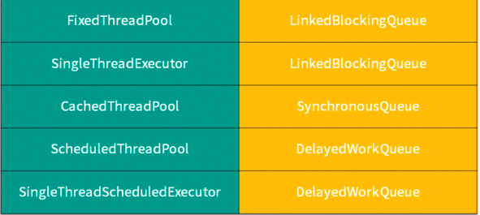

# 线程池
优点:通过复用已创建的线程，降低资源损耗、线程可以直接处理队列中的任务加快响应速度、同时便于统一监控 和管理。
 
## 线程池构造函数
```java
/**
 * 线程池构造函数7大参数
*/
public ThreadPoolExecutor(int corePoolSize,int maximumPoolSize,long keepAliveTime,
TimeUnit unit,BlockingQueue<Runnable> workQueue,ThreadFactory threadFactory, RejectedExecutionHandler handler) {}


```
参数说明
```bash
corePoolSize 核心线程池大小
maximumPoolSize 最大线程池大小
keepAliveTime 线程池中超过 corePoolSize 数目的空闲线程最大存活时间;
TimeUnit keepAliveTime 时间单位
workQueue 阻塞任务队列
threadFactory 新建线程工厂
RejectedExecutionHandler  拒绝策略。当提交任务数超过 maxmumPoolSize+workQueue 之和时，任务会交给RejectedExecutionHandler 来处理
```

1. 当线程池小于corePoolSize，新提交任务将创建一个新线程执行任务，即使此时线程池中存在空闲线程。
2. 当线程池达到corePoolSize时，新提交任务将被放入 workQueue 中，等待线程池中任务调度执行。
3. 当workQueue已满，且 maximumPoolSize 大于 corePoolSize 时，新提交任务会创建新线程执行任务。 
4. 当提交任务数超过 maximumPoolSize 时，新提交任务由 RejectedExecutionHandler 处理。
5. 当线程池中超过corePoolSize 线程，空闲时间达到 keepAliveTime 时，关闭空闲线程。


## 3. 线程拒绝策略
线程池中的线程已经用完了，无法继续为新任务服务，同时等待队列也已经排满了，再也塞不下新任务了。这时 候我们就需要拒绝策略机制合理的处理这个问题。

JDK 内置的拒绝策略如下:
* AbortPolicy: 直接抛出异常，阻止系统正常运行。可以根据业务逻辑选择重试或者放弃提交等策略。 
* CallerRunsPolicy : 如果线程池满，则将新提交的任务交给调用者所在的线程去执行,也就是直接在调用execute方法的线程中运行(run)被拒绝的任务,如果执行程序已关闭，则会丢弃该任务。
* DiscardOldestPolicy : 丢弃最老的一个请求，也就是即将被执行的任务，并尝试再次提交当前任务。 
* DiscardPolicy : 该策略默默地丢弃无法处理的任务，不予任何处理。如果允许任务丢失，这是最好的一种方案。

## Execuors类实现线程池


* newSingleThreadExecutor():只有一个线程的线程池，任务是顺序执行，适用于一个一个任务执行的场景
* newCachedThreadPool():线程池里有很多线程需要同时执行，60s内复用，适用执行很多短期异步的小程
序或者负载较轻的服务
* newFixedThreadPool():拥有固定线程数的线程池，如果没有任务执行，那么线程会一直等待，适用执行长 期的任务。
* newScheduledThreadPool():用来调度即将执行的任务的线程池
* newWorkStealingPool():底层采用forkjoin的Deque，采用独立的任务队列可以减少竞争同时加快任务处理

FixedThreadPool 和 SingleThreadExecutor : 允许请求的队列⻓度为 Integer.MAXVALUE，会导致OOM。 

CachedThreadPool 和 ScheduledThreadPool : 允许创建的线程数量为 Integer.MAXVALUE，会导致 OOM。
手动创建的线程池底层可以使用ArrayBlockingQueue防止OOM。

## 线程池大小设置
* CPU 密集型(n+1)
CPU 密集的意思是该任务需要大量的运算，而没有阻塞，CPU 一直全速运行。 
CPU 密集型任务尽可能的少的线程数量，一般为 CPU 核数 + 1 个线程的线程池。

* IO 密集型(2*n)
由于 IO 密集型任务线程并不是一直在执行任务，可以多分配一点线程数，如 CPU * 2 也可以使用公式:CPU 核心数 *(1+平均等待时间/平均工作时间)。