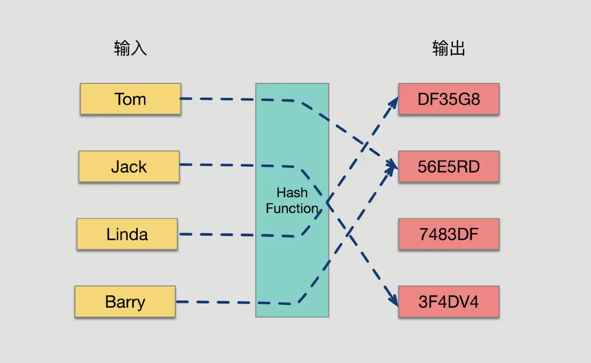
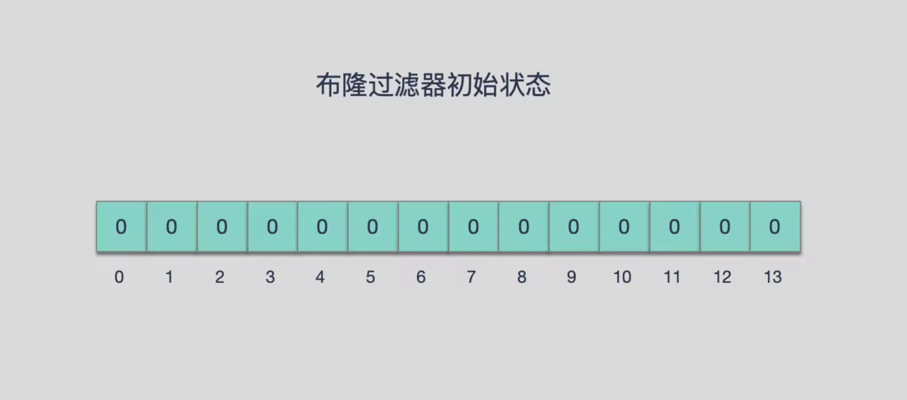
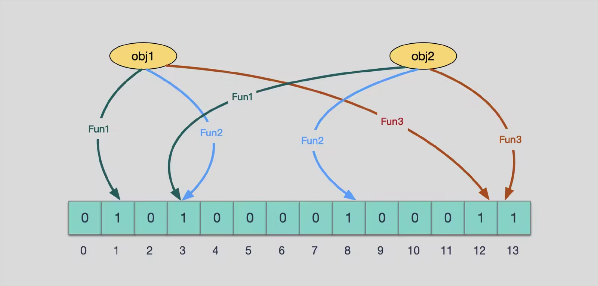

## 布隆过滤器
布隆过滤器（英语：Bloom Filter）是 1970 年由布隆提出的。它实际上是一个很长的二进制向量和一系列随机映射函数。
主要用于判断一个元素是否在一个集合中。它的优点是空间效率和查询时间都比一般的算法要好的多，缺点是有一定的误识别率和删除困难。 

特点总结为如下：
1. 空间效率高的概率型数据结构，用来检查一个元素是否在一个集合中
2. 对于一个元素检测是否存在的调用，BloomFilter会告诉调用者两个结果之一：可能存在或者一定不存在

### 为什么需要BloomFilter
如果想要判断一个元素是不是在一个集合里，一般想到的是将所有元素保存起来，然后通过比较确定的 链表、树等等数据结构都是这种思路。
但是随着集合中元素的增加，我们需要的存储空间越来越大，检索速度也越来越慢(O(n),O(logn))。

还有一种叫作散列表（又叫哈希表，Hash table）的数据结构。它可以通过一个Hash函数将一个元素映射成一个位阵列（Bit array）中的一个点。
这样一来，我们只要看看这个点是不是1就可以知道集合中有没有它了，这就是布隆过滤器的基本思想。 
但是随着集合中元素的增加，我们需要的存储空间也会呈现线性增长，最终达到瓶颈。同时检索速度也越来越慢。这个时候，布隆过滤器（Bloom Filter）就应运而生。

## 布隆过滤器原理

### 哈希函数原理
哈希函数的概念是：将任意大小的输入数据转换成特定大小的输出数据的函数，转换后的数据称为哈希值或哈希编码，也叫散列值。下面是一幅示意图：

所有散列函数都有如下基本特性：
* 如果两个散列值是不相同的（根据同一函数），那么这两个散列值的原始输入也是不相同的。这个特性是散列函数具有确定性的结果，具有这种性质的散列函数称为`单向散列函数`。
* 散列函数的输入和输出不是唯一对应关系的，如果两个散列值相同，两个输入值很可能是相同的，但也可能不同，这种情况称为`散列碰撞（collision）`。

但是用 hash表存储大数据量时，空间效率还是很低，当只有一个 hash 函数时，还很容易发生哈希碰撞。

### 布隆过滤器原理
布隆过滤器（Bloom Filter）的核心实现是一个超大的位数组和几个哈希函数。

BloomFilter 是由一个固定大小的二进制向量或者位图（bitmap）和一系列映射函数组成的。在初始状态时，对于长度为 m 的位数组，它的所有位都被置为0，如下图所示：

当有变量被加入集合时，通过 K 个映射函数将这个变量映射成位图中的 K 个点，把它们置为 1（假定有两个变量都通过 3 个映射函数）。

查询某个变量的时候我们只要看看这些点是不是都是 1 就可以大概率知道集合中有没有它了。

1. 如果这些点有任何一个 0，则被查询变量一定不在；
2. 如果都是 1，则被查询变量很可能存在

为什么说是可能存在，而不是一定存在呢？那是因为映射函数本身就是散列函数，散列函数是会有碰撞的。

#### 误判率
布隆过滤器的误判是指多个输入经过哈希之后在相同的bit位置1了，这样就无法判断究竟是哪个输入产生的，因此误判的根源在于相同的 bit 位被多次映射且置 1。

这种情况也造成了布隆过滤器的删除问题，因为布隆过滤器的每一个 bit 并不是独占的，很有可能多个元素共享了某一位。如果我们直接删除这一位的话，会影响其他的元素。(比如上图中的第 3 位)

#### 特性
1. 一个元素如果判断结果为存在的时候元素不一定存在，但是判断结果为不存在的时候则一定不存在。
2. 布隆过滤器可以添加元素，但是不能删除元素。因为删掉元素会导致误判率增加。

#### 优点
1. 相比于其它的数据结构，布隆过滤器在空间和时间方面都有巨大的优势。 布隆过滤器存储空间和插入/查询时间都是常数 O(K)O(K)，
2. 散列函数相互之间没有关系，方便由硬件并行实现。布隆过滤器不需要存储元素本身，在某些对保密要求非常严格的场合有优势。

布隆过滤器可以表示全集，其它任何数据结构都不能；

#### 缺点
但是布隆过滤器的缺点和优点一样明显。
1. 误算率是其中之一。
随着存入的元素数量增加，误算率随之增加。但是如果元素数量太少，则使用散列表足矣。

2. 一般情况下不能从布隆过滤器中删除元素。我们很容易想到把位数组变成整数数组，每插入一个元素相应的计数器加 1, 这样删除元素时将计数器减掉就可以了。然而要保证安全地删除元素并非如此简单。首先我们必须保证删除的元素的确在布隆过滤器里面。这一点单凭这个过滤器是无法保证的。另外计数器回绕也会造成问题。

在降低误算率方面，有不少工作，使得出现了很多布隆过滤器的变种。

## 使用场景 
在程序的世界中，布隆过滤器是程序员的一把利器，利用它可以快速地解决项目中一些比较棘手的问题。

如网页 URL 去重、垃圾邮件识别、大集合中重复元素的判断和缓存穿透等问题。

布隆过滤器的典型应用有：
1. 数据库防止穿库。 
Google Bigtable，HBase 和 Cassandra 以及 Postgresql 使用BloomFilter来减少不存在的行或列的磁盘查找。避免代价高昂的磁盘查找会大大提高数据库查询操作的性能。

2. 业务场景中判断用户是否阅读过某视频或文章
比如抖音或头条，当然会导致一定的误判，但不会让用户看到重复的内容。

3. 缓存宕机、缓存击穿场景
一般判断用户是否在缓存中，如果在则直接返回结果，不在则查询db。如果来一波冷数据，会导致缓存大量击穿，造成雪崩效应，这时候可以用布隆过滤器当缓存的索引，只有在布隆过滤器中，才去查询缓存，如果没查询到，则穿透到db;如果不在布隆器中，则直接返回。

4. WEB拦截器
如果相同请求则拦截，防止重复被攻击。用户第一次请求，将请求参数放入布隆过滤器中，当第二次请求时，先判断请求参数是否被布隆过滤器命中。可以提高缓存命中率。
Squid 网页代理缓存服务器在 cache digests 中就使用了布隆过滤器。
Google Chrome浏览器使用了布隆过滤器加速安全浏览服务

