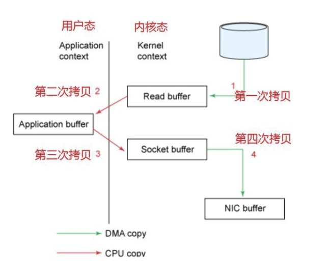
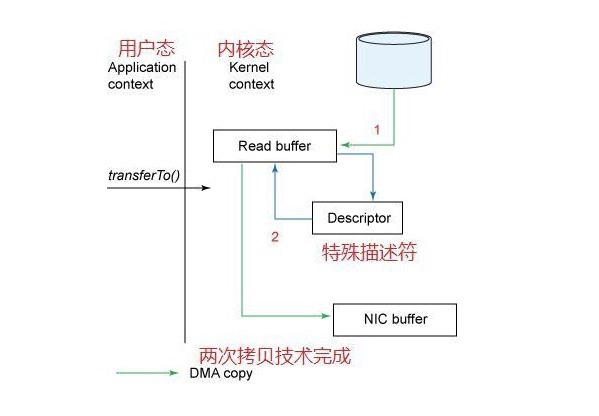
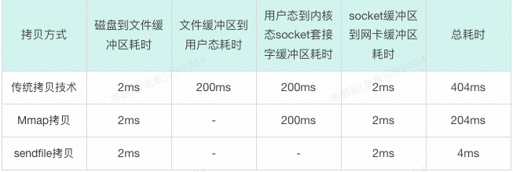

## 正常IO拷贝
用户进程读取一段数据，传统的拷贝方案如下，经过4次文件拷贝：
磁盘---1--->文件缓冲区---2--->应用缓存区---3--->网络套接字socket缓冲区---4--->网卡缓冲区

现在我们可以看到1->2->3->4的整个过程一共经历了四次拷贝的方式，但是`真正消耗资源和浪费时间的是第二次和第三次，因为这两次都需要经过我们的CPU拷贝，而且还需要内核态和用户态之间的来回切换。`
想想看，我们的CPU资源是多么宝贵，要处理大量的任务。还要去拷贝大量的数据。如果能把CPU的这两次拷贝给去除掉，岂不快哉！！！既能节省CPU资源，还可以避免内核态和用户态之间的切换。

## 零拷贝方案
零拷贝目前了解到的主要有两种方式：

a、Mmap：内存映射，在磁盘划分出一块区域，这块区域的地址和内存区域做直接映射，减少一次从内核态到用户态的文件拷贝，做到三次拷贝，显著提高拷贝速度。

b、send file：文件描述符拷贝，也就是下图所示的拷贝方案，去除内核态到用户态的转换，直接在内核态通过文件描述符进行拷贝的技术。
DMA(Direct Memory Access，直接存储器访问)

### IO传输性能对比

