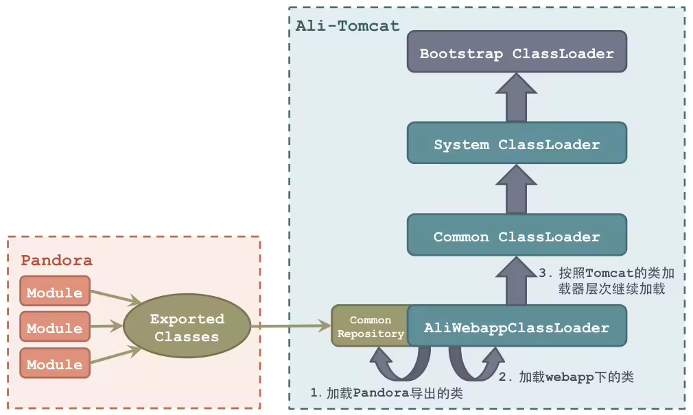
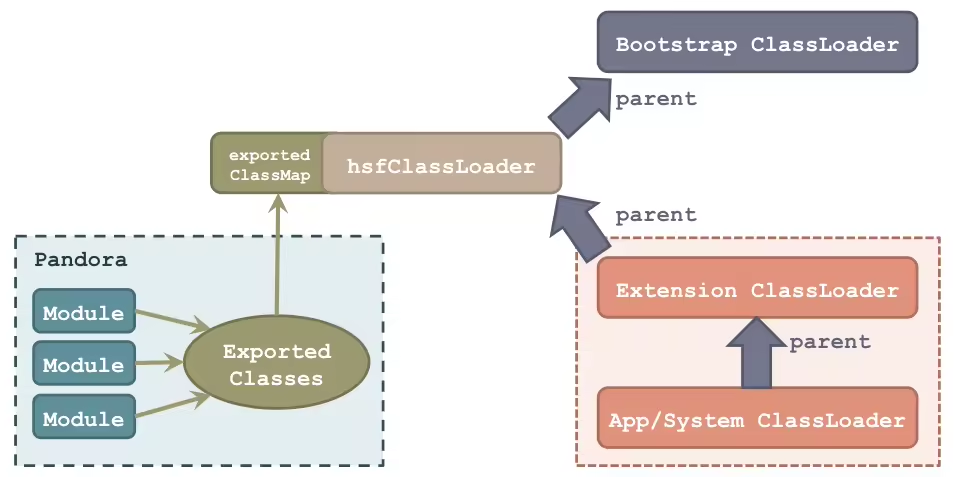

Pandora是脱身于HSF 1.X的轻量级隔离容器，从HSF 2.X起，“隔离”的功能被独立的交付给Pandora，HSF通过运行在Pandora容器中来实现与业务代码和其他中间件代码的隔离。
你可以暂且把它理解成taobao-hsf.sar，它用来隔离`Webapp和中间件`的依赖，也用来隔离`中间件之间`的依赖。

Pandora实现了以下两种“隔离”：  

* 依赖隔离： 能够隔离中间件与应用、中间件与中间件之间的隔离，让其相互之间互不影响
* 部署隔离： 部署和应用分离，中间件升级相对于应用透明
此外，Pandora还实现了：
* 中间件的 生命周期管理：主要面向于运行在Pandora中的中间件插件

## Pandora 的工作原理
在介绍Pandora的工作原理之前，首先需要明确一个概念： 在JVM中，一个类型实例是通过它的全类名和加载它的类加载器（ClassLoader）来唯一确定的 。
因此，如果要做到“隔离”，就让不同的类加载器去加载需要隔离的类就可以了。

### 类加载器的层次
Java默认提供三个类加载器，按照层次关系（ 非继承关系，只是类加载器的父子关系，通过classloader.getParent()获取父类加载器 ）如下图所示：

* Bootstrap Class Loader： 启动类加载器，是Java类加载层次中最顶层的类加载器，负责加载JDK中的核心类库，如：rt.jar、resources.jar、charsets.jar等；
* Extension ClassLoader： 扩展类加载器，负责加载Java的扩展类库，默认加载JAVA_HOME/jre/lib/ext/目录下的所有jar；
* App/System Class Loader： 系统类加载器，负责加载应用程序CLASSPATH目录下的所有jar和class文件。

除了Java默认提供的三个ClassLoader之外，用户还可以根据需要实现自定义的 Custom ClassLoader，这些自定义的ClassLoader都必须继承自java.lang.ClassLoader类。
Java提供的两个ClassLoader：ExtClassLoader和AppClassLoader也都继承自java.lang.ClassLoader，但是Bootstrap ClassLoader不继承自ClassLoader，因为它不是一个普通的Java类，底层由C++编写，已嵌入到了JVM内核当中，当JVM启动后，Bootstrap ClassLoader也随着启动，负责加载完核心类库后，并构造ExtClassLoader和AppClassLoader。

### 双亲委派
JVM在加载类时默认采用的是双亲委派机制。

通俗的讲，就是某个类加载器在执行loadClass()操作时，会首先将加载类的任务委派给自己的父classloader，而父classloader在执行loadClass()操作时，又会继续委派给它的父classloader，依次向上...直到最顶层的Bootstrap ClassLoader。
如果某个层次上的父classloader可以成功加载到目标class，则返回； 只有当父classloader加载不到目标class时，才会由当前的classloader进行加载。

### 反双亲委派
而在Tomcat等应用容器中，则采用了另一种类加载机制：`反双亲委派`。
即某个类加载器在执行loadClass()操作时，会首先尝试从自己的ClASSPATH下加载类，只有在加载不到时，才会委派给父classloader帮他加载。
这样就能保证应用加载到的一些三方jar中的类，是自己应用lib目录下依赖的版本了。

说明：
应用容器在实现反双亲委派时，会对`Java核心类库中的类`按照全类名进行过滤，保证Java核心类库中的类是从Bootstrap ClassLoader加载到的。

### Pandora 启动机制及原理 

Ali-Tomcat扩展了 WebAppClassLoader，构造了自己的 AliWebappClassloader，来对应用类加载过程做一些干预。

* Ali-Tomcat在启动过程中，会反射调用Pandora的启动类，完成Pandora的启动。
* Pandora在启动过程中会完成Sar包中插件（Module）的部署，并针对每一个插件的类导出配置，将需要导出的类进行导出（这些类一般是中间件希望提供给应用使用的Client API），并以 <全类名，Class实例> 的 Key-Value 结构存储在一个大概叫做 ExportedClasses 的Map中。
* Ali-Tomcat在Pandora启动完成后、应用部署之前，会调用Pandora容器的 getExportedClasses() 方法，将这些导出类缓存在AliWebappClassLoader的成员变量commonRepository中。
* 当webapp需要进行类加载时，它所对应的 AliWebappClassloader实例会首先尝试从commonRepository中进行类加载 ，如果加载到，就返回；若加载不到，才会继续按照Apache Tomcat的原有反双亲委派类加载流程进行类加载。 从而保证应用加载到的中间件的类是sar包中，而非自己lib目录下依赖的。

## 扩展：HSF LightApi 不依赖 Pandora SAR包也可以使用中间件原理
如果希望脱离应用容器使用HSF或者Sar包中的其他插件，可以使用 HSF LightApi。

HSF LightApi以main函数启动，无需应用容器。它的原理其实与Ali-Tomcat启动Pandora的原理十分类似，即：
* 1. 反射调用启动Pandora
* 2. 创建类加载器，插入加载应用CLASSPATH之前进行类加载，从而优先加载Sar包中导出的类

关于第二点的细节，我们可以看 com.taobao.hsf.standalone.HSFMiniContainer 类的start() 方法，它 在ExtClassLoader和Bootstrap ClassLoader之间插入了一个自定义的URLClassLoader（hsfClassLoader） 。
hsfClassLoader会从Pandora的 exportedClasses 中捞一把，如果成功加载到导出类，就返回；否则继续走原有的类加载流程。

注意，此时我们并未更改Java默认的双亲委派的类加载策略，因此这个自定义的URLClassLoader加载类的顺序将优先于应用ClASSPATH的AppClassLoader。

HSFMiniContainer.start()方法执行完毕后，构建出的类加载器层次如下图所示：

因此，我们需要在应用加载任何导出类（例如，HSFSpringProviderBean）之前就构建好这个类加载器层次，否则应用就会加载到自己应用CLASSPATH下的相关类实例，引发一系列问题。
这就是为什么我们强调， 在脱离容器使用HSF时，必须要在main方法第一行执行HSFEasyStarter.start()。更准确的说，是在应用加载任何Sar包提供的类之前启动HSF 。