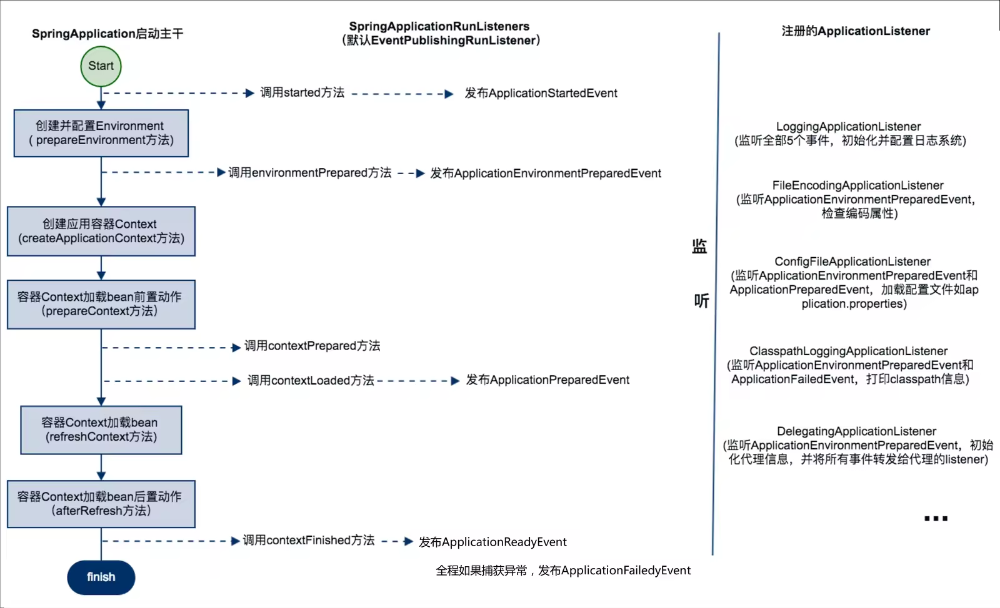

# Spring-boot启动

总结一下Spring Boot应用启动主干，两大步：构造SpringApplication实例和执行run方法。

SpringApplication实例的构造过程，主要流程是：

1. SpringApplication设置sources属性
2. 推断断是否是web程序并设置到webEnvironment属性中
3. 找出并设置所有的初始化器
4. 找出并设置所有的监听器
5. 找出并设置运行的主类

SpringApplication实例run方法执行过程，事件机制发挥很重要的作用，主要流程是：

1. 加载SpringApplicationRunListeners，为后续事件机制做准备
2. 配置应用环境信息（environment）
3. 创建容器
4. 容器刷新的前置动作，执行初始化器
5. 容器刷新
6. 容器刷新的后置动作，执行runner

```java
@SpringBootApplication
public class Application {
    public static void main(String[] args) {
        SpringApplication.run(Application.class, args);
    }
}
```

## @SpringBootApplication注解
简单讨论下主类上的@SpringBootApplication注解。我们先看这个注解的定义：
```java
@Target(ElementType.TYPE)
@Retention(RetentionPolicy.RUNTIME)
@Documented
@Inherited
@SpringBootConfiguration
@EnableAutoConfiguration
@ComponentScan(excludeFilters = @Filter(type = FilterType.CUSTOM, classes = TypeExcludeFilter.class))
public @interface SpringBootApplication {
    ...
}
```

这里可以看出，这个@SpringBootApplication是@SpringBootConfiguration, @EnableAutoConfiguration, @ComponentScan三个注解的组合注解。
如果不用@SpringBootApplication组合注解，换成@Configuration + @EnableAutoConfiguration + @ComponentScan三个注解，效果是一样的。
为什么组合？是因为这三个注解常放一起用，组合成一个用起来更方便。那这三个注解分别什么意义呢？
* @SpringBootConfiguration：包装了@Configuration，告诉容器该类是一个拥有bean定义和依赖项的配置类。Spring Boot做到抛弃xml，使用纯Java类做配置，@Configuration立了大功。
* @ComponentScan：自动扫描，相当于Spring中的<context:component-scan>, 可以使用basePackages指定要扫描的包，并可以指定扫描的条件。默认扫描@ComponentScan注解所在类(一般是入口类Application)的同级类和同级目录下的类，所以我们一般会把入口类Application放在源码包(src)的第一层目录，保证src目录下的所有类都被扫描到。
* @EnableAutoConfiguration：自动配置，根据依赖的jar包进行最大化的默认配置。

这其中，@EnableAutoConfiguration最体现Spring Boot新特性，他是Spring Boot自动配置的源头。

## Main方法
Spring Boot启动的重头戏都在main方法里。入口类Application中的public static void main(String[] args)方法，这是一个标准的Java程序入口。
在这个main方法中，执行了SpringApplication类的静态run方法，并将一个Application类和main方法参数args作为参数传递进去。

我们看SpringApplication类的静态run方法： 
```java
public static ConfigurableApplicationContext run(Object[] sources, String[] args) {
    return new SpringApplication(sources).run(args);
}
```
先构造一个SpringApplication实例，然后调用该实例的run方法。那我们就分两步来看，先看SpringApplication实例的构造过程，再看run方法的执行过程。

## SpringApplication实例的构造过程
SpringApplication的构造方法中直接进行了环境初始化，所有的构造过程都在该方法里。
注：基于 `Spring-Boot-2.0.2.RELEASE`
```java
public SpringApplication(ResourceLoader resourceLoader, Class<?>... primarySources) {
    this.sources = new LinkedHashSet();
    this.bannerMode = Mode.CONSOLE;
    this.logStartupInfo = true;
    this.addCommandLineProperties = true;
    this.headless = true;
    this.registerShutdownHook = true;
    this.additionalProfiles = new HashSet();
    this.resourceLoader = resourceLoader;
    Assert.notNull(primarySources, "PrimarySources must not be null");
    // 1. 设置SpringApplication实例的sources属性
    this.primarySources = new LinkedHashSet(Arrays.asList(primarySources));
    // 2. 推断是否web应用
    this.webApplicationType = this.deduceWebApplicationType();
    // 3. 查找并加载所有可用的ApplicationContextInitializer
    this.setInitializers(this.getSpringFactoriesInstances(ApplicationContextInitializer.class));
    // 4. 查找并加载所有可用的ApplicationListener
    this.setListeners(this.getSpringFactoriesInstances(ApplicationListener.class));
    // 5. 推断并设置main方法所在类
    this.mainApplicationClass = this.deduceMainApplicationClass();
}
```

### Step1. 设置SpringApplication实例的sources属性
sources属性就是我们传给SpringApplication.run方法的参数，当前就是Application.class。

### Step2. 推断是否是web应用

推断的方法是扫描classpath下是否存在两个web应用特征类javax.servlet.Servlet和org.springframework.web.context.ConfigurableWebApplicationContext，
如果存在则是web应用（WebEnvironment），反之则是标准应用（StandardEnvironment）。我们一般引入了web相关的jar包，随之引入这两个类也就会被判断为web应用了。
```java
// web应用特征类
private static final String[] WEB_ENVIRONMENT_CLASSES = new String[]{"javax.servlet.Servlet", "org.springframework.web.context.ConfigurableWebApplicationContext"};

// 推断是否是web应用
private WebApplicationType deduceWebApplicationType() {
    if (ClassUtils.isPresent("org.springframework.web.reactive.DispatcherHandler", (ClassLoader)null) && !ClassUtils.isPresent("org.springframework.web.servlet.DispatcherServlet", (ClassLoader)null)) {
        return WebApplicationType.REACTIVE;
    } else {
        String[] var1 = WEB_ENVIRONMENT_CLASSES;
        int var2 = var1.length;

        for(int var3 = 0; var3 < var2; ++var3) {
            String className = var1[var3];
            if (!ClassUtils.isPresent(className, (ClassLoader)null)) {
                return WebApplicationType.NONE;
            }
        }

        return WebApplicationType.SERVLET;
    }
}
```

### Step3. 查找并加载所有可用的ApplicationContextInitializer

ApplicationContextInitializer是应用初始化器，在应用刷新容器之前做一些初始化的工作。如需定制，新增扩展类并覆写initialize方法即可。
```java
public interface ApplicationContextInitializer<C extends ConfigurableApplicationContext> {
    void initialize(C applicationContext);
}
```

查找并加载所有可用的ApplicationContextInitializer
```java
private <T> Collection<T> getSpringFactoriesInstances(Class<T> type) {
    return this.getSpringFactoriesInstances(type, new Class[0]);
}
```

1.首先通过SpringFactoriesLoader查找到所有的ApplicationContextInitializer类，然后实例化这些类
```java
/**
 * 查找并加载所有可用的ApplicationContextInitializer
 */
private <T> Collection<T> getSpringFactoriesInstances(Class<T> type, Class<?>[] parameterTypes, Object... args) {
    // 获取ClassLoader 
    ClassLoader classLoader = Thread.currentThread().getContextClassLoader();
    // 查找到所有的ApplicationContextInitializer类
    Set<String> names = new LinkedHashSet(SpringFactoriesLoader.loadFactoryNames(type, classLoader));

    // 实例化所有的ApplicationContextInitializer类
    List<T> instances = this.createSpringFactoriesInstances(type, parameterTypes, classLoader, args, names);

    // 排序
    AnnotationAwareOrderComparator.sort(instances);
    return instances;
}
```

2. SpringFactoriesLoader怎么查找到所有的ApplicationContextInitializer类的呢？
   SpringFactoriesLoader从classpath里找到所有的`META-INF/spring.factories`文件，然后遍历地解析spring.factories文件， 找出所有ApplicationContextInitializer类。
```java
private static Map<String, List<String>> loadSpringFactories(@Nullable ClassLoader classLoader) {
    MultiValueMap<String, String> result = (MultiValueMap)cache.get(classLoader);
    if (result != null) {
        return result;
    } else {
        try {
            //1.  获取classpath下所有的"META-INF/spring.factories"文件
            Enumeration<URL> urls = classLoader != null ? classLoader.getResources("META-INF/spring.factories") : ClassLoader.getSystemResources("META-INF/spring.factories");
            MultiValueMap<String, String> result = new LinkedMultiValueMap();

            //2.  遍历所有的spring.factories文件
            while(urls.hasMoreElements()) {
                URL url = (URL)urls.nextElement();
                UrlResource resource = new UrlResource(url);
                Properties properties = PropertiesLoaderUtils.loadProperties(resource);
                Iterator var6 = properties.entrySet().iterator();

                while(var6.hasNext()) {
                    Map.Entry<?, ?> entry = (Map.Entry)var6.next();
                    
                    //3. 找出该spring.factories文件中ApplicationContextInitializer下的所有类
                    List<String> factoryClassNames = Arrays.asList(StringUtils.commaDelimitedListToStringArray((String)entry.getValue()));
                    result.addAll((String)entry.getKey(), factoryClassNames);
                }
            }

            cache.put(classLoader, result);
            return result;
        } catch (IOException var9) {
            IOException ex = var9;
            throw new IllegalArgumentException("Unable to load factories from location [META-INF/spring.factories]", ex);
        }
    }
}
```

### Step4. 查找并加载所有可用的ApplicationListener
ApplicationListener是应用事件监听器，监听应用事件(ApplicationEvent)。这是典型的Listenr模式，跟事件绑定，一旦发生某个事件，则做某个事情。
ApplicationListener可以监听某一个事件，也可以监听某一些事件，也可以监听所有事件，如清除容器缓存监听器ClearCachesApplicationListener只监听ContextRefreshedEvent事件，而日志监听器LoggingApplicationListener就绑定了所有事件。
如需定制ApplicationListener，新增扩展类覆写onApplicationEvent方法即可，参数为需要监听的事件类型。
```java
public interface ApplicationListener<E extends ApplicationEvent> extends EventListener {
    void onApplicationEvent(E event);
}
```

整个查找并加载ApplicationListener的过程和ApplicationContextInitializer一模一样，遍历classpath下所有spring.factories文件来查找ApplicationListener下的类，然后实例化。

明白了ApplicationContextInitializer和ApplicationListener的查找过程，我们再实际地找一个“META-INF/spring.factories“文件看看，就更清楚了。我们以org/springframework/boot/spring-boot/1.4.3.RELEASE/spring-boot-1.4.3.RELEASE-sources.jar下的spring.factories为例
```bash
# Application Context Initializers
org.springframework.context.ApplicationContextInitializer=\
org.springframework.boot.context.ConfigurationWarningsApplicationContextInitializer,\
org.springframework.boot.context.ContextIdApplicationContextInitializer,\
org.springframework.boot.context.config.DelegatingApplicationContextInitializer,\
org.springframework.boot.web.context.ServerPortInfoApplicationContextInitializer

# Application Listeners
org.springframework.context.ApplicationListener=\
org.springframework.boot.ClearCachesApplicationListener,\
org.springframework.boot.builder.ParentContextCloserApplicationListener,\
org.springframework.boot.context.FileEncodingApplicationListener,\
org.springframework.boot.context.config.AnsiOutputApplicationListener,\
org.springframework.boot.context.config.ConfigFileApplicationListener,\
org.springframework.boot.context.config.DelegatingApplicationListener,\
org.springframework.boot.context.logging.ClasspathLoggingApplicationListener,\
org.springframework.boot.context.logging.LoggingApplicationListener,\
org.springframework.boot.liquibase.LiquibaseServiceLocatorApplicationListener
```

我们可以看到spring.factories以k-v的形式组织的，所以当查找ApplicationContextInitializer时就会根据org.springframework.context.ApplicationContextInitializer这个key，拿到值并转化为list返回，这里有4个初始化器；当查找ApplicationListener时就会根据org.springframework.context.ApplicationListener这个key，拿到值并转化为list返回，这里有9个监听器。

### Step5. 推断并设置main方法所在类

找出main方法所在类的类名，并设置为SpringApplication的mainApplicationClass属性的值。
```java
private Class<?> deduceMainApplicationClass() {
    try {
        StackTraceElement[] stackTrace = (new RuntimeException()).getStackTrace();
        StackTraceElement[] var2 = stackTrace;
        int var3 = stackTrace.length;

        for(int var4 = 0; var4 < var3; ++var4) {
            StackTraceElement stackTraceElement = var2[var4];
            if ("main".equals(stackTraceElement.getMethodName())) {
                return Class.forName(stackTraceElement.getClassName());
            }
        }
    } catch (ClassNotFoundException var6) {
    }

    return null;
}
```

至此，SpringApplication实例化完成，做了一些容器启动前的必要准备工作，接着就是执行run方法启动容器。
事实上SpringApplication实例化时无论是推断web应用类型，还是加载ApplicationContextInitializer，还是ApplicationListener等都是有目的的，都会在接着run方法启动Spring容器的过程中发挥作用，拭目以待！

## SpringApplication.run方法执行过程

```java
public ConfigurableApplicationContext run(String... args) {
   // 实例化一个StopWatch(Spring core提供的任务执行观察器),主要用于计时
   StopWatch stopWatch = new StopWatch();
   stopWatch.start();
   ConfigurableApplicationContext context = null;
   // 错误处理器
   Collection<SpringBootExceptionReporter> exceptionReporters = new ArrayList<>();
   configureHeadlessProperty();

   // Step1：查找并加载所有可用的SpringApplicationRunListeners
   SpringApplicationRunListeners listeners = getRunListeners(args);
   // 发布start事件
   listeners.starting();
   try {
      // 构建应用的参数持有类
      ApplicationArguments applicationArguments = new DefaultApplicationArguments(args);
      
      // Step2：配置要使用的PropertySource以及Profile
      ConfigurableEnvironment environment = prepareEnvironment(listeners, applicationArguments);
      configureIgnoreBeanInfo(environment);

      // 打印应用启动Banner，默认ASCII码格式的SpringBoot就是这里输出的
      Banner printedBanner = printBanner(environment);

      // Step3：创建Spring容器
      context = createApplicationContext();
      exceptionReporters = getSpringFactoriesInstances(SpringBootExceptionReporter.class, new Class[] { ConfigurableApplicationContext.class }, context);

      // Step4：容器刷新的前置动作
      prepareContext(context, environment, listeners, applicationArguments, printedBanner);

      // Step5：容器刷新(IOC就在这里了)
      refreshContext(context);
      
      // Step6：容器刷新的后置动作        
      afterRefresh(context, applicationArguments);

      //stopWatch结束，记录了启动时间等信息
      stopWatch.stop();

      // 打启动日志
      if (this.logStartupInfo) {
         new StartupInfoLogger(this.mainApplicationClass)
                 .logStarted(getApplicationLog(), stopWatch);
      }
      listeners.started(context);
      // Step7: 调用所有的runner
      callRunners(context, applicationArguments);
   }
   catch (Throwable ex) {
      handleRunFailure(context, ex, exceptionReporters, listeners);
      throw new IllegalStateException(ex);
   }

   try {
      listeners.running(context);
   }
   catch (Throwable ex) {
      handleRunFailure(context, ex, exceptionReporters, null);
      throw new IllegalStateException(ex);
   }
   return context;
}
```

### Step1: 查找并加载所有可用的SpringApplicationRunListeners
> SpringApplicationRunListeners是所有SpringApplicationRunListener的集合。
> 那SpringApplicationRunListener和ApplicationListener什么区别？
> SpringApplicationRunListener实现类负责感知容器启动过程的各个阶段，并发布SpringApplicationEvent出去供ApplicationListener监听。

整个查找并加载SpringApplicationRunListeners的过程和ApplicationContextInitializer/ApplicationListener一模一样，遍历classpath下所有`spring.factories`文件来查找SpringApplicationRunListeners下的类，然后实例化。
spring-boot包下spring.factories文件里就一个EventPublishingRunListener，如下：
```java
# Run Listeners
org.springframework.boot.SpringApplicationRunListener=\
org.springframework.boot.context.event.EventPublishingRunListener
```
我们详细捋一下启动的事件传播过程。SpringApplicationRunListener定义了started/environmentPrepared/contextPrepared/contextLoaded/finished五个方法分别对应容器启动的五个阶段，容器启动过程的相应阶段会调用相应方法，只是方法调用，并非真正的listener监听event。
我们以SpringApplicationRunListeners的实现类EventPublishingRunListener为例，看看相应方法被调用后，做了什么？

org.springframework.boot.context.event.EventPublishingRunListener
```java
public class EventPublishingRunListener implements SpringApplicationRunListener, Ordered {

   private final SpringApplication application;

   private final String[] args;

   private final SimpleApplicationEventMulticaster initialMulticaster;

   public EventPublishingRunListener(SpringApplication application, String[] args) {
      this.application = application;
      this.args = args;
      // 实例化广播器
      this.initialMulticaster = new SimpleApplicationEventMulticaster();
      
      // 注册SprigApplication实例中所有的ApplicationListener到广播器
      for (ApplicationListener<?> listener : application.getListeners()) {
         this.initialMulticaster.addApplicationListener(listener);
      }
   }


   /**
    * 感知容器environmentPrepared，发布ApplicationEnvironmentPreparedEvent事件
    * @param environment
    */
   @Override
	public void environmentPrepared(ConfigurableEnvironment environment) {
		this.initialMulticaster.multicastEvent(new ApplicationEnvironmentPreparedEvent(
				this.application, this.args, environment));
	}

   /**
    * // 感知容器contextPrepared，什么都不做
    * @param context
    */
	@Override
	public void contextPrepared(ConfigurableApplicationContext context) {

	}

   /**
    * // 感知容器started，发布ApplicationStartedEvent事件
    * @param context
    */
	@Override
	public void started(ConfigurableApplicationContext context) {
		context.publishEvent(
				new ApplicationStartedEvent(this.application, this.args, context));
	}
}
```

我们可以看到，EventPublishingRunListener相应方法被调用后，会选择性地将一些事件通过initialMulticaster广播器发布，这时候initialMulticaster广播器是真正地发布SpringApplicationEvent事件，ApplicationListener能真正地监听事件。
所以说，SpringApplicationRunListener是起到事件转发作用，他先感知到容器启动不同阶段，然后选择性地发布事件。

那为什么容器启动过程不直接发布事件到整个应用，而要调用SpringApplicationRunListener然后再发布呢? 
个人认为这是为了更好的扩展性，容器启动过程和事件发布的解耦和。容器启动各个阶段，要不要发布事件？发布什么事件？怎么发布事件(如异步还是同步)？都可以通过扩展SpringApplicationRunListener接口类做到定制化，并且容器启动过程可以通过多个SpringApplicationRunListener实现类向外发布事件。
看个实际例子，在默认EventPublishingRunListener中，感知到容器contextLoaded状态后发布了ApplicationPreparedEvent事件，而感知到容器contextPrepared状态后并没有发布任何事件。

接下来的问题是：哪些ApplicationListener可以监听到initialMulticaster广播器发布的事件呢？我们还是以EventPublishingRunListener为例看他的构造过程：

我们可以看到，EventPublishingRunListener构造过程中，实例化SimpleApplicationEventMulticaster对象得到一个initialMulticaster广播器，
接着该广播器遍历地持有了SpringApplication实例中所有的ApplicationListener（或者说ApplicationListener注册到了该广播器中），那么一旦initialMulticaster广播器发布事件，该广播器下注册过的ApplicationListener都能监听得到。
这里initialMulticaster广播器持有的ApplicationListener，就是上文SpringApplication实例化过程中查找并加载到的所有的ApplicationListener。

以上基本完整地描述了Spring Boot事件机制注册/发布/监听过程。整个启动过程伴随着许多事件的发布，相应的listener监听到事件后执行相应动作，这为容器初始化贡献了重要力量。启动过程中详细的事件关系如下图：


### Step2: 配置应用环境信息

创建environment实例，接着配置环境信息，最后调用SpringApplicationRunListeners的方法，发布environmentPrepared事件。
```java
private ConfigurableEnvironment prepareEnvironment(
      SpringApplicationRunListeners listeners,
      ApplicationArguments applicationArguments) {
    // Create and configure the environment  创建environment实例
    ConfigurableEnvironment environment = getOrCreateEnvironment();
   
    // 配置环境
    configureEnvironment(environment, applicationArguments.getSourceArgs());
   
   // 调用SpringApplicationRunListeners的方法，发布ApplicationEnvironmentPreparedEvent事件
    listeners.environmentPrepared(environment);
    bindToSpringApplication(environment);
    if (this.webApplicationType == WebApplicationType.NONE) {
        environment = new EnvironmentConverter(getClassLoader())
              .convertToStandardEnvironmentIfNecessary(environment);
    }
    ConfigurationPropertySources.attach(environment);
    return environment;
}


protected void configureEnvironment(ConfigurableEnvironment environment,
                                    String[] args) {
   // 加载properties配置
   configurePropertySources(environment, args);
   // 加载profiles配置        
   configureProfiles(environment, args);
}
```

Spring Boot运行中的环境信息分两类。
* 一类是profiles，用来实现不同环境(production/dev/test等）配置参数的切换，比如某个配置类有@Profile("test")，且配置了spring.profiles.active=test，就那么这个配置类会被加载。
* 另一类是properties，用来描述系统的配置，其来源包括JVM信息、操作系统环境变量、命令行信息、配置文件信息等等。
注：阿里内部使用AONE，一般用不着profile。

注意，这里的configurePropertySources方法并没有加载文件配置(如application.properties/application.yml)，
配置文件的解析是通过ConfigFileApplicationListener监听到ApplicationEnvironmentPreparedEvent事件后进行的，配置文件中的配置被解析成一个个HashTable存到一个大LinkedHashSet里面，供后续应用运行使用。
我们可以通过environment.getProperty（"key"）获取相应的value。不详细展开了。

### Step3：创建Spring容器

我们知道Spring的容器类型非常的多，ConfigurableApplicationContext就有不少子类，那么创建哪一种ConfigurableApplicationContext容器呢？
这时要看this.webEnvironment属性，如果是web应用，则默认创建`AnnotationConfigEmbeddedWebApplicationContext`容器，
如果非web应用，则默认创建`AnnotationConfigApplicationContext`容器。
上文中推断是否是web应用的目的就在于此。
```java

/**
 * The class name of application context that will be used by default for non-web
 * environments.
 */
public static final String DEFAULT_CONTEXT_CLASS = "org.springframework.context."
        + "annotation.AnnotationConfigApplicationContext";

/**
 * The class name of application context that will be used by default for web
 * environments.
 */
public static final String DEFAULT_WEB_CONTEXT_CLASS = "org.springframework.boot."
        + "web.servlet.context.AnnotationConfigServletWebServerApplicationContext";

/**
 * The class name of application context that will be used by default for reactive web
 * environments.
 */
public static final String DEFAULT_REACTIVE_WEB_CONTEXT_CLASS = "org.springframework."
        + "boot.web.reactive.context.AnnotationConfigReactiveWebServerApplicationContext";

protected ConfigurableApplicationContext createApplicationContext() {
     Class<?> contextClass = this.applicationContextClass;
     if (contextClass == null) {
         try {
             switch (this.webApplicationType) {
             case SERVLET:
                 contextClass = Class.forName(DEFAULT_WEB_CONTEXT_CLASS);
                 break;
             case REACTIVE:
                 contextClass = Class.forName(DEFAULT_REACTIVE_WEB_CONTEXT_CLASS);
                 break;
             default:
                 contextClass = Class.forName(DEFAULT_CONTEXT_CLASS);
             }
         }
         catch (ClassNotFoundException ex) {
             throw new IllegalStateException(
                     "Unable create a default ApplicationContext, "
                             + "please specify an ApplicationContextClass",
                     ex);
         }
     }
     return (ConfigurableApplicationContext) BeanUtils.instantiateClass(contextClass);
 }
```

在决定了容器类之后，直接用BeanUtils.instantiate实例化容器。
对于web应用的容器AnnotationConfigEmbeddedWebApplicationContext，我们从命名就可以看出他的一些特征，支持Annotation配置（AnnotationConfig），内置容器（Embedded），web应用类（Web）。

### Step4：容器刷新的前置动作

```java
private void prepareContext(ConfigurableApplicationContext context,
         ConfigurableEnvironment environment, SpringApplicationRunListeners listeners,
         ApplicationArguments applicationArguments, Banner printedBanner) {
   
   // 1.将环境配置传给容器
   context.setEnvironment(environment);
   
   // 2.为容器配置bean生成器，资源加载器等
   postProcessApplicationContext(context);
   
   // 3.执行所有的初始化器
   applyInitializers(context);
   
   // 4.调用SpringApplicationRunListeners的contextPrepared方法
   listeners.contextPrepared(context);
   
   if (this.logStartupInfo) {
      logStartupInfo(context.getParent() == null);
      logStartupProfileInfo(context);
   }
   
   // 注册两个特殊bean：springApplicationArguments和springBootBanner
   context.getBeanFactory().registerSingleton("springApplicationArguments", applicationArguments);
   if (printedBanner != null) {
      context.getBeanFactory().registerSingleton("springBootBanner", printedBanner);
   }

   // 加载resources
   Set<Object> sources = getAllSources();
   Assert.notEmpty(sources, "Sources must not be empty");
   load(context, sources.toArray(new Object[0]));
   
   // 调用SpringApplicationRunListeners的方法，发布ApplicationPrepared事件
   listeners.contextLoaded(context);
}
```

这里主要看下applyInitializers方法，遍历SpringApplication实例中所有的ApplicationContextInitializer，分别调用initialize方法执行初始化动作。
我们在上文SpringApplication实例化过程中查找并加载的所有ApplicationContextInitializer，在这里发挥作用了。
比如ContextIdApplicationContextInitializer，他的initialize方法为容器设置id。
```java
protected void applyInitializers(ConfigurableApplicationContext context) {
   // 遍历所有的ApplicationContextInitializer
   for (ApplicationContextInitializer initializer : getInitializers()) {
      Class<?> requiredType = GenericTypeResolver.resolveTypeArgument(
              initializer.getClass(), ApplicationContextInitializer.class);
      Assert.isInstanceOf(requiredType, context, "Unable to call initializer.");
      // 针对每个ApplicationContextInitializer进行initialize
      initializer.initialize(context);
  }
}
```
### Step5：容器刷新
最主要调用容器的refresh方法做依赖注入了，这个refresh方法会做一系列的动作(见下面这段代码,如onRefresh()实现了Servlet容器的启动)，是Spring实现IOC的核心，网上相关的文章太多了，不展开讨论。
除了刷新上下文，还会判断是否向JVM注册一个shutdown hook，这个hook用来优雅处理容器的shutdown，如调用@PreDestroy注解的方法/实现DisposableBean接口的destroy方法等。

```java
private void refreshContext(ConfigurableApplicationContext context) {
   //刷新上下文
   refresh(context);

   // shutdown处理钩子 
  if (this.registerShutdownHook) {
      try {
          context.registerShutdownHook();
      }
      catch (AccessControlException ex) {
          // Not allowed in some environments.
      }
  }
}
```

抽象类通用实现
org.springframework.context.support.AbstractApplicationContext#refresh
```java
public void refresh() throws BeansException, IllegalStateException {
     synchronized(this.startupShutdownMonitor) {
        // Prepare this context for refreshing.
        this.prepareRefresh();
        // Tell the subclass to refresh the internal bean factory.
        ConfigurableListableBeanFactory beanFactory = this.obtainFreshBeanFactory();
        // Prepare the bean factory for use in this context.
        this.prepareBeanFactory(beanFactory);

         try {
            // Allows post-processing of the bean factory in context subclasses.
            this.postProcessBeanFactory(beanFactory);

            // Invoke factory processors registered as beans in the context.
            this.invokeBeanFactoryPostProcessors(beanFactory);

            // Register bean processors that intercept bean creation.
            this.registerBeanPostProcessors(beanFactory);

            // Initialize message source for this context.
            this.initMessageSource();

            // Initialize event multicaster for this context.
            this.initApplicationEventMulticaster();
            
            // Initialize other special beans in specific context subclasses.
            // 初始化Servlet容器的入口在这里
            this.onRefresh();

            // Check for listener beans and register them.
            this.registerListeners();

            // Instantiate all remaining (non-lazy-init) singletons.
            this.finishBeanFactoryInitialization(beanFactory);

            // Last step: publish corresponding event.
            this.finishRefresh();
         } catch (BeansException var9) {
             BeansException ex = var9;
             if (this.logger.isWarnEnabled()) {
                 this.logger.warn("Exception encountered during context initialization - cancelling refresh attempt: " + ex);
             }

             this.destroyBeans();
             this.cancelRefresh(ex);
             throw ex;
         } finally {
             this.resetCommonCaches();
         }

     }
 }
```

### Step6：容器刷新的后置动作
Spring-boot 2版本，该方法为空代码块，不做任何处理

### Step7: 调用所有的runner
容器启动完成后，调用Spring容器中ApplicationRunner和CommandLineRunner接口的实现类，做一些后置动作。
我们也可以扩展ApplicationRunner或者CommandLineRunner接口类，覆写run方法，定制一些后置动作。
```java
private void callRunners(ApplicationContext context, ApplicationArguments args) {
     List<Object> runners = new ArrayList<>();
     runners.addAll(context.getBeansOfType(ApplicationRunner.class).values());
     runners.addAll(context.getBeansOfType(CommandLineRunner.class).values());
     AnnotationAwareOrderComparator.sort(runners);
     for (Object runner : new LinkedHashSet<>(runners)) {
         if (runner instanceof ApplicationRunner) {
             callRunner((ApplicationRunner) runner, args);
         }
         if (runner instanceof CommandLineRunner) {
             callRunner((CommandLineRunner) runner, args);
         }
     }
 }
```


