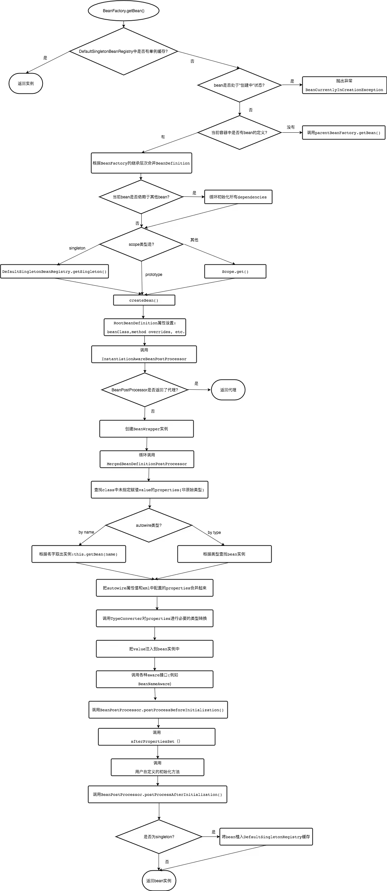
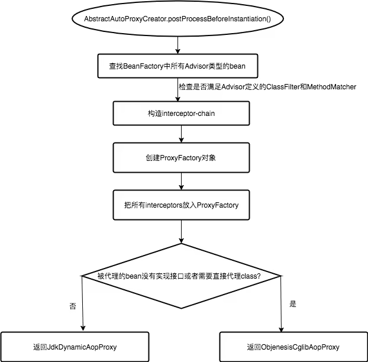

## 实例化过程
bean实例化过程的不同阶段Spring容器(BeanFactory)会依次调用以下生命周期接口(前提是bean实现了当前接口):
```java
--> BeanNameAware.setBeanName()
--> BeanClassLoaderAware.setBeanClassLoader()

// 会把当前环境中的Spring容器实例的引用暴露给bean
--> BeanFactoryAware.setBeanFactory()
--> EnvironmentAware.setEnvironment()
--> EmbeddedValueResolverAware.setEmbeddedValueResolver()
--> ResourceLoaderAware.setResourceLoader()
--> ApplicationEventPublisherAware.setApplicationEventPublisher()
--> MessageSourceAware.setMessageSource()
--> ApplicationContextAware.setApplicationContext()
--> ServletContextAware.setServletContext()
--> BeanPostProcessor.postProcessBeforeInitialization()

// 会在bean的属性设置结束之后被调用，此时autowire和apply property values都已完成
--> InitializingBean.afterPropertiesSet()
--> a custom init-method
// BeanPostProcessor 是Spring容器标准初始化过程的扩展，BeanFactory中可以注册多个post processors，容器每创建并初始化一个bean的时候都会将实例传递给post processor的接口，接口中实现的任意初始化逻辑随即都会被执行。BeanPostProcessor是Spring AOP机制实现的关键
--> BeanPostProcessor.postProcessAfterInitialization()
```
### 实例化过程图
完成了容器初始化操作之后所有bean都已经被注册在Spring框架内部的BeanFactory中了，此时，应用程序可以通过两种方式来从容器中获取一个bean实例：
直接调用BeanFactory.getBean()接口或者依赖Spring提供的自动注入能力(autowire)。在应用程序拿到bean之前，Spring内部会执行如下图所示的bean实例化过程。




## 当BeanFactory进入shutdown过程
当BeanFactory进入shutdown状态时会调用以下生命周期接口来destroy掉bean实例:
```java
--> DestructionAwareBeanPostProcessors.postProcessBeforeDestruction()
--> DisposableBean.destroy()
--> a custom destroy-method
```

## 基于注解的autowire过程
Spring可以根据用户标注的@Autowired、@Value、@Inject、@Resource等多种注解来实现自动装配，在框架内部，这个功能的实现依赖于BeanPostProcessor机制，
更确切地说是AutowiredAnnotationBeanPostProcessor为应用程序赋予了autowire能力。
AutowiredAnnotationBeanPostProcessor是在 `AbstractAutowireCapableBeanFactory.populateBean()` 函数调用发生时介入bean实例化过程中的。

                        
## AOP 实现
Spring AOP的实现依赖于BeanPostProcessor和方法拦截器(method interceptor)这两个概念
Method interceptor的主要作用是拦截对目标实例方法的调用，在原始方法执行之前或返回结果之后增加一层处理逻辑。Spring内置了三种interceptor—— 
1. MethodBeforeAdviceInterceptor  原始方法执行前处理逻辑
2. AfterReturningAdviceInterceptor 执行完成后处理逻辑
3. ThrowsAdviceInterceptor 抛出异常时插入特殊处理逻辑
    
把BeanPostProcessor和method interceptor结合起来，简单来说Spring AOP是这样实现的：
上层通过getBean()获取bean实例的时候，AbstractAutowireCapableBeanFactory会在`真正实例化bean之前` 调用注册在BeanFactory中的AspectJAwareAdvisorAutoProxyCreator，检查是否需要创建一个proxy来替换bean实例，
如果需要进行代理，那么getBean()会直接把proxy返回给调用方，当proxy中实现的方法被调用的时候相应的method interceptor就会起作用。

