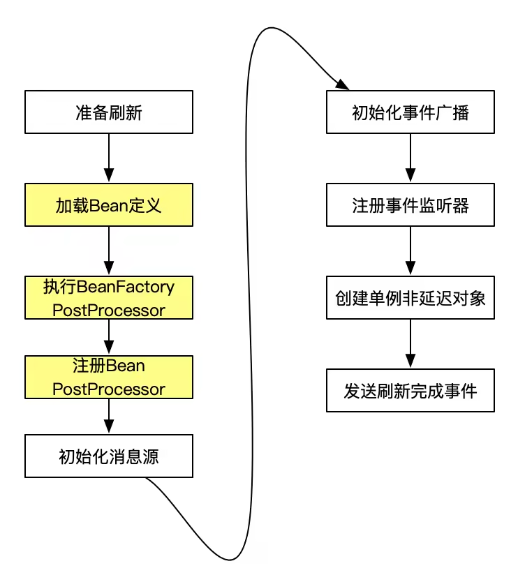

# Spring初始化过程
Spring容器（BeanFactory）按照scope将bean划分成多种类型，例如singleton、prototype、request、session等等，最常见的就是singleton和prototype这两种，
前者所标识的bean是一个单例对象，在相同的上下文中（ApplicationContext）每次getBean()请求拿到的都会是同一份实例，
prototype的不同之处在于每次getBean()拿到的都是一个fresh new instance。


org.springframework.context.support.AbstractApplicationContext#refresh
```java
@Override
public void refresh() throws BeansException, IllegalStateException {
    // 容器重启同步监控锁，防止刷新进行到一半被重复执行
    synchronized (this.startupShutdownMonitor) {
        // 填充配置文件占位符，记录容器启动时间和启动状态
        prepareRefresh();

        // 1. 获得新的BeanFactory定义,完成配置文件定义到注册表登记bean的流程，此时对象还未被创建
        ConfigurableListableBeanFactory beanFactory = obtainFreshBeanFactory();

        // 准备工厂，主要设置classloader、设置自动注入时需要忽略的类、设置工厂、添加BeanPostProcessor可供回调
        prepareBeanFactory(beanFactory);

        try {
            // 注册实现了 BeanPostProcessor 接口的 bean
            postProcessBeanFactory(beanFactory);

            // 2. 初始化和执行 实现了 BeanFactoryPostProcessor beans
            invokeBeanFactoryPostProcessors(beanFactory);

            // 3. 初始化和执行 实现了BeanPostProcessor beans，bean扩展:postProcessBeforeInitialization和postProcessAfterInitialization，分别在Bean初始化之前和初始化之后得到执行
            registerBeanPostProcessors(beanFactory);

            // 初始化MessageSource对象，国际化
            initMessageSource();

            // 初始化事件广播器（可理解为事件发送者）
            initApplicationEventMulticaster();

            // 调用子类refresh扩展，初始化特殊的类，默认该方法什么都不做，临时钩子方法，提供一些初始化完成前的特殊操作
            onRefresh();

            // 注册事件监听器
            registerListeners();
            
            // Instantiate all remaining (non-lazy-init) singletons.
            // 4. 完成对象实例化入口（创建非延迟加载的单例对象）
            finishBeanFactoryInitialization(beanFactory);

            // 完成刷新，发布容器刷新事件
            finishRefresh();
        } catch (BeansException ex) {
            if (logger.isWarnEnabled()) {
                logger.warn("Exception encountered during context initialization - " + "cancelling refresh attempt: " + ex);
            }
            // Destroy already created singletons to avoid dangling resources.
            destroyBeans();

            // Reset 'active' flag.
            cancelRefresh(ex);

            // Propagate exception to caller.
            throw ex;
        }

        finally {
            // Reset common introspection caches in Spring's core, since we
            // might not ever need metadata for singleton beans anymore...
            resetCommonCaches();
        }
    }
}
```




## 容器初始化过程
这里我们以ClassPathXmlApplicationContext为例来介绍下容器的初始化过程，所有初始化逻辑都是在refresh()方法的执行流程中展开的，下面会对比较关键的几个环节进行介绍。

### 1. AbstractApplicationContext#obtainFreshBeanFactory 刷新BeanFactory
BeanFactory会将旧的工厂对象连同其管理的所有bean definition以及实例全部销毁掉，然后创建一个新的工厂对象，重新从xml配置文件中读取bean definition信息，借助BeanDefinitionRegistry接口将所有bean的配置信息注册到BeanFactory之中

### 2. BeanDefinition 扩展点
我们在Spring中注入bean无法可以通过xml或annotation两种方式,不管使用哪一种方式，最终一个bean注入就会解析为一个BeanDefinition（bean定义元信息）对象，
后续框架中要使用bean定义信息就是通过该对象来承载的。 BeanDefinition到底有什么用处呢？
```xml
<!-- 1.注入一个bean -->
<bean id="xxAspect" class="*.XXAspect" />

<!-- 2.定义一个切面 -->
<aop:config>
    <aop:aspect id="aspect1" ref="xxAspect">
    </aop:aspect>
</aop:config>
```
bean是标准的spring对象注入标签，aop是定义一个标签，针对两种不同的标签框架是怎样解析的呢？
Spring框架中每种标签定义为一个namespace，每个namespace都有一个实现了NamespaceHandler接口的类负责对应类的解析，不管配置文件多么的不一样，最终解析结果都是BeanDefinition。
aop的对应的NamespaceHandler是`org.springframework.aop.config.AopNamespaceHandler`。

如果自己要扩展框架或要把外部框架集成到spring中，常规的bean注入不能很好的满足你的需求，就可以自定义xml schema标签，然后实现一个应该的NamspaceHandler负责把schema配置解析为BeanDefinition，解析成标准元数据对象以后就是正常的spring注入流程了。

### 3. BeanFactoryPostProcessor 扩展点
BeanFactoryPostProcessor是针对容器的扩展点，加载BeanDefinition之后容器就会触发该扩展点，实现了该接口的扩展点可以修改元信息也就是BeanDefinition对象中的信息。
AbstractApplicationContext会调用Spring内部的各种BeanFactoryPostProcessor来对上一步刷新得到的BeanFactory做进一步的配置。

相信大部分同学都使用过spring的占位符功能（如下代码）。 spring正式通过实现BeanFactoryPostProcessor扩展点来做的占位符替换。
解析成BeanDefinition以后dataSource的属性依然存储的是占位符，BeanDefinition加载完成后，框架会触发PropertyPlaceholderConfigurer的扩展点，该对象主要负责替换含有占位符的属性值。
```xml
<bean id= "placeHolder" class="org.springframework.beans.factory.config.PropertyPlaceholderConfigurer">  
   <property name="location" >  
         <value>classpath*:*.properties</value >  
   </property>  
</bean>

<bean id="dataSource" class="*.XXClass">
    <property name="username" value="${username}"/>
    <property name="password" value="${passwd}"/>
</bean>
```

需要注意区分BeanFactoryPostProcessor与BeanPostProcessor的差别。
首先，两者的作用不同：
* BeanFactoryPostProcessor会在所有bean实例化之前对BeanFactory进行修改，比如向容器中注册一些仅供框架内部使用的bean，
* BeanPostProcessor只能对当前正在实例化的某一个bean进行处理，比如用代理（proxy）来替换原始的bean实例；

二者的调用时机不同：
* BeanFactoryPostProcessor仅会在容器初始化的过程中被调用一次
* BeanPostProcessor会在bean每次实例化的时候被调用。

### 4. BeanPostProcessor扩展
BeanPostProcessor扩展点提供了两个方案分别在对象初始化之前和初始化之后执行，有趣的是通过注解标识的init（@PostConstruct）方法也是通过该接口的postProcessBeforeInitialization触发被标识init方法执行的。
```java
public interface BeanPostProcessor {

    /**
     * 对象初始化之前调用，bean指的是ioc创建出来的对象
     */
    @Nullable
    default Object postProcessBeforeInitialization(Object bean, String beanName) throws BeansException {
        return bean;
    }

    /**
     * 对象初始化之后调用，bean指的是ioc创建出来的对象
     */
    default Object postProcessAfterInitialization(Object bean, String beanName) throws BeansException {
        return bean;
    }

}
```

## 其他场景
### Aware
开发中有一个常见场景，一个不受Spring管理的对象，需要引用或获取Spring容器中的bean，我们需要先拿到ApplicationContext对象，然后调用getBean方法获取容器中的bean。
那ApplicationContext又怎样获取呢，系统提供了一个扩展点ApplicationContextAware，实现了该接口在创建对象后会把上下文通过接口定义的set方法传给使用方。
包装一个工具类，让不受Spring管理的bean也可以获取Spring容器中的bean，代码如下：
```java
class MyApplicationContext implements ApplicationContextAware {

    private static ApplicationContext applicationContext;
    public void setApplicationContext(ApplicationContext applicationContext) {
        this.applicationContext=applicationContext;    
    }
    
    public static Object getBean(String beanName) {
        return this.applicationContext.getBean(beanName);
    }

}
```

框架是什么时机注入ApplicationContext的呢？

通过上一节我们介绍的BeanPostProcessor注入的，还记得上面介绍的特性吧，该接口提供了一个扩展点在对象实例化后，调用初始化方法之前可以扩展逻辑。
正是通过这个扩展点检查bean实现了ApplicationContextAware接口，然后调用setApplicationContext把context对象注入到目标bean。

```java
class ApplicationContextAwareProcessor implements BeanPostProcessor {
    private final ConfigurableApplicationContext applicationContext;
    private final StringValueResolver embeddedValueResolver;

    public ApplicationContextAwareProcessor(ConfigurableApplicationContext applicationContext) {
        this.applicationContext = applicationContext;
        this.embeddedValueResolver = new EmbeddedValueResolver(applicationContext.getBeanFactory());
    }

    /**
     * 类初始化之前执行注入
     * 
     * @param bean
     * @param beanName
     * @return
     * @throws BeansException
     */
    @Nullable
    public Object postProcessBeforeInitialization(Object bean, String beanName) throws BeansException {
        AccessControlContext acc = null;
        if (System.getSecurityManager() != null && (bean instanceof EnvironmentAware || bean instanceof EmbeddedValueResolverAware || bean instanceof ResourceLoaderAware || bean instanceof ApplicationEventPublisherAware || bean instanceof MessageSourceAware || bean instanceof ApplicationContextAware)) {
            acc = this.applicationContext.getBeanFactory().getAccessControlContext();
        }

        if (acc != null) {
            AccessController.doPrivileged(() -> {
                this.invokeAwareInterfaces(bean);
                return null;
            }, acc);
        } else {
            this.invokeAwareInterfaces(bean);
        }

        return bean;
    }

    private void invokeAwareInterfaces(Object bean) {
        if (bean instanceof Aware) {
            if (bean instanceof EnvironmentAware) {
                ((EnvironmentAware)bean).setEnvironment(this.applicationContext.getEnvironment());
            }

            if (bean instanceof EmbeddedValueResolverAware) {
                ((EmbeddedValueResolverAware)bean).setEmbeddedValueResolver(this.embeddedValueResolver);
            }

            if (bean instanceof ResourceLoaderAware) {
                ((ResourceLoaderAware)bean).setResourceLoader(this.applicationContext);
            }

            if (bean instanceof ApplicationEventPublisherAware) {
                ((ApplicationEventPublisherAware)bean).setApplicationEventPublisher(this.applicationContext);
            }

            if (bean instanceof MessageSourceAware) {
                ((MessageSourceAware)bean).setMessageSource(this.applicationContext);
            }

            if (bean instanceof ApplicationContextAware) {
                ((ApplicationContextAware)bean).setApplicationContext(this.applicationContext);
            }
        }

    }

    public Object postProcessAfterInitialization(Object bean, String beanName) {
        return bean;
    }
}
```

如上代码片段可见，框架不只提供了ApplicationContextAware还有其它Aware供使用方扩展，要想获取对象内部服务，定义一个类实现对应Aware接口即可。

### InitializingBean
对象初始化接口，该接口有一个afterPropertiesSet方法，会在对象创建肯属性注入完成后调用该方法。
```java
public interface InitializingBean {

    /**
     * 对象初始化&属性注入之后调用
     */
    void afterPropertiesSet() throws Exception;

}
```
### DisposableBean
DisposableBean扩展点会在对象被销毁时调用。
```java
public interface DisposableBean {

    /**
     * 对象被销毁时回调
     */
    void destroy() throws Exception;

}
```
