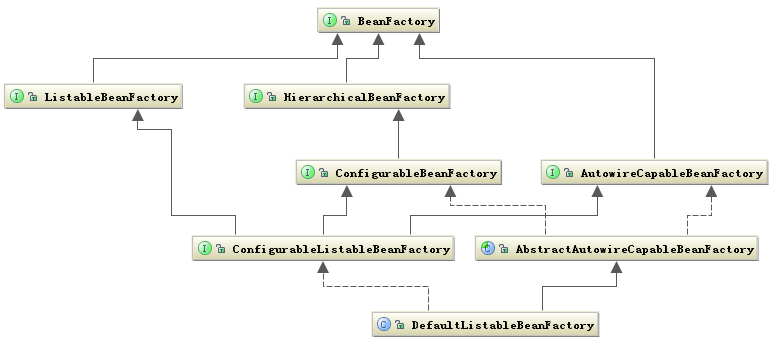

## 依赖注入
> 我们常提起的依赖注入(Dependency Injection)和控制反转(Inversion of Control)是同一个概念。 
> 具体含义是:当某个角色(可能是一个Java实例，调用者)需要另一个角色(另一个Java实例，被调用者)的协助时， 在传统的程序设计过程中，通常由调用者来创建被调用者的实例。
> 但在Spring里，创建被调用者的工作不再由调用者来完成，因此称为控制反转; 创建被调用者实例的工作通常由Spring容器来完成，然后注入调用者，因此也称为依赖注入。

其实简单的说，依赖注入起到的作用就是讲对象之间的依赖关系从原先的代码中解耦出来，通过配置文件或注解等方式加上Spring框架的处理让我们对依赖关系灵活集中的进行管理。


## 核心组件
前面说 Bean 是 Spring 中的关键因素，那么 Context 和 Core 又有何作用呢？
前面把 Bean比做一场演出中的演员，Context 就是这场演出的舞台背景，而 Core 应该就是演出的道具了。 只有它们在一起才能具备能演出一场好戏的最基本的条件。
当然有最基本的条件还不能使这场演出脱颖而出，还要它表演的节目足够精彩，这些节目就是 Spring 能提供的特色功能了。

我们知道 Bean 包装的是 Object，而 Object 必然有数据，如何给这些数据提供生存环境就是 Context 要解决的问题，对 Context 来说它就是要发现每个 Bean 之间的关系，为它们建立这种关系并且维护好这种关系。
所以 Context 就是一个 Bean 关系的集合，这个关系集合又叫 Ioc 容器，一旦建立起这个 Ioc 容器 Spring 就可以为你工作了。
Core 组件又有什么用武之地呢？其实 Core 就是发现、建立和维护每个 Bean 之间的关系所需要的一系列工具，从这个角度来看，Core 组件叫 Util 更能让你理解。


### Bean 组件
Bean 组件在 Spring 的 org.springframework.beans 包下。
这个包下的所有类主要解决了三件事：Bean 的定义、Bean 的创建及对 Bean 的解析。
对 Spring 的使用者来说唯一需要关心的就是 Bean 的创建，其他两个由 Spring 在内部帮你完成了，对你来说是透明的。
Spring Bean 的创建是典型的工厂模式，它的顶级接口是 BeanFactory，下图是这个工厂的继承层次关系。


BeanFactory 有三个子类：ListableBeanFactory、HierarchicalBeanFactory 和 AutowireCapableBeanFactory。
但是从图中我们可以发现最终的默认实现类是 DefaultListableBeanFactory，它实现了所有的接口。

为何要定义这么多层次的接口呢？查阅这些接口的源码和说明可以发现每个接口都有它使用的场合，它主要是为了区分在 Spring 内部对象的传递和转化过程中，对对象的数据访问所做的限制。
例如，ListableBeanFactory 接口表示这些 Bean 是可列表的，
而 HierarchicalBeanFactory 表示的是这些 Bean 是有继承关系的，也就是每个 Bean 有可能有父 Bean，
AutowireCapableBeanFactory 接口定义 Bean 的自动装配规则。这四个接口共同定义了 Bean 的集合、Bean 之间的关系和 Bean 的行为。

### Bean 定义 及解析
Bean 的定义主要由 BeanDefinition 描述

Bean 的定义完整地描述了在 Spring 的配置文件中你定义的<bean/>节点中所有的信息，包括各种子节点。当 Spring 成功解析你定义的一个<bean/>节点后，在 Spring 的内部它就被转化成 BeanDefinition 对象，以后所有的操作都是对这个对象进行的。

Bean 的解析过程非常复杂，功能被分得很细，因为这里需要被扩展的地方很多，必须保证有足够的灵活性，以应对可能的变化。
Bean 的解析主要就是对 Spring 配置文件的解析，这个解析过程主要通过下图中的类完成。


### Context 组件
Context 在 Spring 的 org.springframework.context 包下，前面已经讲解了 Context 组件在 Spring 中的作用，它实际上就是给 Spring 提供一个运行时的环境，用以保存各个对象的状态。
ApplicationContext 是 Context 的顶级父类，它除了能标识一个应用环境的基本信息外，还继承了 5 个接口，这 5 个接口主要是扩展了 Context 的功能。下图是 Context 相关的类结构图。


从图中可以看出，ApplicationContext 继承了 BeanFactory，这也说明了 Spring 容器中运行的主体对象是 Bean。
另外 ApplicationContext 继承了 ResourceLoader 接口，使得ApplicationContext 可以访问到任何外部资源，这将在 Core 中详细说明。

ApplicationContext 的子类主要包含两个方面：
1. ConfigurableApplicationContext 表示该 Context 是可修改的，也就是在构建 Context中用户可以动态添加或修改已有的配置信息，它下面又有多个子类，其中最经常使用的是可更新的 Context，即 AbstractRefreshableApplicationContext 类。
2. WebApplicationContext 顾名思义就是为 Web 准备的 Context，它可以直接访问到ServletContext，通常情况下，这个接口使用得很少。

Context 作为 Spring 的 Ioc 容器，基本上整合了 Spring 的大部分功能，或者说是大部分功能的基础。

### CORE组件
Core 组件作为 Spring 的核心组件，其中包含了很多关键类，一个重要的组成部分就是定义了资源的访问方式。
这种把所有资源都抽象成一个接口的方式很值得在以后的设计中拿来学习。


Resource 接口封装了各种可能的资源类型，也就是对使用者来说屏蔽了文件类型的不同。
对资源的提供者来说，如何把资源包装起来交给其他人用这也是一个问题，我们看到 Resource 接口继承了 InputStreamSource 接口，这个接口中有个getInputStream 方法，返回的是 InputStream 类。
这样所有的资源都可以通过 InputStream类来获取，所以也屏蔽了资源的提供者。
另外还有一个问题就是加载资源的问题，也就是资源的加载者要统一，从上图中可以看出这个任务是由 ResourceLoader 接口完成的，它屏蔽了所有的资源加载者的差异，只需要实现这个接口就可以加载所有的资源，它的默认实现是 DefaultResourceLoader。

#### Context 和 Resource 是如何建立关系的？

从图中可以看出，Context 把资源的加载、解析和描述工作委托给了 ResourcePatternResolver 类来完成，它相当于一个接头人，它把资源的加载、解析和资源的定义整合在一起便于其他组件使用。
Core 组件中还有很多类似的方式。

## Bean初始化时机
> AbstractAutowireCapableBeanFactory.populateBean()
> Spring可以根据用户标注的@Autowired、@Value、@Inject、@Resource等多种注解来实现自动装配，在框架内部，这个功能的实现依赖于`BeanPostProcessor`机制，更确切地说是`AutowiredAnnotationBeanPostProcessor`为应用程序赋予了autowire能力。
> `AutowiredAnnotationBeanPostProcessor`是在`AbstractAutowireCapableBeanFactory.populateBean()`函数调用发生时介入bean实例化过程中的

1. 在Spring容器启动时，预初始化那些符合条件的Bean（单例、非抽象、非延迟加载），
2. 但对于FactoryBean，需要额外检查是否是SmartFactoryBean，并且是否需要急切初始化，只有在这些情况下才会初始化。
3. 如果bean的scope是prototype的，第一次使用时再进行实例化.

在AbstractApplicationContext的refresh的后面环节会根据beanName遍历去获取对应的实例化bean，这个环节会触发getBean进行初始化。
org.springframework.beans.factory.support.DefaultListableBeanFactory#preInstantiateSingletons具体代码如下
```java
@Override
public void preInstantiateSingletons() throws BeansException {
    if (this.logger.isDebugEnabled()) {
        this.logger.debug("Pre-instantiating singletons in " + this);
    }

    // Iterate over a copy to allow for init methods which in turn register new bean definitions.
    // While this may not be part of the regular factory bootstrap, it does otherwise work fine.
    List<String> beanNames = new ArrayList<>(this.beanDefinitionNames);

    // Trigger initialization of all non-lazy singleton beans...
    for (String beanName : beanNames) {
        RootBeanDefinition bd = getMergedLocalBeanDefinition(beanName);
        if (!bd.isAbstract() && bd.isSingleton() && !bd.isLazyInit()) {
            if (isFactoryBean(beanName)) {
                Object bean = getBean(FACTORY_BEAN_PREFIX + beanName);
                if (bean instanceof FactoryBean) {
                    final FactoryBean<?> factory = (FactoryBean<?>) bean;
                    boolean isEagerInit;
                    if (System.getSecurityManager() != null && factory instanceof SmartFactoryBean) {
                        isEagerInit = AccessController.doPrivileged((PrivilegedAction<Boolean>)
                                        ((SmartFactoryBean<?>) factory)::isEagerInit,
                                getAccessControlContext());
                    }
                    else {
                        isEagerInit = (factory instanceof SmartFactoryBean &&
                                ((SmartFactoryBean<?>) factory).isEagerInit());
                    }
                    if (isEagerInit) {
                        getBean(beanName);
                    }
                }
            }
            else {
                getBean(beanName);
            }
        }
    }

    // Trigger post-initialization callback for all applicable beans...
    for (String beanName : beanNames) {
        Object singletonInstance = getSingleton(beanName);
        if (singletonInstance instanceof SmartInitializingSingleton) {
            final SmartInitializingSingleton smartSingleton = (SmartInitializingSingleton) singletonInstance;
            if (System.getSecurityManager() != null) {
                AccessController.doPrivileged((PrivilegedAction<Object>) () -> {
                    smartSingleton.afterSingletonsInstantiated();
                    return null;
                }, getAccessControlContext());
            }
            else {
                smartSingleton.afterSingletonsInstantiated();
            }
        }
    }
}

```


## Bean初始化流程

### 1. 调用AbstractBeanFactory#getBean(java.lang.String)
### 2. AbstractBeanFactory#doGetBean
### 3. AbstractAutowireCapableBeanFactory#createBean(java.lang.String, org.springframework.beans.factory.support.RootBeanDefinition, java.lang.Object[])
### 4. AbstractAutowireCapableBeanFactory#doCreateBean

### 5. AbstractAutowireCapableBeanFactory#createBeanInstance
> 生成了Bean所包含的Java对象

```java
protected BeanWrapper createBeanInstance(String beanName, RootBeanDefinition mbd, @Nullable Object[] args) {
    // 确认需要创建Bean实例的类可以实例化
    Class<?> beanClass = resolveBeanClass(mbd, beanName);

    if (beanClass != null && !Modifier.isPublic(beanClass.getModifiers()) && !mbd.isNonPublicAccessAllowed()) {
        throw new BeanCreationException(mbd.getResourceDescription(), beanName,
                "Bean class isn't public, and non-public access not allowed: " + beanClass.getName());
    }

    Supplier<?> instanceSupplier = mbd.getInstanceSupplier();
    if (instanceSupplier != null) {
        return obtainFromSupplier(instanceSupplier, beanName);
    }

    // 使用工厂方法进行实例化
    if (mbd.getFactoryMethodName() != null)  {
        return instantiateUsingFactoryMethod(beanName, mbd, args);
    }

    // Shortcut when re-creating the same bean...
    boolean resolved = false;
    boolean autowireNecessary = false;
    if (args == null) {
        synchronized (mbd.constructorArgumentLock) {
            if (mbd.resolvedConstructorOrFactoryMethod != null) {
                resolved = true;
                autowireNecessary = mbd.constructorArgumentsResolved;
            }
        }
    }
    if (resolved) {
        if (autowireNecessary) {
            return autowireConstructor(beanName, mbd, null, null);
        }
        else {
            return instantiateBean(beanName, mbd);
        }
    }

    // 使用构造函数进行实例化
    Constructor<?>[] ctors = determineConstructorsFromBeanPostProcessors(beanClass, beanName);
    if (ctors != null ||
            mbd.getResolvedAutowireMode() == RootBeanDefinition.AUTOWIRE_CONSTRUCTOR ||
            mbd.hasConstructorArgumentValues() || !ObjectUtils.isEmpty(args))  {
        return autowireConstructor(beanName, mbd, ctors, args);
    }

    // 默认使用无参构造函数进行实例化
    return instantiateBean(beanName, mbd);
}
```

#### 5.1 AbstractAutowireCapableBeanFactory#instantiateBean 实例化
> 我们重点关注 getInstantiationStrategy() 这个方法，可以看到instantiateBean方法的功能实现是通过调用getInstantiationStrategy().instantiate方法实现的。
getInstantiationStrategy 方法的作用是获得实例化的策略对象，也就是指通过哪种方案进行实例化的过程。
继续跟踪下去我们可以发现，Spring当中提供了两种实例化方案： BeanUtils 和 Cglib 方式。
BeanUtils实现机制是通过Java的反射机制， Cglib是一个第三方类库采用的是一种字节码加强方式机制。 Spring中采用的默认实例化策略是Cglib。`
分析到这里我们已经知道了实例化Bean对象的流程，现在已经是万事具备，只欠东风，就剩下对这些建立好的Bean对象建立联系了。

```java
protected BeanWrapper instantiateBean(final String beanName, final RootBeanDefinition mbd) {
    try {
        Object beanInstance;
        final BeanFactory parent = this;
        if (System.getSecurityManager() != null) {
            beanInstance = AccessController.doPrivileged((PrivilegedAction<Object>) () ->
                    getInstantiationStrategy().instantiate(mbd, beanName, parent),
                    getAccessControlContext());
        }
        else {
            beanInstance = getInstantiationStrategy().instantiate(mbd, beanName, parent);
        }
        BeanWrapper bw = new BeanWrapperImpl(beanInstance);
        initBeanWrapper(bw);
        return bw;
    }
    catch (Throwable ex) {
        throw new BeanCreationException(
                mbd.getResourceDescription(), beanName, "Instantiation of bean failed", ex);
    }
}
```
### 6. AbstractAutowireCapableBeanFactory#populateBean
```java
protected void populateBean(String beanName, RootBeanDefinition mbd, @Nullable BeanWrapper bw) {
    // 获得BeanDefinition中设置的property信息，简单理解依赖注入的过程就是对这些property赋值的过程，而只是property信息在BeanDefinition的解析过程中
    if (bw == null) {
        if (mbd.hasPropertyValues()) {
            throw new BeanCreationException(
                    mbd.getResourceDescription(), beanName, "Cannot apply property values to null instance");
        }
        else {
            // Skip property population phase for null instance.
            return;
        }
    }

    // Give any InstantiationAwareBeanPostProcessors the opportunity to modify the
    // state of the bean before properties are set. This can be used, for example,
    // to support styles of field injection.
    boolean continueWithPropertyPopulation = true;

    if (!mbd.isSynthetic() && hasInstantiationAwareBeanPostProcessors()) {
        for (BeanPostProcessor bp : getBeanPostProcessors()) {
            if (bp instanceof InstantiationAwareBeanPostProcessor) {
                InstantiationAwareBeanPostProcessor ibp = (InstantiationAwareBeanPostProcessor) bp;
                if (!ibp.postProcessAfterInstantiation(bw.getWrappedInstance(), beanName)) {
                    continueWithPropertyPopulation = false;
                    break;
                }
            }
        }
    }

    if (!continueWithPropertyPopulation) {
        return;
    }
    
    PropertyValues pvs = (mbd.hasPropertyValues() ? mbd.getPropertyValues() : null);

    //开始依赖注入的过程，先处理Autowire的注入，根据自动注入模式调用相应的处理方法
    if (mbd.getResolvedAutowireMode() == RootBeanDefinition.AUTOWIRE_BY_NAME ||
            mbd.getResolvedAutowireMode() == RootBeanDefinition.AUTOWIRE_BY_TYPE) {
        MutablePropertyValues newPvs = new MutablePropertyValues(pvs);

        // Add property values based on autowire by name if applicable.
        if (mbd.getResolvedAutowireMode() == RootBeanDefinition.AUTOWIRE_BY_NAME) {
            autowireByName(beanName, mbd, bw, newPvs);
        }

        // Add property values based on autowire by type if applicable.
        if (mbd.getResolvedAutowireMode() == RootBeanDefinition.AUTOWIRE_BY_TYPE) {
            autowireByType(beanName, mbd, bw, newPvs);
        }

        pvs = newPvs;
    }

    boolean hasInstAwareBpps = hasInstantiationAwareBeanPostProcessors();
    boolean needsDepCheck = (mbd.getDependencyCheck() != RootBeanDefinition.DEPENDENCY_CHECK_NONE);

    if (hasInstAwareBpps || needsDepCheck) {
        if (pvs == null) {
            pvs = mbd.getPropertyValues();
        }
        PropertyDescriptor[] filteredPds = filterPropertyDescriptorsForDependencyCheck(bw, mbd.allowCaching);
        if (hasInstAwareBpps) {
            for (BeanPostProcessor bp : getBeanPostProcessors()) {
                if (bp instanceof InstantiationAwareBeanPostProcessor) {
                    InstantiationAwareBeanPostProcessor ibp = (InstantiationAwareBeanPostProcessor) bp;
                    pvs = ibp.postProcessPropertyValues(pvs, filteredPds, bw.getWrappedInstance(), beanName);
                    if (pvs == null) {
                        return;
                    }
                }
            }
        }
        if (needsDepCheck) {
            checkDependencies(beanName, mbd, filteredPds, pvs);
        }
    }
    
    //对属性进行注入
    if (pvs != null) {
        applyPropertyValues(beanName, mbd, bw, pvs);
    }
}
```
 

#### 6.1 AbstractAutowireCapableBeanFactory#applyPropertyValues 对属性进行注入
在配置Bean的属性的时候，属性可能有多种类型，我们再进行注入的时候，不同的属性类型我们不可能一概而论的进行处理，集合类型的属性和非集合类型具备很大的差别，对不同的类型应该有不同的解析处理过程，
故该方法流程中首先判断value的类型然后在分别调用 resolveManagedList()、 resolveManagedList() 、 resolveManagedList()等方法进行具体的解析。

#### 6.2 BeanDefinitionValueResolver#resolveValueIfNecessary 
在完成这个解析过程后，已经为依赖注入准备好了条件，下面的 setPropertyValue() 方法是真正设置属性依赖的地方，该方法的实现是在BeanWrapper的实现类BeanWrapperImpl中，其代码如下:


到了这里，就完成了对Bean各种属性的依赖注入的过程，整个过程我们只要把握住 getBean 这个依赖注入的入口，一步步分析下去，就可以完成对整个依赖注入的把握。


### 7.AbstractAutowireCapableBeanFactory#initializeBean 从该方法可以看到Bean初始化流程

org.springframework.beans.factory.support.AbstractAutowireCapableBeanFactory#initializeBean(java.lang.String, java.lang.Object, org.springframework.beans.factory.support.RootBeanDefinition)
```java
protected Object initializeBean(final String beanName, final Object bean, RootBeanDefinition mbd) {
    // 1. 初始化Aware 方法
    if (System.getSecurityManager() != null) {
        AccessController.doPrivileged(new PrivilegedAction<Object>() {
            public Object run() {
                AbstractAutowireCapableBeanFactory.this.invokeAwareMethods(beanName, bean);
                return null;
            }
        }, this.getAccessControlContext());
    } else {
        this.invokeAwareMethods(beanName, bean);
    }

    // 2. bean 初始化之前, 触发BeanPostProcessor的postProcessBeforeInitialization
    Object wrappedBean = bean;
    if (mbd == null || !mbd.isSynthetic()) {
        wrappedBean = this.applyBeanPostProcessorsBeforeInitialization(wrappedBean, beanName);
    }

    // 3. 初始化bean
    try {
        this.invokeInitMethods(beanName, wrappedBean, mbd);
    } catch (Throwable var6) {
        Throwable ex = var6;
        throw new BeanCreationException(mbd != null ? mbd.getResourceDescription() : null, beanName, "Invocation of init method failed", ex);
    }
    
    // 4. bean 初始化之后, 触发BeanPostProcessor的postProcessAfterInitialization
    if (mbd == null || !mbd.isSynthetic()) {
        wrappedBean = this.applyBeanPostProcessorsAfterInitialization(wrappedBean, beanName);
    }
    return wrappedBean;
}
```