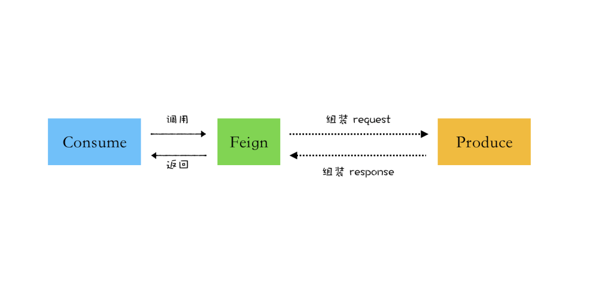

# 结语

文章从最基础的知识介绍什么是 Feign？继而从源码的角度上说明 Feign 的底层原理，总结如下：

## 什么是 Feign
Feign 是声明式 Web 服务客户端，它使编写 Web 服务客户端更加容易

Feign 不做任何请求处理，通过处理注解相关信息生成 Request，并对调用返回的数据进行解码，从而实现 简化 HTTP API 的开发

如果要使用 Feign，需要创建一个接口并对其添加 Feign 相关注解，另外 Feign 还支持可插拔编码器和解码器，致力于打造一个轻量级 HTTP 客户端

## 工作原理
1. 通过 @EnableFeignCleints 注解启动 Feign Starter 组件
2. Feign Starter 在项目启动过程中注册全局配置，扫描包下所有的 @FeignClient 接口类，并进行注册IOC 容器
3. @FeignClient 接口类被注入时，通过 FactoryBean#getObject 返回动态代理类
4. 接口被调用时被动态代理类逻辑拦截，将 @FeignClient 请求信息通过编码器生成 Request
5. 交由 Ribbon 进行负载均衡，挑选出一个健康的 Server 实例
6. 继而通过 Client 携带 Request 调用远端服务返回请求响应
7. 通过解码器生成 Response 返回客户端，将信息流解析成为接口返回数据

https://cloud.tencent.com/developer/article/1856262