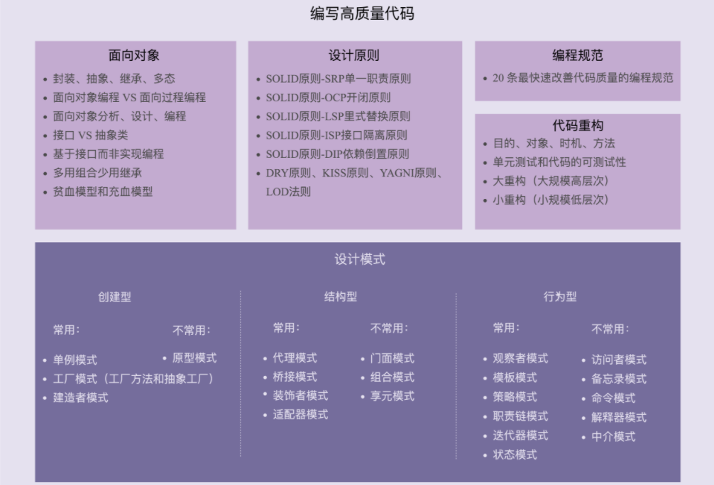

## 设计模式

## 高内聚、松耦合
### 那到底什么是“高内聚”呢？
所谓高内聚，就是指相近的功能应该放到同一个类中，不相近的功能不要放到同一个类中。相近的功能往往会被同时修改，放到同一个类中，修改会比较集中，代码容易维护。实际上，我们前面讲过的单一职责原则是实现代码高内聚非常有效的设计原则。
### 我们再来看一下，什么是“松耦合”？
所谓松耦合是说，在代码中，类与类之间的依赖关系简单清晰。即使两个类有依赖关系，一个类的代码改动不会或者很少导致依赖类的代码改动。实际上，我们前面讲的依赖注入、接口隔离、基于接口而非实现编程，以及今天讲的迪米特法则，都是为了实现代码的松耦合。

## 迪米特法则 Law of Demeter，缩写是LOD
每个模块（unit）只应该了解那些与它关系密切的模块（units: only units “closely” related to the current unit）的有限知识（knowledge）。
或者说，每个模块只和自己的朋友“说话”（talk），不和陌生人“说话”（talk）。

结合我自己的理解和经验，对刚刚的定义重新描述一下。注意，为了统一讲解，我把定义描述中的“模块”替换成了“类”：
不该有直接依赖关系的类之间，不要有依赖；有依赖关系的类之间，尽量只依赖必要的接口