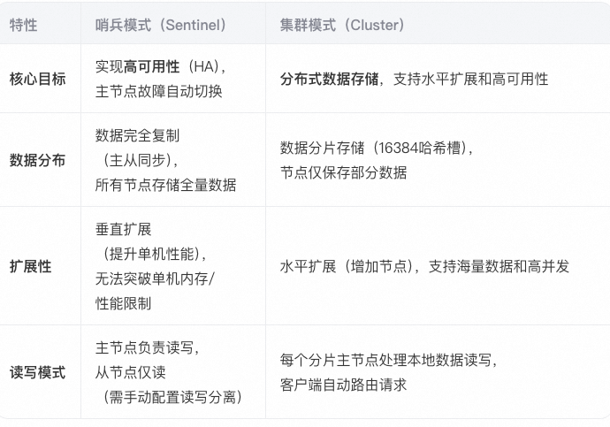
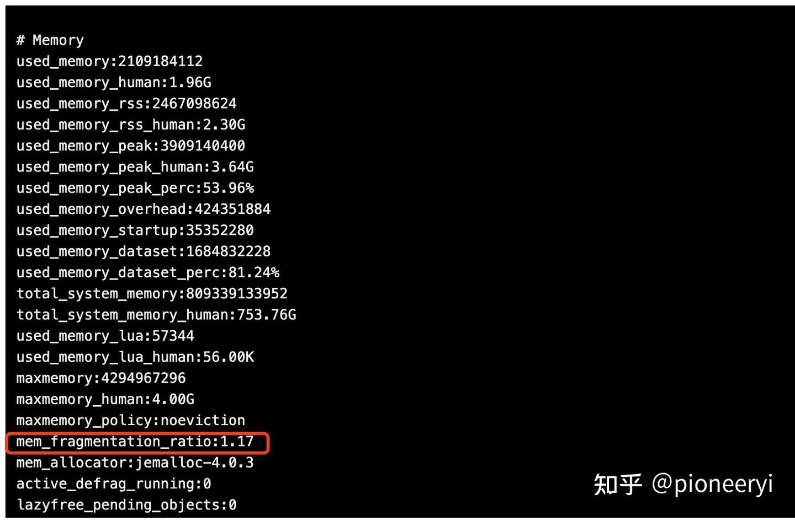
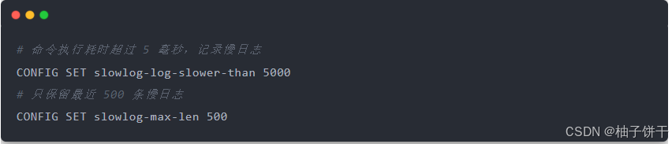
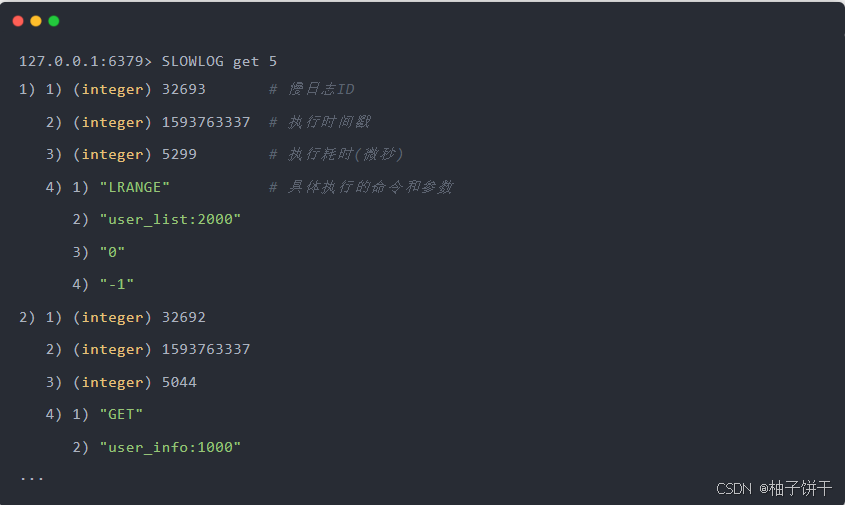

# Redis经典问题

## 1. 缓存雪崩
指缓存同一时间大面积的失效，所以，后面的请求都会落到数据库上，造成数据库短时间内承受大量请求而崩掉。

###  解决方案:
* Redis 高可用，主从+哨兵，Redis cluster，避免全盘崩溃
* 本地 ehcache 缓存 + hystrix 限流&降级，避免 MySQL 被打死
* 缓存数据的过期时间设置随机，防止同一时间大量数据过期现象发生。
* 逻辑上永不过期给每一个缓存数据增加相应的缓存标记，缓存标记失效则更新数据缓存
* 多级缓存，失效时通过二级更新一级，由第三方插件更新二级缓存。

## 2. 缓存穿透
https://blog.csdn.net/lin777lin/article/details/105666839
缓存穿透是指缓存和数据库中都没有的数据，导致所有的请求都落到数据库上，造成数据库短时间内承受大量请求而崩掉。
### 解决方案:
1. 接口层增加校验，如用户鉴权校验，id做基础校验，id<=0的直接拦截;
2. 从缓存取不到的数据，在数据库中也没有取到，这时也可以将key-value对写为key-null，缓存有效时间可以设置短点，如30秒。这样可以防止攻击用户反复用同一个id暴力攻击;
3. 采用布隆过滤器，将所有可能存在的数据哈希到一个足够大的 bitmap中，一个一定不存在的数据会被这个 bitmap 拦截掉，从而避免了对底层存储系统的查询压力。(宁可错杀一千不可放过一人)

## 3. 缓存击穿
这时由于并发用户特别多，同时读缓存没读到数据，又同时去数据库去取数据，引起数据库压力瞬间增大，造成过大压力。
和缓存雪崩不同的是，缓存击穿指并发查同一条数据，缓存雪崩是不同数据都过期了，很多数据都查不到从而查数据库

### 解决方案:
1. 设置热点数据永远不过期，异步线程处理。 
2. 加写回操作加互斥锁，查询失败默认值快速返回。 
3. 缓存预热
系统上线后，将相关可预期(例如排行榜)热点数据直接加载到缓存。
写一个缓存刷新页面，手动操作热点数据(例如广告推广)上下线。

## 4. 数据不一致
在缓存机器的带宽被打满，或者机房网络出现波动时，缓存更新失败，新数据没有写入缓存，就会导致缓存和 DB 的 数据不一致。
缓存 rehash 时，某个缓存机器反复异常，多次上下线，更新请求多次 rehash。这样，一份数据存在多 个节点，且每次 rehash 只更新某个节点，导致一些缓存节点产生脏数据。

### 解决方案
* Cache 更新失败后，可以进行重试，则将重试失败的 key 写入mq，待缓存访问恢复后，将这些 key 从缓存删
  除。这些 key 在再次被查询时，重新从 DB 加载，从而保证数据的一致性
* 缓存时间适当调短，让缓存数据及早过期后，然后从 DB 重新加载，确保数据的最终一致性。
* 不采用 rehash 漂移策略，而采用缓存分层策略，尽量避免脏数据产生。


## 5. 数据并发竞争
数据并发竞争在大流量系统也比较常见，
比如车票系统，如果某个火车车次缓存信息过期，但仍然有大量用户在查询该车次信息。
又比如微博系统中，如果某条微博正好被缓存淘汰，但这条微博仍然有大量的转发、评论、赞。
上述情 况都会造成并发竞争读取的问题。

### 解决方案
* 加写回操作加互斥锁，查询失败默认值快速返回。
* 对缓存数据保持多个备份，减少并发竞争的概率

## 6. 热点key问题
明星结婚、离婚、出轨这种特殊突发事件，比如奥运、春节这些重大活动或节日，还比如秒杀、双12、618 等线上促 销活动，都很容易出现 Hot key 的情况。
如何提前发现HotKey?

* 对于重要节假日、线上促销活动这些提前已知的事情，可以提前评估出可能的热 key 来。
* 而对于突发事件，无法提前评估，可以通过 Spark，对应流任务进行实时分析，及时发现新发布的热点 key。而对
  于之前已发出的事情，逐步发酵成为热 key 的，则可以通过 Hadoop 对批处理任务离线计算，找出最近历史数据 中的高频热 key。

### 解决方案:
#### 1. Key 拆分（应对读/写热点）
* 适用场景：热点 Key 的 Value 是聚合性数据（如计数器、榜单）。
* 方法：
垂直拆分：将单 Key 拆分为多个子 Key，分散到不同节点。
分桶随机化：对 Key 增加随机后缀（如 hotkey_{1..N}），将请求分散到多个 Key。

* 示例：
原始 Key：product:12345:views（商品访问量）
  
拆分后：product:12345:views:part1、product:12345:views:part2 访问时随机选择一个子 Key 操作，最终汇总统计。

#### 2. Redis 集群分片优化
* 适用场景：Redis 集群中某个分片因热点 Key 成为瓶颈。
* 方法：
  * 强制分片：对热点 Key 手动增加分片后缀（如 :{shard_id}），将其分配到不同节点。
  * 代理层分片：通过代理中间件（如 Twemproxy、Codis）自定义路由策略，分散热点 Key。


## 7. BigKey问题
比如互联网系统中需要保存用户最新 1万 个粉丝的业务，
比如一个用户个人信息缓存，包括基本资料、关系图谱计 数、发 feed 统计等。
微博的 feed 内容缓存也很容易出现，一般用户微博在 140 字以内，但很多用户也会发表 1千 字 甚至更长的微博内容，这些长微博也就成了大 key

* 首先Redis底层数据结构里，根据Value的不同，会进行数据结构的重新选择
* 可以扩展新的数据结构，进行序列化构建，然后通过 restore 一次性写入
* 将大 key 分拆为多个 key，设置较长的过期时间

## 8. redis的keys和scan命令区别？
Redis的KEYS和SCAN命令都用于按模式匹配键（Key），但它们在实现方式和使用场景上有显著区别。以下是两者的核心差异：

### KEYS命令：
* 阻塞性：会遍历整个键空间（Key Space），直到找到所有匹配的键。如果数据库包含大量键，执行期间会阻塞Redis服务器，导致其他操作无法响应。
* 风险：在生产环境中，KEYS可能导致服务短暂不可用（类似“雪崩”），不推荐使用。
* 时间复杂度为O(N)（N是数据库中的键总数），性能与数据量直接相关。如果数据库有百万级键，响应延迟可能达到秒级。
* 仅支持全局键空间遍历，无法针对特定数据类型。

### SCAN命令：
* 非阻塞性：基于游标（Cursor）的迭代器，每次只返回少量匹配的键(默认 COUNT=10)。通过多次调用逐步获取结果，不会长时间阻塞服务器。
* 安全性：适合生产环境，但需要多次交互才能完成完整遍历。
* 时间复杂度为O(N): 单次调用时间复杂度为O(1)，但完整遍历的时间复杂度是O(N)。虽然总时间可能更长，但分散了性能压力，避免了阻塞。
* 支持通过命令对特定类型数据进行遍历：SSCAN（遍历集合）、HSCAN（遍历哈希）、ZSCAN（遍历有序集合）用于特定数据类型的渐进式遍历。

## 9. redis的zrank和zscore的时间复杂度是多少，为什么？
### ZRANK 时间复杂度：O(log N)
* ZRANK key member：返回有序集合中 member 的排名（从 0 开始），按 score 升序排列。

#### 原因分析
1. 当 ZSET 使用 跳表（Skiplist） + 哈希表（Hash Table） 编码时：
  * 跳表用于维护成员的有序性，支持范围查询和排名操作。
  * 查找某个成员的排名需要在跳表中进行 二分查找式搜索，其时间复杂度为 O(log N)。
  * 具体流程：
    * 利用哈希表（member -> score）快速验证 member 是否存在（O(1)）。
    * 在跳表中查找 member 所在节点，并统计其前面有多少节点（即排名），此过程需遍历跳表路径，总时间为 O(log N)。

2. 如果 ZSET 使用压缩列表（Ziplist）编码（小规模数据集），则 ZRANK 需要线性扫描整个列表，时间复杂度为 O(N)。

### ZSCORE 时间复杂度：O(1) 
* ZSCORE key member：返回有序集合中 member 对应的 score。

#### 原因分析
无论 ZSET 使用哪种编码（跳表 + 哈希表 或 Ziplist），Redis 都会维护一个 哈希表 来存储 member -> score 的映射关系。
直接通过哈希表查找 member 对应的 score，时间复杂度为 O(1)。

注: 若使用 Ziplist 编码，虽然也需要线性扫描查找 member，但由于 Redis 会在内部缓存部分信息，实际性能接近 O(1)（但仍属于 O(N) 理论复杂度）。

## 9. Redis如何保证主从复制的数据一致性？
Redis保证主从复制的数据一致性主要依赖于以下机制：

* 1、全量复制： 当从服务器连接到主服务器时，或者主从复制过程中发生断线需要重连时，主服务器会触发一次全量复制，将所有数据同步到从服务器。
* 2、增量复制： 在全量复制之后，如果主服务器的数据发生变化，这些变化会以命令的形式发送到从服务器，从服务器执行这些命令来保持数据的更新。
* 3、复制偏移量和复制积压缓冲区： 主服务器和从服务器都会维护一个复制偏移量，主服务器还会维护一个复制积压缓冲区，用于记录最近的数据变化。
这两个机制确保即使在网络波动等异常情况下，也能保证数据最终一致性。

## 10. Redis 如何解决集群情况下分布式锁的可靠性？如何使用哨兵模式解决集群情况下分布式锁的可靠性？
### 1. RedLock算法
虽然Redis本身没有内置RedLock算法，但你可以通过组合使用多个独立的Redis实例来实现RedLock算法，从而提高分布式锁的可靠性。
RedLock算法要求客户端在多个独立的Redis节点上尝试获取锁，只有在大多数节点上成功获取锁时才认为成功。这样可以防止单点故障导致锁不可用。
### 2. 哨兵模板实现方案
1. 选举过程：

当主服务器（Master）发生故障时，哨兵（Sentinel）系统会启动故障转移过程。哨兵通过心跳检测发现主服务器不可用后，会开始选举一个新的主服务器。

在选举过程中，哨兵会评估所有可达的从服务器，选择一个最适合作为新主服务器的从服务器。这个选择通常基于从服务器的优先级（priority）、复制偏移量（replication offset）、运行ID等。

2. 复制偏移量：

复制偏移量是主服务器用于记录复制了多少字节给从服务器的偏移量。哨兵会监控各个从服务器的复制偏移量，确保它们尽可能接近主服务器的偏移量。

在选举新主服务器时，哨兵会检查从服务器的复制偏移量，选择具有最高复制偏移量的从服务器作为新的主服务器，这样可以确保数据的一致性和完整性。

3. 运行ID：

每个Redis实例在启动时都会有一个唯一的运行ID。在选举过程中，哨兵会考虑从服务器的运行ID，以避免选择到之前的主服务器（如果它仍然存活并被提升为从服务器）。

4. 数据同步：

一旦选出了新的主服务器，所有之前的从服务器都会与新的主服务器重新建立连接并进行数据同步。这包括使用PSYNC命令，该命令允许从服务器请求部分重同步，而不是完全重同步，这样可以显著减少数据传输量和时间。

5. 监控与自动故障恢复：

哨兵不仅在主服务器宕机时启动故障转移，还持续监控新主服务器的健康状态和所有从服务器的状态。如果新主服务器出现问题，哨兵会再次启动故障转移流程，选择另一个从服务器作为新的主服务器。


## 11. Redis 哨兵模式与集群模式核心区别


### 哨兵模式‌

#### 组件‌：
1个主节点 + N个从节点 + M个哨兵节点（M≥3，建议奇数）
#### 工作机制‌：
* 哨兵通过心跳检测监控主节点状态，主节点故障时触发‌自动故障转移‌（选举新主）
* 客户端通过哨兵获取最新主节点地址，实现透明切换

#### 一致性保障‌：
主从异步复制，故障转移可能导致‌少量数据丢失‌（未同步的写操作）

### 集群模式‌
#### 组件‌：
多组分片（每个分片包含1主+N从） + 集群总线（Gossip协议通信）
#### 工作机制‌：
* 数据按哈希槽分片存储，客户端请求根据槽位路由到对应分片
* 分片主节点故障时，从节点自动晋升为新主（类似哨兵，但由集群自身管理） 
#### 一致性保障‌：
‌最终一致性‌为主，可通过WAIT命令实现同步复制（强一致性，牺牲性能）

## 怎么排查redis慢查询?
排查慢查询，我们需要从Redis客户端和服务端两方面来排查

### 客户端
我们主要对链接进行检查，首先看下是否使用的链接池，如果不是需要改成链接池；如果是链接池，那么就看下链接池设置的大小。
官方建议一般设置服务核数的1.5倍，如果你的QPS比较大，并且对性能要求很高，其实再大一点也没关系，因为Redis集群一般链接都是几万个。

### 服务端
#### 1. 内存问题
包括内存是否达到上限（这个比较简单，其实一开始就可以看看，但是一般达到上限，应该要告警的，不能等到定位才发现），
然后再看下内存碎片率，Redis命令行， 使用INFO命令，可以看到：
如果 mem_fragmentation_ratio > 1.5，说明内存碎片率已经超过了 50%，这时我们就需要采取一些措施来降低内存碎片了，因此这个是没问题的。



#### 2. 慢查询日志 
> 你需要去查看一下 Redis 的慢日志（slowlog）。 Redis 提供了慢日志命令的统计功能，它记录了有哪些命令在执行时耗时比较久。
查看 Redis 慢日志之前，你需要设置慢日志的阈值。例如，设置慢日志的阈值为 5 毫秒，并且保留最近 500 条慢日志记录



设置完成之后，所有执行的命令如果操作耗时超过了 5 毫秒，都会被 Redis 记录下来。

此时，你可以执行以下命令，就可以查询到最近记录的慢日志：


通过查看慢日志，我们就可以知道在什么时间点，执行了哪些命令比较耗时。

上面结果分析展示：

第一种情况导致变慢的原因在于，Redis 在操作内存数据时，时间复杂度过高，要花费更多的 CPU 资源。例如 SORT、SUNION、ZUNIONSTORE 聚合类命令

第二种情况导致变慢的原因在于，Redis 一次需要返回给客户端的数据过多，更多时间花费在数据协议的组装和网络传输过程中。

##### 解决方案
如果确实出现了复杂命令，那么就这样解决：
1. 尽量不使用 O(N) 以上复杂度过高的命令，对于数据的聚合操作，放在客户端做
2. 执行 O(N) 命令，保证 N 尽量的小（推荐 N <= 300），每次获取尽量少的数据，让 Redis 可以及时处理返回。

#### 3. BigKey 问题删除引起慢查询
那就要看下是否存在BigKey了，Redis提供了扫描BigKey的命令

如果发现了存在BigKey的情况，我们需要：

1. 要思考一下可不可以做一些优化（例如拆分数据结构）尽量让这些bigkey消失在业务中，
2. 如果bigkey不可避免，也要思考一下要不要每次把所有元素都取出来（例如有时候仅仅需要hmget，而不是hgetall）。
3. 最后，值得一提的事，Redis在4.0版本后支持了lazy delete free的模式，这种模式删除bigkey不会阻塞Redis。
你可以Check下，如果版本过低，建议审计；如果没开启lazy模式，建议开启。

#### 4. 如果将一个月的K线数据预存在redis中，你认为应该怎么存，假设五分钟一个柱子
要将K线数据保存到Redis中，首先要将K线数据格式化为适合保存在Redis的数据结构中。

一种常见的方式是使用Redis的有序集合数据类型（Sorted Set），其中每个K线数据作为一个成员，而时间戳作为它的分值。

下面是保存K线数据到Redis的步骤：
1. 连接Redis：首先，你需要使用适当的Redis客户端连接到Redis数据库。多种语言和框架都有相应的Redis客户端可供选择，例如Python的redis-py等。
2. 格式化K线数据：将每根K线的数据转换为合适的格式。
通常，一个K线数据包括时间戳、开盘价、最高价、最低价、收盘价等信息。你可以将这些数据封装为一个JSON对象或者使用其他适合的数据结构。
3. 存储K线数据：使用Redis的ZADD命令将包含K线数据的JSON对象插入到有序集合中。
将时间戳作为分值，这样就可以根据时间戳顺序对K线数据进行排序。
4. 查询K线数据：使用Redis的ZRANGE命令可以按照时间顺序检索K线数据。
你可以设置开始和结束的索引，或者使用闭区间或开区间来限定查询的范围。
5. 更新K线数据：当新的K线数据可用时，可以使用ZADD命令添加到有序集合中。
如果已经存在相同的时间戳，则更新该条目的值。这样可以实时地更新K线数据。

要注意的是，Redis是一种内存数据库，所以在保存大量K线数据时需要考虑内存的使用情况。

如果数据量较大，可以考虑使用持久化机制（如RDB或AOF）将数据保存到磁盘中，以避免内存不足的问题。

#### 5. 如果有1千万个用户和1千万个视频，我需要记录用户对视频的点赞或是否订阅的状态，怎么实现?
##### 数据结构使用set，如果需要有序可以选择zset

```bash
// key为固定前缀 + 视频ID
String key = "Blog:liked:" + id;

// 1. 判断用户是否点过赞
Boolean Liked = stringRedisTemplate.opsForSet().isMember(key, userId);

// 2. 成功,将用户加入redis
stringRedisTemplate.opsForSet().add(key,userId.toString());

// 3. 已点赞就取消之前的点赞
stringRedisTemplate.opsForSet().remove(key,userId.toString());
```

##### 5.1 异步双写流程
```java
// 伪代码：用户点赞操作（Java + Spring Boot）
public void likeVideo(Long userId, Long videoId) {
    // Step1：写入Redis
    redisTemplate.opsForSet().add("user:" + userId + ":liked_videos", videoId);
    redisTemplate.opsForValue().increment("video:" + videoId + ":like_count");
    
    // Step2：异步写入MySQL（通过消息队列）
    kafkaTemplate.send("like_topic", new LikeEvent(userId, videoId, 1));
}

// 消费者处理逻辑
@KafkaListener(topics = "like_topic")
public void handleLikeEvent(LikeEvent event) {
    userLikeRepository.insertOrUpdate(event.getUserId(), event.getVideoId(), event.getStatus());
}

```

##### 5.2 延时双删优化
```java
// 伪代码：取消点赞操作
public void cancelLike(Long userId, Long videoId) {
    // 第一次删除缓存
    redisTemplate.opsForSet().remove("user:" + userId + ":liked_videos", videoId);
    redisTemplate.opsForValue().decrement("video:" + videoId + ":like_count");
    
    // 更新数据库
    userLikeRepository.updateStatus(userId, videoId, 0);
    
    // 延时二次删除（500ms 或 1秒后）,消除并发读且未更新数据库时造成的缓存脏数据，适用读多写少的场景
    scheduler.schedule(() -> {
        redisTemplate.opsForSet().remove("user:" + userId + ":liked_videos", videoId);
    }, 1000, TimeUnit.MILLISECONDS);
}

```

##### 5.3 高性能查询优化
```java
// 1.实时状态查询‌，‌是否点赞‌：直接访问 Redis SET（响应时间 <1ms）
Boolean isLiked = redisTemplate.opsForSet().isMember("user:" + userId + ":liked_videos", videoId);

// 2.点赞总数‌：从 Redis 计数器直接读取
Long count = redisTemplate.opsForValue().get("video:" + videoId + ":like_count");

// 3.批量数据同步:定时任务‌：每小时同步 Redis 计数器到 MySQL
UPDATE video_stats SET like_count = {redis_count} WHERE video_id = {videoId};

```

#### 6. 假如我要实现一个长度只有100的分布式队列，基于LRU的规则进行元素剔除，怎么实现？
LRU，全称Least Recently Used，即最近最少使用 ，可以借助redis的zset实现。

核心设计思路：
* 队列长度固定‌	每次插入新元素后检查长度，超过阈值时移除最旧元素
* LRU淘汰规则‌	使用时间戳作为排序依据，每次访问（读/写）更新元素时间戳
* 分布式一致性‌	通过 Redis 单线程特性 + Lua 脚本保证操作的原子性
* 高性能‌	使用内存操作（时间复杂度 O(log N)），控制队列长度在较小范围（100）以降低计算压力

数据结构选择：Sorted Set (ZSET)
* Key‌：lru_queue:100
* Member‌：队列元素（如用户ID、视频ID等）
* Score‌：最后一次访问的时间戳（毫秒精度）


```bash
# Lua 脚本（原子化执行插入和修剪）
local key = KEYS[1]
local member = ARGV[1]
local max_size = tonumber(ARGV[2])
local timestamp = tonumber(ARGV[3])

# 插入或更新时间戳
redis.call('ZADD', key, timestamp, member)

# 检查并修剪队列
local current_size = redis.call('ZCARD', key)
if current_size > max_size then
    # 移除最旧的元素（score最小的成员）
    redis.call('ZREMRANGEBYRANK', key, 0, current_size - max_size - 1)
end
return current_size

```


https://blog.csdn.net/qq_64558518/article/details/129635943

redis慢查询原因及排查  https://zhuanlan.zhihu.com/p/483377523
redis 查询慢排查优化 https://blog.csdn.net/weixin_43942414/article/details/140395213